## Diagram Map

### Who this document is for

```mermaid
flowchart TD
    A[Reader Type] --> B[Solo Developer / Technical Founder]
    A --> C[Engineer on Existing Team]
    A --> D[AI Coding Agent]
    A --> E[Business Function Builder]
    B --> B1[Use full 0-8 stage chain]
    B --> B2[Keep PROJECT_TASKS.md local]
    B --> B3[Enable Auto-Approve only after gates pass]
    C --> C1[Use specification discipline]
    C --> C2[Use adversarial review]
    C --> C3[Use authority capsule]
    C --> C4[Replace local task board with CI-backed tracker if needed]
    D --> D1[Load docs/active/authority.json first]
    D --> D2[Load active graph second]
    D --> D3[Execute only claimed tasks]
    D --> D4[Stop on ambiguity]
    E --> E1[Write domain rules precisely]
    E --> E2[Use reference guide workflow]
    E --> E3[Do not need to write code]
    E --> E4[Define correctness before implementation]
```

### The core problems this workflow solves

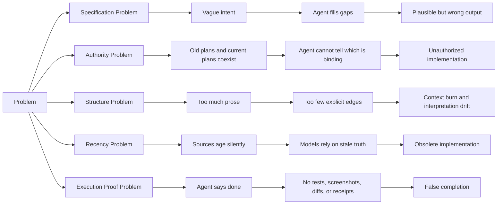

### How this document is structured

```mermaid
flowchart TD
    A[ACDF v7 Document Map] --> P1[Part I: Orientation]
    A --> P2[Part II: Build the Truth]
    A --> P3[Part III: Turn Truth into Plan]
    A --> P4[Part IV: Attack the Plan]
    A --> P5[Part V: Authority and Task Control]
    A --> P6[Part VI: 0-8 Stage Workflow]
    A --> P7[Part VII: Agent Roles and Collaboration]
    A --> P8[Part VIII: Archetype Overlays]
    A --> P9[Part IX: Reusable Patterns]
    A --> P10[Part X: Governance Modes]
    A --> P11[Part XI: Proof and Portfolio]
    A --> P12[Part XII: Quick Reference and Templates]
    A --> AP[Appendices]
    P1 --> P1a[Core thesis]
    P1 --> P1b[Failure equation]
    P1 --> P1c[Five engines plus Recency Layer]
    P1 --> P1d[Hero lenses as control primitives]
    P2 --> P2a[Source synthesis]
    P2 --> P2b[NotebookLM as temporary SME]
    P2 --> P2c[Nine-question reference loop]
    P2 --> P2d[Mermaid-first reference graph]
    P2 --> P2e[Approved reference guide]
    P3 --> P3a[Build plan generation]
    P3 --> P3b[Plan Mode]
    P3 --> P3c[Indexed task board]
    P4 --> P4a[Adversarial review before code]
    P4 --> P4b[Adaptive model council]
    P4 --> P4c[Independence and contamination control]
    P4 --> P4d[Risk register and plan hardening]
    P5 --> P5a[Truth layers]
    P5 --> P5b[Authority capsule]
    P5 --> P5c[Graph hash]
    P5 --> P5d[Claims and collision control]
    P5 --> P5e[Drift pause protocol]
    P6 --> P6a[Stage 0: Objective]
    P6 --> P6b[Stage 1: Reference]
    P6 --> P6c[Stage 2: Plan]
    P6 --> P6d[Stage 3: Review]
    P6 --> P6e[Stage 4: Authority]
    P6 --> P6f[Stage 5: Execution]
    P6 --> P6g[Stage 6: Validation]
    P6 --> P6h[Stage 7: Handoff]
    P6 --> P6i[Stage 8: Learning]
```

### How to use this document

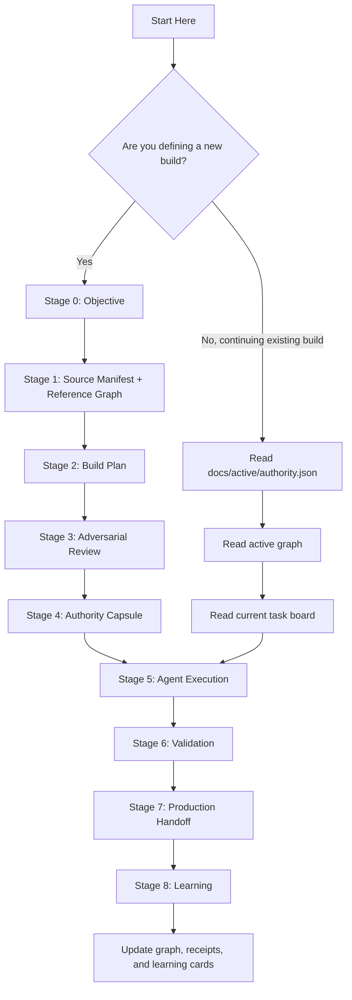

### The v7 command layer

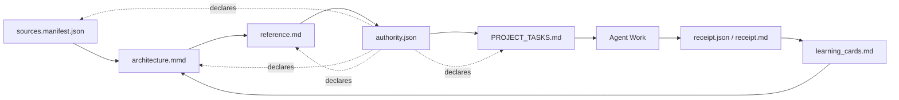

### The shortest possible version

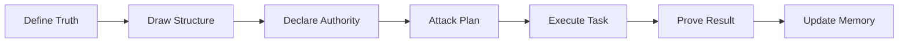

## Chapter 1 — What the Dark Factory Is

### Diagram 2

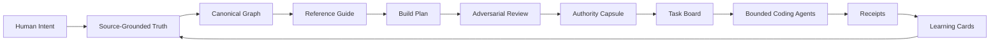

### The Dark Factory Command Stack

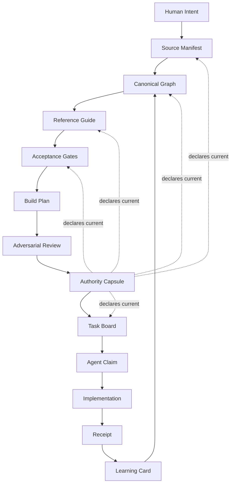

### The Core Advantage

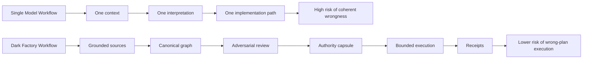

## Chapter 2 — The Six Engines of ACDF v7

### Diagram 1

```mermaid
flowchart TD
    A[ACDF v7] --> B[1. Reference Engine]
    A --> C[2. Planning Engine]
    A --> D[3. Review Engine]
    A --> E[4. Authority Engine]
    A --> F[5. Execution Engine]
    A --> G[6. Learning Engine]
    A --> H[Constraint Layer: Recency]
    A --> I[Constraint Layer: Token Governance]
    B --> B1[Turns sources into implementation-grade truth]
    B --> B2[Produces manifest, graph, reference guide, and gates]
    C --> C1[Turns truth into sequenced work]
    C --> C2[Produces build plan, task board, determinism map]
    D --> D1[Attacks truth and plan before code]
    D --> D2[Uses adaptive model council by task type]
    E --> E1[Declares current authority mechanically]
    E --> E2[Separates active truth from archive noise]
    F --> F1[Runs bounded coding agents]
    F --> F2[Controls claims, scope, files, and evidence]
    G --> G1[Converts failure into future constraints]
    G --> G2[Updates receipts, learning cards, tests, and graph]
    H --> H1[Tracks freshness of sources]
    H --> H2[Blocks stale critical claims]
    I --> I1[Preserves context headroom]
    I --> I2[Prevents expensive-model waste]
```

### Diagram 2

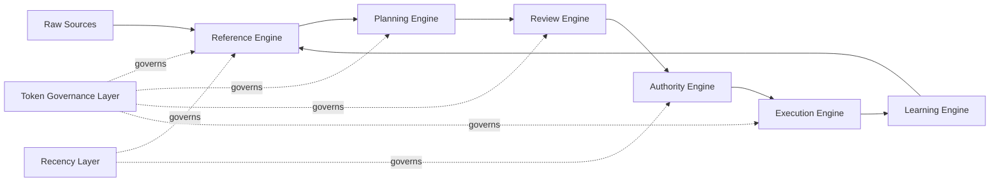

### Diagram 3

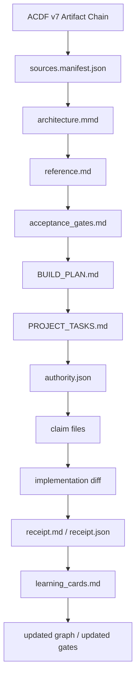

### Engine 1 — Reference Engine

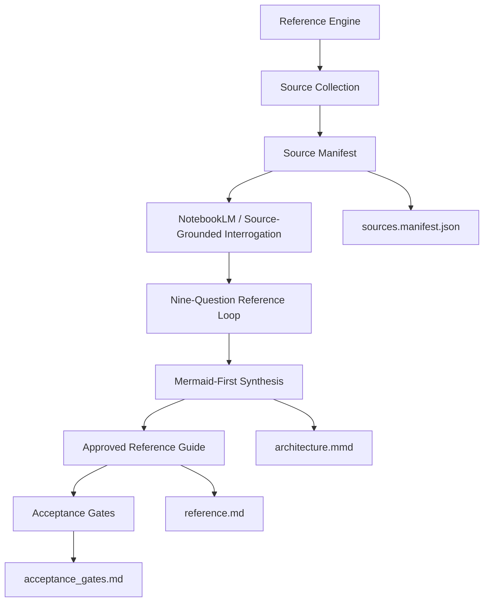

### Engine 2 — Planning Engine

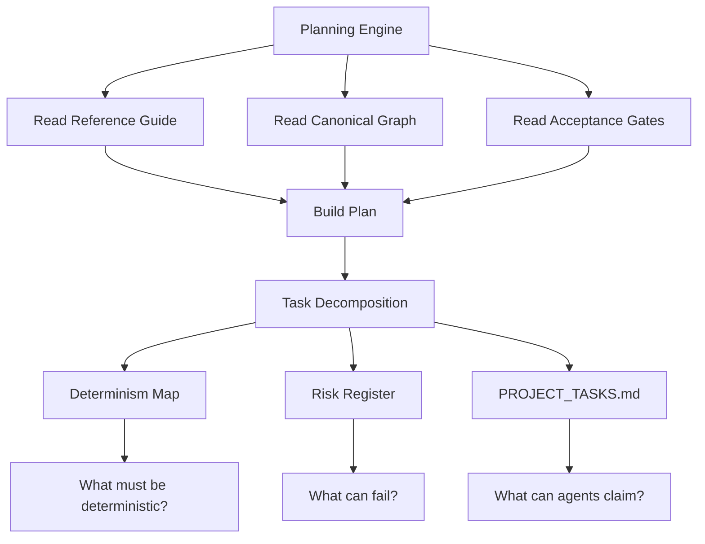

### Engine 3 — Review Engine

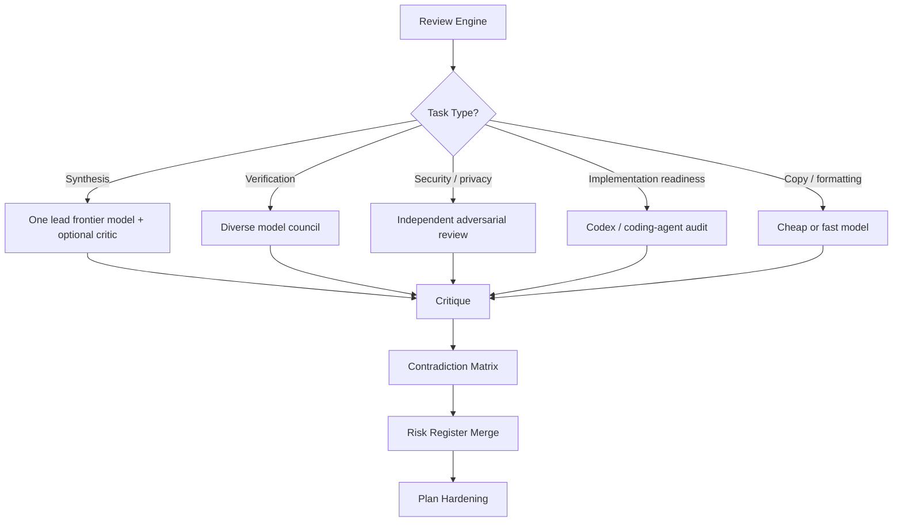

### Engine 4 — Authority Engine

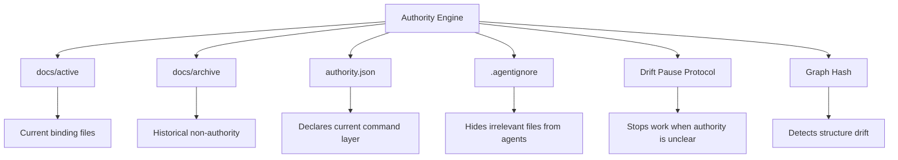

### Engine 5 — Execution Engine

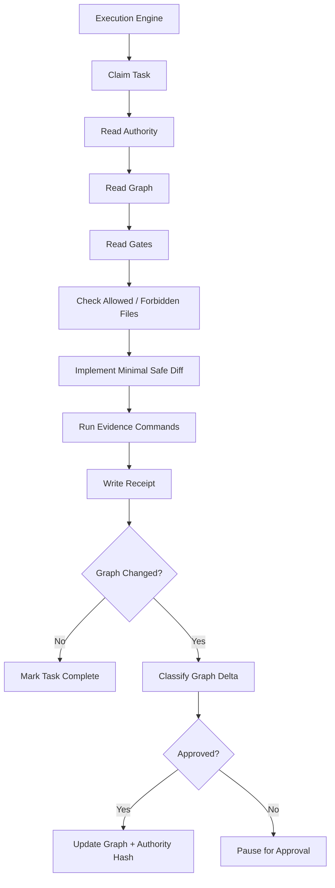

### Engine 6 — Learning Engine

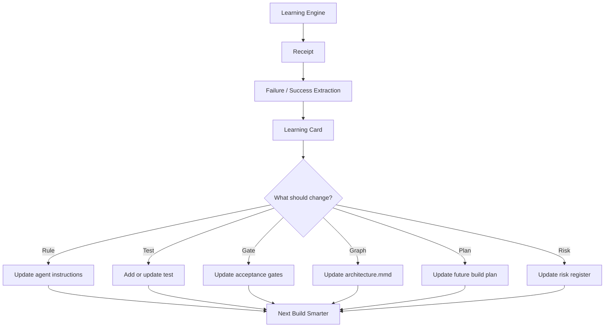

### Constraint Layer 1 — Recency Layer

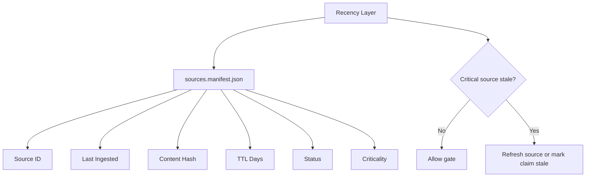

### Constraint Layer 2 — Token Governance Layer

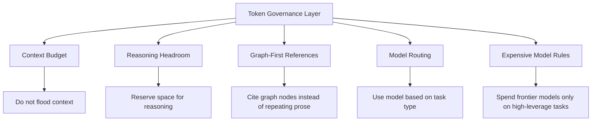

### The v7 Engine Loop

```mermaid
flowchart TD
    A[Reference Engine: define truth] --> B[Planning Engine: sequence work]
    B --> C[Review Engine: attack plan]
    C --> D[Authority Engine: bind current truth]
    D --> E[Execution Engine: perform bounded work]
    E --> F[Learning Engine: capture proof and lessons]
    F --> A
    G[Recency Layer] -. checks source freshness .-> A
    G -. checks authority freshness .-> D
    H[Token Governance Layer] -. preserves context headroom .-> A
    H -. routes model use .-> C
    H -. limits execution context .-> E
```

## Chapter 3 — The Core Failure

### Diagram 1

```mermaid
flowchart TD
    A[AI Coding Failure] --> B[Vague Specification]
    A --> C[Unclear Authority]
    A --> D[Stale Context]
    A --> E[Unstructured Inputs]
    A --> F[Unverified Completion]
    B --> B1[Agent fills gaps]
    B1 --> B2[Plausible assumptions]
    C --> C1[Old and current plans coexist]
    C1 --> C2[Agent cannot identify binding truth]
    D --> D1[Prior chat memory]
    D --> D2[Old task lists]
    D --> D3[Compressed subagent prompts]
    E --> E1[Too much prose]
    E --> E2[No canonical graph]
    E --> E3[No explicit edges or boundaries]
    F --> F1[Agent says done]
    F1 --> F2[No receipt or proof]
    B2 --> G[Coherent but Unauthorized Implementation]
    C2 --> G
    D1 --> G
    D2 --> G
    D3 --> G
    E2 --> G
    F2 --> G
```

### Diagram 2

```mermaid
flowchart LR
    A[Vague Intent] --> B[Stale Build Plan]
    B --> C[Old Task List]
    C --> D[Current Repo State]
    D --> E[Prior Chat Memory]
    E --> F[Compressed Subagent Prompt]
    F --> G[Agent Interpretation]
    G --> H[Coherent but Unauthorized Implementation]
```

### Diagram 3

```mermaid
flowchart TD
    A[Truth-Layer Collapse] --> B[Evidence]
    A --> C[Notes]
    A --> D[Old Plans]
    A --> E[Active Plans]
    A --> F[Tasks]
    A --> G[Logs]
    A --> H[Memory]
    B --> I[False Command Layer]
    C --> I
    D --> I
    E --> I
    F --> I
    G --> I
    H --> I
    I --> J[Confident Implementation]
    J --> K[Unauthorized Change]
```

### Diagram 4

```mermaid
flowchart TD
    A[Fix Is Architectural] --> B[Source Manifest]
    A --> C[Canonical Graph]
    A --> D[Reference Guide]
    A --> E[Acceptance Gates]
    A --> F[Authority Capsule]
    A --> G[Task Claims]
    A --> H[Receipts]
    B --> B1[What evidence exists and is fresh?]
    C --> C1[What structure is current?]
    D --> D1[What does correct mean?]
    E --> E1[What must pass?]
    F --> F1[What is binding?]
    G --> G1[What is the agent allowed to do?]
    H --> H1[What actually changed?]
    B1 --> I[Prevent Collapse]
    C1 --> I
    D1 --> I
    E1 --> I
    F1 --> I
    G1 --> I
    H1 --> I
```

### The Failure Equation

```mermaid
flowchart TD
    A[Failure Equation] --> B[Vague Intent]
    A --> C[Stale Build Plan]
    A --> D[Old Task List]
    A --> E[Current Repo State]
    A --> F[Prior Chat Memory]
    A --> G[Compressed Subagent Prompt]
    A --> H[No Binding Authority]
    A --> I[No Receipt Requirement]
    B --> J[Agent fills gaps]
    C --> J
    D --> J
    E --> J
    F --> J
    G --> J
    H --> J
    I --> J
    J --> K[Reasonable Assumptions]
    K --> L[Unauthorized Implementation]
```

### Key Principles

```mermaid
flowchart TD
    A[Core Failure Principles] --> P1[Plausible output is not correct output]
    A --> P2[Agents fill gaps with unauthorized assumptions]
    A --> P3[Humans experience time as sequence]
    A --> P4[Agents experience time as context]
    A --> P5[Old files can feel current]
    A --> P6[More capable models make drift more dangerous]
    A --> P7[Truth-layer collapse is an authority failure]
    A --> P8[Graph absence makes drift harder to detect]
    A --> P9[Receipts are required for completion]
    P1 --> C1[Require acceptance gates]
    P2 --> C2[Require precise specs]
    P3 --> C3[Do not rely on conversation order]
    P4 --> C4[Use explicit filesystem authority]
    P5 --> C5[Separate active and archive]
    P6 --> C6[Constrain before execution]
    P7 --> C7[Use authority capsule]
    P8 --> C8[Use canonical graph]
    P9 --> C9[Require proof]
```

### Core Term: Truth-Layer Collapse

```mermaid
flowchart LR
    A[Evidence] --> H[False Command Layer]
    B[Notes] --> H
    C[Old Plans] --> H
    D[Active Plans] --> H
    E[Tasks] --> H
    F[Logs] --> H
    G[Memory] --> H
    H --> I[Confident Agent Action]
    I --> J[Unauthorized Implementation]
```

### The v7 Diagnosis

```mermaid
flowchart TD
    A[What Failed?] --> B{Was correctness defined?}
    B -->|No| C[Specification failure]
    B -->|Yes| D{Was current authority declared?}
    D -->|No| E[Authority failure]
    D -->|Yes| F{Was structure explicit?}
    F -->|No| G[Structure failure]
    F -->|Yes| H{Were sources fresh?}
    H -->|No| I[Recency failure]
    H -->|Yes| J{Was proof required?}
    J -->|No| K[Receipt failure]
    J -->|Yes| L[Implementation bug]
```

### The Architectural Fix

```mermaid
flowchart TD
    A[Truth-Layer Collapse] --> B[ACDF v7 Countermeasures]
    B --> C[Reference Engine]
    B --> D[Planning Engine]
    B --> E[Authority Engine]
    B --> F[Execution Engine]
    B --> G[Learning Engine]
    B --> H[Recency Layer]
    B --> I[Token Governance Layer]
    C --> C1[Defines correctness]
    D --> D1[Sequences work]
    E --> E1[Declares current truth]
    F --> F1[Constrains agent action]
    G --> G1[Converts failure into future rules]
    H --> H1[Prevents stale evidence]
    I --> I1[Prevents context overload]
    C1 --> J[Collapse Prevention]
    D1 --> J
    E1 --> J
    F1 --> J
    G1 --> J
    H1 --> J
    I1 --> J
```

## Chapter 4 — The v7 Operating Model

### Diagram 1

```mermaid
flowchart TD
    A[Source Material] --> B[Source Manifest]
    B --> C[Source Synthesis]
    C --> D[Canonical Graph]
    D --> E[Reference Guide]
    E --> F[Acceptance Gates]
    F --> G[Reference Hardening]
    G --> H[Build Plan]
    H --> I[Indexed Task Board]
    I --> J[Adaptive Adversarial Review]
    J --> K[Contradiction Matrix]
    K --> L[Authority Capsule]
    L --> M[Execution Readiness]
    M --> N[Claimed Agent Tasks]
    N --> O[Implementation]
    O --> P[Validation]
    P --> Q[Stabilization]
    Q --> R[Receipts]
    R --> S[Retrospective Learning]
    S --> T[Learning Cards]
    T --> D
```

### Diagram 2

```mermaid
flowchart LR
    A[Build Truth] --> B[Draw Structure]
    B --> C[Harden Truth]
    C --> D[Plan Work]
    D --> E[Attack Plan]
    E --> F[Declare Authority]
    F --> G[Execute Claimed Tasks]
    G --> H[Prove Behavior]
    H --> I[Update Memory]
```

### Diagram 3

```mermaid
flowchart TD
    A[v7 Operating Model] --> B[Before Code]
    A --> C[During Code]
    A --> D[After Code]
    B --> B1[Source manifest]
    B --> B2[Canonical graph]
    B --> B3[Reference guide]
    B --> B4[Acceptance gates]
    B --> B5[Build plan]
    B --> B6[Adversarial review]
    B --> B7[Authority capsule]
    C --> C1[Task claim]
    C --> C2[Allowed / forbidden files]
    C --> C3[Minimal safe diff]
    C --> C4[Evidence commands]
    C --> C5[Graph delta check]
    D --> D1[Receipt]
    D --> D2[Validation]
    D --> D3[Stabilization]
    D --> D4[Learning card]
    D --> D5[Graph / gate / rule update]
```

### Workflow Spine

```mermaid
flowchart TD
    A[1. Source Material] --> B[2. Source Manifest]
    B --> C[3. Source Synthesis]
    C --> D[4. Canonical Graph]
    D --> E[5. Reference Guide]
    E --> F[6. Acceptance Gates]
    F --> G[7. Reference Hardening]
    G --> H[8. Build Plan]
    H --> I[9. Indexed Task Board]
    I --> J[10. Adaptive Adversarial Review]
    J --> K[11. Contradiction Matrix]
    K --> L[12. Authority Capsule]
    L --> M[13. Execution Readiness]
    M --> N[14. Claimed Agent Tasks]
    N --> O[15. Implementation]
    O --> P[16. Validation]
    P --> Q[17. Stabilization]
    Q --> R[18. Receipts]
    R --> S[19. Retrospective Learning]
    S --> T[20. Learning Cards]
    T --> U[21. Updated Graph / Gates / Constraints]
```

### The Three Phases of v7

```mermaid
flowchart TD
    A[ACDF v7] --> B[Phase 1: Before Code]
    A --> C[Phase 2: During Code]
    A --> D[Phase 3: After Code]
    B --> B1[Build truth]
    B --> B2[Draw structure]
    B --> B3[Define gates]
    B --> B4[Plan work]
    B --> B5[Attack plan]
    B --> B6[Declare authority]
    C --> C1[Claim task]
    C --> C2[Read authority]
    C --> C3[Check scope]
    C --> C4[Implement]
    C --> C5[Run evidence]
    D --> D1[Validate]
    D --> D2[Stabilize]
    D --> D3[Write receipt]
    D --> D4[Capture learning]
    D --> D5[Update graph / gates / rules]
```

### Key Principles

```mermaid
flowchart TD
    A[v7 Operating Principles] --> P1[Build truth before building code]
    A --> P2[Draw structure before hardening prose]
    A --> P3[Attack truth before trusting it]
    A --> P4[Make authority visible before execution]
    A --> P5[Make tasks indexed before agents claim them]
    A --> P6[Constrain scope before files change]
    A --> P7[Prove behavior before calling it done]
    A --> P8[Convert failures into constraints]
    P1 --> C1[Reference Engine]
    P2 --> C2[Canonical Graph]
    P3 --> C3[Review Engine]
    P4 --> C4[Authority Engine]
    P5 --> C5[Planning Engine]
    P6 --> C6[Execution Engine]
    P7 --> C7[Receipts]
    P8 --> C8[Learning Engine]
```

### v6 to v7 Upgrade Map

```mermaid
flowchart LR
    A[v6 Operating Model] --> B[v7 Operating Model]
    A1[Source Synthesis] --> B1[Source Manifest + Source Synthesis]
    A2[Reference Guide] --> B2[Canonical Graph + Reference Guide]
    A3[Build Plan] --> B3[Build Plan + Determinism Map]
    A4[Multi-Model Review] --> B4[Adaptive Adversarial Review]
    A5[Authority Capsule] --> B5[Authority Capsule + Graph Hash + Source TTL]
    A6[Claimed Tasks] --> B6[Claimed Tasks + Graph Delta Check]
    A7[Retrospective Learning] --> B7[Receipts + Learning Cards + Updated Graph]
```

### The v7 Control Loop

```mermaid
flowchart TD
    A[Define] --> B[Structure]
    B --> C[Harden]
    C --> D[Authorize]
    D --> E[Execute]
    E --> F[Prove]
    F --> G[Learn]
    G --> A
    A --> A1[Reference guide + gates]
    B --> B1[Canonical graph]
    C --> C1[Adversarial review + contradiction matrix]
    D --> D1[authority.json]
    E --> E1[Claimed task + bounded diff]
    F --> F1[Receipt + validation]
    G --> G1[Learning card + updated constraints]
```

### Operating Model Doctrine

```mermaid
flowchart LR
    A[Truth] --> B[Structure]
    B --> C[Authority]
    C --> D[Execution]
    D --> E[Proof]
    E --> F[Memory]
```

## Chapter 5 — Hero Lenses as Agent Control Primitives

### Diagram 1

```mermaid
flowchart TD
    A[Hero Lenses] --> B[Behavioral Priors]
    A --> C[Task-Time Controls]
    A --> D[Evidence Requirements]
    A --> E[Failure-Mode Focus]
    A --> F[Tradeoff Selectors]
    B --> B1[Compress engineering judgment]
    B --> B2[Give the model a sharper frame]
    B --> B3[Replace vague quality language]
    C --> C1[Activated per stage, phase, or task]
    C --> C2[Declared in task instructions]
    C --> C3[Mapped to allowed behavior]
    D --> D1[Tests]
    D --> D2[Screenshots]
    D --> D3[Logs]
    D --> D4[Receipts]
    D --> D5[Graph delta notes]
    E --> E1[Drift]
    E --> E2[Ambiguity]
    E --> E3[Security]
    E --> E4[Runtime mismatch]
    E --> E5[Product failure]
    F --> F1[Correctness vs speed]
    F --> F2[Safety vs scope]
    F --> F3[Simplicity vs abstraction]
    F --> F4[User proof vs internal elegance]
```

### Diagram 2

```mermaid
flowchart LR
    A[Generic Prompt] --> B[Write good code]
    B --> C[Weak behavioral frame]
    D[Hero Lens Prompt] --> E[Optimize for specific behavior]
    E --> F[Watch specific failure mode]
    F --> G[Produce specific evidence]
    G --> H[Stronger agent control]
```

### Diagram 3

```mermaid
flowchart TD
    A[Hero Lens] --> B[What to Optimize]
    A --> C[What to Avoid]
    A --> D[What Evidence Counts]
    A --> E[When to Stop]
    A --> F[What Failure to Expect]
    B --> G[Agent Behavior Changes]
    C --> G
    D --> G
    E --> G
    F --> G
    G --> H[Better Bounded Execution]
```

### The Hero Lens Map

```mermaid
flowchart TD
    A[Hero Lenses] --> L[Lopopolo]
    A --> C[Cherny]
    A --> W[Willison]
    A --> H[Hashimoto]
    A --> T[Taylor]
    A --> N[Carlini]
    A --> R[Schaad]
    A --> G[Wood]
    A --> K[Karpathy]
    A --> J[Carmack]
    L --> L1[Harness Master]
    L1 --> L2[Binary gates, constraints, artifact discipline]
    C --> C1[Type-Driven Orchestrator]
    C1 --> C2[Options, decomposition, task sequencing]
    W --> W1[Agentic Architect]
    W1 --> W2[Empirical checks, sandboxing, validation]
    H --> H1[Hammer Maker]
    H1 --> H2[Usable tools, one-command paths, operability]
    T --> T1[Product Machine Builder]
    T1 --> T2[Outcome metrics, user proof, business value]
    N --> N1[Adversarial Reductionist]
    N1 --> N2[Security, injection, exfiltration, least privilege]
    R --> R1[Temporal Craftsman]
    R1 --> R2[UI states, latency, copy, hierarchy, feel]
    G --> G1[Protocol Primitive Architect]
    G1 --> G2[Invariants, incentives, composability]
    K --> K1[Micro-Loop Engineer]
    K1 --> K2[Small, inspectable, surgical changes]
    J --> J1[Runtime Truth Engineer]
    J1 --> J2[Logs, screenshots, measurements, performance proof]
```

### Hero Lenses in the ACDF v7 Stack

```mermaid
flowchart TD
    A[ACDF v7 Stage] --> B{Which behavior is needed?}
    B -->|Define correctness| L[Lopopolo]
    B -->|Plan sequence| C[Cherny]
    B -->|Verify reality| W[Willison]
    B -->|Build usable primitive| H[Hashimoto]
    B -->|Optimize user outcome| T[Taylor]
    B -->|Reduce attack surface| N[Carlini]
    B -->|Shape UI behavior| R[Schaad]
    B -->|Formalize protocol| G[Wood]
    B -->|Keep diff surgical| K[Karpathy]
    B -->|Prove runtime behavior| J[Carmack]
    L --> X[Task Lens]
    C --> X
    W --> X
    H --> X
    T --> X
    N --> X
    R --> X
    G --> X
    K --> X
    J --> X
    X --> Y[Agent Instructions]
    Y --> Z[Evidence Requirements]
```

### Hero Lens Syntax

```mermaid
flowchart TD
    A[Hero Lens Block] --> B[Hero Lens]
    A --> C[Agent Behavior]
    A --> D[Evidence Required]
    A --> E[Stop Conditions]
    A --> F[Forbidden Behavior]
    B --> B1[Who is active?]
    C --> C1[What should the agent do differently?]
    D --> D1[What proof must exist?]
    E --> E1[When must the agent pause?]
    F --> F1[What must not happen?]
```

### Hero Lens Evidence Contract

```mermaid
flowchart LR
    A[Hero Lens] --> B[Behavior]
    B --> C[Evidence]
    C --> D[Receipt]
    D --> E[Acceptance]
    A -. no evidence .-> F[Invalid Lens]
```

### Hero Combinations

```mermaid
flowchart TD
    A[Task Need] --> B{Primary Risk?}
    B -->|Correctness ambiguity| C[[L] + [W]]
    B -->|Planning complexity| D[[C] + [K]]
    B -->|Security risk| E[[N] + [W] + [J]]
    B -->|UI/product behavior| F[[R] + [T] + [W]]
    B -->|Tooling/operability| G[[H] + [K] + [J]]
    B -->|Protocol/economic system| H[[G] + [N] + [J]]
    B -->|Runtime validation| I[[J] + [W] + [L]]
```

### Key Principles

```mermaid
flowchart TD
    A[Hero Lens Principles] --> P1[Heroes are behavioral anchors, not mascots]
    A --> P2[Heroes should be active at task time]
    A --> P3[Hero combinations define tradeoffs]
    A --> P4[Every hero callout maps to evidence]
    A --> P5[A hero lens should change agent behavior]
    A --> P6[The lens is selected by the failure mode]
    A --> P7[No evidence means no lens]
    P1 --> C1[Do not use names as decoration]
    P2 --> C2[Put lens inside task instructions]
    P3 --> C3[Combine lenses deliberately]
    P4 --> C4[Require receipt fields]
    P5 --> C5[Behavior must be observable]
    P6 --> C6[Start from what could go wrong]
    P7 --> C7[Remove decorative callouts]
```

### Hero Lens Scope

```mermaid
flowchart TD
    A[Hero Scope Rules] --> G[Wood]
    A --> K[Karpathy]
    A --> J[Carmack]
    A --> N[Carlini]
    A --> R[Schaad]
    A --> T[Taylor]
    G --> G1[Activate for protocol / multi-actor / economic systems]
    K --> K1[Activate across most AI-assisted builds]
    J --> J1[Activate for runtime validation and learning]
    N --> N1[Activate for security, privacy, injection, data boundaries]
    R --> R1[Activate for UI, UX, visual hierarchy, interaction states]
    T --> T1[Activate for product outcome and customer proof]
```

### Hero Lens Receipt Fields

```mermaid
flowchart TD
    A[Receipt] --> B[Hero Lens Used]
    A --> C[Behavior Required]
    A --> D[Evidence Produced]
    A --> E[Stop Conditions Encountered]
    A --> F[Failure Mode Checked]
    A --> G[Graph Delta]
    A --> H[Open Risk]
    B --> I[Accept / Reject Completion]
    C --> I
    D --> I
    E --> I
    F --> I
    G --> I
    H --> I
```

### One-Line Doctrine

```mermaid
flowchart LR
    A[Hero Lens] --> B[Behavior]
    B --> C[Evidence]
    C --> D[Receipt]
    D --> E[Trust]
```

---

## Narrative


What this document is

This is a complete, standalone operating methodology for building software systems with AI coding agents. It covers the full lifecycle from objective definition to production handoff: how to synthesize source material into implementation-grade truth, how to define correctness, how to plan without guessing, how to attack the plan before code exists, how to make authority mechanically visible to agents, how to run agents without collision or drift, and how to make every build smarter than the one before it.

It is not a tutorial for any specific AI coding tool. It is the governance layer above the tools. The tools will change. The specification problem will not.

⸻

Where ACDF Sits


Agentic AI development is new. Production-grade agentic builds only became reliably possible around November 2025, with earlier glimpses in mid-2025. The field has moved fast enough since then that no "best practices" have had time to settle. This document does not claim to be the only valid approach. It documents one approach, validated across multiple production builds by a single solo orchestrator, and states its assumptions plainly so the reader can judge whether those assumptions match their own situation.

There is a useful fork in how people build with AI agents today:

Vibe coding is rapid, exploratory, low-stakes iteration. Go with the flow, accept some mess, optimize for speed of feedback. This is a legitimate and often correct choice for prototypes, throwaway tools, and low-complexity work. ACDF is not aimed at this mode and does not try to replace it.

Agentic code engineering is for high-complexity or high-stakes builds, where the cost of an undetected mistake compounds. Within this mode there is a further fork between legacy codebases (building on existing code, where unknown constraints and hidden dependencies dominate) and greenfield builds (starting from a blank repo, where the risk is unconstrained scope rather than hidden constraints). ACDF applies to both, with archetype overlays adjusting emphasis.

Within agentic code engineering, the current dominant pattern is the agent loop: a persistent, autonomous agent running OODA-style cycles against a long-running goal, sometimes called "/goals" or long-running-goal workflows. In that paradigm, heavy token usage is not a bug — it is the mechanism. Deep exploration, self-correction, and emergent self-improvement come from the agent being given room (and budget) to iterate extensively. This is a real and often effective approach.

It has one structural weakness: it assumes token or subscription-credit cost is not the binding constraint. If AI providers change pricing models, tighten subscription limits, or if the builder is simply cost- or time-constrained from the start, the agent-loop paradigm degrades — sometimes sharply — for that builder.

ACDF is built for that builder: the solopreneur or small team that is both cost-constrained and time-constrained, and cannot treat tokens as an expendable resource for exploration. ACDF is largely unknown outside this document's author's own practice; it is offered here as a documented alternative, not a replacement, for the agent-loop meta.

⸻

Every serious failure in agentic engineering usually traces back to one of five causes:

1. The agent was asked to implement something that was not precisely defined.
2. The agent could not distinguish current authority from stale authority.
3. The agent consumed too much prose and too little structure.
4. The agent relied on sources that were no longer fresh.
5. The agent claimed completion without producing evidence.

ACDF v7.0 exists to remove those failure modes before implementation begins.

v6.0 added the Authority Engine. That solved a major context problem: agents cannot drift against the wrong plan if the filesystem makes the right plan unmistakably visible and the wrong files visibly non-authoritative.

v7.0 adds the next layer: Structure-First, Recency-Native, Graph-Governed execution.

The v7 doctrine is:

A model may propose.
A graph must locate.
A manifest must date.
An authority file must bind.
A receipt must prove.

In v7, Mermaid diagrams are not decoration. They are canonical intermediate representations. The active graph shows what the system believes is connected. The source manifest shows how fresh the evidence is. The authority capsule shows what is binding. The receipt shows what actually changed.

The factory does not care what you are building. It cares whether the right graph is in command, whether that graph is still true, and whether the implementation proved its work.

⸻

The Economic Doctrine


Structure substitutes for scale.

A well-specified task given to a cheap or free-tier model reliably outperforms an underspecified task given to an expensive frontier model, because the expensive model still has to guess at what the cheap model was simply told.

This is the economic counterpart to the technical argument above. The reference guide, the graph, the gates, and the receipts are not only correctness mechanisms — they are the mechanism by which a cost-constrained builder gets access to reasoning quality that would otherwise require unconstrained token spend. The adversarial review step alone routes a plan through several models' worth of independent scrutiny before any expensive execution begins, at a cost in time rather than tokens. AI Credit Arbitrage (Part IV) makes this explicit: expensive models are reserved for the small number of tasks where their marginal value is highest, and structure does the rest.

The builder is not just spending less. The builder is getting more — at the price tier they can actually afford, indefinitely.

⸻

Who this document is for


Reader	How this document applies
Solo developer or technical founder	This is the primary validated use case. The workflow has been proven across multiple production systems in different domains by a single orchestrator. Use the full 0–8 stage chain. Keep PROJECT_TASKS.md as a local repo file when working solo. External subscription tools are optional, not required. Enable Auto-Approve Mode only after Gates 0–3 have passed for personal projects.
Engineer on a team with an existing codebase	The specification discipline, adversarial review, determinism map, authority capsule, graph contract, and takeover protocol apply directly. For team-scale orchestration, replace PROJECT_TASKS.md with a CI-backed issue tracker. Read the enterprise governance sections before deploying this workflow across a team.
AI coding agent receiving this as context	This document defines the operating contract you must follow. The authority.json file in docs/active/ defines what plan is current. The active Mermaid graph defines the current system structure. The approved reference guide defines what correct means. PROJECT_TASKS.md or the assigned issue tracker defines the work queue. Claims lock your work. When in doubt, stop and surface the ambiguity. Do not proceed without resolution. All gates are binary. Partial passes do not exist. Archive files are not authority.
Business function builder, domain expert, or non-engineer	This workflow does not require you to write code. It requires you to define rules precisely enough that an agent can implement them without guessing. Your domain expertise is the input. The reference guide, graph, acceptance gates, and task board are the outputs.

⸻

The core problems this workflow solves


The specification problem

AI coding agents are fast but unreliable when the specification is vague. The failure mode is usually the same: the agent produces output that is internally coherent but incorrect relative to what was actually needed.

The reason is often not model capability. The reason is that “what was actually needed” was never written precisely enough for the agent to implement it correctly. The agent filled in the gaps with plausible assumptions, and those assumptions diverged from intent.

ACDF solves this by forcing the specification to exist before code begins. The reference guide, graph, acceptance gates, and task board make intent explicit.

The authority problem

Even with a precise specification, agents fail when they cannot determine which plan, task board, constraints, and design rules are currently authoritative.

Agents experience time as context, not sequence. An old build plan feels as alive as the current one if both are available in the same context. Truth-layer collapse happens when an agent blends evidence, notes, old plans, active plans, tasks, logs, and memory into one false command layer.

The Authority Engine solves this architecturally. Current authority lives in docs/active/. Archive files are not authority. authority.json declares the binding plan, binding graph, binding reference guide, binding acceptance gates, and current task board.

The structure problem

Prose is necessary but expensive. It is also easy to misread.

ACDF v7 adds a structure-first rule: serious source synthesis must produce a canonical structure before final prose. For software systems, the default structure is a Mermaid graph. For other domains, the structure may be a schema, state machine, clause matrix, timeline, decision tree, or test matrix.

The rule is:

Structure first. Prose second. Execution third.

This lets agents argue over the same system shape instead of six different interpretations of a long document.

The recency problem

Frontier models are powerful, but they are not automatically current on your project, your repo, your latest docs, or last week’s framework changes.

ACDF v7 introduces a Recency Layer. Sources must be tracked in sources.manifest.json with ingestion dates, content hashes, freshness windows, and status. If a critical claim depends on a stale source, the gate fails automatically. The "marked stale" path applies only to non-critical claims, which may proceed with the staleness flag recorded in the receipt. The agent does not decide which claims are critical; criticality is declared in the source manifest at ingestion.

The source manifest answers:

What evidence do we have?
When was it ingested?
Has it changed?
Is it still fresh enough to govern implementation?

The execution proof problem

Agentic development fails when “done” means “the agent stopped writing.”

In ACDF, “done” means evidence exists.

Every implementation must produce receipts: changed files, tests run, tests passed or failed, screenshots when relevant, graph deltas, unresolved risks, and next recommended action. The receipt is not paperwork. It is the mechanism that lets the next build inherit truth instead of confusion.

⸻

How this document is structured


Section	What it contains
Part I — Orientation	Core thesis, the failure equation, the five engines, the v7 operating model, structure-first doctrine, recency-native governance, and hero lenses as agent control primitives.
Part II — Build the Truth	Source synthesis, NotebookLM as temporary subject matter expert, the nine-question reference guide loop, Mermaid-first synthesis, multi-model hardening, and the approved reference guide.
Part III — Turn Truth into Plan	Build plan generation, Plan Mode, the indexed project task board, determinism mapping, and acceptance gate design.
Part IV — Attack the Plan	Why adversarial review comes before code, the adaptive frontier model review council, independence and contamination control, AI credit arbitrage, risk register, contradiction matrix, and plan hardening.
Part V — Authority and Task Control	Truth layers, the authority capsule, graph hash, source freshness, claims and collision control, the drift pause protocol, and graph-diff governance.
Part VI — The 0–8 Stage Workflow	Complete stage runbooks for Stages 0 through 8.
Part VII — Agent Roles and Collaboration Protocol	Human workflow owner role, agent role definitions, collaboration rules, handoff norms, and stop conditions.
Part VIII — Archetype Overlays	Data pipeline, AI/LLM app, frontend, creative/product, native/mobile, takeover/fork, Web3/protocol, and other domain-specific overlays.
Part IX — Reusable Patterns	Level 5 Harness, Structured Output Compiler, Creative/Product Reference Guide, AI App Failure Checklist, Build Ledger, Receipt Schema, and Graph Delta Log.
Part X — Governance Modes	Solo/lightweight, standard, heavy, enterprise, orchestration bridge, and Auto-Approve Mode constraints.
Part XI — Proof and Portfolio	The factory that does not care what you are building, portfolio evidence, cross-build lessons, and institutional memory.
Part XII — Quick Reference and Templates	Pre-execution checklist, gate summary, reusable prompts, graph templates, manifest templates, authority templates, and receipt templates.
Appendices	Glossary, example repo structures, deprecated patterns, domain-expert guidance, frontier-model optimization, token governance, Mermaid patterns, and external convergence notes.

⸻

How to use this document


Read this document as an operating system, not as an essay.

For a new build, start at Stage 0 and move sequentially through the workflow. Do not skip the reference guide. Do not skip the graph. Do not skip adversarial review. Do not let an agent write code before correctness has been defined.

For an existing build, begin with docs/active/authority.json. That file tells you what is current. Then read the active graph, the approved reference guide, the acceptance gates, and the task board. Do not treat archived plans, old notes, chat transcripts, or prior task lists as authority unless the authority file explicitly names them.

For an AI coding agent, this document is not background reading. It is an operating contract. Your job is not to be creative by default. Your job is to execute the current task against current authority, produce evidence, and stop when ambiguity appears.

For a human orchestrator, this document gives you leverage. You are not trying to out-code the agent. You are building the rails that make the agent useful: precise truth, clear authority, structured context, adversarial review, and receipt-backed learning.

⸻

The v7 command layer


The v7 command layer is simple:

1. sources.manifest.json says what evidence exists and whether it is fresh.
2. architecture.mmd says what the system structure is.
3. reference.md explains the graph and defines correctness.
4. authority.json declares which files are binding.
5. PROJECT_TASKS.md or the issue tracker defines the work queue.
6. The agent claims one task, implements it, and produces a receipt.
7. Receipts update learning cards, task state, and when necessary, the graph.

This is how ACDF v7 prevents truth-layer collapse.

The agent does not decide what is current.
The filesystem does.
The graph does.
The authority file does.
The receipt proves whether the work matched them.

⸻

The shortest possible version


ACDF v7 is the discipline of making AI coding agents operate against current, structured, fresh, and testable truth.

The method is simple:

Define truth.
Draw structure.
Declare authority.
Attack the plan.
Execute one claimed task.
Prove the result.
Update memory.

Everything else in this document exists to make those seven steps mechanically reliable.
----
PART I — ORIENTATION

Chapter 1 — What the Dark Factory Is


Key Message

The Dark Factory is a governance layer for building software with AI agents.

It is not a prompt library.
It is not a coding tutorial.
It is not a workflow for one specific tool.

It is the operating system above the tools: a method for defining correctness before code exists, attacking the plan before implementation, making authority mechanically visible to agents, and constraining agents so they execute the right work inside the right truth.

The core advantage is orchestration. A solo builder can now simulate a synthetic expert council:

NotebookLM as source-grounded subject matter expert
+ frontier models as adversarial reviewers
+ canonical graph as system structure
+ reference guide as correctness contract
+ build plan as execution sequence
+ PROJECT_TASKS.md as human control tower
+ authority capsule as current truth
+ coding agents as bounded workers
+ receipts as proof of execution
+ learning cards as future constraints

The goal is not one smarter model.

The goal is a repo where agents cannot easily build against the wrong plan, stale truth, vague requirements, or unproven assumptions.

In v7, the Dark Factory becomes structure-first, recency-native, and graph-governed. The active graph shows what the system believes. The source manifest shows whether the evidence is fresh. The authority capsule declares what is binding. The receipt proves what changed.

The factory does not care whether the build is a frontend app, data pipeline, AI product, mobile app, Web3 protocol, assessment engine, creative tool, or business workflow. It cares whether the right truth is in command.

⸻

Key Principles


1. AI agents are powerful but not automatically aligned with intent.
    A capable agent can still implement the wrong thing if the right thing was never defined clearly.
2. Code generation is cheap; correctness definition is scarce.
    The bottleneck is not typing code. The bottleneck is deciding what correct means before the agent starts.
3. The human owns intent, scope, risk, authority, and final acceptance.
    The agent can propose, generate, test, and revise. The human remains responsible for what the system is supposed to do and what risks are acceptable.
4. The model writes code; the workflow defines what correct means.
    ACDF does not depend on a single genius model. It depends on an operating method that turns intent into reference, reference into plan, plan into tasks, and tasks into verified implementation.
5. Authority must be mechanically declared, not assumed from context.
    Agents cannot reliably infer which plan is current when old plans, notes, logs, and drafts coexist. The filesystem must make authority explicit.
6. Structure must come before prose for serious systems.
    Long explanations are expensive and ambiguous. A canonical graph makes the system shape visible, compact, and easier to diff.
7. Recency must be tracked.
    A source can be true, useful, and still too stale to govern implementation. v7 treats source freshness as part of correctness.
8. Every build should make the next build smarter.
    Receipts, graph deltas, and learning cards turn failures into constraints instead of repeated mistakes.

⸻

The Dark Factory Command Stack


The Dark Factory operates through a command stack:

Layer	Function
Human intent	Defines what matters, why it matters, and what tradeoffs are acceptable.
Source manifest	Records what evidence exists, when it was ingested, and whether it is fresh.
Canonical graph	Shows the current system structure.
Reference guide	Explains correctness in implementation-grade language.
Acceptance gates	Define binary pass/fail conditions.
Build plan	Sequences the work.
Adversarial review	Attacks the plan before code exists.
Authority capsule	Declares which files are binding.
Task board	Converts the plan into claimable units of work.
Agent claim	Prevents collision and uncontrolled parallel edits.
Implementation	Changes the codebase.
Receipt	Proves what changed, what passed, what failed, and what remains unresolved.
Learning card	Converts the lesson into a future constraint.

This stack is what makes the repo governable.

Without it, the agent is operating from prompt memory.
With it, the agent is operating from declared authority.

⸻

The Core Advantage


The core advantage is not raw model intelligence. It is controlled orchestration.

A single frontier model can be brilliant and still wrong. It can reason deeply from a bad assumption. It can produce elegant code for a misunderstood objective. It can follow stale instructions because stale instructions were present in context.

The Dark Factory reduces those failure modes by separating the work into layers:

Truth is built before planning.
Structure is drawn before prose hardens.
The plan is attacked before code exists.
Authority is declared before agents execute.
Tasks are claimed before files are changed.
Receipts are produced before work is accepted.
Learning cards are written before the next build begins.

This is why a solo builder can simulate a synthetic expert council. The council is not valuable because it creates noise. It is valuable because each layer has a job.

NotebookLM grounds.
Frontier models attack.
The reference guide defines.
The graph locates.
The build plan sequences.
The authority capsule binds.
The task board controls.
The coding agent executes.
The receipt proves.
The learning card remembers.

⸻

One-Line Doctrine


The factory does not care what you are building.
It cares whether the right truth is in command.

v7 extended doctrine:

The graph must locate the system.
The manifest must date the evidence.
The authority file must bind the work.
The receipt must prove the result.
----
Chapter 2 — The Six Engines of ACDF v7


Key Message

ACDF v6 ran on five engines: Reference, Review, Authority, Execution, and Learning.

ACDF v7 upgrades the architecture.

The v7 system runs on six engines:

1. Reference Engine
2. Planning Engine
3. Review Engine
4. Authority Engine
5. Execution Engine
6. Learning Engine

And two constraint layers:

1. Recency Layer
2. Token Governance Layer

This matters because v6 solved authority collapse, but v7 must solve three additional problems:

1. Structure drift
2. Source staleness
3. Context-cost explosion

The v7 engines do not merely move a project from idea to code. They convert uncertain intent into fresh, structured, reviewed, authorized, executed, and remembered truth.

⸻

Engine 1 — Reference Engine


The Reference Engine turns source material into implementation-grade truth.

In v6, this engine worked mainly through source synthesis, NotebookLM interrogation, the nine-question reference guide loop, multi-model hardening, and the approved reference guide.

In v7, the Reference Engine becomes structure-first.

It does not jump from source material directly into prose. It produces a canonical structure before final narrative:

sources.manifest.json
→ architecture.mmd
→ reference.md
→ acceptance_gates.md

The Reference Engine answers:

What evidence do we have?
How fresh is it?
What structure does it imply?
What does correct mean?
How will we know the implementation passed?

Its main outputs are:

Output	Purpose
sources.manifest.json	Records source identity, ingestion date, content hash, TTL, and status.
architecture.mmd	Shows the current system structure as a compact, diffable graph.
reference.md	Explains the graph and defines implementation-grade correctness.
acceptance_gates.md	Converts correctness into binary pass/fail checks.

The Reference Engine prevents agents from guessing what the system is supposed to be.

⸻

Engine 2 — Planning Engine


The Planning Engine turns approved truth into sequenced work.

In earlier versions, planning was treated as part of the bridge between reference and review. In v7, it deserves its own engine because planning is where many agentic builds silently fail.

A good reference guide says what correct means.
A good plan says how to reach it safely.

The Planning Engine answers:

What should be built first?
What should not be touched?
Which tasks can run independently?
Which tasks require sequencing?
Which outputs must be deterministic?
Which gates prove completion?

Its main outputs are:

Output	Purpose
BUILD_PLAN.md	The implementation sequence.
PROJECT_TASKS.md	The claimable task board for agents.
DETERMINISM_MAP.md	Identifies what must be stable, repeatable, and testable.
RISK_REGISTER.md	Captures known risks before execution begins.
FORBIDDEN_TOUCHES.md or task-level forbidden files	Prevents agents from changing unrelated areas.

The Planning Engine prevents agents from improvising the execution order.

⸻

Engine 3 — Review Engine


The Review Engine attacks the reference guide and build plan before code begins.

In v6, the Review Engine used multiple frontier models as an adversarial council: independent review, contamination control, risk register merge, and plan hardening.

In v7, the Review Engine becomes adaptive.

The rule is no longer “send everything to six models.” The rule is:

Use the smallest model council that can catch the relevant failure.

Different tasks require different review shapes:

Task Type	Best Review Pattern	Reason
Synthesis	One strong lead model, optional single critic	Coherence matters more than committee noise.
Verification	Diverse model council	Independent failure detection matters.
Security/privacy	Independent adversaries from different vendors	Correlated blind spots are dangerous.
Implementation readiness	Coding-agent audit	Need file-level feasibility and test awareness.
Copy/formatting	Cheap or fast model	Low risk; frontier review is wasteful.

The Review Engine answers:

What is wrong with the plan?
What assumptions are unsupported?
What edge cases were missed?
What will fail in implementation?
What risks must become gates?

Its main outputs are:

Output	Purpose
MODEL_REVIEWS.md	Stores independent critiques.
CONTRADICTION_MATRIX.md	Resolves conflicts between reviewers.
RISK_REGISTER.md	Merges and ranks risks.
PLAN_HARDENING.md	Converts critique into changes.
Updated BUILD_PLAN.md	The hardened plan after review.

A critique does not count until it is resolved, rejected with rationale, or converted into a gate.

⸻

Engine 4 — Authority Engine


The Authority Engine makes the current plan, task board, source manifest, graph, reference guide, and historical archive mechanically visible and distinct.

In v6, this was the major new engine. It solved truth-layer collapse by making current authority explicit:

authority.json
stable file names
.agentignore
docs/active/
docs/archive/
drift pause protocol

In v7, the Authority Engine also governs structure and freshness.

It must know:

Which graph is current?
What is its hash?
Which source manifest is current?
Which reference guide is binding?
Which acceptance gates are binding?
Which task board is active?
Which files are archive-only?

A v7 authority.json should declare:

{
  "project": "PROJECT_NAME",
  "current_source_manifest": "docs/active/sources.manifest.json",
  "current_graph": "docs/active/architecture.mmd",
  "graph_hash": "sha256:...",
  "current_reference": "docs/active/reference.md",
  "current_acceptance_gates": "docs/active/acceptance_gates.md",
  "current_build_plan": "docs/active/BUILD_PLAN.md",
  "current_task_board": "PROJECT_TASKS.md",
  "archive_policy": "docs/archive is historical and non-authoritative",
  "drift_policy": "pause_on_unapproved_graph_or_authority_delta",
  "last_updated": "YYYY-MM-DD"
}

The Authority Engine answers:

What is current?
What is binding?
What is historical?
What may the agent use?
When must the agent stop?

The Authority Engine prevents agents from obeying stale truth.

⸻

Engine 5 — Execution Engine


The Execution Engine lets coding agents execute bounded tasks without collision, drift, or silent scope expansion.

In v6, this engine used claim files, allowed and forbidden file declarations, hero lenses per task, and evidence requirements per phase.

In v7, the Execution Engine also enforces graph awareness and receipt discipline.

Before an agent changes code, it must know:

What task am I claiming?
What authority governs this task?
What graph edges are relevant?
Which files may I touch?
Which files must I not touch?
Which gates prove completion?
What evidence must I produce?

Its main controls are:

Control	Purpose
Claim file or task claim	Prevents agent collision.
Allowed files	Limits scope.
Forbidden files	Prevents unrelated changes.
Hero lens	Gives the task a decision style.
Acceptance gates	Defines completion.
Receipt requirements	Prevents false “done.”
Graph delta check	Detects architecture drift.

The Execution Engine prevents agents from turning one task into an uncontrolled rewrite.

⸻

Engine 6 — Learning Engine


The Learning Engine converts every build failure into future constraints, tests, hooks, or rules.

In v6, this meant per-phase learning cards, build ledger, enforcement targets, lessons index, and retrospective build plans.

In v7, the Learning Engine also captures structure deltas.

Every learning card should ask:

What failed?
Why did it fail?
Which engine should have caught it?
Which graph node or edge was missing, stale, or wrong?
What constraint prevents recurrence?
Should this become a test, gate, rule, graph update, or task template?

Its main outputs are:

Output	Purpose
receipt.md / receipt.json	Records what happened.
learning_cards.md	Turns lessons into future constraints.
BUILD_LEDGER.md	Preserves cross-build memory.
Updated tests	Converts failures into enforcement.
Updated gates	Tightens correctness definitions.
Updated graph	Keeps structure current.

The Learning Engine prevents ACDF from repeating the same mistake across builds.

⸻

Constraint Layer 1 — Recency Layer


The Recency Layer prevents stale evidence from silently governing current implementation.

This is one of the major v7 upgrades. Frontier models may be strong, but they are not automatically current on your project, your repo, your newest docs, or your latest source material.

The Recency Layer answers:

When was this source ingested?
Has it changed?
Is it fresh enough to govern this task?
Is this source critical or merely supporting?
What happens when its TTL expires?

Minimum sources.manifest.json entry:

{
  "source_id": "SOURCE_ID",
  "title": "SOURCE_TITLE",
  "source_type": "doc | repo | transcript | video | issue | spec | paper | code",
  "last_ingested": "YYYY-MM-DD",
  "content_hash": "sha256:...",
  "recency_ttl_days": 30,
  "criticality": "critical | supporting | historical",
  "status": "active | stale | archived"
}

The Recency Layer prevents agents from building from obsolete truth.

⸻

Constraint Layer 2 — Token Governance Layer


The Token Governance Layer prevents ACDF from becoming an expensive context-burning ritual.

The v7 rule is:

Do not spend frontier-model context re-explaining what the graph already says.

The Token Governance Layer answers:

How much context does this task need?
How much headroom must remain?
Can the graph replace prose?
Which model is strong enough for this task?
Is the expensive model being used where its marginal value is highest?

Practical defaults:

{
  "token_budget_policy": {
    "max_context_fill_pct": 70,
    "reserved_reasoning_headroom_pct": 30,
    "prefer_graph_over_prose": true,
    "repeat_architecture_limit": "cite_graph_node_instead",
    "expensive_model_use": [
      "architecture",
      "contradiction_resolution",
      "security_review",
      "final_acceptance"
    ]
  }
}

The Token Governance Layer prevents “more models” from becoming “more waste.”

⸻

The v7 Engine Loop


ACDF v7 is not just a five-engine workflow with an added appendix. It is a six-engine operating system governed by freshness and context discipline.

The engines define the lifecycle:

Reference builds truth.
Planning sequences truth.
Review attacks truth.
Authority binds truth.
Execution changes the system.
Learning updates future truth.

The constraint layers keep the lifecycle honest:

Recency asks: is this still true?
Token Governance asks: are we spending context where it matters?

Together, they convert AI coding from a prompt-and-pray workflow into a governed production system.
----
Chapter 3 — The Core Failure


Key Message

Most AI coding failures are not caused by weak models.

They are caused by:

vague specs
+ unclear authority
+ stale context
+ unstructured inputs
+ unverified completion

A strong model can still implement the wrong thing if the wrong thing is what the context appears to command. The more capable the model, the more convincing the wrong implementation becomes.

The dangerous failure is not messy output.
The dangerous failure is coherent wrongness.

The agent produces code that looks intentional, compiles, and may even pass shallow checks — but it is unauthorized relative to the actual objective.

⸻

The Failure Equation


The failure equation:

vague intent
+ stale build plan
+ old task list
+ current repo state
+ prior chat memory
+ compressed subagent prompt
+ no binding authority
+ no receipt requirement
= coherent but unauthorized implementation

This is why better prompting alone is not enough.

A prompt can clarify the current message, but it cannot reliably govern a repo full of old plans, partial notes, task fragments, outdated assumptions, and ambiguous source material.

The fix must live in the project structure.

⸻

Key Principles


1. Plausible output is not the same as correct output.
    Code can be elegant, logical, and still wrong.
2. Agents fill gaps with reasonable but unauthorized assumptions.
    The better the model, the more polished those assumptions become.
3. Humans experience time as sequence.
    A human remembers that yesterday’s plan replaced last week’s plan.
4. Agents experience time as context.
    If last week’s plan and yesterday’s plan are both available, both can feel alive.
5. Old files can feel as current as active files.
    Without a mechanical authority layer, archive material can accidentally become command material.
6. The more capable the model, the more dangerous silent drift becomes.
    Weak models fail visibly. Strong models can fail persuasively.
7. Truth-layer collapse is an authority failure, not merely a coding failure.
    The agent did not just code badly. It obeyed a false command layer.
8. Unstructured context amplifies drift.
    Long prose without a canonical graph gives agents too much room to infer hidden structure.
9. Completion requires proof.
    “Done” means the receipt exists, not that the agent stopped generating.

⸻

Core Term: Truth-Layer Collapse


Truth-layer collapse occurs when an agent blends evidence, notes, old plans, active plans, tasks, logs, and memory into one false command layer — producing confident but unauthorized implementation.

This is not a rare edge case. It is the default failure mode of agentic engineering when the repo does not clearly distinguish:

evidence from authority
notes from instructions
old plans from active plans
proposed tasks from claimed tasks
logs from current requirements
memory from binding specification

The agent cannot be expected to infer those distinctions reliably from context alone.

⸻

The v7 Diagnosis


ACDF v7 changes how failures are diagnosed.

Do not begin by asking:

Was the model bad?

Begin by asking:

Was correctness defined?
Was authority declared?
Was structure explicit?
Were sources fresh?
Was proof required?

Only after those questions pass should the failure be treated as a pure implementation bug.

This is the mindset shift:

Most agent failures are governance failures before they are coding failures.

⸻

The Architectural Fix


The fix is architectural, not merely conversational.

A better prompt can reduce ambiguity for one run.
A better repo structure reduces ambiguity for every run.

ACDF v7 prevents truth-layer collapse by making each layer mechanically distinct:

Layer	Artifact	Question Answered
Evidence	sources.manifest.json	What sources exist, and are they fresh?
Structure	architecture.mmd	What is connected to what?
Correctness	reference.md + acceptance_gates.md	What does correct mean?
Authority	authority.json	What is binding now?
Work	PROJECT_TASKS.md	What task may be claimed?
Scope	Claim file + allowed/forbidden files	What may this agent touch?
Proof	receipt.md / receipt.json	What actually changed?
Memory	learning_cards.md	What should future builds remember?

The authority capsule makes current truth visible.
The canonical graph makes structure visible.
The source manifest makes freshness visible.
The receipt makes completion visible.

That is how ACDF v7 turns agentic coding from prompt-following into governed execution.
----
Chapter 4 — The v7 Operating Model


Key Message

ACDF v7 is a governed operating model for moving from uncertain source material to verified implementation without letting agents drift across vague intent, stale authority, or unstructured context.

v6 established the core spine:

Source Material
→ Source Synthesis
→ Reference Guide
→ Reference Hardening
→ Build Plan
→ Indexed Task Board
→ Multi-Model Adversarial Review
→ Authority Capsule
→ Execution Readiness
→ Claimed Agent Tasks
→ Validation
→ Stabilization
→ Retrospective Learning

v7 keeps that spine but upgrades it with four additions:

1. Source Manifest
2. Canonical Graph
3. Adaptive Review
4. Receipts + Graph Delta Learning

The v7 spine is:

Source Material
→ Source Manifest
→ Source Synthesis
→ Canonical Graph
→ Reference Guide
→ Acceptance Gates
→ Reference Hardening
→ Build Plan
→ Indexed Task Board
→ Adaptive Adversarial Review
→ Contradiction Matrix
→ Authority Capsule
→ Execution Readiness
→ Claimed Agent Tasks
→ Implementation
→ Validation
→ Stabilization
→ Receipts
→ Retrospective Learning
→ Learning Cards
→ Updated Graph / Gates / Constraints

The core difference:

v6 made authority visible.
v7 makes structure, freshness, authority, execution, and learning visible.

⸻

Workflow Spine


The v7 operating model is sequential by default, but not bureaucratic. Each stage exists because skipping it creates a predictable failure.

Step	Artifact	Purpose
Source Material	Raw docs, videos, repos, notes, transcripts	Supplies evidence.
Source Manifest	sources.manifest.json	Tracks source identity, freshness, hash, TTL, and status.
Source Synthesis	Source notes / extracted claims	Converts raw material into usable context.
Canonical Graph	architecture.mmd or equivalent structure file	Makes system structure explicit and diffable.
Reference Guide	reference.md	Defines correctness in implementation-grade language.
Acceptance Gates	acceptance_gates.md	Converts correctness into binary pass/fail checks.
Reference Hardening	Hardened reference + review notes	Removes ambiguity before planning.
Build Plan	BUILD_PLAN.md	Sequences implementation.
Indexed Task Board	PROJECT_TASKS.md	Makes work claimable and trackable.
Adaptive Adversarial Review	MODEL_REVIEWS.md	Attacks plan using the right model council for the task type.
Contradiction Matrix	CONTRADICTION_MATRIX.md	Resolves reviewer disagreements.
Authority Capsule	authority.json	Declares what is current and binding.
Execution Readiness	Readiness checklist	Confirms agents may begin.
Claimed Agent Tasks	Claim files / task status	Prevents collision.
Implementation	Code diff	Changes the system.
Validation	Tests, screenshots, checks	Proves behavior.
Stabilization	Fixes and final polish	Makes the build reliable.
Receipts	receipt.md / receipt.json	Records what changed, what passed, and what remains unresolved.
Retrospective Learning	Build review	Extracts reusable lessons.
Learning Cards	learning_cards.md	Converts lessons into future constraints.
Updated Graph / Gates / Constraints	Revised active artifacts	Makes the next build smarter.

⸻

The Three Phases of v7


Phase 1 — Before Code

Before code, the workflow answers:

What is true?
What is fresh?
What is the system structure?
What does correct mean?
What must pass?
What should be built first?
What could go wrong?
What is binding?

This phase prevents the agent from guessing.

Phase 2 — During Code

During code, the workflow answers:

Which task is claimed?
Which authority governs it?
Which files may be touched?
Which files must not be touched?
What is the smallest safe diff?
What evidence must be produced?
Did the implementation alter the graph?

This phase prevents uncontrolled scope expansion.

Phase 3 — After Code

After code, the workflow answers:

Did it pass?
What changed?
What failed?
What remains risky?
What should future builds remember?
Should the graph, gates, rules, or task templates change?

This phase prevents the next build from repeating the same mistake.

⸻

Key Principles


1. Build truth before building code.
    Agents should not implement until correctness has been defined.
2. Draw structure before hardening prose.
    A canonical graph makes system shape explicit before the reference guide becomes binding.
3. Attack truth before trusting it.
    The plan should be criticized before it becomes work.
4. Make authority visible before execution.
    Agents should not infer current truth from context. authority.json declares it.
5. Make tasks indexed before agents claim them.
    Work should be decomposed into claimable units before coding begins.
6. Constrain scope before files change.
    Every task should define allowed files, forbidden files, expected outputs, and stop conditions.
7. Prove behavior before calling it done.
    Completion requires evidence: tests, screenshots, checks, logs, or other receipts.
8. Convert failures into constraints.
    Every failure should become a learning card, test, gate, rule, or graph update.

⸻

v6 to v7 Upgrade Map


v6 Element	v7 Upgrade
Source synthesis	Add sources.manifest.json to track freshness and authority of evidence.
Reference guide	Add architecture.mmd before prose so structure becomes visible and diffable.
Build plan	Add explicit Planning Engine, determinism map, and acceptance-gate alignment.
Multi-model adversarial review	Replace default “more reviewers” with adaptive routing by task type.
Authority capsule	Add graph hash, source manifest, source TTL, and drift policy.
Claimed agent tasks	Add graph delta check and receipt requirement.
Retrospective learning	Add learning cards that update graph, gates, tests, rules, or task templates.

The v7 operating model is not a rejection of v6. It is v6 made stricter, fresher, more structured, and more efficient.

⸻

The v7 Control Loop


The v7 control loop is:

Define.
Structure.
Harden.
Authorize.
Execute.
Prove.
Learn.

This is the shortest form of the operating model.

It replaces prompt-and-pray development with governed iteration.

⸻

Operating Model Doctrine


ACDF v7 works because it separates six things that agentic workflows usually blend together:

Layer	Meaning
Truth	What correctness means.
Structure	How the system is connected.
Authority	What is binding now.
Execution	What the agent is allowed to do.
Proof	What shows the work passed.
Memory	What future builds should inherit.

When these layers collapse, agents drift.
When these layers are explicit, agents can be governed.

The operating doctrine:

Build truth before code.
Draw structure before prose hardens.
Attack the plan before execution.
Declare authority before agents act.
Claim tasks before files change.
Prove behavior before calling it done.
Convert failure into future constraint.
----
Chapter 5 — Hero Lenses as Agent Control Primitives


Key Message

The hero lenses are not branding.

They are compact behavioral priors that make AI agents behave more like disciplined engineers.

A generic instruction like this is weak:

Write good code.

The model can satisfy that instruction in many incompatible ways. It may optimize for elegance, speed, cleverness, completeness, minimalism, performance, safety, or product feel — without knowing which tradeoff matters.

A hero lens gives the model a sharper frame:

What should be optimized?
What should be avoided?
What evidence counts?
What failure mode should be watched?
When should the agent stop?

In ACDF v7, hero lenses are task-time control primitives. They are not motivational labels. They are behavioral selectors that attach engineering judgment to a stage, phase, or task.

A hero lens should change what the agent does.

⸻

The Hero Lens Map


Code	Hero	Core Behavior	What It Forces
[L]	Lopopolo — Harness Master	Make correct behavior mechanically easier	Binary gates, constraints, artifact discipline, receipt requirements
[C]	Cherny — Type-Driven Orchestrator	Plan before building	Options, decomposition, task sequencing, interface clarity
[W]	Willison — Agentic Architect	Assume failure, test reality	Empirical checks, sandboxing, validation, source verification
[H]	Hashimoto — Hammer Maker	Prefer practical primitives	Usable tools, one-command paths, operability, local-first workflows
[T]	Taylor — Product Machine Builder	Optimize for happy customers	Outcome metrics, business value, user proof, adoption signal
[N]	Carlini — Adversarial Reductionist	Treat ambiguity as attack surface	Security, prompt injection, exfiltration, least privilege, abuse cases
[R]	Schaad — Temporal Craftsman	Design is behavior over time	UI states, latency, copy, hierarchy, interaction feel
[G]	Wood — Protocol Primitive Architect	Formalize multi-actor systems	Invariants, incentives, composability, game mechanics, protocol boundaries
[K]	Karpathy — Micro-Loop Engineer	Keep agent execution small and inspectable	Think before coding, simplicity, surgical changes, reviewable diffs
[J]	Carmack — Runtime Truth Engineer	Runtime truth beats claims	Logs, screenshots, measurements, performance proof, real behavior over assertion

⸻

Hero Lenses in the ACDF v7 Stack


Hero lenses operate across the ACDF stack:

ACDF Layer	Useful Hero Lenses	Why
Reference Engine	[L], [W], [N]	Define correctness, verify source claims, expose ambiguity.
Planning Engine	[C], [K], [L]	Decompose work into safe, claimable, testable units.
Review Engine	[N], [W], [T], [G]	Attack assumptions from security, reality, product, or protocol angles.
Authority Engine	[L], [K]	Make current truth mechanically visible and reduce drift.
Execution Engine	[K], [H], [W]	Keep changes small, usable, and empirically checked.
Learning Engine	[J], [L], [W]	Convert runtime evidence into future constraints.
Product/UI Work	[R], [T], [W]	Verify feel, hierarchy, user proof, and actual behavior.
Security/Protocol Work	[N], [G], [J]	Enforce invariants, least privilege, and runtime proof.

The lens is chosen by the failure mode the task must avoid.

⸻

Hero Lens Syntax


Every major stage, phase, and task should include a hero lens block.

Example:

Hero Lens: [L] Lopopolo + [W] Willison + [K] Karpathy
Agent Behavior:
- Make the change mechanically verifiable.
- Keep the diff small and inspectable.
- Run the declared test.
- Do not mark DONE without command output.
Evidence Required:
- Test command output
- Files touched list
- Validation note
- Receipt entry
Stop Conditions:
- Acceptance gate is unclear.
- Required source or graph edge is missing.
- Implementation requires touching forbidden files.
- Test cannot be run.
Forbidden Behavior:
- Do not expand scope.
- Do not rewrite unrelated files.
- Do not infer new requirements from old notes.

A v7 task should not merely say what to build. It should say what behavioral lens governs the build.

⸻

Hero Lens Evidence Contract


Every hero callout must map to evidence.

If the lens does not change the agent’s required evidence, it is decorative and should be removed.

Hero Lens	Evidence That Should Appear
[L] Lopopolo	Binary gate result, schema validation, test output, artifact checklist
[C] Cherny	Decomposition, options considered, task ordering rationale, interface boundary
[W] Willison	Empirical check, sandbox run, source verification, failure reproduction
[H] Hashimoto	One-command path, CLI/local run instructions, operability note
[T] Taylor	User outcome, business metric, customer proof, adoption risk
[N] Carlini	Threat model note, injection/exfiltration check, least-privilege boundary
[R] Schaad	UI state proof, screenshot, latency/interaction note, copy/hierarchy review
[G] Wood	Invariant list, actor map, protocol state transition, composability risk
[K] Karpathy	Small diff, files touched list, reasoning-before-coding note, rollback path
[J] Carmack	Runtime logs, screenshot/video proof, measurement, performance data

⸻

Hero Combinations


Hero combinations define tradeoffs.

Use combinations deliberately:

Combination	Use When	Behavior Forced
[L] + [W]	You need correctness and empirical verification	Define gates, run checks, prove behavior.
[C] + [K]	You need safe decomposition	Plan first, keep changes small, avoid giant diffs.
[N] + [W] + [J]	Security or data exposure matters	Threat model, sandbox, verify runtime behavior.
[R] + [T] + [W]	UI/product quality matters	User outcome, interface feel, screenshot proof.
[H] + [K] + [J]	Tooling or developer experience matters	One-command path, surgical diff, runtime proof.
[G] + [N] + [J]	Protocol, wallet, incentives, or multi-actor behavior matters	Invariants, attack surface, runtime/protocol proof.
[J] + [W] + [L]	Claims must be tested against reality	Logs, validation, binary gates.

The point is not to name heroes. The point is to select an operating mode.

Default to zero or one lens per task. Invoke additional lenses only when their stated trigger condition (see Part VII activation rules) is independently met by the task at hand. Lens count is not a quality signal — stacking lenses on a simple task burns context budget without adding rigor, the same failure mode the Structure Problem warns against.

⸻

Key Principles


1. Heroes are behavioral anchors, not mascots.
    A hero lens is useful only if it makes the model behave differently.
2. Heroes should be active at task time, not only described in the introduction.
    The lens belongs inside the task, phase, or gate where the behavior matters.
3. Hero combinations define tradeoffs.
    [K] pushes toward small diffs. [T] pushes toward user outcome. [N] pushes toward attack surface reduction. Use the combination that matches the risk.
4. Every hero callout must map to evidence.
    If [J] is active, runtime proof should appear. If [L] is active, gates should appear. If [R] is active, screenshots or UI-state proof should appear.
5. A hero lens should change what the agent does.
    If the agent would behave the same without the lens, the lens is not doing work.
6. The lens is selected by the failure mode.
    Do not choose a hero because the name sounds good. Choose the lens because that task has a specific risk.
7. No evidence means no lens.
    A lens without proof is theater.

⸻

Hero Lens Scope


[G] Wood — Protocol Primitive Architect

[G] activates only when the project contains protocol rules, decentralized actors, smart contracts, x402 payments, stablecoins, wallets, token incentives, governance, on-chain data, or multi-agent economic behavior.

For ordinary frontend, content, CRUD, or prototype work, the base heroes are usually sufficient.

Use [G] when the task needs:

actor maps
state transitions
invariants
economic incentives
composability boundaries
protocol failure cases

[K] Karpathy — Micro-Loop Engineer

[K] applies across most AI-assisted builds, especially during build-plan decomposition, implementation, validation, and debugging.

He operates after the reference guide and build plan exist.

Use [K] when the task needs:

small diffs
inspectable changes
think-before-coding discipline
simple implementation
rollback paths
minimal surface area

[K] is the default antidote to agent overreach.

[J] Carmack — Runtime Truth Engineer

[J] activates primarily in validation, stabilization, runtime proof, performance review, and retrospective learning.

His job is to verify whether the built system actually behaves as claimed.

Use [J] when the task needs:

logs
screenshots
measurements
performance proof
runtime behavior checks
real output over claims

[J] should not be invoked for vague planning. He belongs where behavior can be observed.

[N] Carlini — Adversarial Reductionist

[N] activates when ambiguity, security, privacy, prompt injection, exfiltration, permissions, secrets, user data, or untrusted input matters.

Use [N] when the task needs:

threat modeling
least privilege
input boundary checks
prompt injection review
data leakage analysis
abuse-case thinking

[N] is the default lens for turning ambiguity into attack surface.

[R] Schaad — Temporal Craftsman

[R] activates when the quality of the user experience depends on state, sequence, latency, hierarchy, copy, rhythm, or visual behavior over time.

Use [R] when the task needs:

UI state review
interaction flow
visual hierarchy
loading/empty/error states
copy tone
screenshot proof

[R] is strongest for frontend, product, and creative interface work.

[T] Taylor — Product Machine Builder

[T] activates when the build must be judged by customer value, business usefulness, adoption likelihood, retention, revenue, or user outcome.

Use [T] when the task needs:

customer proof
business metric
activation path
adoption risk
user problem clarity
happy-customer evidence

[T] keeps engineering work tied to product value.

⸻

Hero Lens Receipt Fields


Every implementation receipt should include a hero lens section:

Hero Lens Used:
- [K] Karpathy — Micro-Loop Engineer
- [W] Willison — Agentic Architect
- [L] Lopopolo — Harness Master
Behavior Required:
- Keep diff small.
- Run declared validation.
- Do not mark DONE without proof.
Evidence Produced:
- Files touched:
- Commands run:
- Test output:
- Screenshots:
- Graph delta:
- Open risks:
Stop Conditions Encountered:
- None / list
Completion Status:
- PASS / FAIL / BLOCKED

This makes hero lenses enforceable instead of decorative.

⸻

One-Line Doctrine


A hero lens is valid only when it changes behavior and produces evidence.

The model does not need mascots.
It needs operating priors.

Hero lenses are those priors.
