## Diagram Map

## Chapter 6 — Source Synthesis

### Diagram 1

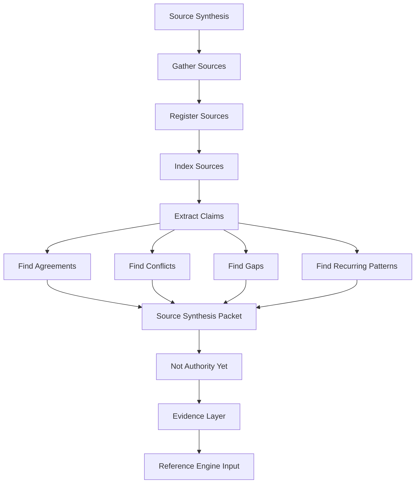

### Diagram 2

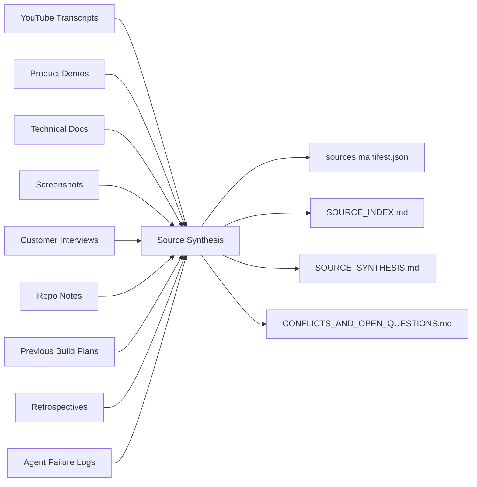

### Diagram 3

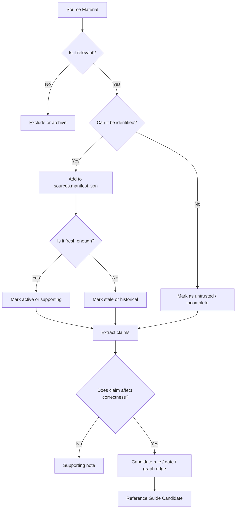

### Diagram 4

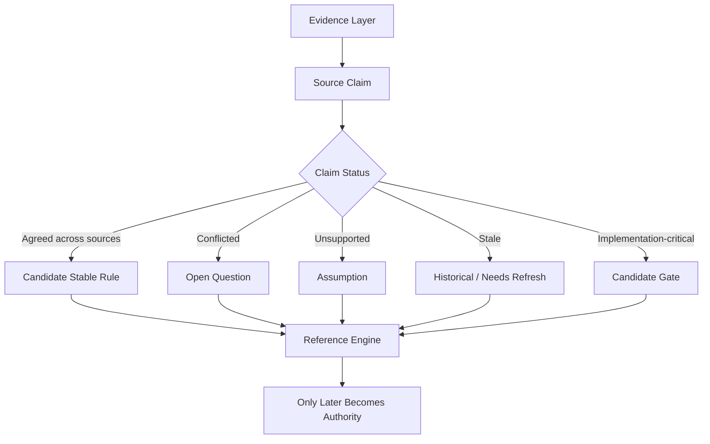

### What Source Synthesis Is

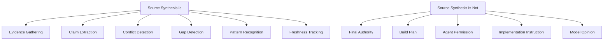

### Key Principles

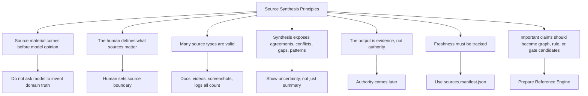

### Typical Inputs

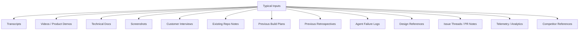

### Source Manifest

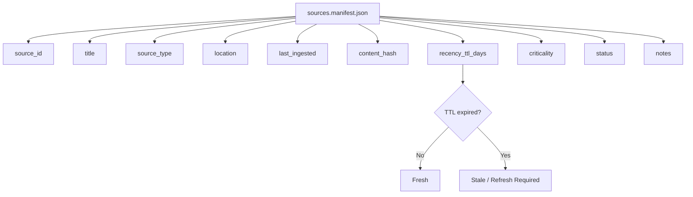

### Required Outputs

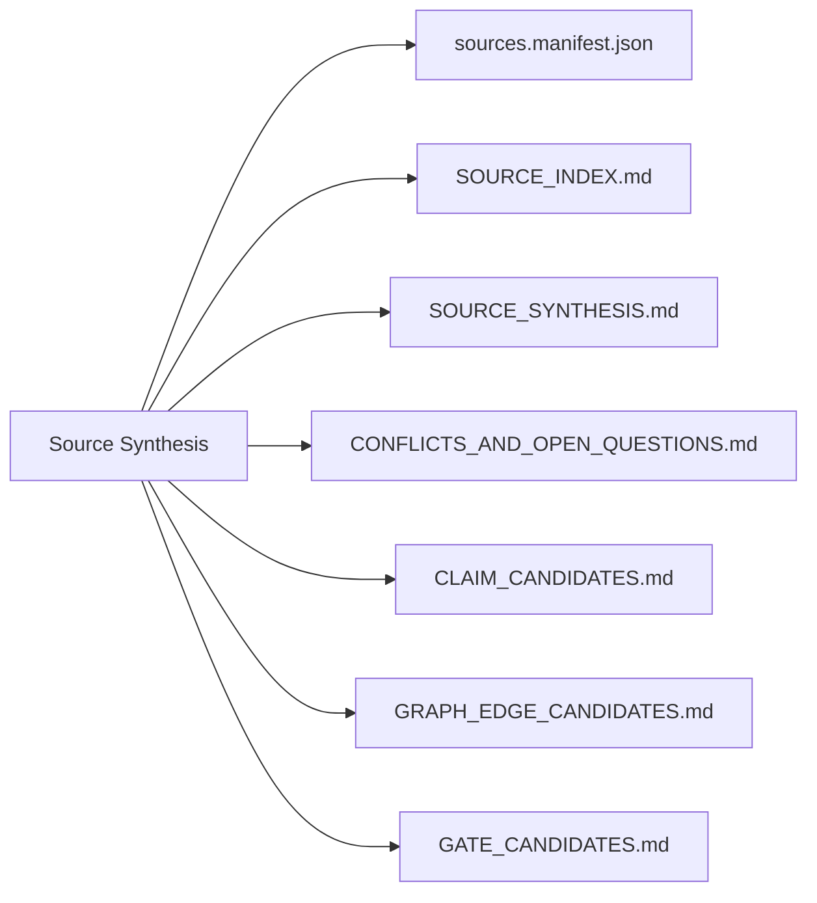

### Source Synthesis Template

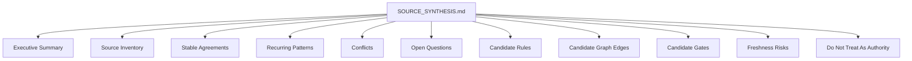

### Candidate Graph Edges

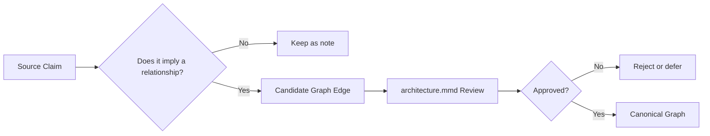

### Candidate Gates

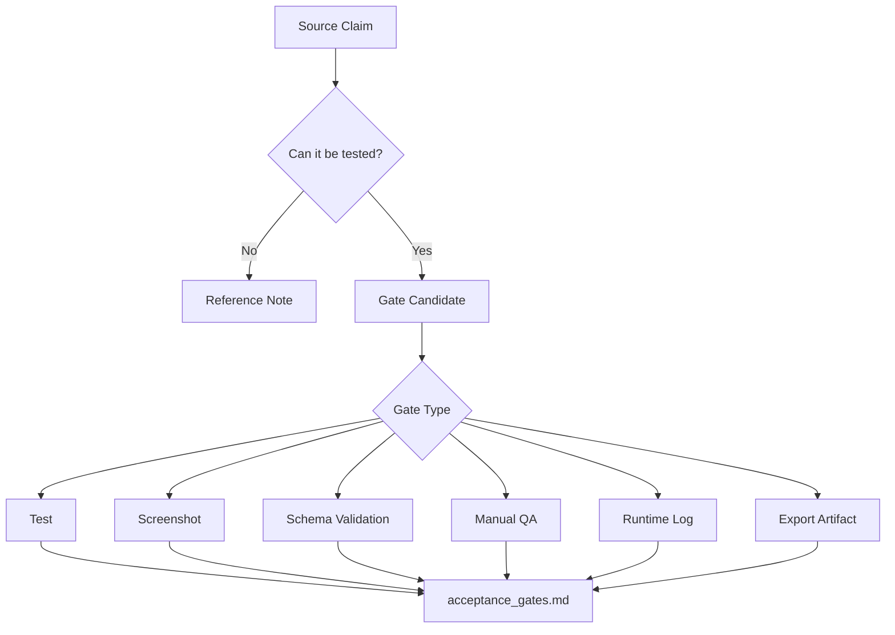

### Hero Lenses

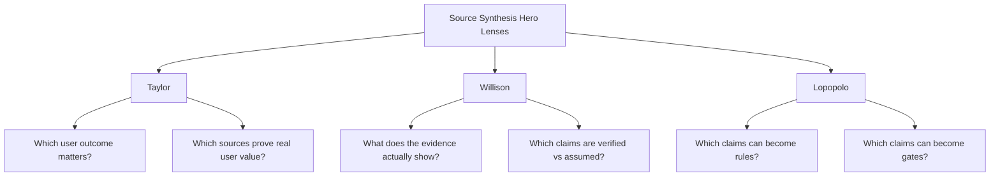

### Source Synthesis Receipt

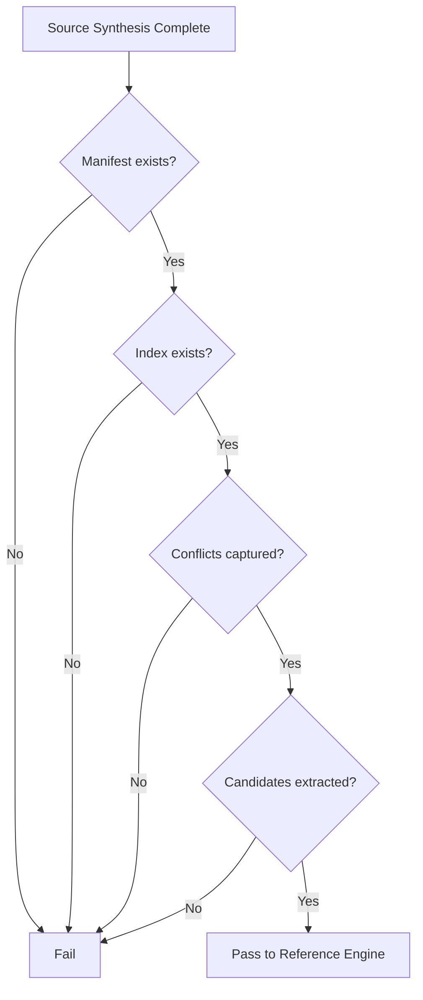

### One-Line Doctrine

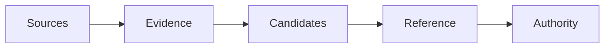

## Chapter 7 — NotebookLM as Temporary Subject Matter Expert

### Diagram 1

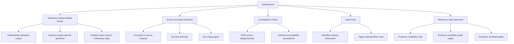

### Diagram 2

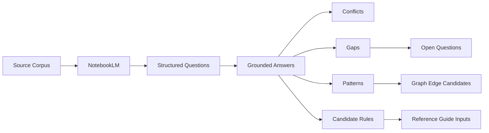

### Diagram 3

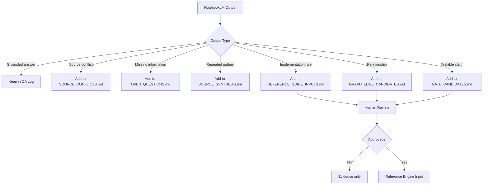

### What NotebookLM Is

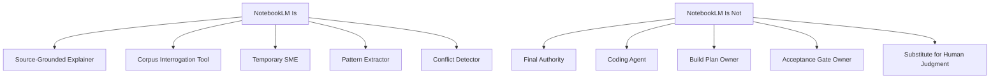

### Key Principles

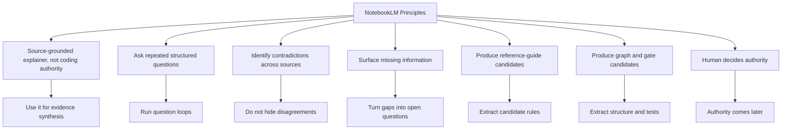

### The NotebookLM Question Loop

```mermaid
flowchart TD
    A[Load Source Corpus] --> B[Round 1: Orientation Questions]
    B --> C[Round 2: Conflict and Gap Questions]
    C --> D[Round 3: Rule and Gate Questions]
    D --> E[Round 4: Graph Structure Questions]
    E --> F[Round 5: Product / User Outcome Questions]
    F --> G[QA Log]
    G --> H[Reference Guide Inputs]
```

### The Nine Core Questions

```mermaid
flowchart TD
    A[Nine Core Questions] --> Q1[What is the user or system trying to accomplish?]
    A --> Q2[What are the recurring workflows?]
    A --> Q3[What entities, actors, or components appear?]
    A --> Q4[What rules or constraints are repeated?]
    A --> Q5[Where do sources agree?]
    A --> Q6[Where do sources conflict?]
    A --> Q7[What information is missing?]
    A --> Q8[What claims can become graph edges?]
    A --> Q9[What claims can become acceptance gates?]
```

### Required Outputs

```mermaid
flowchart LR
    A[NotebookLM Interrogation] --> B[NOTEBOOKLM_QA_LOG.md]
    A --> C[SOURCE_CONFLICTS.md]
    A --> D[REFERENCE_GUIDE_INPUTS.md]
    A --> E[GRAPH_EDGE_CANDIDATES.md]
    A --> F[GATE_CANDIDATES.md]
    A --> G[OPEN_QUESTIONS.md]
```

### NotebookLM Output Routing

```mermaid
flowchart TD
    A[NotebookLM Answer] --> B{What did it produce?}
    B -->|Summary| C[NOTEBOOKLM_QA_LOG.md]
    B -->|Conflict| D[SOURCE_CONFLICTS.md]
    B -->|Gap| E[OPEN_QUESTIONS.md]
    B -->|Rule| F[REFERENCE_GUIDE_INPUTS.md]
    B -->|Entity / flow / dependency| G[GRAPH_EDGE_CANDIDATES.md]
    B -->|Testable claim| H[GATE_CANDIDATES.md]
    F --> I[Human Review]
    G --> I
    H --> I
    I --> J{Promote?}
    J -->|No| K[Keep as evidence]
    J -->|Yes| L[Reference Engine]
```

### NotebookLM Prompt Template

```mermaid
flowchart TD
    A[Prompt] --> B[Role]
    A --> C[Corpus Boundary]
    A --> D[Task]
    A --> E[Output Buckets]
    A --> F[Source Discipline]
    A --> G[No Authority Warning]
    B --> B1[Act as source-grounded SME]
    C --> C1[Use only loaded sources]
    D --> D1[Answer structured question]
    E --> E1[Agreements, conflicts, gaps, rules, graph edges, gates]
    F --> F1[Cite or reference source basis when possible]
    G --> G1[Do not make final implementation decisions]
```

### Primary Hero Lenses

```mermaid
flowchart TD
    A[NotebookLM Hero Lenses] --> T[Taylor]
    A --> R[Schaad]
    A --> L[Lopopolo]
    A --> W[Willison]
    T --> T1[Which user outcome matters?]
    T --> T2[Which source claims affect customer value?]
    R --> R1[What behavior unfolds over time?]
    R --> R2[Which states, flows, or sequences matter?]
    L --> L1[Which claims can become rules or gates?]
    L --> L2[What artifact discipline follows?]
    W --> W1[What does the evidence actually show?]
    W --> W2[What remains unverified?]
```

### NotebookLM Completion Gate

```mermaid
flowchart TD
    A[NotebookLM Phase Complete?] --> B{QA log exists?}
    B -->|No| X[Fail]
    B -->|Yes| C{Conflicts captured?}
    C -->|No| X
    C -->|Yes| D{Open questions captured?}
    D -->|No| X
    D -->|Yes| E{Reference inputs captured?}
    E -->|No| X
    E -->|Yes| F{Graph/gate candidates captured?}
    F -->|No| X
    F -->|Yes| G[Pass to Reference Guide Loop]
```

### One-Line Doctrine

```mermaid
flowchart LR
    A[NotebookLM] --> B[Grounds]
    B --> C[Explains]
    C --> D[Exposes]
    D --> E[Suggests]
    E --> F[Human Promotes]
```

## Chapter 8 — The Nine-Question Reference Guide Loop

### Diagram 1

```mermaid
flowchart TD
    A[Nine-Question Reference Guide Loop] --> B[1. Outcome]
    A --> C[2. Correctness]
    A --> D[3. Never-Do Rules]
    A --> E[4. Schemas, States, and Data Flows]
    A --> F[5. Edge Cases and Failure States]
    A --> G[6. Deterministic vs Model-Generated]
    A --> H[7. UX, Design, Voice, and Interaction Rules]
    A --> I[8. Trust Boundaries and Security]
    A --> J[9. Proof and Evidence]
    B --> B1[Who is this for? What improves?]
    C --> C1[What exactly counts as correct?]
    D --> D1[What must never happen?]
    E --> E1[What objects, fields, states, and transitions exist?]
    F --> F1[What happens under bad, thin, missing, delayed, or hostile input?]
    G --> G1[What must be stable vs probabilistic?]
    H --> H1[What should the system say, show, hide, refuse, or feel like?]
    I --> I1[What is untrusted, privileged, or leak-sensitive?]
    J --> J1[What proves the system works?]
```

### Diagram 2

```mermaid
flowchart LR
    A[Fuzzy Intent] --> B[Nine-Question Loop]
    B --> C[Rules]
    B --> D[Schemas]
    B --> E[Thresholds]
    B --> F[Examples]
    B --> G[Non-Goals]
    B --> H[Graph Edges]
    B --> I[Acceptance Gates]
    C --> J[REFERENCE_GUIDE_DRAFT.md]
    D --> J
    E --> J
    F --> J
    G --> J
    H --> K[architecture.mmd Candidate]
    I --> L[acceptance_gates.md Candidate]
```

### Diagram 3

```mermaid
flowchart TD
    A[Answer] --> B{Is it precise?}
    B -->|No| C[Ask again]
    B -->|Yes| D{Does it define structure?}
    D -->|Yes| E[Candidate graph edge / schema / state]
    D -->|No| F{Does it define behavior?}
    F -->|Yes| G[Reference-guide rule]
    F -->|No| H{Does it define risk?}
    H -->|Yes| I[Never-do rule / trust boundary]
    H -->|No| J{Does it define proof?}
    J -->|Yes| K[Acceptance gate]
    J -->|No| L[Decision log note]
    E --> M[Human Review]
    G --> M
    I --> M
    K --> M
    L --> M
    M --> N{Promote?}
    N -->|No| O[Keep as evidence]
    N -->|Yes| P[Reference Guide Draft]
```

### Diagram 4

```mermaid
flowchart TD
    A[Reference Guide Loop Complete?] --> B{Outcome defined?}
    B -->|No| X[Not Done]
    B -->|Yes| C{Correctness defined?}
    C -->|No| X
    C -->|Yes| D{Never-do rules defined?}
    D -->|No| X
    D -->|Yes| E{Schemas / states / flows defined?}
    E -->|No| X
    E -->|Yes| F{Edge cases defined?}
    F -->|No| X
    F -->|Yes| G{Determinism boundaries defined?}
    G -->|No| X
    G -->|Yes| H{UX / voice / interaction rules defined?}
    H -->|No| X
    H -->|Yes| I{Trust boundaries defined?}
    I -->|No| X
    I -->|Yes| J{Proof requirements defined?}
    J -->|No| X
    J -->|Yes| K[Gate 1 Candidate: Reference Guide Draft Ready]
```

### What the Loop Produces

```mermaid
flowchart TD
    A[Nine-Question Loop] --> B[Reference Guide Draft]
    A --> C[Open Decisions]
    A --> D[Decision Log]
    A --> E[Graph Candidates]
    A --> F[Gate Candidates]
    A --> G[Determinism Map]
    A --> H[Never-Do Rules]
    A --> I[Trust Boundaries]
    B --> J[REFERENCE_GUIDE_DRAFT.md]
    C --> K[OPEN_DECISIONS.md]
    D --> L[DECISION_LOG.md]
    E --> M[GRAPH_EDGE_CANDIDATES.md]
    F --> N[GATE_CANDIDATES.md]
    G --> O[DETERMINISM_MAP.md]
```

### The Nine Question Families

```mermaid
flowchart TD
    A[Question Family] --> Q1[Outcome]
    A --> Q2[Correctness]
    A --> Q3[Never-Do Rules]
    A --> Q4[Schemas / States / Data Flows]
    A --> Q5[Edge Cases / Failure States]
    A --> Q6[Deterministic vs Model-Generated]
    A --> Q7[UX / Design / Voice / Interaction]
    A --> Q8[Trust Boundaries / Security]
    A --> Q9[Proof / Evidence]
    Q1 --> O1[Success meaning]
    Q2 --> O2[Expected behavior]
    Q3 --> O3[Forbidden behavior]
    Q4 --> O4[System structure]
    Q5 --> O5[Robustness]
    Q6 --> O6[Stability boundary]
    Q7 --> O7[Human-facing behavior]
    Q8 --> O8[Safety boundary]
    Q9 --> O9[Acceptance evidence]
```

### data flows (1 of 2)

```mermaid
graph nodes
```

### data flows (2 of 2)

```mermaid
graph edges
```

### Key Principles

```mermaid
flowchart TD
    A[Nine-Question Principles] --> P1[Every question removes ambiguity]
    A --> P2[Every answer becomes artifact material]
    A --> P3[Vague answers must be re-asked]
    A --> P4[Source conflicts must be documented]
    A --> P5[Undefined behavior means guide is not done]
    A --> P6[No agent should guess after Gate 1]
    A --> P7[Structure candidates must be extracted before prose hardens]
    A --> P8[Proof must be designed before implementation]
    P1 --> C1[Less agent inference]
    P2 --> C2[Rules, schemas, thresholds, examples, non-goals, tests]
    P3 --> C3[Interrogate again]
    P4 --> C4[CONFLICTS_AND_OPEN_QUESTIONS.md]
    P5 --> C5[OPEN_DECISIONS.md]
    P6 --> C6[Reference readiness gate]
    P7 --> C7[GRAPH_EDGE_CANDIDATES.md]
    P8 --> C8[GATE_CANDIDATES.md]
```

### Required Outputs (1 of 2)

```mermaid
flowchart LR
    A[Nine-Question Loop] --> B[REFERENCE_GUIDE_DRAFT.md]
    A --> C[OPEN_DECISIONS.md]
    A --> D[DECISION_LOG.md]
    A --> E[GRAPH_EDGE_CANDIDATES.md]
    A --> F[GATE_CANDIDATES.md]
    A --> G[DETERMINISM_MAP.md]
    A --> H[TRUST_BOUNDARIES.md]
```

### Reference Guide Draft Template

```mermaid
flowchart TD
    A[REFERENCE_GUIDE_DRAFT.md] --> B[1. Outcome]
    A --> C[2. Correctness Rules]
    A --> D[3. Never-Do Rules]
    A --> E[4. Schemas / States / Data Flows]
    A --> F[5. Edge Cases]
    A --> G[6. Determinism Boundaries]
    A --> H[7. UX / Voice / Interaction]
    A --> I[8. Trust Boundaries]
    A --> J[9. Proof Requirements]
    A --> K[10. Open Decisions]
```

### Primary Hero Lenses (1 of 2)

```mermaid
flowchart TD
    A[Reference Guide Hero Lenses] --> L[Lopopolo]
    A --> T[Taylor]
    A --> R[Schaad]
    A --> N[Carlini]
    A --> W[Willison]
    A --> J[Carmack]
    L --> L1[What can become a rule or gate?]
    T --> T1[What user outcome matters?]
    R --> R1[What should behavior feel like over time?]
    N --> N1[What ambiguity creates attack surface?]
    W --> W1[What does the evidence show?]
    J --> J1[What proves runtime behavior?]
```

### Completion Gate (1 of 2)

```mermaid
flowchart TD
    A[Gate 1: Reference Guide Draft Ready] --> B{All nine question families answered?}
    B -->|No| X[FAIL]
    B -->|Yes| C{Open decisions listed?}
    C -->|No| X
    C -->|Yes| D{Graph candidates extracted?}
    D -->|No| X
    D -->|Yes| E{Gate candidates extracted?}
    E -->|No| X
    E -->|Yes| F{Trust boundaries defined?}
    F -->|No| X
    F -->|Yes| G{Determinism boundaries defined?}
    G -->|No| X
    G -->|Yes| H[PASS: Ready for Reference Hardening]
```

### One-Line Doctrine (1 of 6)

```mermaid
flowchart LR
    A[Ask] --> B[Clarify]
    B --> C[Structure]
    C --> D[Rule]
    D --> E[Test]
    E --> F[Authority]
```

### One-Line Doctrine (2 of 6)

```mermaid
flowchart TD
    A[Reference Guide Draft] --> B[Hardening Review]
    B --> C[Ambiguity Review]
    B --> D[Misread Review]
    B --> E[Boundary Review]
    B --> F[Assumption Review]
    B --> G[Testability Review]
    B --> H[Schema / Graph Review]
    B --> I[Never-Do Review]
    C --> J[Review Log]
    D --> J
    E --> J
    F --> J
    G --> J
    H --> J
    I --> J
    J --> K[Contradiction Matrix]
    K --> L[Reference Guide Patches]
    L --> M[Approved Reference Guide]
    M --> N[Candidate Authority]
```

### One-Line Doctrine (3 of 6)

```mermaid
flowchart LR
    A[Weak Reference Guide] --> B[Weak Build Plan]
    B --> C[Wrong Task Board]
    C --> D[Wrong Agent Execution]
    D --> E[Coherent but Unauthorized Code]
    F[Hardened Reference Guide] --> G[Clear Build Plan]
    G --> H[Claimable Tasks]
    H --> I[Bounded Agent Execution]
    I --> J[Verifiable Implementation]
```

### One-Line Doctrine (4 of 6)

```mermaid
flowchart TD
    A[Reviewer Output] --> B{What did reviewer find?}
    B -->|Ambiguity| C[Patch reference rule]
    B -->|Missing boundary| D[Patch schema / trust boundary]
    B -->|Hidden assumption| E[Add decision or open question]
    B -->|Untestable claim| F[Move to gate candidate or remove]
    B -->|Missing never-do| G[Add forbidden behavior]
    B -->|Missing structure| H[Add graph candidate]
    B -->|Reviewer conflict| I[Add to contradiction matrix]
    C --> J[REFERENCE_GUIDE_PATCHES.md]
    D --> J
    E --> J
    F --> J
    G --> J
    H --> J
    I --> K[CONTRADICTION_MATRIX.md]
```

### One-Line Doctrine (5 of 6)

```mermaid
flowchart TD
    A[Reference Hardening Complete?] --> B{Review log exists?}
    B -->|No| X[FAIL]
    B -->|Yes| C{Ambiguities resolved or logged?}
    C -->|No| X
    C -->|Yes| D{Graph candidates reviewed?}
    D -->|No| X
    D -->|Yes| E{Gate candidates reviewed?}
    E -->|No| X
    E -->|Yes| F{Never-do rules reviewed?}
    F -->|No| X
    F -->|Yes| G{Contradictions resolved?}
    G -->|No| X
    G -->|Yes| H{Human approved final guide?}
    H -->|No| X
    H -->|Yes| I[PASS: Approved Reference Guide]
```

### What Reference Hardening Attacks

```mermaid
flowchart TD
    A[Reference Guide Hardening] --> B[Ambiguity]
    A --> C[Misread Risk]
    A --> D[Undefined Boundaries]
    A --> E[Hidden Assumptions]
    A --> F[Untestable Claims]
    A --> G[Prose That Should Be Schema]
    A --> H[Missing Never-Do Rules]
    A --> I[Missing Graph Edges]
    A --> J[Missing Acceptance Gates]
    A --> K[Stale or Unsupported Claims]
    B --> L[Patch or clarify]
    C --> L
    D --> L
    E --> M[Decision or open question]
    F --> N[Gate or remove]
    G --> O[Schema / graph / state machine]
    H --> P[Forbidden behavior]
    I --> Q[Graph candidate]
    J --> R[Gate candidate]
    K --> S[Source refresh or citation note]
```

### Adaptive Model Review Assignments

```mermaid
flowchart TD
    A[Reference Guide Hardening] --> B{Review Need}
    B -->|Coherence / missing constraints| C[Claude-style review]
    B -->|Structure / developer usability| D[GPT-style review]
    B -->|Broad-context consistency| E[Gemini-style review]
    B -->|Assumption / product challenge| F[Grok-style review]
    B -->|Technical reasoning / algorithmic consistency| G[DeepSeek-style review]
    B -->|Authority hygiene / systems design| H[Meta-style review]
    B -->|Security / trust boundary| I[Security adversary]
    B -->|Graph / schema consistency| J[Structure reviewer]
    C --> K[Independent Review Notes]
    D --> K
    E --> K
    F --> K
    G --> K
    H --> K
    I --> K
    J --> K
    K --> L[Human Synthesis]
```

### Independence and Contamination Control

```mermaid
flowchart TD
    A[Review Protocol] --> B[Give each reviewer same base packet]
    B --> C[Hide other reviews during first pass]
    C --> D[Collect independent critiques]
    D --> E[Merge findings]
    E --> F[Identify overlaps]
    E --> G[Identify conflicts]
    E --> H[Identify unique findings]
    F --> I[Contradiction Matrix]
    G --> I
    H --> I
    I --> J[Human Resolution]
```

### Review Prompt Template

```mermaid
flowchart TD
    A[Review Prompt] --> B[Role]
    A --> C[Artifacts to Review]
    A --> D[Attack Questions]
    A --> E[Output Format]
    A --> F[No Rewrite Rule]
    A --> G[Evidence Mapping]
    B --> B1[Assigned reviewer lens]
    C --> C1[Reference guide + graph/gates/maps]
    D --> D1[Ambiguity, boundaries, assumptions, tests]
    E --> E1[Findings table]
    F --> F1[Critique first, do not rewrite entire doc]
    G --> G1[Each finding must map to patch/gate/graph/open decision]
```

### Contradiction Matrix

```mermaid
flowchart TD
    A[Reviewer Findings] --> B[Contradiction Matrix]
    B --> C[Finding]
    B --> D[Raised By]
    B --> E[Severity]
    B --> F[Evidence]
    B --> G[Conflict]
    B --> H[Resolution]
    B --> I[Patch Type]
    B --> J[Owner]
    H --> K{Resolved?}
    K -->|No| L[Open Decision]
    K -->|Yes| M[Reference Patch]
```

### Required Outputs (2 of 2)

```mermaid
flowchart LR
    A[Reference Hardening] --> B[REFERENCE_GUIDE_REVIEW_LOG.md]
    A --> C[CONTRADICTION_MATRIX.md]
    A --> D[REFERENCE_GUIDE_PATCHES.md]
    A --> E[APPROVED_REFERENCE_GUIDE.md]
    A --> F[architecture.mmd Candidate]
    A --> G[acceptance_gates.md Candidate]
```

### Primary Hero Lenses (2 of 2)

```mermaid
flowchart TD
    A[Reference Hardening Hero Lenses] --> W[Willison]
    A --> N[Carlini]
    A --> L[Lopopolo]
    A --> C[Cherny]
    W --> W1[What does reality and evidence show?]
    W --> W2[What would fail when tested?]
    N --> N1[What ambiguity is attack surface?]
    N --> N2[What trust boundary is missing?]
    L --> L1[What should become a gate, schema, or rule?]
    L --> L2[What makes correctness mechanical?]
    C --> C1[What structure or interface is missing?]
    C --> C2[What should be decomposed before planning?]
```

### Completion Gate (2 of 2)

```mermaid
flowchart TD
    A[Gate 2: Reference Guide Approved] --> B{Independent reviews complete?}
    B -->|No| X[FAIL]
    B -->|Yes| C{Review log exists?}
    C -->|No| X
    C -->|Yes| D{Contradiction matrix resolved?}
    D -->|No| X
    D -->|Yes| E{Patches applied?}
    E -->|No| X
    E -->|Yes| F{Graph updated or explicitly deferred?}
    F -->|No| X
    F -->|Yes| G{Gates updated or explicitly deferred?}
    G -->|No| X
    G -->|Yes| H{Human approval recorded?}
    H -->|No| X
    H -->|Yes| I[PASS: Approved Reference Guide Ready for Planning]
```

### One-Line Doctrine (6 of 6)

```mermaid
flowchart LR
    A[Draft Reference] --> B[Attack]
    B --> C[Patch]
    C --> D[Approve]
    D --> E[Plan]
```

## Chapter 10 — The Approved Reference Guide

### Diagram 1

```mermaid
flowchart TD
    A[Approved Reference Guide] --> B[Defines Implementation Correctness]
    A --> C[Not a PRD]
    A --> D[Not a Build Plan]
    A --> E[Not Authority Until Declared]
    A --> F[Feeds Planning Engine]
    B --> B1[What code must do]
    B --> B2[What behavior must never happen]
    B --> B3[What evidence proves success]
    C --> C1[PRD explains why product should exist]
    C --> C2[Reference guide defines what implementation must satisfy]
    D --> D1[Build plan sequences the work]
    D --> D2[Reference guide defines correctness]
    E --> E1[Authority Engine must declare it active]
    E --> E2[authority.json names binding version]
    F --> F1[Build plan]
    F --> F2[Task board]
    F --> F3[Acceptance gates]
```

### Diagram 2

```mermaid
flowchart LR
    A[sources.manifest.json] --> B[architecture.mmd]
    B --> C[APPROVED_REFERENCE_GUIDE.md]
    C --> D[acceptance_gates.md]
    D --> E[BUILD_PLAN.md]
    E --> F[PROJECT_TASKS.md]
    F --> G[Agent Execution]
    H[authority.json] -. declares .-> A
    H -. declares .-> B
    H -. declares .-> C
    H -. declares .-> D
```

### Diagram 3

```mermaid
flowchart TD
    A[Correctness Contract] --> B[Schemas]
    A --> C[Constants]
    A --> D[Calculation Rules]
    A --> E[Thresholds]
    A --> F[Edge Cases]
    A --> G[Retry / Idempotency / Failure Handling]
    A --> H[Infrastructure Config]
    A --> I[Trust Boundaries]
    A --> J[Product Outcome Metrics]
    A --> K[UX State Expectations]
    A --> L[AI / Model Output Contract]
    A --> M[Authority Rules]
    A --> N[Graph Alignment]
    A --> O[Acceptance Evidence]
    N --> N1[Nodes, edges, data flows, boundaries]
    O --> O1[Tests, screenshots, logs, exports, receipts]
```

### Diagram 4

```mermaid
flowchart TD
    A[Gate: Can Agent Implement Without Guessing?] --> B{Schemas complete?}
    B -->|No| X[FAIL]
    B -->|Yes| C{Constants verified?}
    C -->|No| X
    C -->|Yes| D{Thresholds explicit?}
    D -->|No| X
    D -->|Yes| E{Edge cases defined?}
    E -->|No| X
    E -->|Yes| F{Trust boundaries stated?}
    F -->|No| X
    F -->|Yes| G{UX states defined?}
    G -->|No| X
    G -->|Yes| H{Model output contract exists?}
    H -->|No| X
    H -->|Yes| I{Authority rules clear?}
    I -->|No| X
    I -->|Yes| J{Proof requirements listed?}
    J -->|No| X
    J -->|Yes| K[PASS: Ready for Planning]
```

### What the Approved Reference Guide Is

```mermaid
flowchart TD
    A[Approved Reference Guide Is] --> B[Correctness Contract]
    A --> C[Implementation Boundary]
    A --> D[Rule Source]
    A --> E[Gate Source]
    A --> F[Graph Companion]
    A2[Approved Reference Guide Is Not] --> G[Marketing PRD]
    A2 --> H[Brainstorming Notes]
    A2 --> I[Old Chat Summary]
    A2 --> J[Build Plan]
    A2 --> K[Automatic Authority]
```

### Required Sections

```mermaid
flowchart TD
    A[APPROVED_REFERENCE_GUIDE.md] --> S1[Schemas]
    A --> S2[Constants]
    A --> S3[Calculation Rules]
    A --> S4[Thresholds]
    A --> S5[Edge Cases]
    A --> S6[Retry Rules]
    A --> S7[Idempotency Rules]
    A --> S8[Failure Handling]
    A --> S9[Infrastructure Config]
    A --> S10[Trust Boundaries]
    A --> S11[Product Outcome Metrics]
    A --> S12[UX State Expectations]
    A --> S13[AI / Model Output Contract]
    A --> S14[Authority Rules]
    A --> S15[Graph Alignment]
    A --> S16[Proof and Evidence]
```

### Graph Alignment Requirement

```mermaid
flowchart TD
    A[Approved Reference Guide] --> B{Matches architecture.mmd?}
    B -->|No| C[Resolve mismatch]
    B -->|Yes| D{All critical flows represented?}
    D -->|No| E[Add graph edge or explain deferral]
    D -->|Yes| F{All trust boundaries represented?}
    F -->|No| G[Add boundary node / edge]
    F -->|Yes| H{All model boundaries represented?}
    H -->|No| I[Add model / compiler / validation edge]
    H -->|Yes| J[Graph-aligned reference ready]
```

### The Ten No’s

```mermaid
flowchart TD
    A[The Ten No's] --> N1[No TBD schemas]
    A --> N2[No implicit constants]
    A --> N3[No undefined thresholds]
    A --> N4[No vague edge cases]
    A --> N5[No hidden retry behavior]
    A --> N6[No unstated trust boundary]
    A --> N7[No unclear UX state]
    A --> N8[No ambiguous authority rule]
    A --> N9[No model output without contract]
    A --> N10[No agent judgment about correctness]
```

### Approved Reference Guide Template

```mermaid
flowchart TD
    A[APPROVED_REFERENCE_GUIDE.md] --> B[1. Purpose and Scope]
    A --> C[2. Graph Alignment]
    A --> D[3. Schemas]
    A --> E[4. Constants]
    A --> F[5. Calculation Rules]
    A --> G[6. Thresholds]
    A --> H[7. Edge Cases]
    A --> I[8. Retry / Idempotency / Failure Handling]
    A --> J[9. Infrastructure Config]
    A --> K[10. Trust Boundaries]
    A --> L[11. Product Outcome Metrics]
    A --> M[12. UX State Expectations]
    A --> N[13. AI / Model Output Contract]
    A --> O[14. Authority Rules]
    A --> P[15. Proof and Evidence]
    A --> Q[16. Open Non-Blocking Notes]
```

### Gate 1 — Can a Coding Agent Implement Without Guessing?

```mermaid
flowchart TD
    A[Gate 1] --> B{Every schema defined?}
    B -->|No| F[FAIL: return to questioning]
    B -->|Yes| C{Every constant / threshold explicit?}
    C -->|No| F
    C -->|Yes| D{Every edge case and failure state defined?}
    D -->|No| F
    D -->|Yes| E{Retry, idempotency, and rollback defined?}
    E -->|No| F
    E -->|Yes| G{Trust boundaries and UX states defined?}
    G -->|No| F
    G -->|Yes| H{Model output contract defined if AI is used?}
    H -->|No| F
    H -->|Yes| I{Authority rules defined?}
    I -->|No| F
    I -->|Yes| J{Evidence requirements defined?}
    J -->|No| F
    J -->|Yes| K[PASS]
```

### Approved vs Binding

```mermaid
flowchart LR
    A[Approved Reference Guide] --> B[Human Approved Correctness]
    B --> C{Declared in authority.json?}
    C -->|No| D[Candidate Authority Only]
    C -->|Yes| E[Binding Authority]
```

### Primary Hero Lenses

```mermaid
flowchart TD
    A[Approved Reference Guide Hero Lenses] --> L[Lopopolo]
    A --> T[Taylor]
    A --> R[Schaad]
    A --> N[Carlini]
    A --> J[Carmack]
    L --> L1[What can be mechanically verified?]
    T --> T1[What outcome improves?]
    R --> R1[What should the user/operator experience over time?]
    N --> N1[What ambiguity becomes attack surface?]
    J --> J1[What runtime proof will be required later?]
```

### One-Line Doctrine

```mermaid
flowchart LR
    A[PRD] --> B[Why]
    C[Reference Guide] --> D[What Correct Means]
    E[Build Plan] --> F[How To Sequence]
    G[Authority] --> H[What Is Binding]
    I[Receipt] --> J[What Was Proven]
```

---

## Narrative

PART II — BUILD THE TRUTH

Chapter 6 — Source Synthesis


Key Message

Before building, create a source-grounded knowledge base.

The first job is not to ask an AI to code.
The first job is to gather the best available source material, make it queryable, and separate evidence from opinion.

Source synthesis is the first stage of the Reference Engine. It does not produce authority yet. It produces the evidence layer from which authority can later be built.

In ACDF v7, source synthesis has three jobs:

1. Gather the best available source material.
2. Register and index it so agents know what evidence exists.
3. Extract agreements, conflicts, gaps, and candidate rules.

The output is not the final reference guide.
The output is the raw evidence packet that the reference guide will later harden.

⸻

What Source Synthesis Is


Source synthesis is the process of turning messy project material into a structured evidence layer.

It gathers:

what the sources say
where they agree
where they conflict
what they omit
what patterns repeat
what claims may become rules
what claims may become acceptance gates
what claims may become graph edges

It does not yet decide what the agent should build. It does not authorize implementation. It does not replace human judgment.

The human still decides which sources matter, which conflicts require resolution, and which claims should become binding.

⸻

Key Principles


1. Source material comes before model opinion.
    The model should summarize, compare, and interrogate sources before it invents recommendations.
2. The human defines what sources matter.
    The human owns domain relevance. The model can help organize the material, but it should not silently decide what evidence counts.
3. Many source types are valid.
    Transcripts, videos, screenshots, product docs, code notes, customer interviews, previous retrospectives, and failure logs can all become useful evidence.
4. Source synthesis should expose agreements, conflicts, gaps, and recurring patterns.
    A bland summary is not enough. The synthesis must show what is stable, what is disputed, and what is missing.
5. The output is not yet authority. It is evidence.
    Evidence becomes authority only after reference hardening, review, acceptance-gate definition, and authority declaration.
6. Freshness must be tracked.
    A source can be accurate but stale. v7 records freshness in sources.manifest.json.
7. Important claims should become candidates for graph edges, rules, or gates.
    Source synthesis should prepare the next stage: structure-first reference building.

⸻

Typical Inputs


Typical inputs include:

YouTube transcripts
product demos
design references
technical docs
screenshots
customer interviews
existing repo notes
previous build plans
previous retrospectives
agent failure logs
issue threads
pull request notes
telemetry
analytics
competitor references

Each input should be treated as a source with metadata, not as anonymous context.

⸻

Source Manifest


In ACDF v7, every serious source synthesis should produce a source manifest.

Minimum entry:

{
  "source_id": "SOURCE_ID",
  "title": "SOURCE_TITLE",
  "source_type": "transcript | video | doc | repo | screenshot | interview | retrospective | log | issue | telemetry | other",
  "location": "path-or-url-or-note",
  "last_ingested": "YYYY-MM-DD",
  "content_hash": "sha256:...",
  "recency_ttl_days": 30,
  "criticality": "critical | supporting | historical",
  "status": "active | stale | archived",
  "notes": "Why this source matters."
}

The manifest answers:

What sources do we have?
Where did they come from?
When were they ingested?
Are they fresh?
Are they critical, supporting, or historical?
Can they govern implementation?

This prevents source material from becoming anonymous, timeless context.

⸻

Required Outputs


Required outputs:

sources.manifest.json
SOURCE_INDEX.md
SOURCE_SYNTHESIS.md
CONFLICTS_AND_OPEN_QUESTIONS.md
CLAIM_CANDIDATES.md
GRAPH_EDGE_CANDIDATES.md
GATE_CANDIDATES.md

Output	Purpose
sources.manifest.json	Tracks source identity, freshness, content hash, TTL, criticality, and status.
SOURCE_INDEX.md	Lists sources in human-readable form with short descriptions.
SOURCE_SYNTHESIS.md	Summarizes agreements, recurring claims, evidence clusters, and source-backed patterns.
CONFLICTS_AND_OPEN_QUESTIONS.md	Lists contradictions, missing evidence, unclear terms, and unresolved decisions.
CLAIM_CANDIDATES.md	Captures claims that may become reference-guide rules.
GRAPH_EDGE_CANDIDATES.md	Captures relationships that may become Mermaid graph edges.
GATE_CANDIDATES.md	Captures claims that may become acceptance gates.

The last three are v7 additions. They force source synthesis to feed the structure-first Reference Engine.

⸻

Source Synthesis Template


Use this structure for SOURCE_SYNTHESIS.md:

# SOURCE_SYNTHESIS.md
## 1. Executive Summary
What the evidence appears to say.
## 2. Source Inventory
Which sources were used and why.
## 3. Stable Agreements
Claims supported by multiple credible sources.
## 4. Recurring Patterns
Repeated themes, workflows, failure modes, or design principles.
## 5. Conflicts
Where sources disagree or imply different implementation choices.
## 6. Open Questions
What remains unknown or underspecified.
## 7. Candidate Rules
Source-backed claims that may become reference-guide requirements.
## 8. Candidate Graph Edges
Relationships that may become part of architecture.mmd.
## 9. Candidate Gates
Evidence-backed pass/fail checks that may become acceptance gates.
## 10. Freshness Risks
Sources that may expire, be outdated, or require refresh.
## 11. Authority Warning
This synthesis is evidence only. It is not implementation authority.

⸻

Candidate Graph Edges


In v7, source synthesis should look for relationships that can become graph edges.

Examples:

Source Claim	Candidate Graph Edge
“The UI should never write directly to storage.”	UI --> API --> Validator --> Store
“The assessment receipt is the durable artifact.”	Assessment Session --> Receipt --> Ledger
“The agent must not read archive files as current authority.”	authority.json --> docs/active and .agentignore -. blocks .-> docs/archive
“User uploads become evidence, not authority.”	Uploaded Source --> Source Manifest --> Evidence Layer

The purpose is not to make diagrams pretty.
The purpose is to make future drift detectable.

⸻

Candidate Gates


A good source synthesis does not merely say what the sources claim. It asks which claims can become tests.

Examples:

Source Claim	Candidate Gate
“The export must be readable.”	Export TXT opened and visually checked for contrast/readability.
“The agent must not touch unrelated pages.”	Diff contains only allowed files.
“The UI must work without cloud services.”	Offline/local run test passes.
“The graph is current authority.”	Receipt includes graph delta: none / approved / blocked.

The stronger the gate, the less the agent has to guess.

⸻

Hero Lenses


Primary Hero Lenses:

[T] Taylor + [W] Willison + [L] Lopopolo

Taylor asks:

Which user outcome matters?
Which evidence shows real user value?
Which source claims are product-critical?

Willison asks:

What does the evidence actually show?
Which claims are grounded?
Which claims are inferred?
Which sources contradict each other?

Lopopolo asks:

Which source claims can become rules?
Which claims can become binary gates?
Which artifacts should be required before implementation?

⸻

Source Synthesis Receipt


Source synthesis is complete only when the following exist:

[ ] sources.manifest.json
[ ] SOURCE_INDEX.md
[ ] SOURCE_SYNTHESIS.md
[ ] CONFLICTS_AND_OPEN_QUESTIONS.md
[ ] CLAIM_CANDIDATES.md
[ ] GRAPH_EDGE_CANDIDATES.md
[ ] GATE_CANDIDATES.md

Do not proceed to reference-guide generation until conflicts, gaps, and candidate gates have been captured.

⸻

One-Line Doctrine


Source synthesis produces evidence, not authority.

The first truth-building mistake is asking the model what it thinks before showing it what the sources say.

ACDF v7 reverses that order:

Gather sources.
Register sources.
Index sources.
Extract claims.
Expose conflicts.
Identify gaps.
Generate graph and gate candidates.
Only then build authority.
----
Chapter 7 — NotebookLM as Temporary Subject Matter Expert


Key Message

NotebookLM can become a project-specific subject matter expert when loaded with the right source material.

Its job is not to make final decisions.
Its job is not to write production code.
Its job is not to become authority.

Its job is to answer grounded questions from the source corpus and expose what the material collectively implies.

In ACDF v7, NotebookLM is part of the Reference Engine. It helps transform source material into candidate rules, candidate graph edges, candidate acceptance gates, conflicts, open questions, and reference-guide inputs.

The human still decides what becomes authority.

⸻

What NotebookLM Is


NotebookLM is useful because it is grounded in the material you give it. If the corpus is strong, it can behave like a temporary subject matter expert for that project.

But its authority is limited.

NotebookLM can explain what the sources say.
It can compare sources.
It can surface contradictions.
It can identify missing information.
It can suggest implementation rules.

It cannot decide what matters most.
It cannot certify correctness.
It cannot declare authority.
It cannot replace the human workflow owner.

The right mental model:

NotebookLM is a source-grounded witness, not the judge.

⸻

Key Principles


1. NotebookLM is a source-grounded explainer, not a coding authority.
    It should explain the corpus, not command implementation.
2. It should be asked repeated structured questions.
    One broad prompt produces shallow synthesis. Repeated question loops expose deeper implications.
3. It should identify contradictions across sources.
    Contradictions are not noise. They are implementation risks.
4. It should surface missing information.
    Missing rules must become open questions before code begins.
5. It should produce synthesis that can be converted into reference-guide rules.
    Good NotebookLM output should become structured inputs, not loose prose.
6. It should produce candidate graph edges and candidate gates.
    v7 is structure-first. NotebookLM should help identify relationships and testable claims.
7. The human decides what becomes authority.
    NotebookLM output remains evidence until reviewed, hardened, and declared authoritative.

⸻

The NotebookLM Question Loop


NotebookLM should be interrogated in rounds.

A strong pattern:

Round	Purpose
Round 1 — Orientation	What does the corpus say overall?
Round 2 — Conflict and Gap Detection	Where do sources disagree or omit critical details?
Round 3 — Rule Extraction	What implementation rules follow from the corpus?
Round 4 — Graph Extraction	What entities, flows, states, boundaries, or dependencies appear?
Round 5 — Gate Extraction	What claims can become binary acceptance gates?

The goal is not to get one impressive answer.
The goal is to build a structured evidence trail.

⸻

The Nine Core Questions


Use these nine questions as the standard NotebookLM interrogation loop:

1. What is the user, customer, or system trying to accomplish?
2. What workflows recur across the source corpus?
3. What entities, actors, components, states, or artifacts appear repeatedly?
4. What rules, constraints, or invariants are stated or implied?
5. Where do the sources agree?
6. Where do the sources conflict?
7. What information is missing or underspecified?
8. What relationships should become candidate graph edges?
9. What claims are testable enough to become candidate acceptance gates?

These questions keep NotebookLM from producing a generic summary. They force it to produce implementation-useful evidence.

⸻

Required Outputs


Required outputs:

NOTEBOOKLM_QA_LOG.md
SOURCE_CONFLICTS.md
REFERENCE_GUIDE_INPUTS.md
GRAPH_EDGE_CANDIDATES.md
GATE_CANDIDATES.md
OPEN_QUESTIONS.md

Output	Purpose
NOTEBOOKLM_QA_LOG.md	Stores the structured questions and grounded answers.
SOURCE_CONFLICTS.md	Captures contradictions across sources.
REFERENCE_GUIDE_INPUTS.md	Captures candidate rules and implementation implications.
GRAPH_EDGE_CANDIDATES.md	Captures relationships that may become part of architecture.mmd.
GATE_CANDIDATES.md	Captures claims that may become binary acceptance gates.
OPEN_QUESTIONS.md	Captures missing or underspecified information that must be resolved.

v6 used NotebookLM mainly to prepare the reference guide.
v7 uses NotebookLM to prepare the reference guide, the canonical graph, and the acceptance gates.

⸻

NotebookLM Output Routing


NotebookLM outputs should be routed immediately.

Do not leave useful answers trapped in chat history.

A grounded answer becomes a QA log entry.
A contradiction becomes a source conflict.
A missing detail becomes an open question.
An implementation implication becomes a reference-guide input.
A relationship becomes a graph-edge candidate.
A testable claim becomes a gate candidate.

This routing turns NotebookLM from a helpful explainer into a production input.

⸻

NotebookLM Prompt Template


Use this template:

You are a temporary source-grounded subject matter expert for this project.
Use only the loaded source corpus. Do not invent implementation requirements that are not supported by the sources. If the sources are incomplete, say so.
Question:
[INSERT QUESTION]
Return your answer in these buckets:
1. Direct answer from the sources
2. Source-backed agreements
3. Source conflicts
4. Missing or underspecified information
5. Candidate implementation rules
6. Candidate graph edges
7. Candidate acceptance gates
8. Human decisions required
Do not declare final authority. Your output is evidence for the Reference Engine.

This prompt keeps NotebookLM in its lane.

⸻

Primary Hero Lenses


Primary Hero Lenses:

[T] Taylor + [R] Schaad + [L] Lopopolo

Taylor asks:

Which user outcome matters?
Which source claims affect customer value?
Which evidence proves the product is solving the right problem?

Schaad asks:

What behavior unfolds over time?
Which states, flows, sequences, transitions, or interaction details matter?
Where does the experience fail if timing, copy, or hierarchy is wrong?

Lopopolo asks:

Which claims can become rules?
Which claims can become binary gates?
Which artifacts should be required before implementation?

Useful supporting lens:

[W] Willison

Willison asks:

What does the evidence actually show?
Which claims are verified?
Which claims are inferred?
Which claims are missing?

⸻

NotebookLM Completion Gate


NotebookLM work is complete only when these artifacts exist:

[ ] NOTEBOOKLM_QA_LOG.md
[ ] SOURCE_CONFLICTS.md
[ ] OPEN_QUESTIONS.md
[ ] REFERENCE_GUIDE_INPUTS.md
[ ] GRAPH_EDGE_CANDIDATES.md
[ ] GATE_CANDIDATES.md

Do not proceed to reference-guide generation until source conflicts, open questions, and candidate graph/gate material have been extracted.

⸻

One-Line Doctrine


NotebookLM grounds and explains; the human promotes.

NotebookLM is powerful because it can become temporarily fluent in a project corpus. But fluency is not authority.

Its best use is to expose what the sources collectively imply, then hand those implications to the Reference Engine for hardening.
----
Chapter 8 — The Nine-Question Reference Guide Loop


Key Message

The reference guide is not written in one pass.

It is interrogated into existence.

The nine-question loop converts fuzzy intent into implementation-grade correctness by forcing the human, source corpus, and model to answer the questions an agent would otherwise guess.

A weak reference guide says:

Build the feature well.

A strong reference guide says:

Who the feature is for.
What correct behavior means.
What must never happen.
What data structures and states exist.
What happens under edge cases.
Which parts must be deterministic.
What the system should show, say, hide, or refuse.
Where the trust boundaries are.
What evidence proves it works.

In ACDF v7, the nine-question loop also feeds the canonical graph and acceptance gates. It does not merely produce prose. It produces structure, rules, tests, and open decisions.

⸻

What the Loop Produces


The loop turns each answer into one or more concrete artifacts:

Answer Type	Becomes
User outcome	Product requirement or success metric
Correct behavior	Reference-guide rule
Never-do behavior	Constraint or forbidden behavior
Object / field / state	Schema or graph node
Flow / transition	Graph edge or state transition
Edge case	Failure rule or test case
Deterministic requirement	Determinism map entry
Probabilistic behavior	Model-output boundary
UX behavior	UI state, copy rule, or interaction rule
Security boundary	Trust-boundary rule
Proof requirement	Acceptance gate

The loop is complete only when the answers are precise enough that a coding agent no longer has to infer hidden requirements.

⸻

The Nine Question Families


1. Outcome

Who is this for, and what gets better if it works?

Ask:

Who is the primary user?
What problem are they trying to solve?
What changes for them if this works?
What is the smallest useful version?
What would make the build valuable even if it is not complete?

Output:

user outcome
success metric
non-goals
minimum useful behavior

Hero lens: [T] Taylor

Taylor asks whether the work creates real user or business value.

⸻

2. Correctness

What exactly counts as correct behavior?

Ask:

What should happen in the normal case?
What should happen in the best case?
What should happen in the minimum acceptable case?
What output format is required?
What must remain stable between runs?
What would make the output wrong?

Output:

correctness rules
expected outputs
thresholds
examples
counterexamples

Hero lens: [L] Lopopolo

Lopopolo asks how correct behavior becomes mechanically easier to verify.

⸻

3. Never-Do Rules

What should the system never do?

Ask:

What actions are forbidden?
What files, data, states, or user flows must never be changed?
What assumptions must never be made?
What output must never be shown?
What should cause the system or agent to stop?

Output:

forbidden behavior
stop conditions
red lines
scope limits

Hero lenses: [N] Carlini + [L] Lopopolo

Carlini treats ambiguity as attack surface. Lopopolo turns red lines into gates.

⸻

4. Schemas, States, and Data Flows

What objects, fields, states, and transitions exist?

Ask:

What entities exist?
What fields does each entity need?
What states can each entity enter?
What transitions are allowed?
What data flows between components?
What should be represented in the canonical graph?

Output:

schemas
state machines
data flows

Hero lenses: [C] Cherny + [L] Lopopolo

Cherny decomposes the system. Lopopolo turns structure into enforceable artifacts.

⸻

5. Edge Cases and Failure States

What happens when inputs are missing, malformed, thin, delayed, duplicated, or hostile?

Ask:

What if input is missing?
What if input is malformed?
What if input is too thin?
What if input is duplicated?
What if input arrives late?
What if a dependency fails?
What if a user behaves unexpectedly?
What if input is adversarial?

Output:

edge-case rules
fallback behavior
error states
retry behavior
abuse cases
test cases

Hero lenses: [W] Willison + [N] Carlini

Willison tests reality. Carlini attacks assumptions.

⸻

6. Deterministic vs Model-Generated

Which parts must be stable, and which parts can be probabilistic?

Ask:

Which outputs must be deterministic?
Which outputs may vary?
Which values are measured?
Which values are calculated?
Which values are modeled?
Which values are narrative?
Which model outputs need schema validation?
Which outputs need confidence labels?

Output:

determinism map
model boundaries
schema requirements
confidence labels
validation rules

Hero lenses: [L] Lopopolo + [W] Willison

Lopopolo enforces deterministic harnesses. Willison checks whether model claims match reality.

⸻

7. UX, Design, Voice, and Interaction Rules

What should the system feel like, say, show, hide, and refuse?

Ask:

What should the user see first?
What should be hidden by default?
What should the system say when uncertain?
What tone should it use?
What loading, empty, success, warning, and error states exist?
What should the system refuse to do?
What makes the experience feel trustworthy?

Output:

UI states
copy rules
voice constraints
interaction flows
design non-goals
screenshot requirements

Hero lenses: [R] Schaad + [T] Taylor

Schaad asks how behavior unfolds over time. Taylor asks whether the experience creates user value.

⸻

8. Trust Boundaries and Security

What inputs are untrusted? What actions are privileged? What data cannot leak?

Ask:

What inputs are untrusted?
What data is sensitive?
What secrets exist?
What actions require permission?
What can be read but not written?
What can be written but not exported?
What prompt-injection paths exist?
What data must never leave the local environment?

Output:

trust boundaries
permission rules
data handling rules
security constraints
prompt-injection defenses
least-privilege requirements

Hero lens: [N] Carlini

Carlini asks where ambiguity becomes attack surface.

⸻

9. Proof and Evidence

What screenshots, exports, tests, logs, or metrics prove it works?

Ask:

What command proves the behavior?
What screenshot proves the UI?
What export proves the artifact?
What log proves the runtime path?
What test proves the edge case?
What metric proves the product outcome?
What receipt fields must exist?

Output:

acceptance gates
test commands
screenshot requirements
export requirements
runtime logs
receipt fields

Hero lenses: [J] Carmack + [L] Lopopolo + [W] Willison

Carmack asks what the runtime proves. Lopopolo asks what gate passes. Willison asks what reality shows.

⸻

Key Principles


1. Every question removes an implementation ambiguity.
    The purpose of the loop is to reduce what the agent must infer.
2. Every answer becomes a rule, schema, threshold, example, non-goal, graph edge, or test.
    Answers should not remain conversational.
3. If the answer is vague, ask again.
    Vague answers produce vague implementation.
4. If sources conflict, document the conflict.
    Conflicts are not side notes. They are implementation risks.
5. If the system behavior is undefined, the reference guide is not done.
    Undefined behavior becomes unauthorized agent invention.
6. No coding agent should need to guess after Gate 1.
    If guessing is still required, the Reference Engine has not finished.
7. Structure candidates must be extracted before prose hardens.
    Entities, states, flows, and boundaries should become graph candidates early.
8. Proof must be designed before implementation.
    Do not ask agents to build before deciding what evidence will prove success.

⸻

Required Outputs


Required outputs:

REFERENCE_GUIDE_DRAFT.md
OPEN_DECISIONS.md
DECISION_LOG.md
GRAPH_EDGE_CANDIDATES.md
GATE_CANDIDATES.md
DETERMINISM_MAP.md
TRUST_BOUNDARIES.md

Output	Purpose
REFERENCE_GUIDE_DRAFT.md	The first implementation-grade correctness document.
OPEN_DECISIONS.md	Unresolved questions that block authority.
DECISION_LOG.md	Human decisions made during the loop and why.
GRAPH_EDGE_CANDIDATES.md	Candidate structure for architecture.mmd.
GATE_CANDIDATES.md	Candidate pass/fail checks for acceptance_gates.md.
DETERMINISM_MAP.md	Boundary between deterministic, calculated, modeled, and narrative outputs.
TRUST_BOUNDARIES.md	Security, privacy, permission, and data-handling constraints.

⸻

Reference Guide Draft Template


Use this structure:

# REFERENCE_GUIDE_DRAFT.md
## 1. Outcome
Who this is for, what improves, and how success is recognized.
## 2. Correctness Rules
What exact behavior counts as correct.
## 3. Never-Do Rules
Forbidden behavior, stop conditions, and scope red lines.
## 4. Schemas, States, and Data Flows
Objects, fields, states, transitions, and candidate graph relationships.
## 5. Edge Cases and Failure States
Missing, malformed, thin, delayed, duplicated, hostile, or failed-input behavior.
## 6. Deterministic vs Model-Generated
What must be stable, what may vary, and how model outputs are constrained.
## 7. UX, Design, Voice, and Interaction Rules
What the system should show, say, hide, refuse, and feel like.
## 8. Trust Boundaries and Security
Untrusted inputs, privileged actions, sensitive data, and leakage constraints.
## 9. Proof and Evidence
Screenshots, exports, tests, logs, metrics, and receipt requirements.
## 10. Open Decisions
Questions that must be resolved before authority is declared.

⸻

Primary Hero Lenses


Primary Hero Lenses:

[L] Lopopolo + [T] Taylor + [R] Schaad + [N] Carlini

Lopopolo asks:

What can become a binary rule, test, schema, or gate?

Taylor asks:

What outcome matters to the user or business?

Schaad asks:

What should the system feel like, say, show, hide, and refuse over time?

Carlini asks:

What ambiguity can become attack surface?

Useful supporting lenses:

[W] Willison + [J] Carmack

Willison asks what the evidence actually shows.
Carmack asks what runtime proof will later be required.

⸻

Completion Gate


Gate 1 passes only when:

[ ] All nine question families are answered.
[ ] Vague answers have been re-asked.
[ ] Source conflicts are documented.
[ ] Open decisions are listed.
[ ] Candidate graph edges are extracted.
[ ] Candidate acceptance gates are extracted.
[ ] Determinism boundaries are defined.
[ ] Trust boundaries are defined.
[ ] Proof requirements are listed.

If any of these are missing, the reference guide is not ready.

⸻

One-Line Doctrine


The reference guide is interrogated into existence.

Every unanswered question becomes a future agent guess.
Every precise answer becomes a rule, graph edge, gate, or test.

The nine-question loop exists to move ambiguity out of implementation and into the Chapter 9 — Multi-Model Reference Guide Hardening


Key Message

Before a build plan exists, the reference guide itself should be attacked.

A weak reference guide produces a weak plan.
A weak plan produces wrong tasks.
Wrong tasks produce wrong code.

Reference hardening exists to catch ambiguity before it becomes implementation.

The question is not:

Does the reference guide sound good?

The question is:

Could a coding agent misread this and still produce something plausible?

If the answer is yes, the reference guide is not ready.

In ACDF v7, reference hardening also checks the graph and gates. The reference guide is no longer a prose document alone. It must align with:

architecture.mmd
acceptance_gates.md
DETERMINISM_MAP.md
TRUST_BOUNDARIES.md
OPEN_DECISIONS.md

A hardened reference guide is not yet authority. It becomes authority only when the Authority Engine declares it current and binding.

⸻

What Reference Hardening Attacks


Review questions:

What is still ambiguous?
What would a coding agent likely misread?
What file or state boundary is undefined?
What assumptions are hidden?
What test would prove this wrong?
What should be moved from prose into schema?
What should be moved from prose into the canonical graph?
What should be moved from prose into acceptance gates?
What does the reference guide fail to forbid?
Which source claims are stale, unsupported, or overconfident?

The hardening process should make the reference guide narrower, clearer, more testable, and less dependent on agent interpretation.

⸻

Adaptive Model Review Assignments


The v6 model review board assigned each model a broad pressure area. v7 keeps that idea but makes it adaptive.

The goal is not to maximize the number of reviewers. The goal is to maximize non-redundant pressure on the reference guide.

Reviewer	What to Pressure
Claude-style review	Coherence, missing constraints, implementation clarity, internal contradictions.
GPT-style review	Structure, readability, developer usability, task-readiness, reference-guide ergonomics.
Gemini-style review	Broad-context consistency, long-range conflicts, cross-source alignment. Must review before seeing other model outputs.
Grok-style review	Assumptions, product logic challenges, contrarian failure cases, “why would this not matter?”
DeepSeek-style review	Technical reasoning, algorithmic consistency, dependency logic, implementation feasibility.
Meta-style review	Authority hygiene, context control, systems design, stale-plan risk, agent drift risk.
Security adversary	Trust boundaries, prompt injection, data leakage, privilege boundaries, least privilege.
Structure reviewer	Graph consistency, schema completeness, state transitions, prose that should become diagram or schema.

The human synthesizes.

No model becomes sole authority.

⸻

Independence and Contamination Control


The first review pass should be independent.

Do not show Claude’s critique to Gemini before Gemini reviews.
Do not show GPT’s synthesis to DeepSeek before DeepSeek reviews.
Do not let one model’s framing contaminate the next reviewer’s failure search.

Use a shared base packet:

REFERENCE_GUIDE_DRAFT.md
sources.manifest.json
architecture.mmd or GRAPH_EDGE_CANDIDATES.md
GATE_CANDIDATES.md
DETERMINISM_MAP.md
TRUST_BOUNDARIES.md
OPEN_DECISIONS.md

Then ask each reviewer to attack the guide from its assigned angle.

After independent review, merge the findings into a contradiction matrix.

⸻

Review Prompt Template


Use this prompt:

You are reviewing the reference guide before any build plan exists.
Your job is to attack the guide, not to praise it and not to rewrite it wholesale.
Review artifacts:
- REFERENCE_GUIDE_DRAFT.md
- GRAPH_EDGE_CANDIDATES.md or architecture.mmd
- GATE_CANDIDATES.md
- DETERMINISM_MAP.md
- TRUST_BOUNDARIES.md
- OPEN_DECISIONS.md
- sources.manifest.json
Reviewer lens:
[INSERT ASSIGNED REVIEWER ROLE]
Questions:
1. What is still ambiguous?
2. What would a coding agent likely misread?
3. What file, data, state, or authority boundary is undefined?
4. What assumptions are hidden?
5. What test would prove this wrong?
6. What should be moved from prose into schema?
7. What should be moved from prose into the graph?
8. What should be moved from prose into acceptance gates?
9. What does the guide fail to forbid?
10. What source claim is stale, unsupported, or too weak to govern implementation?
Return a table with:
- Finding
- Severity: Blocker / High / Medium / Low
- Evidence from guide or source packet
- Why an agent could fail
- Required patch
- Patch type: rule / schema / graph / gate / never-do / open decision / source refresh

This prompt keeps the reviewer from producing vague commentary.

⸻

Contradiction Matrix


A review finding does not count until it is resolved.

Use this structure:

Finding	Raised By	Severity	Evidence	Conflict / Risk	Resolution	Patch Type	Owner
Agent may write directly to storage	GPT, Meta-style	High	Guide says “save locally” but no path specified	Could bypass validation layer	Add explicit data flow rule	graph + rule	Human
Output format not testable	Claude	Blocker	“Readable export” undefined	Agent may produce any export	Add export readability gate	gate	Human
Trust boundary unclear	Security adversary	High	User uploads and model prompts mixed	Prompt injection/data leak risk	Add untrusted input rule	trust boundary	Human

The human must decide whether to:

accept the finding
reject it with rationale
convert it into an open decision
convert it into a rule
convert it into a graph edge
convert it into an acceptance gate
convert it into a source refresh task

⸻

Required Outputs


Required outputs:

REFERENCE_GUIDE_REVIEW_LOG.md
CONTRADICTION_MATRIX.md
REFERENCE_GUIDE_PATCHES.md
APPROVED_REFERENCE_GUIDE.md
architecture.mmd
acceptance_gates.md

Output	Purpose
REFERENCE_GUIDE_REVIEW_LOG.md	Stores independent reviewer findings.
CONTRADICTION_MATRIX.md	Tracks conflicts, severity, evidence, and human resolution.
REFERENCE_GUIDE_PATCHES.md	Lists exact changes made to harden the guide.
APPROVED_REFERENCE_GUIDE.md	The human-approved correctness contract.
architecture.mmd	The canonical graph candidate produced or updated from the hardening process.
acceptance_gates.md	The candidate gate file produced or updated from the hardening process.

The approved reference guide is not fully binding until the Authority Engine declares it active.

⸻

Primary Hero Lenses


Primary Hero Lenses:

[W] Willison + [N] Carlini + [L] Lopopolo

Willison asks:

What would reality prove wrong?
What empirical check is missing?
What source claim is unsupported?

Carlini asks:

What ambiguity can be exploited?
What trust boundary is undefined?
What data could leak?
What prompt or input could poison the system?

Lopopolo asks:

What should become a binary gate?
What should move from prose into schema?
What artifact makes correctness mechanical?

Useful supporting lens:

[C] Cherny

Cherny asks what structure, interface, or decomposition is still unclear before planning begins.

⸻

Completion Gate


Gate 2 passes only when:

[ ] Independent reference guide reviews are complete.
[ ] Review findings are logged.
[ ] Contradictions are resolved or explicitly deferred.
[ ] Reference guide patches are applied.
[ ] Graph candidates are promoted, rejected, or deferred.
[ ] Gate candidates are promoted, rejected, or deferred.
[ ] Human approval is recorded.
[ ] APPROVED_REFERENCE_GUIDE.md exists.

Do not generate the build plan until Gate 2 passes.

⸻

One-Line Doctrine


Attack the reference guide before it becomes the build plan.

A weak guide does not stay weak in isolation.
It infects the plan, the task board, the agent prompt, the code, and the receipts.

Reference hardening is where ACDF catches wrongness before implementation has momentum.
-----
Chapter 10 — The Approved Reference Guide


Key Message

The approved reference guide defines implementation correctness.

The PRD explains why the product should exist.
The reference guide defines what the code must do.
The build plan defines how the work should be sequenced.
The authority capsule declares which version is binding.

Do not collapse these documents.

A PRD can be persuasive and still be too vague for an agent.
A build plan can be detailed and still be wrong if the reference guide is weak.
An approved reference guide can be correct and still not be authority until authority.json declares it active.

In ACDF v7, the approved reference guide is the implementation correctness contract. It should be precise enough that a coding agent can implement without inventing material decisions.

⸻

What the Approved Reference Guide Is


The approved reference guide is the document that lets the Planning Engine and coding agents answer:

What exactly must the system do?
What must it never do?
What data structures exist?
What values are fixed?
What behavior is deterministic?
What behavior may be model-generated?
What boundaries must not be crossed?
What evidence proves completion?

It is not a product pitch.
It is not a brainstorm.
It is not a narrative summary.
It is not a substitute for the canonical graph.
It is not automatically binding until the Authority Engine declares it active.

⸻

Required Sections


Section	What it must define
Schemas	Every table, column, type, object, field, enum, event, payload, and receipt shape. No TBD entries.
Constants	Token addresses, topic hashes, decimal precision, confirmation buffers, model IDs, feature flags, route names, timeout values, and environment variables — all verified or explicitly marked non-binding.
Calculation rules	Every derived field formula. Explicit inputs, output type, rounding, units, null handling, and error behavior. No inference.
Thresholds	All numeric tolerances: match rate, supply delta, bytes billed ceiling, row-count tolerance, latency target, confidence floor, retry limit, export size, or validation threshold.
Edge cases	Defined behavior for every expected failure scenario. Missing, malformed, thin, delayed, duplicated, hostile, partial, stale, offline, or permission-denied inputs must have defined behavior.
Retry rules	Max attempts, backoff strategy, retryable vs terminal failure classification, logging, alerting, and user-facing state.
Idempotency rules	MERGE keys, deduplication logic, rerun behavior, file overwrite policy, receipt uniqueness, migration safety, and task replay behavior.
Failure handling	Run failure states, alert triggers, rollback policy, degraded mode, fallback behavior, and stop conditions.
Infrastructure config	Project, dataset, region, service account, IAM roles, scheduler config, local env requirements, deployment target, secrets boundary, and required permissions.
Trust boundaries [N]	Privileged actions, trusted vs untrusted input surfaces, prompt-injection paths, exfiltration risks, least-privilege constraints, and data that must never leak.
Product outcome metrics [T]	Which metric moves if this works, how it will be measured, who benefits, and what would count as useful even before full completion.
UX state expectations [R]	Operator-facing states, loading/empty/error/success/warning states, latency expectations, critical-path copy, refusal copy, and screenshot requirements.
AI/model output contract	IR schema, compiler boundary, provider mock behavior, model-output validation, deterministic vs probabilistic boundaries, confidence labels, and fallback behavior.
Authority rules	Which files are authoritative, which are archive-only, which agents may touch, which files are forbidden, and when work must pause.
Graph alignment	Which architecture.mmd nodes, edges, boundaries, and flows this guide depends on. Any mismatch between graph and guide must be resolved before planning.
Proof and evidence	Tests, commands, screenshots, logs, exports, metrics, receipts, and manual QA required to prove implementation correctness.

⸻

Graph Alignment Requirement


In v7, an approved reference guide must align with the canonical graph.

If the guide says the UI writes through a validator, the graph must show that path.
If the guide says model output passes through a compiler, the graph must show the compiler boundary.
If the guide says archive files are not authority, the graph or authority map must show that separation.

Graph mismatch is not cosmetic. It is a drift risk.

The guide should include a section like:

## Graph Alignment
Current graph: docs/active/architecture.mmd
Graph hash at approval: sha256:...
Critical graph dependencies:
- UI --> API --> Validator --> Store
- Source Manifest --> Reference Guide --> Authority Capsule
- Model Output --> IR Schema --> Compiler --> Deterministic Artifact
- docs/archive -. blocked by .agentignore .-> Agent Context

⸻

The Ten No’s


1. No TBD schemas.
    Objects, fields, tables, payloads, receipts, exports, and state shapes must be defined.
2. No implicit constants.
    Fixed values must be listed, sourced, and verified or explicitly marked as placeholders that cannot govern implementation.
3. No undefined thresholds.
    Numeric pass/fail boundaries must be explicit.
4. No vague edge cases.
    “Handle errors gracefully” is not enough. Define the actual behavior.
5. No hidden retry behavior.
    Retryable, terminal, delayed, and degraded states must be named.
6. No unstated trust boundary.
    Untrusted input, privileged actions, secrets, exports, and model prompts must be bounded.
7. No unclear UX state.
    Loading, empty, success, warning, error, refusal, and recovery states must be defined.
8. No ambiguous authority rule.
    Agents must know which files are current, historical, allowed, forbidden, or ignored.
9. No model output without contract.
    AI/model output must have an IR schema, validation boundary, fallback behavior, and deterministic compiler path where needed.
10. No phase that requires agent judgment about correctness.
    The agent may choose implementation details within scope. It must not decide what correct means.

⸻

Approved Reference Guide Template


Use this structure:

# APPROVED_REFERENCE_GUIDE.md
## 1. Purpose and Scope
What the system must do, who it serves, and what is explicitly out of scope.
## 2. Graph Alignment
Current graph path, graph hash, critical nodes, critical edges, trust boundaries, and unresolved graph risks.
## 3. Schemas
Every table, object, payload, field, enum, receipt, export, or state shape.
## 4. Constants
All fixed values, source basis, verification status, and allowed override path.
## 5. Calculation Rules
Every deterministic formula, unit, rounding rule, null behavior, and derived-field rule.
## 6. Thresholds
All numeric pass/fail thresholds and tolerance bands.
## 7. Edge Cases
Defined behavior for missing, malformed, thin, delayed, duplicated, hostile, stale, offline, failed, or permission-denied inputs.
## 8. Retry, Idempotency, and Failure Handling
Retry policy, backoff, terminal states, rerun behavior, deduplication, rollback, alerting, and degraded mode.
## 9. Infrastructure Config
Projects, datasets, regions, services, accounts, roles, schedulers, local env, deployment boundaries, and secrets handling.
## 10. Trust Boundaries
Trusted and untrusted surfaces, privileged actions, sensitive data, leakage risks, prompt-injection routes, and least-privilege rules.
## 11. Product Outcome Metrics
User outcome, product metric, business metric, operator metric, and measurement plan.
## 12. UX State Expectations
User/operator-facing states, copy, latency expectations, screenshots required, refusals, and recovery paths.
## 13. AI / Model Output Contract
Model role, IR schema, provider mock behavior, deterministic compiler boundary, schema validation, confidence labels, and fallback behavior.
## 14. Authority Rules
Authoritative files, archive files, allowed files, forbidden files, agent scope, stop conditions, and authority refresh rules.
## 15. Proof and Evidence
Tests, commands, logs, screenshots, exports, metrics, receipt fields, and manual QA required for completion.
## 16. Open Non-Blocking Notes
Anything known but explicitly not required for this implementation phase.

⸻

Gate 1 — Can a Coding Agent Implement Without Guessing?


Gate question:

Can a coding agent implement without guessing?

PASS: Every schema, constant, threshold, calculation, edge case, retry rule, idempotency rule, failure behavior, infrastructure config, trust boundary, UX state, model contract, authority rule, and proof requirement is explicitly defined. No material decision is left to agent judgment.

FAIL: Identify what is undefined. Return to iterative questioning for each gap. Do not proceed to Stage 2 with any ambiguous requirement.

A coding agent may make local implementation choices. It may not decide what correctness means.

⸻

Approved vs Binding


Approved does not automatically mean binding.

The guide becomes binding only when authority.json names it as current:

{
  "current_reference": "docs/active/APPROVED_REFERENCE_GUIDE.md",
  "current_graph": "docs/active/architecture.mmd",
  "current_acceptance_gates": "docs/active/acceptance_gates.md",
  "current_source_manifest": "docs/active/sources.manifest.json"
}

This distinction prevents a newly approved document from silently conflicting with an older active authority capsule.

⸻

Primary Hero Lenses


Primary Hero Lenses:

[L] Lopopolo + [T] Taylor + [R] Schaad + [N] Carlini

Lopopolo asks:

What can be made mechanically verifiable?
What rule, schema, test, or gate removes agent judgment?

Taylor asks:

Which product outcome matters?
What user or business metric moves if this works?

Schaad asks:

What should the system show, say, hide, refuse, and feel like over time?
Which UI states need explicit behavior?

Carlini asks:

What trust boundary is missing?
What ambiguity could become prompt injection, exfiltration, privilege escalation, or unsafe behavior?

Useful supporting lens:

[J] Carmack

Carmack asks what runtime proof will be required later.

⸻

One-Line Doctrine


The PRD explains why.
The reference guide defines correct.
The build plan sequences work.
The authority capsule binds.
The receipt proves.

Do not collapse these layers.

The approved reference guide exists so the coding agent does not have to guess what correctness means.
----
