## Diagram Map

## Chapter 11 — From Reference Guide to Build Plan

### Diagram 1

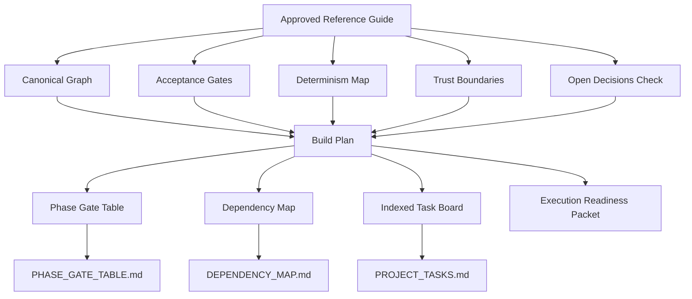

### Diagram 2

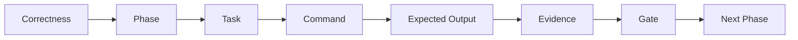

### Diagram 3

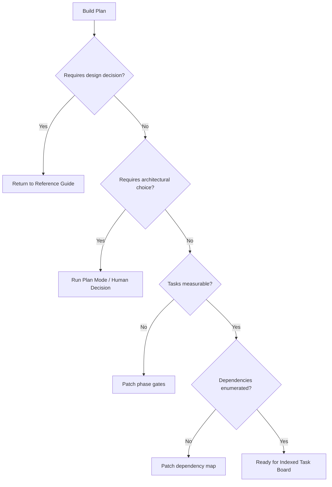

### Diagram 4

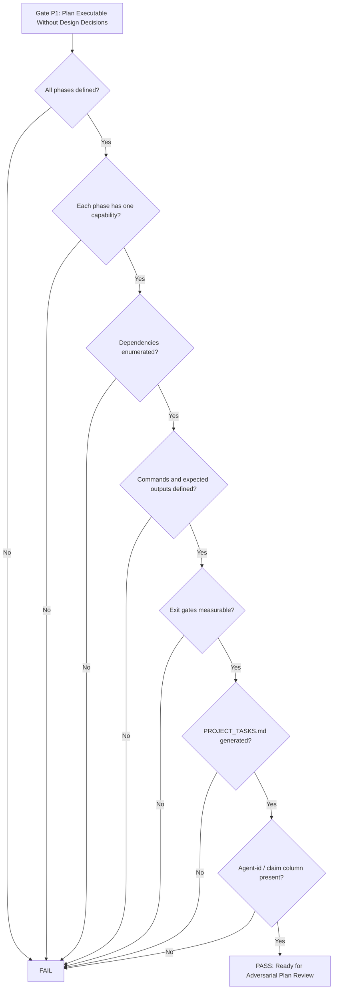

### The Build Plan’s Job

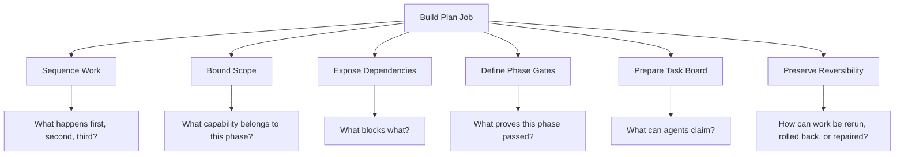

### Inputs to the Build Plan

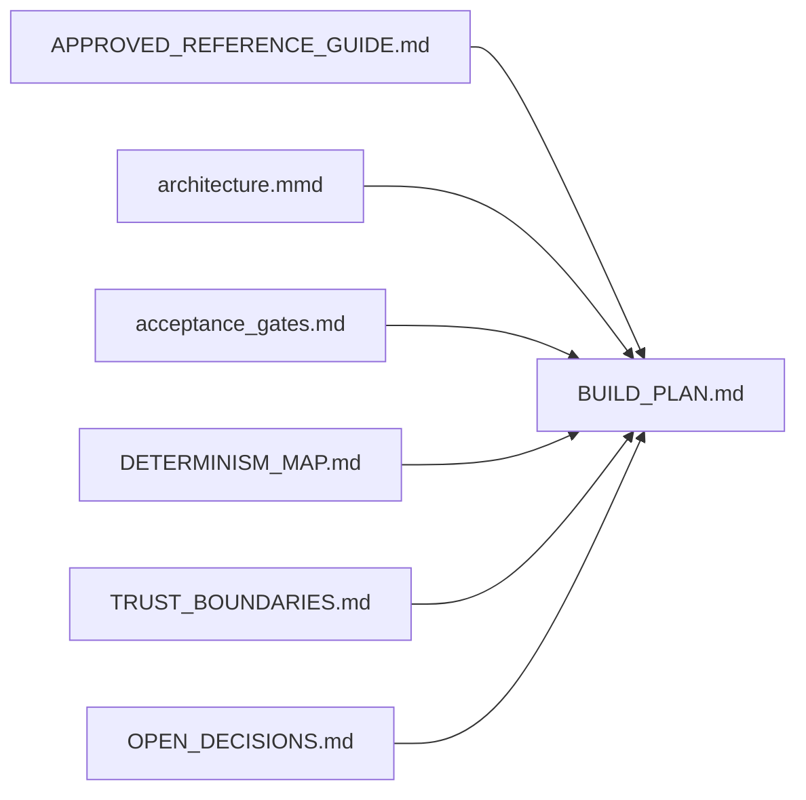

### Phase Design Rules

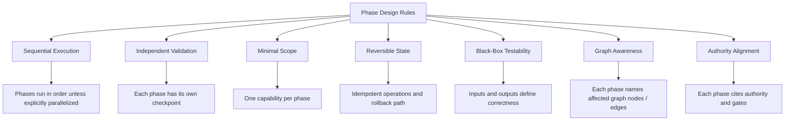

### Build Plan Phase Template

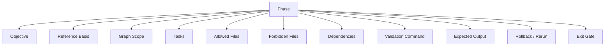

### Required Outputs

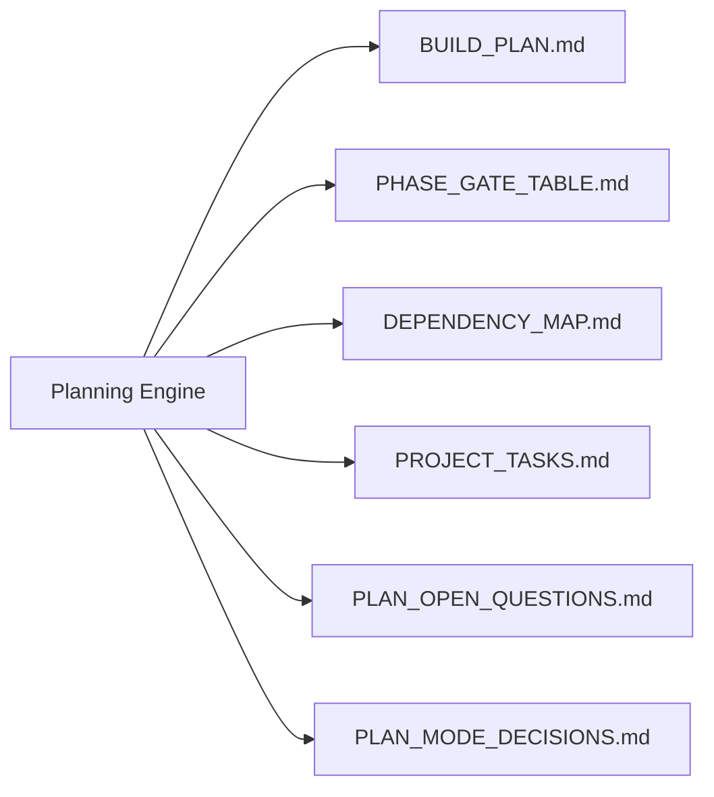

### Phase Gate Table

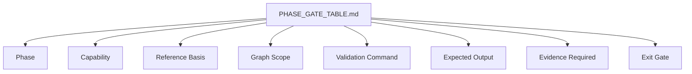

### Dependency Map

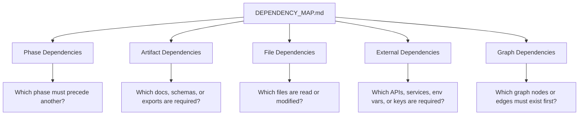

### PROJECT_TASKS.md Generation

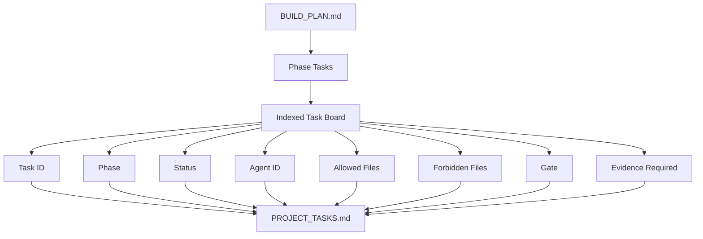

### Gate P1 — Can a Coding Agent Execute Without Making Design Decisions?

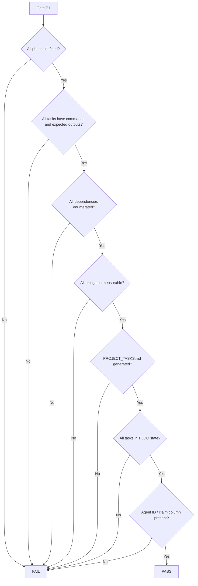

### Primary Hero Lenses

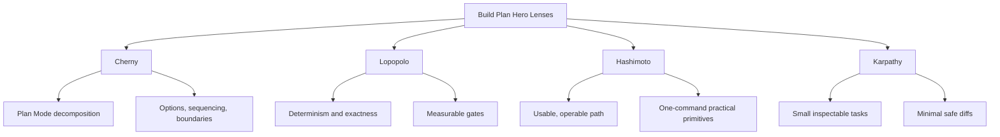

### One-Line Doctrine

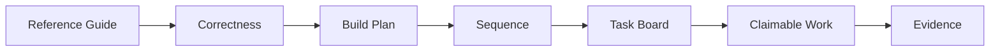

## Chapter 12 — Plan Mode: Options Before Architecture

### Diagram 1

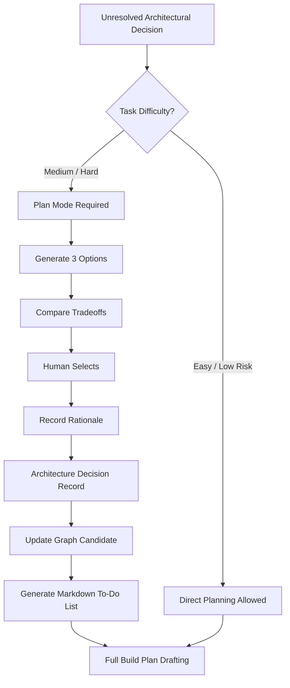

### Diagram 2

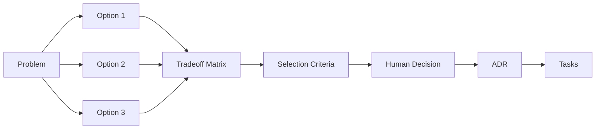

### Diagram 3

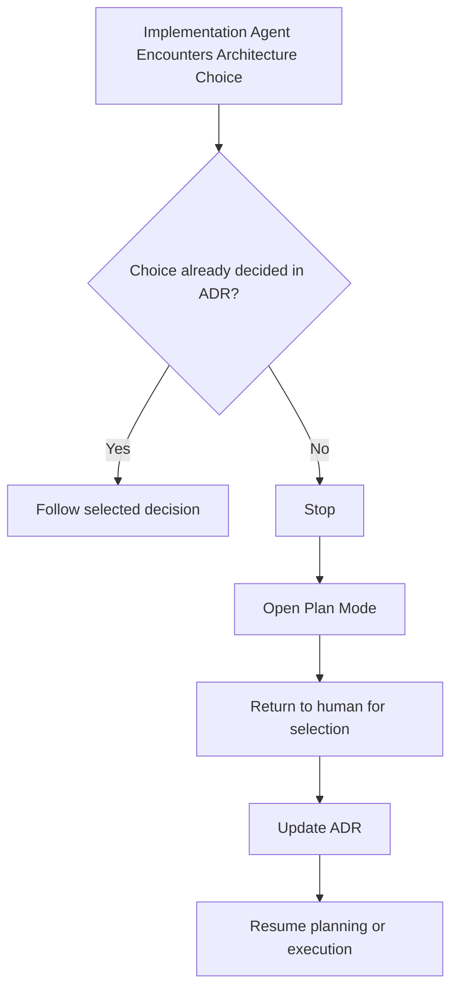

### Diagram 4

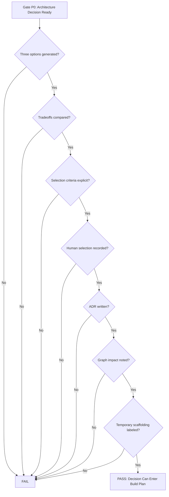

### When Plan Mode Is Required

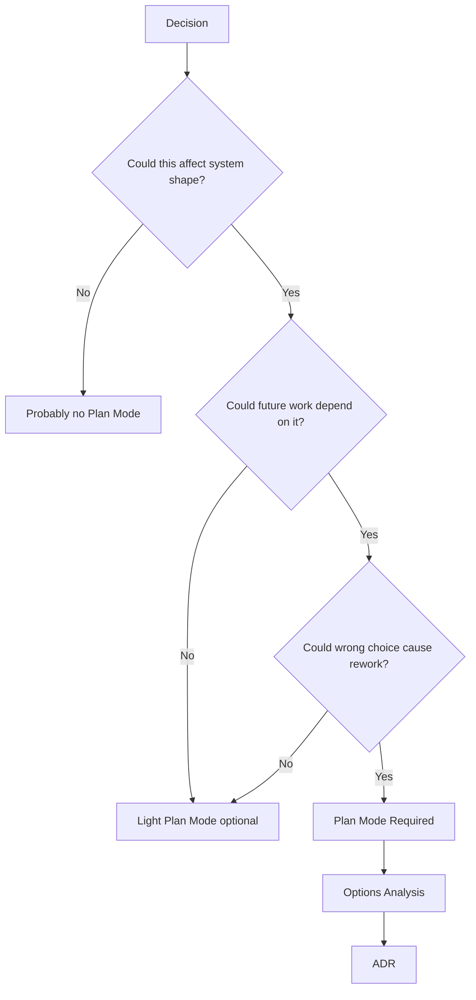

### model-output contract

```mermaid
graph structure
```

### Plan Mode Procedure [C]

```mermaid
flowchart TD
    A[Start Plan Mode] --> B[Name the unresolved decision]
    B --> C[Ask for Options 1, 2, and 3]
    C --> D[Compare tradeoffs]
    D --> E[Define selection criteria]
    E --> F[Human selects option]
    F --> G[Record rationale]
    G --> H[Write ADR]
    H --> I[Identify graph impact]
    I --> J[Generate markdown to-do list]
    J --> K[Proceed to build plan]
```

### Options Analysis Template

```mermaid
flowchart TD
    A[OPTIONS_ANALYSIS.md] --> B[Decision]
    A --> C[Context]
    A --> D[Selection Criteria]
    A --> E[Option 1]
    A --> F[Option 2]
    A --> G[Option 3]
    A --> H[Tradeoff Matrix]
    A --> I[Recommendation]
    A --> J[Human Selection]
```

### Architecture Decision Record

```mermaid
flowchart TD
    A[ARCHITECTURE_DECISION_RECORD.md] --> B[Decision ID]
    A --> C[Status]
    A --> D[Context]
    A --> E[Options Considered]
    A --> F[Decision]
    A --> G[Rationale]
    A --> H[Consequences]
    A --> I[Graph Impact]
    A --> J[Temporary Scaffolding]
    A --> K[Review Trigger]
```

### Temporary Scaffolding Rule

```mermaid
flowchart TD
    A[Temporary Scaffolding] --> B{Is it labeled TEMPORARY?}
    B -->|No| X[Invalid]
    B -->|Yes| C{Removal trigger defined?}
    C -->|No| X
    C -->|Yes| D{Owner defined?}
    D -->|No| X
    D -->|Yes| E{Review point defined?}
    E -->|No| X
    E -->|Yes| F[Allowed]
```

### Required Outputs

```mermaid
flowchart LR
    A[Plan Mode] --> B[OPTIONS_ANALYSIS.md]
    A --> C[ARCHITECTURE_DECISION_RECORD.md]
    A --> D[PLAN_MODE_TODO.md]
    A --> E[GRAPH_DELTA_CANDIDATES.md]
```

### Gate P0 — Architecture Decision Ready

```mermaid
flowchart TD
    A[Gate P0] --> B{Decision named?}
    B -->|No| F[FAIL]
    B -->|Yes| C{Options 1, 2, and 3 documented?}
    C -->|No| F
    C -->|Yes| D{Tradeoffs explicit?}
    D -->|No| F
    D -->|Yes| E{Human selected option?}
    E -->|No| F
    E -->|Yes| G{Rationale recorded?}
    G -->|No| F
    G -->|Yes| H{ADR created?}
    H -->|No| F
    H -->|Yes| I{Graph impact captured?}
    I -->|No| F
    I -->|Yes| J{Temporary scaffolding labeled with removal trigger?}
    J -->|No| F
    J -->|Yes| K[PASS]
```

### Primary Hero Lenses

```mermaid
flowchart TD
    A[Plan Mode Hero Lenses] --> C[Cherny]
    A --> T[Taylor]
    A --> H[Hashimoto]
    A --> N[Carlini]
    A --> K[Karpathy]
    C --> C1[Options before architecture]
    C --> C2[Decomposition and tradeoffs]
    T --> T1[Which option best serves user outcome?]
    T --> T2[Which option avoids product dead weight?]
    H --> H1[Which option creates practical primitives?]
    H --> H2[Which path is operable with least friction?]
    N --> N1[Which option reduces attack surface?]
    N --> N2[Which option creates dangerous ambiguity?]
    K --> K1[Which option supports small inspectable diffs?]
    K --> K2[Which option is easiest to rollback?]
```

### One-Line Doctrine

```mermaid
flowchart LR
    A[Options] --> B[Tradeoffs]
    B --> C[Human Selection]
    C --> D[ADR]
    D --> E[Tasks]
    E --> F[Build Plan]
```

## Chapter 13 — The Indexed Project Task Board

### Diagram 1

```mermaid
flowchart TD
    A[PROJECT_TASKS.md] --> B[Human Control Tower]
    A --> C[Agent Coordination Board]
    A --> D[Live Execution Contract]
    A --> E[Phase Dashboard]
    A --> F[Evidence Ledger]
    B --> B1[Shows progress, blockers, drift, and evidence]
    C --> C1[Prevents collision through claims]
    D --> D1[Defines what can be executed now]
    E --> E1[Tracks phase gates and completion state]
    F --> F1[Records proof before DONE]
```

### Diagram 2

```mermaid
flowchart TD
    A[Task Created] --> B[TODO]
    B --> C{Agent wants task}
    C --> D{Status still TODO?}
    D -->|No| E[Skip and pick next TODO]
    D -->|Yes| F[Claim Task]
    F --> G[IN_PROGRESS agent-id timestamp]
    G --> H[Create / update claim file]
    H --> I[Execute bounded task]
    I --> J{Blocked?}
    J -->|Yes| K[BLOCKED reason]
    J -->|No| L{Failed?}
    L -->|Yes| M[FAILED root cause]
    L -->|No| N[Produce evidence]
    N --> O{Evidence sufficient?}
    O -->|No| M
    O -->|Yes| P[DONE agent-id timestamp]
    P --> Q[Append receipt / outcome note]
```

### Diagram 3

```mermaid
flowchart LR
    A[BUILD_PLAN.md] --> B[PHASE_GATE_TABLE.md]
    B --> C[PROJECT_TASKS.md]
    C --> D[Claim File]
    D --> E[Agent Work]
    E --> F[Receipt]
    F --> G[Phase Dashboard]
    G --> H[Human Review]
```

### Diagram 4

```mermaid
flowchart TD
    A[Can Task Be Marked DONE?] --> B{Status was IN_PROGRESS?}
    B -->|No| X[No]
    B -->|Yes| C{Agent ID recorded?}
    C -->|No| X
    C -->|Yes| D{Allowed / forbidden files respected?}
    D -->|No| X
    D -->|Yes| E{Evidence recorded?}
    E -->|No| X
    E -->|Yes| F{Files touched listed?}
    F -->|No| X
    F -->|Yes| G{Drift notes recorded?}
    G -->|No| X
    G -->|Yes| H{Receipt or outcome note appended?}
    H -->|No| X
    H -->|Yes| I[DONE allowed]
```

### What the Task Board Does

```mermaid
flowchart TD
    A[Task Board Functions] --> B[Visibility]
    A --> C[Coordination]
    A --> D[Scope Control]
    A --> E[Evidence Control]
    A --> F[Drift Detection]
    A --> G[Phase Governance]
    B --> B1[Human sees phase progress]
    C --> C1[Agents avoid collisions]
    D --> D1[Allowed and forbidden files are explicit]
    E --> E1[Completion requires proof]
    F --> F1[Tasks record graph and scope drift]
    G --> G1[Phase gates cannot be skipped]
```

### Key Principles

```mermaid
flowchart TD
    A[Task Board Principles] --> P1[The board is the human control tower]
    A --> P2[Every task has a stable ID]
    A --> P3[Every task declares allowed and forbidden files]
    A --> P4[Every task declares evidence required]
    A --> P5[Every phase has a dashboard and gate checklist]
    A --> P6[A task is not done unless evidence is recorded]
    A --> P7[The file is the status]
    A --> P8[Claim files lock the work]
    A --> P9[Graph deltas must be recorded]
    P1 --> C1[No hidden status]
    P2 --> C2[Stable references across agents and receipts]
    P3 --> C3[Scope control]
    P4 --> C4[Completion control]
    P5 --> C5[Phase governance]
    P6 --> C6[No false DONE]
    P7 --> C7[Single dashboard]
    P8 --> C8[Collision prevention]
    P9 --> C9[Structure drift detection]
```

### Claim Protocol

```mermaid
flowchart TD
    A[Before Starting Task] --> B[Read PROJECT_TASKS.md]
    B --> C{Task status is TODO?}
    C -->|No| D[Skip task]
    C -->|Yes| E[Update status to IN_PROGRESS]
    E --> F[Record agent-id]
    F --> G[Record timestamp]
    G --> H[Create claim file]
    H --> I[Begin work]
```

### Completion Protocol

```mermaid
flowchart TD
    A[Task Complete] --> B[Run required commands]
    B --> C[Collect evidence]
    C --> D[List files touched]
    D --> E[Record graph delta]
    E --> F[Append receipt or outcome note]
    F --> G[Update task status to DONE]
    G --> H[Record agent-id and timestamp]
    H --> I{Phase complete?}
    I -->|No| J[Stop]
    I -->|Yes| K[Update phase dashboard]
    K --> L[Record phase-level eval, tests, validation]
```

### Blocked and Failed Protocol

```mermaid
flowchart TD
    A[Task Trouble] --> B{Can agent proceed safely?}
    B -->|No, missing info| C[BLOCKED reason]
    B -->|No, attempted and failed| D[FAILED root cause]
    B -->|Yes| E[Continue]
    C --> F[Surface to human orchestrator]
    D --> F
    F --> G[Do not silently abandon]
```

### Required Task Fields

```mermaid
flowchart TD
    A[Required Task Fields] --> B[Task ID]
    A --> C[Phase]
    A --> D[Hero Lens]
    A --> E[Status]
    A --> F[Agent]
    A --> G[Claim File]
    A --> H[Allowed Files]
    A --> I[Forbidden Files]
    A --> J[Dependencies]
    A --> K[Expected Output]
    A --> L[Eval Command]
    A --> M[Test Command]
    A --> N[Validation Command]
    A --> O[Files Touched]
    A --> P[Graph Scope / Delta]
    A --> Q[Drift Notes]
    A --> R[Completion Evidence]
```

### Example Task Row

```mermaid
flowchart LR
    A[Task ID] --> B[Task]
    B --> C[Hero Lens]
    C --> D[Status]
    D --> E[Agent]
    E --> F[Claim]
    F --> G[Allowed Files]
    G --> H[Forbidden Files]
    H --> I[Gate]
    I --> J[Evidence]
```

### Phase Dashboard

```mermaid
flowchart TD
    A[Phase Dashboard] --> B[Phase ID]
    A --> C[Capability]
    A --> D[Status]
    A --> E[Tasks Complete]
    A --> F[Blockers]
    A --> G[Gate]
    A --> H[Evidence]
    A --> I[Phase Receipt]
```

### Tool Guidance by Usage Mode

```mermaid
flowchart TD
    A[Usage Mode] --> B[Solo Greenfield]
    A --> C[Solo Serious / Multi-Agent]
    A --> D[Enterprise Legacy]
    B --> B1[Plain PROJECT_TASKS.md in repo]
    B --> B2[Checked into git]
    B --> B3[No external tracker required]
    C --> C1[PROJECT_TASKS.md + claim files]
    C --> C2[Receipt files]
    C --> C3[Optional scripts for status checks]
    D --> D1[CI-backed issue tracker]
    D --> D2[Machine-readable state]
    D --> D3[Gate-enforceable workflows]
```

### Primary Hero Lenses

```mermaid
flowchart TD
    A[Task Board Hero Lenses] --> C[Cherny]
    A --> L[Lopopolo]
    A --> H[Hashimoto]
    A --> W[Willison]
    A --> K[Karpathy]
    C --> C1[Decompose work into claimable units]
    L --> L1[Require binary gates and evidence]
    H --> H1[Keep task workflow operable]
    W --> W1[Verify reality with commands]
    K --> K1[Keep diffs small and inspectable]
```

### Gate P2 — Task Board Execution Ready

```mermaid
flowchart TD
    A[Gate P2: Task Board Execution Ready] --> B{PROJECT_TASKS.md exists?}
    B -->|No| X[FAIL]
    B -->|Yes| C{Every task has stable ID?}
    C -->|No| X
    C -->|Yes| D{Every task has status?}
    D -->|No| X
    D -->|Yes| E{Every task has allowed / forbidden files?}
    E -->|No| X
    E -->|Yes| F{Every task has evidence requirement?}
    F -->|No| X
    F -->|Yes| G{Every task has gate?}
    G -->|No| X
    G -->|Yes| H{Agent / claim field exists?}
    H -->|No| X
    H -->|Yes| I{All tasks start TODO?}
    I -->|No| X
    I -->|Yes| J[PASS]
```

### One-Line Doctrine

```mermaid
flowchart LR
    A[Task Board] --> B[Claim]
    B --> C[Scope]
    C --> D[Execute]
    D --> E[Evidence]
    E --> F[Receipt]
    F --> G[DONE]
```

## Chapter 14 — Why Adversarial Review Comes Before Code

### Diagram 1

```mermaid
flowchart TD
    A[Build Plan] --> B[Adversarial Review]
    B --> C{Critical Risk Found?}
    C -->|Yes| D[Block Implementation]
    D --> E[Patch Plan / Reference / Graph / Gates]
    E --> B
    C -->|No| F{Medium Risks Resolved or Accepted?}
    F -->|No| G[Resolve or Record Decision]
    G --> B
    F -->|Yes| H[Plan Hardened]
    H --> I[Authority Capsule]
    I --> J[Execution Readiness]
    J --> K[Coding Agents]
```

### Diagram 2

```mermaid
flowchart LR
    A[Risk Found in Review] --> B[Minutes to fix]
    C[Risk Found in Implementation] --> D[Hours or days to fix]
    E[Risk Found After Handoff] --> F[Customer trust / production cost]
    B --> G[Cheap Correction]
    D --> H[Expensive Rework]
    F --> I[Reputation / data / revenue damage]
```

### Diagram 3

```mermaid
flowchart TD
    A[Plan Is Guilty Until Proven Robust] --> B[Attack Assumptions]
    A --> C[Attack Boundaries]
    A --> D[Attack Dependencies]
    A --> E[Attack Gates]
    A --> F[Attack Graph Alignment]
    A --> G[Attack Security]
    A --> H[Attack Operability]
    B --> I[Risk Register]
    C --> I
    D --> I
    E --> I
    F --> I
    G --> I
    H --> I
    I --> J[Contradiction Matrix]
    J --> K[Plan Hardening]
```

### Diagram 4

```mermaid
flowchart TD
    A[Reviewer Finding] --> B{Finding Type}
    B -->|Critical risk| C[Block implementation]
    B -->|Ambiguity| D[Patch build plan or reference guide]
    B -->|Graph mismatch| E[Patch architecture.mmd or record graph delta]
    B -->|Missing gate| F[Patch acceptance_gates.md]
    B -->|Security issue| G[Patch trust boundary / never-do rule]
    B -->|Dependency issue| H[Patch dependency map]
    B -->|Reviewer disagreement| I[Contradiction matrix]
    C --> J[Human Resolution]
    D --> J
    E --> J
    F --> J
    G --> J
    H --> J
    I --> J
    J --> K{Resolved?}
    K -->|No| L[Not Ready for Code]
    K -->|Yes| M[Hardened Plan]
```

### Why Review Comes Before Code

```mermaid
flowchart TD
    A[Before Code] --> B[Plan is still cheap to change]
    A --> C[No implementation momentum]
    A --> D[No partial architecture lock-in]
    A --> E[No agent has touched files]
    A --> F[No false DONE state]
    G[After Code] --> H[Rework touches files]
    G --> I[Tests may encode wrong behavior]
    G --> J[Agents may defend existing implementation]
    G --> K[Architecture inertia increases]
    G --> L[Receipts may become misleading]
```

### Key Principles

```mermaid
flowchart TD
    A[Adversarial Review Principles] --> P1[The plan must survive hostile review]
    A --> P2[Independent reviews must stay independent]
    A --> P3[Reviewer contradictions are valuable]
    A --> P4[Critical risks block implementation]
    A --> P5[Unresolved plans must not reach coding agents]
    A --> P6[Every finding must route to an artifact]
    A --> P7[Review is not praise]
    A --> P8[The graph and gates are part of the plan]
    P1 --> C1[Do not trust coherence]
    P2 --> C2[Prevent contamination]
    P3 --> C3[Expose hidden assumptions]
    P4 --> C4[No exceptions]
    P5 --> C5[Pause until resolved]
    P6 --> C6[Patch, reject, or gate]
    P7 --> C7[Break the plan]
    P8 --> C8[Attack structure and evidence, not just prose]
```

### What the Reviewer Attacks

```mermaid
flowchart TD
    A[Plan Attack Surface] --> B[Ambiguity]
    A --> C[Hidden Assumptions]
    A --> D[Missing Dependencies]
    A --> E[Undefined File Boundaries]
    A --> F[Weak Gates]
    A --> G[Graph Mismatch]
    A --> H[Stale Sources]
    A --> I[Security / Trust Boundary]
    A --> J[Operability]
    A --> K[Task Board Drift]
    B --> L[Can agent misread?]
    C --> M[What is being assumed?]
    D --> N[What blocks execution?]
    E --> O[What might be touched accidentally?]
    F --> P[What would falsely pass?]
    G --> Q[Does structure match plan?]
    H --> R[Is evidence still fresh?]
    I --> S[What can leak or be abused?]
    J --> T[Can this actually run?]
    K --> U[Can tasks be claimed safely?]
```

### Independent Review Protocol

```mermaid
flowchart TD
    A[Base Review Packet] --> B[Reviewer 1]
    A --> C[Reviewer 2]
    A --> D[Reviewer 3]
    A --> E[Reviewer N]
    B --> F[Independent Findings]
    C --> F
    D --> F
    E --> F
    F --> G[Merge Findings]
    G --> H[Deduplicate]
    G --> I[Identify Contradictions]
    G --> J[Identify Unique Risks]
    H --> K[Risk Register]
    I --> L[Contradiction Matrix]
    J --> K
    K --> M[Human Synthesis]
    L --> M
```

### Critical Risk Rule

```mermaid
flowchart TD
    A[Reviewer Finding] --> B{Severity?}
    B -->|Low| C[Track or patch]
    B -->|Medium| D[Patch or accept with rationale]
    B -->|High| E[Patch before execution]
    B -->|Critical| F[Block implementation]
    F --> G{Resolved?}
    G -->|No| H[No agent execution]
    G -->|Yes| I[Re-review affected plan section]
```

### Required Outputs

```mermaid
flowchart LR
    A[Adversarial Review] --> B[PLAN_REVIEW_LOG.md]
    A --> C[RISK_REGISTER.md]
    A --> D[CONTRADICTION_MATRIX.md]
    A --> E[PLAN_HARDENING_PATCHES.md]
    A --> F[UPDATED_BUILD_PLAN.md]
    A --> G[UPDATED_PROJECT_TASKS.md]
```

### Primary Hero Lenses

```mermaid
flowchart TD
    A[Adversarial Review Hero Lenses] --> W[Willison]
    A --> N[Carlini]
    A --> L[Lopopolo]
    A --> J[Carmack]
    W --> W1[Assume the plan is wrong]
    W --> W2[Test against reality]
    N --> N1[Strip away magic]
    N --> N2[Model attack surface and worst-case adversaries]
    L --> L1[Convert risks into gates]
    L --> L2[Make failure mechanically detectable]
    J --> J1[Ask what runtime proof will later be required]
    J --> J2[Reject claims without evidence paths]
```

### Gate R3 — Plan Survives Adversarial Review

```mermaid
flowchart TD
    A[Gate R3: Plan Survives Adversarial Review] --> B{Independent reviews complete?}
    B -->|No| X[FAIL]
    B -->|Yes| C{Risk register exists?}
    C -->|No| X
    C -->|Yes| D{Critical risks resolved?}
    D -->|No| X
    D -->|Yes| E{Contradictions resolved or accepted?}
    E -->|No| X
    E -->|Yes| F{Plan patches applied?}
    F -->|No| X
    F -->|Yes| G{Task board updated?}
    G -->|No| X
    G -->|Yes| H{Graph/gate impacts handled?}
    H -->|No| X
    H -->|Yes| I[PASS: Ready for Authority Capsule]
```

### One-Line Doctrine

```mermaid
flowchart LR
    A[Plan] --> B[Attack]
    B --> C[Patch]
    C --> D[Recheck]
    D --> E[Authorize]
    E --> F[Execute]
```

## Chapter 15 — The Frontier Model Review Council

### Diagram 1

```mermaid
flowchart TD
    A[Frontier Model Review Council] --> B[Independent Review]
    A --> C[Role-Specific Pressure]
    A --> D[Risk Classification]
    A --> E[Contradiction Resolution]
    A --> F[Plan Hardening]
    B --> B1[First pass reviews stay uncontaminated]
    C --> C1[Each reviewer attacks a different failure surface]
    D --> D1[Critical / High / Medium / Minor]
    E --> E1[Disagreements expose hidden assumptions]
    F --> F1[Update plan, graph, gates, tasks, or authority packet]
```

### Diagram 2

```mermaid
flowchart TD
    A[Base Review Packet] --> B[Claude-Style Review]
    A --> C[Gemini-Style Review]
    A --> D[GPT-Style Review]
    A --> E[Grok-Style Review]
    A --> F[DeepSeek-Style Review]
    A --> G[Meta-Style Review]
    B --> H[Independent Review Logs]
    C --> H
    D --> H
    E --> H
    F --> H
    G --> H
    H --> I[Merged Risk Register]
    I --> J[Contradiction Matrix]
    J --> K{Any unresolved critical risks?}
    K -->|Yes| L[Patch Plan / Graph / Gates / Task Board]
    L --> M[Re-review changed sections]
    M --> I
    K -->|No| N[Plan Review Passed]
    N --> O[Ready for Authority Capsule]
```

### Diagram 3

```mermaid
flowchart TD
    A[Review Need] --> B{Task Type}
    B -->|Architecture synthesis| C[One lead frontier model + one critic]
    B -->|Verification| D[Diverse model council]
    B -->|Security / privacy| E[Security adversaries from different vendors]
    B -->|Product logic| F[Product / contrarian reviewer]
    B -->|Implementation feasibility| G[Technical reasoning reviewer]
    B -->|Authority hygiene| H[Systems / context-control reviewer]
    C --> I[Targeted Review]
    D --> I
    E --> I
    F --> I
    G --> I
    H --> I
    I --> J[Risk Register]
```

### Diagram 4

```mermaid
flowchart TD
    A[Reviewer Finding] --> B{Severity}
    B -->|Minor| C[Track or patch opportunistically]
    B -->|Medium| D[Patch or accept with rationale]
    B -->|High| E[Patch before execution]
    B -->|Critical| F[Block implementation]
    F --> G[Resolve]
    G --> H{Material plan change?}
    H -->|No| I[Return to risk register]
    H -->|Yes| J[Re-review changed section]
    J --> I
```

### What the Council Reviews

```mermaid
flowchart TD
    A[Review Packet] --> B[APPROVED_REFERENCE_GUIDE.md]
    A --> C[architecture.mmd]
    A --> D[acceptance_gates.md]
    A --> E[BUILD_PLAN.md]
    A --> F[PHASE_GATE_TABLE.md]
    A --> G[DEPENDENCY_MAP.md]
    A --> H[PROJECT_TASKS.md]
    A --> I[TRUST_BOUNDARIES.md]
    A --> J[DETERMINISM_MAP.md]
    A --> K[sources.manifest.json]
```

### Review Cycle Procedure

```mermaid
flowchart TD
    A[Start Council Review] --> B[Prepare base packet]
    B --> C[Assign reviewer lenses]
    C --> D[Run independent first-pass reviews]
    D --> E[Collect review logs]
    E --> F[Merge risk logs]
    F --> G[Classify severity]
    G --> H[Build contradiction matrix]
    H --> I[Resolve critical risks]
    I --> J{Zero unresolved critical risks?}
    J -->|No| K[Patch plan / graph / gates / tasks]
    K --> L[Re-review materially changed sections]
    L --> F
    J -->|Yes| M[Document accepted deferred risks]
    M --> N[Update plan packet]
    N --> O[Gate V1 candidate]
```

### Reviewer Assignments

```mermaid
flowchart TD
    A[Reviewer Assignments] --> B[Claude-Style]
    A --> C[Gemini-Style]
    A --> D[GPT-Style]
    A --> E[Grok-Style]
    A --> F[DeepSeek-Style]
    A --> G[Meta-Style]
    A --> H[Security-Specialist Pass]
    A --> I[Graph / Schema Pass]
    B --> B1[Coherence, constraints, implementation clarity]
    C --> C1[Broad-context consistency]
    D --> D1[Structure, readability, developer usability]
    E --> E1[Assumptions, narrative, product logic]
    F --> F1[Technical reasoning, algorithmic consistency]
    G --> G1[Authority hygiene, context control, systems design]
    H --> H1[Trust boundaries, injection, exfiltration, least privilege]
    I --> I1[Graph, schema, state, and data-flow consistency]
```

### v7 Adaptive Council Modes

```mermaid
flowchart TD
    A[Council Mode] --> B[Lite Review]
    A --> C[Standard Review]
    A --> D[Full Council Review]
    A --> E[Security Review]
    A --> F[Graph Review]
    B --> B1[1 reviewer + human synthesis]
    C --> C1[3 reviewers with distinct lenses]
    D --> D1[5-6 reviewers + contradiction matrix]
    E --> E1[Security adversaries + trust boundary pass]
    F --> F1[Graph/schema reviewer + implementation feasibility pass]
```

### Review Categories

```mermaid
flowchart TD
    A[Review Categories] --> B[Technical Correctness]
    A --> C[Completeness]
    A --> D[Dependency Risk]
    A --> E[Execution / Data / Infrastructure Risk]
    A --> F[Observability Risk]
    A --> G[Determinism / Cost Risk]
    A --> H[Prompt Injection Risk]
    A --> I[Exfiltration Risk]
    A --> J[Privilege Risk]
    A --> K[Product Outcome Mismatch]
    A --> L[Operator Confusion]
    A --> M[Spec Drift Risk]
    A --> N[AI Output Contract Risk]
    A --> O[Authority Risk]
    A --> P[Graph Drift Risk]
    A --> Q[Recency Risk]
```

### Severity Classification

```mermaid
flowchart TD
    A[Finding] --> B{Could this cause data loss, leak, wrong authority, irreversible state, or major rework?}
    B -->|Yes| C[Critical]
    B -->|No| D{Could this cause failed implementation or significant rework?}
    D -->|Yes| E[High]
    D -->|No| F{Could this cause confusion, polish debt, or minor rework?}
    F -->|Yes| G[Medium]
    F -->|No| H[Minor]
```

### Required Outputs

```mermaid
flowchart LR
    A[Frontier Model Council] --> B[MODEL_REVIEW_LOGS/]
    A --> C[MERGED_RISK_REGISTER.md]
    A --> D[CONTRADICTION_MATRIX.md]
    A --> E[PLAN_HARDENING_PATCHES.md]
    A --> F[REVIEW_DECISION_LOG.md]
```

### Model Review Prompt Template

```mermaid
flowchart TD
    A[Prompt] --> B[Reviewer Role]
    A --> C[Artifacts]
    A --> D[Attack Surface]
    A --> E[Output Table]
    A --> F[No Praise Rule]
    A --> G[Patch Routing]
    B --> B1[Assigned model lens]
    C --> C1[Plan packet]
    D --> D1[Specific risk categories]
    E --> E1[Finding / severity / evidence / patch]
    F --> F1[Break the plan]
    G --> G1[Route every finding to artifact]
```

### Primary Hero Lenses

```mermaid
flowchart TD
    A[Council Hero Lenses] --> W[Willison]
    A --> N[Carlini]
    A --> C[Cherny]
    A --> L[Lopopolo]
    A --> T[Taylor]
    W --> W1[What fails in reality?]
    N --> N1[What ambiguity becomes attack surface?]
    C --> C1[What architectural choice or dependency is unclear?]
    L --> L1[What should become a gate?]
    T --> T1[Does this still serve the user outcome?]
```

### Gate V1 — Council Review Passed

```mermaid
flowchart TD
    A[Gate V1: Council Review Passed] --> B{Required review mode complete?}
    B -->|No| X[FAIL]
    B -->|Yes| C{Independent logs stored?}
    C -->|No| X
    C -->|Yes| D{Merged risk register exists?}
    D -->|No| X
    D -->|Yes| E{Critical risks resolved?}
    E -->|No| X
    E -->|Yes| F{High risks patched or accepted with rationale?}
    F -->|No| X
    F -->|Yes| G{Contradictions resolved?}
    G -->|No| X
    G -->|Yes| H{Plan hardening patches applied?}
    H -->|No| X
    H -->|Yes| I{Changed sections re-reviewed if material?}
    I -->|No| X
    I -->|Yes| J[PASS]
```

### One-Line Doctrine

```mermaid
flowchart LR
    A[Independent Models] --> B[Different Failure Surfaces]
    B --> C[Merged Risks]
    C --> D[Human Resolution]
    D --> E[Hardened Plan]
```

## Chapter 16 — Independence and Contamination Control

### Diagram 1

```mermaid
flowchart TD
    A[Base Artifact] --> B[Independent Reviewer A]
    A --> C[Independent Reviewer B]
    A --> D[Independent Reviewer C]
    B --> E[Independent Findings]
    C --> E
    D --> E
    E --> F[Merged Risk Register]
    F --> G[Contradiction Matrix]
    G --> H[Human Resolution]
    H --> I[Plan Patches]
    I --> J{Material Change?}
    J -->|No| K[Review Complete]
    J -->|Yes| L[Re-review Changed Sections]
    L --> F
```

### Diagram 2

```mermaid
flowchart LR
    A[Claude Review] --> B[Gemini Sees Claude Output]
    B --> C[Gemini Framing Contaminated]
    C --> D[Agreement Inflation]
    D --> E[False Confidence]
    F[Build Plan Only] --> G[Gemini Independent Review]
    G --> H[Distinct Failure Surface]
    H --> I[Useful Second Opinion]
```

### The Independence Rule

```mermaid
flowchart TD
    A[Independence Rule] --> B[Reviewer sees base artifact first]
    B --> C[Reviewer writes first-pass critique]
    C --> D[Review log saved]
    D --> E[Only then can reviewer see other critiques]
    A2[Violation] --> F[Reviewer sees another review first]
    F --> G[Contaminated Review]
    G --> H[Label and downgrade independence]
```

### Why Contamination Matters

```mermaid
flowchart TD
    A[Reviewer Sees Prior Critique] --> B[Anchoring]
    A --> C[Risk Framing Inheritance]
    A --> D[Vocabulary Convergence]
    A --> E[Blind Spot Propagation]
    A --> F[False Consensus]
    B --> G[Less Independent Signal]
    C --> G
    D --> G
    E --> G
    F --> G
    G --> H[Review Looks Stronger Than It Is]
```

### Clean Review Sequence

```mermaid
flowchart TD
    A[Prepare Base Packet] --> B[Assign Reviewers]
    B --> C[Run Independent First Passes]
    C --> D[Save Raw Review Logs]
    D --> E[Merge Findings]
    E --> F[Deduplicate]
    F --> G[Find Contradictions]
    G --> H[Human Resolution]
    H --> I[Patch Plan Packet]
    I --> J{Material Change?}
    J -->|No| K[Review Complete]
    J -->|Yes| L[Targeted Re-review]
```

### Contamination Labels

```mermaid
flowchart TD
    A[Review Log] --> B{Did reviewer see other reviews first?}
    B -->|No| C[Independent]
    B -->|Yes, prior critique shown| D[Contaminated]
    B -->|Yes, merged risks shown| E[Post-Merge Review]
    B -->|Yes, patched plan shown| F[Re-review]
    B -->|Unknown| G[Independence Unknown]
    C --> H[High independence weight]
    D --> I[Do not count as independent signal]
    E --> J[Useful for synthesis, not first-pass independence]
    F --> K[Useful for patch validation]
    G --> L[Label uncertainty]
```

### The Merge Comes After Independence

```mermaid
flowchart TD
    A[Independent Review Logs] --> B[Merge]
    B --> C[Deduplicate Findings]
    B --> D[Cluster Risks]
    B --> E[Identify Contradictions]
    B --> F[Assign Severity]
    B --> G[Route Patches]
    C --> H[MERGED_RISK_REGISTER.md]
    D --> H
    E --> I[CONTRADICTION_MATRIX.md]
    F --> H
    G --> J[PLAN_HARDENING_PATCHES.md]
```

### Human Resolution

```mermaid
flowchart TD
    A[Merged Finding] --> B{Human Decision}
    B -->|Fix| C[Patch artifact]
    B -->|Accept risk| D[Record rationale]
    B -->|Defer| E[Record owner and trigger]
    B -->|Reject| F[Record rejection rationale]
    B -->|Escalate| G[Run additional review or Plan Mode]
    C --> H[REVIEW_DECISION_LOG.md]
    D --> H
    E --> H
    F --> H
    G --> H
```

### Re-review Trigger

```mermaid
flowchart TD
    A[Plan Patch] --> B{Material Change?}
    B -->|No| C[No re-review required]
    B -->|Yes| D{What changed?}
    D --> E[Architecture]
    D --> F[Security Boundary]
    D --> G[Data Flow]
    D --> H[Acceptance Gate]
    D --> I[Task Scope]
    D --> J[Authority Rule]
    E --> K[Targeted Re-review Required]
    F --> K
    G --> K
    H --> K
    I --> K
    J --> K
```

### Key Principles

```mermaid
flowchart TD
    A[Independence Principles] --> P1[Reviewers see base artifact before opinions]
    A --> P2[Merged register comes after independent reviews]
    A --> P3[Contaminated independence must be labeled]
    A --> P4[Human decides fix / accept / defer]
    A --> P5[Materially changed plans must be re-reviewed]
    A --> P6[Agreement is not the goal]
    A --> P7[Coverage is the goal]
    P1 --> C1[Protect signal]
    P2 --> C2[Prevent early anchoring]
    P3 --> C3[Preserve evidence quality]
    P4 --> C4[No model is sole authority]
    P5 --> C5[Patch validation]
    P6 --> C6[Avoid false consensus]
    P7 --> C7[Find distinct failure surfaces]
```

### Required Outputs

```mermaid
flowchart LR
    A[Independence Control] --> B[RAW_REVIEW_LOGS/]
    A --> C[INDEPENDENCE_REGISTER.md]
    A --> D[MERGED_RISK_REGISTER.md]
    A --> E[CONTRADICTION_MATRIX.md]
    A --> F[REVIEW_DECISION_LOG.md]
    A --> G[REVIEW_CONTAMINATION_NOTES.md]
```

### Independence Register Template

```mermaid
flowchart TD
    A[INDEPENDENCE_REGISTER.md] --> B[Reviewer]
    A --> C[Review Mode]
    A --> D[Artifacts Seen]
    A --> E[Artifacts Not Seen]
    A --> F[Prior Reviews Seen]
    A --> G[Timestamp]
    A --> H[Independence Notes]
```

### Primary Hero Lenses

```mermaid
flowchart TD
    A[Independence Control Hero Lenses] --> W[Willison]
    A --> N[Carlini]
    A --> L[Lopopolo]
    A --> C[Cherny]
    W --> W1[What is the actual evidence quality?]
    W --> W2[Was the review independently generated?]
    N --> N1[What assumption can contaminate the review process?]
    N --> N2[Where can false consensus become dangerous?]
    L --> L1[What protocol makes independence auditable?]
    L --> L2[What gate prevents contaminated reviews from passing as independent?]
    C --> C1[Which review sequence preserves decision quality?]
```

### Gate V0 — Review Independence Preserved

```mermaid
flowchart TD
    A[Gate V0: Review Independence Preserved] --> B{First-pass reviewers saw base artifacts first?}
    B -->|No| X[FAIL or label contaminated]
    B -->|Yes| C{Prior review exposure recorded?}
    C -->|No| X
    C -->|Yes| D{Independence register exists?}
    D -->|No| X
    D -->|Yes| E{Raw review logs saved before merge?}
    E -->|No| X
    E -->|Yes| F{Merged register created after independent logs?}
    F -->|No| X
    F -->|Yes| G{Contamination events labeled?}
    G -->|No| X
    G -->|Yes| H[PASS]
```

### One-Line Doctrine

```mermaid
flowchart LR
    A[Base Artifact] --> B[Independent Review]
    B --> C[Raw Logs]
    C --> D[Merge]
    D --> E[Human Resolution]
    E --> F[Patch]
    F --> G[Re-review]
```

## Chapter 17 — AI Credit Arbitrage

### Diagram 1

```mermaid
flowchart TD
    A[AI Credit Arbitrage] --> B[Move Cost Upstream]
    A --> C[Use Subsidized Review]
    A --> D[Reduce Coding-Agent Loops]
    A --> E[Preserve Expensive Tokens for Execution]
    A --> F[Improve Specification Quality]
    B --> B1[Source synthesis]
    B --> B2[Reference guide]
    B --> B3[Adversarial review]
    C --> C1[NotebookLM]
    C --> C2[Gemini consumer tier]
    C --> C3[Flat-rate frontier subscriptions]
    D --> D1[Fewer clarifying loops]
    D --> D2[Fewer wrong diffs]
    D --> D3[Fewer retasks]
    E --> E1[Codex / coding agents]
    E --> E2[Runtime debugging]
    E --> E3[Validation and repair]
    F --> F1[Lower cost]
    F --> F2[Higher correctness]
    F --> F3[Less agent drift]
```

### Diagram 2

```mermaid
flowchart LR
    A[Vague Prompt] --> B[Coding Agent Guesses]
    B --> C[Wrong Code]
    C --> D[Review Finds Problems]
    D --> E[Retask]
    E --> F[More Tokens]
    F --> G[More Rework]
    H[Source Synthesis] --> I[Reference Guide]
    I --> J[Adversarial Review]
    J --> K[Bounded Implementation]
    K --> L[Receipts]
    L --> M[Lower Token Waste]
```

### Diagram 3

```mermaid
flowchart TD
    A[Work Type] --> B{Best Cost Tier}
    B -->|Large source ingestion| C[NotebookLM]
    B -->|Independent second opinion| D[Gemini]
    B -->|Primary plan/reference review| E[Claude]
    B -->|Structure / usability review| F[GPT]
    B -->|Assumption challenge| G[Grok]
    B -->|Technical reasoning| H[DeepSeek]
    B -->|Implementation| I[Codex / Coding Agent]
    C --> J[Cheap or subsidized]
    D --> J
    E --> K[Flat subscription]
    F --> K
    G --> K
    H --> K
    I --> L[Primary marginal spend]
```

### Diagram 4

```mermaid
flowchart TD
    A[Task] --> B{Can cheaper model/review solve it?}
    B -->|Yes| C[Use cheaper or subsidized tier]
    B -->|No| D{Does expensive model need full context?}
    D -->|No| E[Send compressed graph + relevant artifacts]
    D -->|Yes| F{Is context below 70 percent?}
    F -->|No| G[Stop and summarize / split task]
    F -->|Yes| H[Use expensive model]
    H --> I[Require receipt or artifact output]
```

### The Cost Logic

```mermaid
flowchart TD
    A[Specification Quality] --> B{High or Low?}
    B -->|Low| C[Coding agent infers hidden requirements]
    C --> D[Wrong diff]
    D --> E[Review]
    E --> F[Retask]
    F --> G[More tokens]
    G --> H[More cost and drift]
    B -->|High| I[Agent receives bounded task]
    I --> J[Small diff]
    J --> K[Declared evidence]
    K --> L[Receipt]
    L --> M[Lower cost and higher correctness]
```

### What AI Credit Arbitrage Means

```mermaid
flowchart TD
    A[AI Credit Arbitrage] --> B[Use the Right Model for the Right Job]
    A --> C[Exploit Subsidized Context]
    A --> D[Exploit Flat-Rate Review]
    A --> E[Protect Marginal Coding Tokens]
    A --> F[Route Expensive Models to High-Leverage Work]
    B --> G[No single model does everything]
    C --> H[NotebookLM / Gemini]
    D --> I[Consumer subscriptions]
    E --> J[Codex and coding agents]
    F --> K[Hard architecture, security, debugging]
```

### Tool Assignments by Cost Tier

```mermaid
flowchart TD
    A[Tool Assignments] --> B[NotebookLM]
    A --> C[Gemini]
    A --> D[Claude]
    A --> E[GPT / Grok / DeepSeek]
    A --> F[Codex]
    B --> B1[Source ingestion and knowledge retrieval]
    C --> C1[Independent second-opinion review]
    D --> D1[Primary reference/plan review]
    E --> E1[Reference hardening and risk pressure]
    F --> F1[Code generation and implementation]
```

### The Specification Multiplier

```mermaid
flowchart TD
    A[Better Specification] --> B[Fewer Agent Questions]
    A --> C[Fewer Wrong Assumptions]
    A --> D[Smaller Diffs]
    A --> E[Cleaner Tests]
    A --> F[Fewer Retasks]
    B --> G[Lower Token Spend]
    C --> G
    D --> G
    E --> G
    F --> G
    G --> H[Higher Effective Compute]
```

### Token Governance Rules

```mermaid
flowchart TD
    A[Token Governance] --> R1[Do not send full context by default]
    A --> R2[Prefer graph + relevant artifacts]
    A --> R3[Keep reasoning headroom]
    A --> R4[Use expensive models only with artifact output]
    A --> R5[Split tasks before context saturation]
    A --> R6[Do not debug vague specs with code tokens]
    R1 --> C1[Compress]
    R2 --> C2[Structure first]
    R3 --> C3[Stay below context danger zone]
    R4 --> C4[Receipt or patch required]
    R5 --> C5[Smaller loops]
    R6 --> C6[Return to reference guide]
```

### Enterprise Contrast

```mermaid
flowchart TD
    A[Enterprise Legacy] --> B[IP restrictions]
    A --> C[Customer data boundaries]
    A --> D[Compliance review]
    A --> E[Procurement friction]
    A --> F[Approved vendor lists]
    A --> G[Logging and retention policies]
    H[Solo Builder] --> I[Routing freedom]
    H --> J[Multi-model review]
    H --> K[Consumer-tier arbitrage]
    H --> L[Faster experimentation]
    H --> M[Lower coordination cost]
```

### Solo Builder Advantage

```mermaid
flowchart TD
    A[Solo Builder Advantage] --> B[Fast Tool Routing]
    A --> C[Low Procurement Friction]
    A --> D[Cross-Model Diversity]
    A --> E[Subsidized Consumer Access]
    A --> F[Direct Human Judgment]
    B --> G[More review per dollar]
    C --> G
    D --> H[More failure-surface coverage]
    E --> G
    F --> I[Faster resolution]
```

### Required Outputs

```mermaid
flowchart LR
    A[Credit-Aware Workflow] --> B[COST_ROUTING_PLAN.md]
    A --> C[TOKEN_BUDGET.md]
    A --> D[MODEL_ASSIGNMENT_MATRIX.md]
    A --> E[CONTEXT_PACKET_PLAN.md]
    A --> F[CREDIT_RECEIPT.md]
```

### Credit Receipt

```mermaid
flowchart TD
    A[Expensive Model Call] --> B{Artifact produced?}
    B -->|No| C[Waste / investigate]
    B -->|Yes| D[Credit Receipt]
    D --> E[Model / Tool]
    D --> F[Purpose]
    D --> G[Context Sent]
    D --> H[Cost Tier]
    D --> I[Output Artifact]
    D --> J[Decision or Patch]
```

### Primary Hero Lenses

```mermaid
flowchart TD
    A[AI Credit Arbitrage Hero Lenses] --> T[Taylor]
    A --> H[Hashimoto]
    A --> W[Willison]
    A --> N[Carlini]
    T --> T1[Does this spend move the product outcome?]
    H --> H1[Is this the simplest operable routing?]
    W --> W1[What does the evidence show about waste?]
    N --> N1[Does cost routing create data exposure?]
```

### Gate C1 — Credit Routing Is Rational

```mermaid
flowchart TD
    A[Gate C1: Credit Routing Is Rational] --> B{High-cost calls assigned only to high-leverage work?}
    B -->|No| X[FAIL]
    B -->|Yes| C{Cheaper review tiers used where competent?}
    C -->|No| X
    C -->|Yes| D{Sensitive data excluded or approved?}
    D -->|No| X
    D -->|Yes| E{Context packets scoped?}
    E -->|No| X
    E -->|Yes| F{Expensive calls produce artifacts?}
    F -->|No| X
    F -->|Yes| G{Implementation starts only after bounded plan?}
    G -->|No| X
    G -->|Yes| H[PASS]
```

### One-Line Doctrine

```mermaid
flowchart LR
    A[Cheap Context] --> B[Better Specification]
    B --> C[Cheaper Code]
    C --> D[Fewer Retasks]
    D --> E[Higher Effective Compute]
```

## Chapter 18 — Risk Register and Plan Hardening

### Diagram 1

```mermaid
flowchart TD
    A[Reviewer Findings] --> B[Merged Risk Register]
    B --> C[Classify Severity]
    C --> D[Resolve / Accept / Defer / Reject]
    D --> E[Plan Patches]
    E --> F{Material Change?}
    F -->|Yes| G[Targeted Re-review]
    G --> B
    F -->|No| H{Zero Unresolved Critical Risks?}
    H -->|No| I[Continue Review Loop]
    H -->|Yes| J[Approved Build Plan]
```

### Diagram 2

```mermaid
flowchart TD
    A[Finding] --> B{Severity}
    B -->|Critical| C[Blocks Implementation]
    B -->|High| D[Patch before execution or explicit human acceptance]
    B -->|Medium| E[Patch / accept / defer with rationale]
    B -->|Minor| F[Track or patch opportunistically]
    C --> G[Risk Register]
    D --> G
    E --> G
    F --> G
    G --> H{Disposition}
    H -->|Fixed| I[PLAN_PATCHES.md]
    H -->|Accepted| J[Acceptance rationale + owner]
    H -->|Deferred| K[Trigger condition + owner]
    H -->|Rejected| L[Rejection rationale]
```

### Diagram 3

```mermaid
flowchart LR
    A[Review] --> B[Register]
    B --> C[Patch]
    C --> D[Re-review]
    D --> E[Approve]
```

### Diagram 4

```mermaid
flowchart TD
    A[Gate V2: Zero Unresolved Critical Risks] --> B{Merged risk register exists?}
    B -->|No| X[FAIL]
    B -->|Yes| C{Every finding classified?}
    C -->|No| X
    C -->|Yes| D{Every critical risk resolved?}
    D -->|No| X
    D -->|Yes| E{Accepted risks have rationale and owner?}
    E -->|No| X
    E -->|Yes| F{Deferred risks have trigger conditions?}
    F -->|No| X
    F -->|Yes| G{Material changes re-reviewed?}
    G -->|No| X
    G -->|Yes| H{Approved build plan produced?}
    H -->|No| X
    H -->|Yes| I[PASS]
```

### What the Risk Register Does

```mermaid
flowchart TD
    A[Risk Register] --> B[Captures Every Finding]
    A --> C[Classifies Severity]
    A --> D[Assigns Owner]
    A --> E[Routes Patch]
    A --> F[Tracks Disposition]
    A --> G[Triggers Re-review]
    A --> H[Blocks Premature Execution]
```

### Key Principles

```mermaid
flowchart TD
    A[Risk Register Principles] --> P1[Every reviewer finding enters the register]
    A --> P2[Risks are classified]
    A --> P3[Critical risks block implementation]
    A --> P4[Accepted risks require rationale and owner]
    A --> P5[Deferred risks require trigger conditions]
    A --> P6[Material plan changes require re-review]
    A --> P7[Build plan is not approved until unresolved critical risk is zero]
    P1 --> C1[No finding disappears]
    P2 --> C2[Severity drives action]
    P3 --> C3[No exceptions]
    P4 --> C4[Risk acceptance is explicit]
    P5 --> C5[Deferred does not mean forgotten]
    P6 --> C6[Patches can create new risks]
    P7 --> C7[Gate V2]
```

### Risk Register Template

```mermaid
flowchart TD
    A[MERGED_RISK_REGISTER.md] --> B[Risk ID]
    A --> C[Finding]
    A --> D[Raised By]
    A --> E[Severity]
    A --> F[Evidence]
    A --> G[Impact]
    A --> H[Patch Target]
    A --> I[Disposition]
    A --> J[Owner]
    A --> K[Re-review Required]
```

### Plan Patch Routing

```mermaid
flowchart TD
    A[Risk] --> B{Patch Target}
    B -->|Correctness unclear| C[APPROVED_REFERENCE_GUIDE.md]
    B -->|Structure mismatch| D[architecture.mmd]
    B -->|False pass possible| E[acceptance_gates.md]
    B -->|Sequence wrong| F[BUILD_PLAN.md]
    B -->|Dependency missing| G[DEPENDENCY_MAP.md]
    B -->|Task scope unclear| H[PROJECT_TASKS.md]
    B -->|Authority unclear| I[authority.json]
    B -->|Source stale| J[sources.manifest.json]
```

### Required Outputs

```mermaid
flowchart LR
    A[Plan Hardening] --> B[MERGED_RISK_REGISTER.md]
    A --> C[PLAN_PATCHES.md]
    A --> D[REVIEW_DECISION_LOG.md]
    A --> E[APPROVED_BUILD_PLAN.md]
    A --> F[UPDATED_PROJECT_TASKS.md]
```

### Gate V2 — Zero Unresolved Critical Risks

```mermaid
flowchart TD
    A[Gate V2] --> B{Every risk registered?}
    B -->|No| F[FAIL]
    B -->|Yes| C{Every risk classified?}
    C -->|No| F
    C -->|Yes| D{Unresolved critical risk count = 0?}
    D -->|No| F
    D -->|Yes| E{Accepted and deferred risks documented?}
    E -->|No| F
    E -->|Yes| G{Material changes re-reviewed?}
    G -->|No| F
    G -->|Yes| H[PASS]
```

### Primary Hero Lenses

```mermaid
flowchart TD
    A[Risk Register Hero Lenses] --> L[Lopopolo]
    A --> C[Cherny]
    A --> W[Willison]
    A --> N[Carlini]
    L --> L1[What gate or artifact makes the risk detectable?]
    C --> C1[Which dependency or structure caused the risk?]
    W --> W1[What evidence proves the risk is real or fixed?]
    N --> N1[What ambiguity becomes attack surface?]
```

### One-Line Doctrine

```mermaid
flowchart LR
    A[Finding] --> B[Register]
    B --> C[Classify]
    C --> D[Patch]
    D --> E[Re-review]
    E --> F[Approve]
```

---

## Narrative

PART III — TURN TRUTH INTO PLAN

Chapter 11 — From Reference Guide to Build Plan


Key Message

The build plan converts correctness into a phase-by-phase execution contract.

It does not make design decisions.

It records decisions already made in the approved reference guide and expresses them as a sequenced, bounded, verifiable work order.

The reference guide answers:

What does correct mean?

The build plan answers:

What should be built first?
What should be built second?
What must be validated before moving on?
Which dependencies block which phases?
Which command or evidence proves each phase?

If the build plan needs to invent requirements, the reference guide is not done.
If the build plan needs to choose architecture, the planning process must pause.
If the build plan needs the coding agent to decide what correctness means, the plan has failed.

In ACDF v7, the build plan must align with the approved reference guide, canonical graph, acceptance gates, determinism map, and trust boundaries before it becomes task-board material.

⸻

The Build Plan’s Job


The build plan is not a brainstorm. It is an execution contract.

It should translate approved truth into:

phases
tasks
dependencies
commands
expected outputs
evidence requirements
rollback notes
stop conditions

The plan must be usable by both the human orchestrator and the coding agent.

The human uses it to control sequence and risk.
The agent uses it to know what to build, what not to touch, and how to prove completion.

⸻

Inputs to the Build Plan


Required inputs:

Input	What the planner checks
APPROVED_REFERENCE_GUIDE.md	Correctness, scope, non-goals, rules, edge cases.
architecture.mmd	Current system structure, nodes, edges, boundaries, data flows.
acceptance_gates.md	Proof requirements and binary pass/fail conditions.
DETERMINISM_MAP.md	What must be stable, repeatable, calculated, modeled, or narrative.
TRUST_BOUNDARIES.md	Security, privacy, permission, and untrusted-input limits.
OPEN_DECISIONS.md	Confirms no blocking design decisions remain unresolved.

If any blocking open decision remains, do not generate the build plan as if it is settled.

⸻

Phase Design Rules


Phase design rules:

1. Sequential execution
    Phases run in order. No parallel phases unless explicitly defined.
2. Independent validation
    Each phase has its own validation checkpoint before the next begins.
3. Minimal scope
    Each phase implements one capability. Never combine two unrelated capabilities.
4. Reversible state
    Prefer idempotent operations throughout. Every phase should allow rollback, rerun, or repair.
5. Black-box testability [H]
    Phase correctness is defined by inputs and outputs, not internal implementation preference.
6. Graph awareness
    Each phase should name the graph nodes, edges, or boundaries it affects.
7. Authority alignment
    Each phase should cite the reference-guide section and gate that justify it.

⸻

Build Plan Phase Template


Each phase in BUILD_PLAN.md should use this template:

## Phase N — [Phase Name]
Objective:
- What this phase adds or fixes.
Reference Basis:
- APPROVED_REFERENCE_GUIDE.md section(s):
- acceptance_gates.md gate(s):
Graph Scope:
- Affected nodes:
- Affected edges:
- Expected graph delta: none / planned / possible
Tasks:
- [ ] Task N.1
- [ ] Task N.2
Allowed Files:
- path/to/file
- path/to/directory/*
Forbidden Files:
- path/to/do-not-touch
- docs/archive/*
Dependencies:
- Must follow Phase:
- Requires artifact:
- Requires command:
Validation:
- Command:
- Expected output:
- Screenshot/export/log required:
Rollback / Rerun:
- How to safely undo or repeat this phase.
Exit Gate:
- Binary pass/fail condition.

A phase that cannot name its validation evidence is not ready for execution.

⸻

Required Outputs


Required outputs:

BUILD_PLAN.md
PHASE_GATE_TABLE.md
DEPENDENCY_MAP.md
PROJECT_TASKS.md
PLAN_OPEN_QUESTIONS.md
PLAN_MODE_DECISIONS.md

Output	Purpose
BUILD_PLAN.md	Phase-by-phase execution contract.
PHASE_GATE_TABLE.md	Compact table of each phase, validation command, expected output, and exit gate.
DEPENDENCY_MAP.md	Lists phase dependencies, artifact dependencies, file dependencies, and external dependencies.
PROJECT_TASKS.md	Indexed claimable task board generated from the plan.
PLAN_OPEN_QUESTIONS.md	Any unresolved planning question that blocks execution. Should be empty before proceeding.
PLAN_MODE_DECISIONS.md	Records architectural or sequencing decisions made during planning.

⸻

Phase Gate Table


PHASE_GATE_TABLE.md should make the whole plan inspectable at a glance.

Example structure:

Phase	Capability	Reference Basis	Graph Scope	Validation Command	Expected Output	Evidence Required	Exit Gate
P1	Add receipt schema	Ref §3, Gate G1	Agent Work --> Receipt	npm test receipt	Schema tests pass	command output	PASS if tests green
P2	Save receipts locally	Ref §8, Gate G2	Receipt --> Ledger	npm test ledger	Save/read tests pass	command output + file path	PASS if persisted receipt reloads
P3	UI receipt ledger	Ref §12, Gate G3	Ledger --> UI	npm run test:e2e	Ledger visible	screenshot + test output	PASS if UI shows saved receipt

The table is a compression artifact. It keeps agents and humans aligned.

⸻

Dependency Map


The dependency map prevents agents from starting work in the wrong order.

It should answer:

Which phase must precede another?
Which artifact must exist before this task starts?
Which files does this phase depend on?
Which external services, keys, or environment variables are required?
Which graph nodes or edges must already exist?
What breaks if this phase runs early?

If dependencies are unclear, execution will drift.

⸻

PROJECT_TASKS.md Generation


The build plan is not execution-ready until it has been converted into an indexed task board.

Minimum columns:

Task ID	Phase	Task	Status	Agent ID	Allowed Files	Forbidden Files	Gate	Evidence Required

Initial status should be TODO.

The Agent ID column should be empty until a task is claimed.

This is what lets the human orchestrator control execution without relying on memory or chat ordering.

⸻

Gate P1 — Can a Coding Agent Execute Without Making Design Decisions?


Gate question:

Can a coding agent execute this plan without making design decisions?

PASS: All phases are defined. All tasks have exact commands, expected outputs, allowed files, forbidden files, dependencies, measurable exit gates, and evidence requirements. PROJECT_TASKS.md is generated. All phases are enumerated. All tasks are in TODO state. Agent ID / claim column is present.

FAIL: Identify ambiguous phases, missing dependencies, missing commands, missing expected outputs, or unresolved design decisions. Return to the reference guide if correctness is undefined. Re-run Plan Mode if architectural sequencing is unresolved.

⸻

Primary Hero Lenses


Primary Hero Lenses:

[C] Cherny + [L] Lopopolo + [H] Hashimoto

Cherny contributes Plan Mode decomposition:

What are the options?
What should happen first?
Where are the boundaries?
Which phases should be separate?

Lopopolo contributes determinism and exactness:

What is the binary gate?
What is the expected output?
What must not depend on agent interpretation?

Hashimoto contributes operability:

Can this be run?
Can this be used?
Is there a one-command path?
Does the plan produce a practical system rather than elegant dead weight?

Useful supporting lens:

[K] Karpathy

Karpathy asks whether the plan can be decomposed into small, inspectable, surgical diffs.

⸻

One-Line Doctrine


The build plan does not decide what correct means.
It sequences already-approved correctness into bounded, verifiable work.

If the plan needs to invent, go back to the reference guide.
If the plan needs to choose architecture, run Plan Mode.
If the plan cannot define proof, do not let agents execute.
-----
Chapter 12 — Plan Mode: Options Before Architecture


Key Message

For medium and hard architectural decisions, explore options before selecting.

Moving directly from problem to implementation is one of the main causes of architecture regret. A capable coding agent can quickly implement the wrong architecture if the decision was never made explicitly.

Plan Mode prevents silent architecture selection.

It forces unresolved decisions through a simple sequence:

Options → tradeoffs → human selection → rationale → ADR → tasks → build plan

The core rule:

Implementation agents do not choose architecture silently.

They may implement an architecture that has been selected.
They may surface a missing decision.
They may propose options.
They may not silently decide the system shape while writing code.

⸻

When Plan Mode Is Required


Plan Mode is required for medium and hard tasks.

Use Plan Mode when the decision affects:

architecture
data model
state management
persistence
API boundary
provider choice
security boundary
agent workflow
receipt schema
deployment shape
model-output contract
task sequencing

Plan Mode is optional for small, reversible implementation details.

A good test:

If the wrong choice would cause expensive rework, use Plan Mode.

⸻

Plan Mode Procedure [C]


Required procedure:

1. Name the unresolved architectural decision.
    Do not ask for options vaguely. Specify the decision boundary.
2. Ask the agent for Options 1, 2, and 3.
    Each option must include implementation shape, benefits, risks, and when it is the right choice.
3. Compare tradeoffs explicitly.
    Include complexity, reversibility, operability, performance, security, user value, and future flexibility.
4. Human reviews, selects, and documents rationale.
    The human owns the decision.
5. Write an Architecture Decision Record.
    The decision must be durable. Do not leave it trapped in chat.
6. Identify graph impact.
    If the decision changes system shape, it must produce a graph candidate or graph update.
7. Agent produces a markdown to-do list based on the selected option.
    The to-do list becomes build-plan input.
8. Only then does full build-plan drafting begin.

⸻

Options Analysis Template


Use this structure:

# OPTIONS_ANALYSIS.md
## Decision
What unresolved architectural choice is being made?
## Context
What reference-guide sections, graph nodes, gates, or constraints make this decision necessary?
## Selection Criteria
What matters most?
- correctness
- simplicity
- reversibility
- operability
- security
- user outcome
- implementation speed
- future extensibility
## Option 1 — [Name]
Description:
Pros:
Cons:
Risks:
Graph impact:
Best when:
Worst when:
## Option 2 — [Name]
Description:
Pros:
Cons:
Risks:
Graph impact:
Best when:
Worst when:
## Option 3 — [Name]
Description:
Pros:
Cons:
Risks:
Graph impact:
Best when:
Worst when:
## Tradeoff Matrix
Compare options across criteria.
## Recommendation
Which option is recommended and why?
## Human Selection
Selected option:
Rationale:
Date:
Owner:

⸻

Tradeoff Matrix

quadrantChart
    title Architecture Option Selection
    x-axis Low Operability --> High Operability
    y-axis Low Reversibility --> High Reversibility
    quadrant-1 Preferred
    quadrant-2 Reversible but awkward
    quadrant-3 Avoid
    quadrant-4 Operable but sticky
    Option 1: [0.70, 0.80]
    Option 2: [0.45, 0.65]
    Option 3: [0.80, 0.35]

Use explicit selection criteria.

A common matrix:

Criterion	Option 1	Option 2	Option 3
Correctness fit	High / Med / Low	High / Med / Low	High / Med / Low
Simplicity	High / Med / Low	High / Med / Low	High / Med / Low
Reversibility	High / Med / Low	High / Med / Low	High / Med / Low
Operability	High / Med / Low	High / Med / Low	High / Med / Low
Security	High / Med / Low	High / Med / Low	High / Med / Low
User value	High / Med / Low	High / Med / Low	High / Med / Low
Time to implement	Fast / Med / Slow	Fast / Med / Slow	Fast / Med / Slow
Future flexibility	High / Med / Low	High / Med / Low	High / Med / Low

The goal is not a fake mathematical score.
The goal is to make tradeoffs visible before code creates inertia.

⸻

Architecture Decision Record


Use this structure:

# ARCHITECTURE_DECISION_RECORD.md
## ADR-[NUMBER]: [Decision Title]
Status:
- proposed / accepted / superseded / rejected
Context:
- Why this decision is needed.
- Which reference-guide sections govern it.
- Which graph nodes or edges are affected.
Options considered:
1. Option 1
2. Option 2
3. Option 3
Decision:
- Selected option.
Rationale:
- Why this option was selected.
Consequences:
- Benefits:
- Costs:
- Risks:
- Dependencies:
Graph impact:
- New nodes:
- New edges:
- Changed edges:
- Removed edges:
- No graph impact:
Temporary scaffolding:
- TEMPORARY guardrail:
- Removal trigger:
- Owner:
- Review date:
Review trigger:
- What future condition would cause this decision to be revisited?

The ADR is what prevents the same architectural debate from reappearing in future agent runs.

⸻

Temporary Scaffolding Rule


Scaffolding is allowed. Invisible scaffolding is not.

Any temporary guardrail, shim, adapter, mock, hardcoded fallback, compatibility layer, bypass, fake provider, or manual step must be labeled:

TEMPORARY

And must include:

removal trigger
owner
review date or phase
risk if left in place

Example:

TEMPORARY: Provider mock remains until live provider credentials are available.
Removal trigger: Real provider integration test passes in staging.
Owner: human orchestrator
Risk if left in place: Production path may pass tests without exercising real provider behavior.

Temporary scaffolding without removal criteria becomes permanent technical debt.

⸻

Required Outputs


Required outputs:

OPTIONS_ANALYSIS.md
ARCHITECTURE_DECISION_RECORD.md
PLAN_MODE_TODO.md
GRAPH_DELTA_CANDIDATES.md

Output	Purpose
OPTIONS_ANALYSIS.md	Shows the three options, tradeoffs, selection criteria, recommendation, and human selection.
ARCHITECTURE_DECISION_RECORD.md	Records the selected decision, rationale, consequences, graph impact, and review trigger.
PLAN_MODE_TODO.md	Converts the selected option into build-plan-ready tasks.
GRAPH_DELTA_CANDIDATES.md	Captures proposed graph changes before they are promoted into architecture.mmd.

⸻

Gate P0 — Architecture Decision Ready


Gate question:

Can this architecture decision enter the build plan without being silently re-decided by an implementation agent?

PASS: The decision is named. Three options are documented. Tradeoffs are explicit. Human selection and rationale are recorded. ADR exists. Graph impact is captured. Temporary scaffolding is labeled with removal trigger.

FAIL: Identify the missing decision, missing option, missing rationale, missing graph impact, or unlabeled temporary scaffolding. Do not proceed to build-plan drafting until resolved.

⸻

Primary Hero Lenses


Primary Hero Lenses:

[C] Cherny + [T] Taylor + [H] Hashimoto

Cherny asks:

What are the viable options?
What are the tradeoffs?
What should be decomposed before implementation?

Taylor asks:

Which option best serves the user or business outcome?
Which option avoids elegant dead weight?

Hashimoto asks:

Which option gives us practical primitives?
Which option is easiest to run, operate, and use?

Useful supporting lenses:

[N] Carlini + [K] Karpathy

Carlini asks which option reduces attack surface.
Karpathy asks which option supports small, inspectable diffs and rollback.

⸻

One-Line Doctrine


Options before architecture.
Architecture before tasks.
Tasks before code.

Plan Mode exists because architecture decisions become expensive once code exists.

A coding agent may implement the selected option.
It may not silently choose the option.
----
Chapter 13 — The Indexed Project Task Board


Key Message

PROJECT_TASKS.md is the human control tower and the agent coordination board.

It is not a simple checklist.
It is the live execution contract.

The task board shows the work.
Claim files lock the work.
Receipts prove the work.

In ACDF v7, PROJECT_TASKS.md also tracks graph scope, allowed files, forbidden files, evidence requirements, drift notes, and completion proof. The board should let the human orchestrator see progress, blockers, phase health, and agent behavior without needing a status meeting or another chat summary.

The file is the status.

⸻

What the Task Board Does


The task board gives the human live visibility into:

phase progress
current claims
blocked tasks
failed tasks
files touched
evidence produced
drift notes
gate status
agent ownership

This replaces vague agent updates with a durable project artifact.

The agent should not ask, “What should I do next?” if the task board exists.
The agent should read the board, claim the next valid task, execute within scope, and update the board with evidence.

⸻

Key Principles


1. The task board gives the human live visibility into phase progress, drift, blockers, and evidence.
    The human should not need to interrupt agents to know what is happening.
2. Every task has a stable ID.
    Stable IDs make tasks, claims, receipts, and reviews referable.
3. Every task declares allowed and forbidden files.
    Scope must be explicit before execution begins.
4. Every task declares evidence required for completion.
    No evidence means no completion.
5. Every phase has a dashboard and gate checklist.
    Phase progress should be visible at a glance.
6. A task is not done unless evidence is recorded.
    DONE without proof is invalid.
7. PROJECT_TASKS.md is the single dashboard the human checks.
    The file is the status.
8. Claim files lock the work.
    Agents must not start unclaimed tasks or collide on claimed tasks.
9. Graph deltas must be recorded.
    If a task changes system structure, the task board and receipt must say so.

⸻

Task Status Values

stateDiagram-v2
    [*] --> TODO
    TODO --> IN_PROGRESS: claimed by agent-id + timestamp
    IN_PROGRESS --> DONE: evidence accepted
    IN_PROGRESS --> BLOCKED: blocker found
    IN_PROGRESS --> FAILED: task failed
    BLOCKED --> TODO: human resolves blocker
    FAILED --> TODO: human resets or creates repair task
    DONE --> [*]

Allowed task status values:

TODO
IN_PROGRESS [agent-id] [timestamp]
BLOCKED [reason]
DONE [agent-id] [timestamp]
FAILED [reason]

No other status values should be used unless the project explicitly extends the schema.

Statuses must be machine-readable enough for a simple script or agent to parse.

⸻

Claim Protocol


Before starting any task:

1. Read PROJECT_TASKS.md.
2. Confirm the task is TODO.
3. Update it to IN_PROGRESS with agent-id and timestamp.
4. Create or update the claim file.
5. Begin work only after the claim is recorded.

If the task is already IN_PROGRESS, skip it and pick the next valid TODO.

Never begin a task without claiming it first.

Claim file pattern:

docs/claims/[TASK_ID].[agent-id].claim.md

Minimum claim file:

# Claim: [TASK_ID]
Agent:
Timestamp:
Task:
Allowed Files:
Forbidden Files:
Expected Evidence:
Status: IN_PROGRESS

The claim file is not optional when multiple agents may operate on the repo.

⸻

Completion Protocol


On task completion:

1. Run the declared eval, test, and validation commands.
2. Record command output or evidence path.
3. List files touched.
4. Record drift notes and graph delta.
5. Append a one-line outcome note.
6. Update status to DONE with agent-id and timestamp.

On phase completion:

1. Update the phase header row to DONE.
2. Record phase-level evaluation result.
3. Record unit test result.
4. Record validation result.
5. Link or summarize receipt evidence.

A task is not complete because the code changed.
A task is complete when the required evidence is recorded.

⸻

Blocked and Failed Protocol


Use BLOCKED when the agent cannot proceed because information, dependency, permission, or authority is missing.

Use FAILED when the agent attempted the task and the implementation or validation failed.

Rules:

- Mark BLOCKED with a reason.
- Surface to human orchestrator immediately.
- Mark FAILED with a root-cause one-liner.
- Never silently abandon a failed task.
- Do not convert FAILED to DONE without a new receipt.

Examples:

BLOCKED [authority.json does not name current graph]
BLOCKED [required API key missing]
BLOCKED [acceptance gate undefined]
FAILED [typecheck fails after storage interface change]
FAILED [e2e test cannot find receipt ledger]

⸻

Required Task Fields


Required task fields:

Task ID
Phase
Hero Lens
Status
Agent
Claim File
Allowed Files
Forbidden Files
Dependencies
Expected Output
Eval Command
Test Command
Validation Command
Files Touched
Graph Scope / Delta
Drift Notes
Completion Evidence

Graph Scope / Delta is a v7 addition. It tells the agent whether the task is expected to change the canonical graph.

Allowed values:

none
planned
possible
unexpected
blocked

⸻

Example Task Row


Example:

| ID   | Task                         | Hero Lens | Status | Agent | Claim | Allowed Files  | Forbidden Files | Graph Delta | Gate                          |
|------|------------------------------|-----------|--------|-------|-------|----------------|-----------------|-------------|-------------------------------|
| P2.A | Add StorageManager interface | [L][C][W] | TODO   | —     | —     | src/storage/** | src/router/**   | planned     | typecheck + storage tests pass |

Extended v7 row:

| ID | Phase | Task | Hero Lens | Status | Agent | Claim File | Allowed Files | Forbidden Files | Dependencies | Expected Output | Eval Command | Test Command | Validation Command | Files Touched | Graph Scope / Delta | Drift Notes | Completion Evidence |
|---|---|---|---|---|---|---|---|---|---|---|---|---|---|---|---|---|---|

Use the compact row for readability. Use the extended row when multiple agents or high-risk tasks are involved.

⸻

Phase Dashboard


Each phase should have a dashboard section above its task rows.

Example:

## Phase P2 — Storage Layer
Status: TODO / IN_PROGRESS / BLOCKED / DONE / FAILED
Capability: Add local receipt persistence
Gate: typecheck + storage tests pass + receipt reloads
Tasks: 0/4 done
Current Blockers: none
Phase Evidence:
- Eval:
- Unit tests:
- Validation:
- Screenshot/export/log:
Phase Receipt:
- path/to/receipt.md

The phase dashboard lets the human see whether the phase is healthy without reading every task.

⸻

Tool Guidance by Usage Mode


Solo Greenfield

PROJECT_TASKS.md lives as a plain Markdown file in the project repository.

No external subscription services.
No task tracker accounts.
No additional tooling required.

The file is checked into git alongside the code.

This is intentional. At solo scale, the overhead of external tools usually exceeds the benefit.

Solo Serious / Multi-Agent

Use:

PROJECT_TASKS.md
docs/claims/
docs/receipts/
simple status-check scripts if useful

This gives the human orchestrator enough structure to manage multiple agents without adding enterprise overhead.

Enterprise Legacy

Replace PROJECT_TASKS.md with a CI-backed issue tracker such as Linear or equivalent.

Requirements:

state must be machine-readable
claiming must be enforceable
gate status must be CI-visible
evidence must attach to the issue
forbidden-file checks should run in CI

The tool may change. The contract does not.

⸻

Primary Hero Lenses


Primary Hero Lenses:

[C] Cherny + [L] Lopopolo + [H] Hashimoto + [W] Willison

Cherny asks:

Is the work decomposed into clear, claimable units?

Lopopolo asks:

What evidence must exist before DONE is allowed?

Hashimoto asks:

Can this task workflow be used without extra tooling or friction?

Willison asks:

What command, sandbox run, or empirical check proves the task worked?

Useful supporting lens:

[K] Karpathy

Karpathy asks whether each task is small enough to inspect, review, and roll back.

⸻

Gate P2 — Task Board Execution Ready


Gate question:

Can agents claim and complete tasks without colliding, drifting, or guessing what DONE means?

PASS: PROJECT_TASKS.md exists. Every task has a stable ID, status, allowed files, forbidden files, evidence requirement, gate, and agent/claim field. All tasks start in TODO unless already completed with evidence.

FAIL: Identify missing task fields, missing gates, missing claim fields, ambiguous scope, or missing evidence requirements. Do not begin agent execution until fixed.

⸻

One-Line Doctrine


The task board shows the work.
The claim file locks the work.
The receipt proves the work.

PROJECT_TASKS.md is not project management theater. It is how a human controls an agentic build without relying on chat memory.

The file is the status.

Binary gates also serve a purpose beyond correctness: they are the solo builder's substitute for a second engineer. A team catches drift and accumulating debt through code review, pairing, and shared context — checks that happen because someone else is looking. A solo builder has no one else looking. Gates that are binary, file-based, and checkable on demand let the builder trust that a passed gate really means passed, without re-auditing the whole system to find out. Debt that would otherwise accumulate invisibly — because no one had time to notice it — instead either fails a gate immediately or never gets the chance to form, because the task that would have introduced it could not be marked complete.

-----
PART IV — ATTACK THE PLAN

Chapter 14 — Why Adversarial Review Comes Before Code


Key Message

Risks found in review cost minutes.

The same risks found during implementation cost hours or days.

The same risks found after handoff cost trust, production stability, user confidence, and future velocity.

The plan is guilty until proven robust. The reviewer’s job is to break it, not praise it.

A plan should not reach coding agents merely because it sounds coherent. It should reach coding agents only after adversarial review has tried to expose ambiguity, dependency gaps, graph drift, missing gates, hidden assumptions, and security risks.

In ACDF v7, adversarial review does not only attack prose. It attacks the full planning packet:

APPROVED_REFERENCE_GUIDE.md
architecture.mmd
acceptance_gates.md
BUILD_PLAN.md
PHASE_GATE_TABLE.md
DEPENDENCY_MAP.md
PROJECT_TASKS.md
TRUST_BOUNDARIES.md
DETERMINISM_MAP.md

If the plan cannot survive hostile review, it should not be handed to implementation agents.

⸻

Why Review Comes Before Code


Adversarial review belongs before code because implementation creates inertia.

Once code exists, the system begins to defend itself:

wrong assumptions become files
wrong files become dependencies
wrong dependencies become tests
wrong tests become false proof
wrong proof becomes authority-like memory

Review before code avoids that spiral.

The cheapest moment to fix a bad plan is before the first implementation task is claimed.

⸻

Key Principles


1. The plan must survive hostile review before it reaches coding agents.
    A coherent plan is not automatically a robust plan.
2. Independent reviews must stay independent.
    A reviewer should not inherit another reviewer’s framing during the first pass.
3. Contradictions between reviewers are valuable.
    Contradictions expose hidden assumptions, unclear priorities, and ambiguous tradeoffs.
4. Critical risks block implementation. No exceptions.
    A critical risk is not a note. It is a stop condition.
5. A plan that cannot survive adversarial review should not be handed to coding agents.
    Agents should not implement a plan that still requires invisible judgment calls.
6. Every finding must route to an artifact.
    A review finding must become a patch, gate, graph update, open decision, risk acceptance, or explicit rejection rationale.
7. Review is not praise.
    The reviewer’s job is to break the plan before production reality does.
8. The graph and gates are part of the plan.
    A plan can be wrong because the prose is unclear, but it can also be wrong because the graph is stale or the gates do not prove the claimed behavior.

⸻

What the Reviewer Attacks


The review should ask:

What is still ambiguous?
What would a coding agent likely misread?
What dependency is missing?
What file or state boundary is undefined?
What graph node or edge does the plan assume?
What graph edge is missing, stale, or contradicted?
What assumption is hidden?
What test would prove the plan wrong?
What gate would falsely pass?
What should be moved from prose into schema, graph, or acceptance gate?
What does the plan fail to forbid?
What source is stale or unsupported?
What task could collide with another task?
What would cause implementation to expand scope?

The point is not to make the plan perfect. The point is to make the remaining risk explicit, bounded, and accepted before agents execute.

⸻

Independent Review Protocol


First-pass reviews should remain independent.

Each reviewer receives the same base packet and their assigned lens. They should not see other reviewers’ critiques until their own review is complete.

Base packet:

APPROVED_REFERENCE_GUIDE.md
architecture.mmd
acceptance_gates.md
BUILD_PLAN.md
PHASE_GATE_TABLE.md
DEPENDENCY_MAP.md
PROJECT_TASKS.md
TRUST_BOUNDARIES.md
DETERMINISM_MAP.md
sources.manifest.json

This prevents one model’s framing from contaminating the whole review.

After first-pass reviews, the human merges findings into:

RISK_REGISTER.md
CONTRADICTION_MATRIX.md
PLAN_HARDENING_PATCHES.md

⸻

Critical Risk Rule


Critical risks block implementation.

No exceptions.

A critical risk is any finding that could cause:

data loss
secret leakage
security compromise
wrong authority execution
major architectural rework
false completion
user-harmful behavior
irreversible state change
corruption of source-of-truth data
agent scope explosion

If a critical risk exists, the next action is not coding.
The next action is plan hardening.

⸻

Required Outputs


Required outputs:

PLAN_REVIEW_LOG.md
RISK_REGISTER.md
CONTRADICTION_MATRIX.md
PLAN_HARDENING_PATCHES.md
UPDATED_BUILD_PLAN.md
UPDATED_PROJECT_TASKS.md

Output	Purpose
PLAN_REVIEW_LOG.md	Stores independent reviewer findings.
RISK_REGISTER.md	Tracks severity, likelihood, impact, mitigation, and blocker status.
CONTRADICTION_MATRIX.md	Records reviewer disagreements and human resolution.
PLAN_HARDENING_PATCHES.md	Lists changes made to the plan, graph, gates, dependencies, or task board.
UPDATED_BUILD_PLAN.md	Hardened plan after review.
UPDATED_PROJECT_TASKS.md	Hardened task board after review.

⸻

Primary Hero Lenses


Primary Hero Lenses:

[W] Willison + [N] Carlini + [L] Lopopolo

Willison assumes the plan is wrong and asks how reality would reveal that.

Carlini strips away the magic, models the attack surface, and evaluates worst-case adversaries instead of polite users.

Lopopolo converts the reviewer’s fears into gates, schemas, constraints, and artifact requirements.

Useful supporting lens:

[J] Carmack

Carmack asks what runtime proof will later be required to verify the plan’s claims.

⸻

Gate R3 — Plan Survives Adversarial Review


Gate question:

Can this plan be safely handed to coding agents?

PASS: Independent reviews are complete. Risks are registered. Critical risks are resolved. Contradictions are resolved or explicitly accepted. Plan patches are applied. Task board is updated. Graph and gate impacts are handled.

FAIL: Identify unresolved critical risks, unpatched plan weaknesses, unresolved reviewer contradictions, or missing graph/gate updates. Do not proceed to agent execution.

⸻

One-Line Doctrine


Attack the plan before the code exists.

A reviewer who only praises the plan has failed.

The point of adversarial review is to make the plan harder to misread, harder to misuse, harder to over-scope, harder to falsely complete, and harder to hand to an agent before it is ready.
----
Chapter 15 — The Frontier Model Review Council


Key Message

A solo builder can assemble an expert review board from multiple frontier models.

This is one of the Dark Factory’s structural advantages.

A single model can be excellent and still be trapped inside its own assumptions. A review council works because each reviewer pressures a different failure surface: technical correctness, broad-context consistency, security, product logic, authority hygiene, dependency risk, and implementation feasibility.

The point is not to ask many models for the same opinion.

The point is to create non-redundant adversarial coverage.

In ACDF v7, the Frontier Model Review Council is adaptive. Use the smallest council that can catch the relevant failure. Full council review is for high-stakes, high-complexity, or irreversible work.

⸻

What the Council Reviews


The review council should attack the full planning packet, not only the prose plan.

Base packet:

APPROVED_REFERENCE_GUIDE.md
architecture.mmd
acceptance_gates.md
BUILD_PLAN.md
PHASE_GATE_TABLE.md
DEPENDENCY_MAP.md
PROJECT_TASKS.md
TRUST_BOUNDARIES.md
DETERMINISM_MAP.md
sources.manifest.json

Each reviewer should know which artifact they are allowed to challenge:

Reference guide: correctness risk
Graph: structure drift risk
Acceptance gates: false-pass risk
Build plan: sequencing risk
Dependency map: missing prerequisite risk
Task board: claim/scope/evidence risk
Trust boundaries: security and exfiltration risk
Source manifest: recency and evidence risk

⸻

Review Cycle Procedure


Recommended procedure:

1. Prepare the base review packet.
    Include the reference guide, graph, gates, build plan, phase table, dependency map, task board, trust boundaries, determinism map, and source manifest.
2. Assign reviewer lenses.
    Do not ask every model the same broad question. Give each reviewer a pressure surface.
3. Run independent first-pass reviews.
    Do not show one reviewer another reviewer’s output during first pass.
4. Collect review logs.
    Store every review in MODEL_REVIEW_LOGS/.
5. Merge risk logs.
    Deduplicate findings and classify severity.
6. Build a contradiction matrix.
    Contradictions between reviewers are not annoying. They are signals.
7. Resolve all critical items.
    Critical risks block implementation.
8. Document acceptance rationale for deferred risks.
    If a risk is not fixed, the reason must be explicit.
9. Update the plan packet.
    Patch the plan, graph, gates, dependency map, task board, or reference guide as needed.
10. Re-review materially changed sections.
    Do not assume a patch is safe because it was intended to fix a risk.
11. Repeat until zero unresolved critical risks remain.

⸻

Reviewer Assignments


Use these assignments as defaults:

Reviewer	What to Pressure
Claude-style review	Coherence, missing constraints, implementation clarity, internal contradictions.
Gemini-style review	Broad-context consistency, long-range conflicts, cross-artifact alignment. Should review independently before seeing other outputs.
GPT-style review	Structure, readability, developer usability, task-board clarity, execution ergonomics.
Grok-style review	Assumptions, narrative logic, product logic, contrarian challenge, “does this actually matter?”
DeepSeek-style review	Technical reasoning, algorithmic consistency, dependency feasibility, edge-case logic.
Meta-style review	Authority hygiene, context control, system design, stale-plan risk, .agentignore, active/archive separation.
Security-specialist pass	Prompt injection, exfiltration, secrets, permissions, least privilege, untrusted-input boundaries.
Graph/schema pass	architecture.mmd, schemas, states, data flows, model-output contracts, compiler boundaries.

The human synthesizes. No model becomes sole authority.

⸻

v7 Adaptive Council Modes


Do not use the full council for every task.

Mode	Use When	Pattern
Lite Review	Small, reversible work	One reviewer + human synthesis.
Standard Review	Serious feature or refactor	Three reviewers with distinct lenses.
Full Council Review	High-stakes architecture, security, data, money, or irreversible work	Five to six reviewers plus contradiction matrix.
Security Review	Secrets, user data, untrusted inputs, agents with tool access	Security adversaries from at least two model families/vendors.
Graph Review	System shape, state transitions, schemas, compiler boundaries	Graph/schema reviewer plus technical feasibility reviewer.

The goal is maximum useful coverage per token, not maximum reviewers.

⸻

Review Categories


Category	Gate Question
Technical correctness	Does the plan contain incorrect logic?
Completeness	Are required steps missing?
Dependency risk	Are dependencies unavailable, unverified, stale, or ordered incorrectly?
Execution / data / infrastructure risk	Will the system fail, corrupt data, lose access, or become unrecoverable at runtime?
Observability risk	Can failures go undetected?
Determinism / cost risk	Can repeated runs produce different results? Can a job exceed billing, token, latency, or compute ceilings?
Prompt injection risk [N]	Does any untrusted input surface reach an agent, prompt, tool, or model with data access?
Exfiltration risk [N]	Is the Lethal Trifecta present? Is the exfiltration leg severed architecturally?
Privilege risk [N]	Can the agent take actions beyond what it needs for this task?
Product-outcome mismatch [T]	Does the plan actually produce the outcome the objective specifies?
Operator confusion [R]	What does the operator see under degraded, partial, loading, empty, warning, or failure states?
Spec drift risk	Does this plan change semantics, thresholds, or state shape without updating reference guide and tests?
AI output contract risk	If the plan includes LLM-generated output, is there an IR schema, validation layer, compiler boundary, and fallback behavior?
Authority risk	Does the plan create ambiguity about which files are authoritative?
Graph drift risk	Does the implementation plan change nodes, edges, state transitions, or trust boundaries without graph approval?
Recency risk	Does the plan rely on stale or unsupported source material?

⸻

Severity Classification


Use four severity levels:

Severity	Meaning	Action
Critical	Could cause data loss, secret leakage, wrong authority execution, irreversible state, major architectural rework, or false completion.	Blocks implementation.
High	Could cause failed implementation, significant rework, broken gates, or unsafe execution path.	Must be patched before execution unless explicitly accepted by human.
Medium	Could cause confusion, degraded UX, maintenance debt, or missing evidence.	Patch or record rationale.
Minor	Local clarity or polish issue.	Track, patch opportunistically, or defer.

Critical risks are blockers. No exceptions.

⸻

Required Outputs


Required outputs:

MODEL_REVIEW_LOGS/
  CLAUDE_REVIEW.md
  GEMINI_REVIEW.md
  GPT_REVIEW.md
  GROK_REVIEW.md
  DEEPSEEK_REVIEW.md
  META_STYLE_REVIEW.md
  SECURITY_REVIEW.md
  GRAPH_SCHEMA_REVIEW.md
MERGED_RISK_REGISTER.md
CONTRADICTION_MATRIX.md
PLAN_HARDENING_PATCHES.md
REVIEW_DECISION_LOG.md

Output	Purpose
MODEL_REVIEW_LOGS/	Stores independent reviewer outputs.
MERGED_RISK_REGISTER.md	Deduplicates and classifies findings.
CONTRADICTION_MATRIX.md	Tracks reviewer disagreements and human resolutions.
PLAN_HARDENING_PATCHES.md	Records patches made to plan, graph, gates, task board, or authority docs.
REVIEW_DECISION_LOG.md	Records accepted, rejected, deferred, or escalated risks with rationale.

⸻

Model Review Prompt Template


Use this prompt:

You are an adversarial reviewer for an AI-agent software build plan.
Your job is to break the plan before coding begins. Do not praise the plan. Do not rewrite it wholesale. Find the failure modes that would cause wrong implementation, hidden rework, security exposure, authority drift, graph drift, false completion, or product mismatch.
Reviewer role:
[INSERT REVIEWER ROLE]
Review artifacts:
- APPROVED_REFERENCE_GUIDE.md
- architecture.mmd
- acceptance_gates.md
- BUILD_PLAN.md
- PHASE_GATE_TABLE.md
- DEPENDENCY_MAP.md
- PROJECT_TASKS.md
- TRUST_BOUNDARIES.md
- DETERMINISM_MAP.md
- sources.manifest.json
Attack these categories:
[INSERT RELEVANT CATEGORIES]
Return a table:
- Finding
- Severity: Critical / High / Medium / Minor
- Evidence from artifact
- Why this could fail during implementation
- Required patch
- Patch target: reference / graph / gate / plan / dependency / task board / authority / source refresh / open decision
- Re-review required: yes / no

The prompt forces every critique to become actionable.

⸻

Primary Hero Lenses


Primary Hero Lenses:

[W] Willison + [N] Carlini + [C] Cherny

Willison asks:

What would fail when tested against reality?
What empirical check is missing?

Carlini asks:

What ambiguity becomes attack surface?
Where can untrusted input reach tools, data, prompts, or privileged actions?

Cherny asks:

Which architectural decision, dependency, interface, or task boundary remains unclear?

Useful supporting lenses:

[L] Lopopolo + [T] Taylor

Lopopolo converts risks into gates.
Taylor checks product-outcome alignment.

⸻

Gate V1 — Council Review Passed


Gate question:

Did the plan survive the required adversarial council review?

PASS: Required review mode is complete. Independent logs are stored. Merged risk register exists. Critical risks are resolved. High risks are patched or explicitly accepted with rationale. Contradictions are resolved. Plan hardening patches are applied. Materially changed sections are re-reviewed.

FAIL: Identify missing reviews, unresolved critical risks, unmerged contradictions, unpatched findings, or unreviewed material changes. Do not proceed to Authority Engine.

⸻

One-Line Doctrine


The council does not vote.
The council attacks.
The human resolves.

A solo builder uses the council to simulate review diversity, not to outsource judgment.

No model becomes sole authority.
No critique counts until it changes an artifact, becomes an accepted risk, or is rejected with rationale.
----
Chapter 16 — Independence and Contamination Control

sequenceDiagram
    participant H as Human
    participant C as Claude
    participant G as Gemini
    participant O as Other Reviewers
    participant R as Risk Register
    H->>C: Review build plan + reference guide
    H->>G: Review build plan only
    H->>O: Review assigned artifacts independently
    C-->>H: Claude review log
    G-->>H: Gemini review log
    O-->>H: Other review logs
    H->>R: Merge findings after independent passes
sequenceDiagram
    participant H as Human
    participant C as Claude
    participant G as Gemini
    H->>C: Review plan
    C-->>H: Claude risk framing
    H->>G: Review plan + Claude output
    G-->>H: Contaminated second opinion
    Note over H,G: Label as contaminated. Do not treat as independent.

Key Message

A second opinion stops being independent once it sees the first model’s framing.

Contaminated independence produces agreement, not review.

The value of multi-model review is not that several models say the same thing. The value is that different reviewers attack the same artifact from different starting points. Once one reviewer sees another reviewer’s critique, it may inherit that reviewer’s assumptions, priorities, blind spots, vocabulary, and risk framing.

In ACDF v7, independence is a protocol, not a vibe.

The review process must preserve first-pass independence, label contamination when it happens, and merge findings only after the independent reviews are complete.

⸻

The Independence Rule


NEVER SHOW GEMINI CLAUDE’S OUTPUT FIRST.

Independent second opinions are only useful when they are actually independent.

Gemini must see the build plan before it sees Claude’s risk framing. If Gemini sees Claude’s critique first, Gemini is no longer giving an independent second opinion. It is reacting to Claude’s frame.

Practical sequence:

1. Claude reviews build plan + reference guide.
2. Gemini reviews build plan only.
3. Other reviewers complete their assigned independent passes.
4. Merge findings.
5. Resolve contradictions.
6. Patch artifacts.
7. Re-review materially changed sections.

Any other order must be labeled as contaminated.

This does not mean contaminated reviews are useless. It means they are no longer independent evidence.

⸻

Why Contamination Matters


Contamination creates false agreement.

A second model may repeat the first model’s concerns because those concerns are now salient, not because the second model independently found them.

That creates three risks:

1. Agreement inflation — multiple reviews appear to confirm the same issue.
2. Blind spot propagation — the first model's omissions become everyone's omissions.
3. False confidence — the human thinks the plan survived diverse review when it only survived repeated framing.

The goal is not agreement.
The goal is coverage.

⸻

Clean Review Sequence


Clean first-pass review requires:

same base artifact
no prior reviewer output
assigned reviewer lens
saved raw review log
timestamped review record
contamination status recorded

Base artifact examples:

APPROVED_REFERENCE_GUIDE.md
architecture.mmd
acceptance_gates.md
BUILD_PLAN.md
PHASE_GATE_TABLE.md
DEPENDENCY_MAP.md
PROJECT_TASKS.md
TRUST_BOUNDARIES.md
DETERMINISM_MAP.md
sources.manifest.json

Each reviewer may see different subsets depending on role, but the subset must be recorded.

⸻

Contamination Labels


Every model review log should include an independence label.

Allowed labels:

Independent
Contaminated
Post-Merge Review
Re-review
Independence Unknown

Example header:

# GEMINI_REVIEW.md
Reviewer: Gemini
Review Mode: Independent
Artifacts Seen:
- BUILD_PLAN.md
Artifacts Not Seen:
- APPROVED_REFERENCE_GUIDE.md
- CLAUDE_REVIEW.md
- MERGED_RISK_REGISTER.md
Timestamp:
Notes:
- First-pass review. No prior model output shown.

If contamination occurs:

# GEMINI_REVIEW.md
Reviewer: Gemini
Review Mode: Contaminated
Artifacts Seen:
- BUILD_PLAN.md
- CLAUDE_REVIEW.md
Timestamp:
Notes:
- This review saw Claude output before producing findings.
- Do not count as independent second opinion.

Contaminated reviews can still help refine patches. They should not be counted as independent confirmation.

⸻

The Merge Comes After Independence


The merged register comes after independent reviews.

Do not merge early.
Do not give the merged risk register to a model that is supposed to provide first-pass independence.
Do not let one reviewer’s risk language become the shared frame before the independent pass is complete.

The correct order is:

independent logs first
merged register second
human resolution third
patches fourth
targeted re-review fifth

⸻

Human Resolution


The human decides which risks are fixed, accepted, deferred, rejected, or escalated.

No model vote decides authority.

Each merged finding must receive one of these outcomes:

fixed
accepted with rationale
deferred with owner and trigger
rejected with rationale
escalated for more review

A finding that has no decision is unresolved.

⸻

Re-review Trigger


If a materially changed plan emerges from the merge, re-review it.

Material changes include:

architecture change
data-flow change
state-shape change
schema change
trust-boundary change
authority-rule change
acceptance-gate change
dependency-order change
task-board scope change
temporary scaffolding added
security mitigation added or removed

Re-review does not require the full council every time. It requires the right reviewer for the changed surface.

Examples:

Trust boundary changed → security re-review.
Graph changed → graph/schema re-review.
Task scope changed → task-board review.
Acceptance gate changed → Lopopolo-style gate review.
Product outcome changed → Taylor-style review.

⸻

Key Principles


1. Reviewers should see the base artifact before seeing other reviewers’ opinions.
    First-pass review must protect independent signal.
2. The merged register comes after independent reviews.
    Merge only after raw reviews exist.
3. Contaminated independence must be labeled as such.
    Do not pretend a contaminated review is independent.
4. The human decides which risks are fixed, accepted, or deferred.
    Models find risk. Humans resolve risk.
5. If a materially changed plan emerges from the merge, re-review it.
    A fix can introduce a new failure mode.
6. Agreement is not the goal.
    Agreement can be evidence, but only if it was produced independently.
7. Coverage is the goal.
    The council exists to expose different failure surfaces.

⸻

Required Outputs


Required outputs:

RAW_REVIEW_LOGS/
  CLAUDE_REVIEW.md
  GEMINI_REVIEW.md
  GPT_REVIEW.md
  GROK_REVIEW.md
  DEEPSEEK_REVIEW.md
  META_STYLE_REVIEW.md
INDEPENDENCE_REGISTER.md
MERGED_RISK_REGISTER.md
CONTRADICTION_MATRIX.md
REVIEW_DECISION_LOG.md
REVIEW_CONTAMINATION_NOTES.md

Output	Purpose
RAW_REVIEW_LOGS/	Stores first-pass review outputs.
INDEPENDENCE_REGISTER.md	Records which artifacts each reviewer saw and whether the review was independent.
MERGED_RISK_REGISTER.md	Deduplicates and classifies findings after independent reviews.
CONTRADICTION_MATRIX.md	Tracks disagreements between reviewers and human resolution.
REVIEW_DECISION_LOG.md	Records fixed, accepted, deferred, rejected, or escalated findings.
REVIEW_CONTAMINATION_NOTES.md	Documents any contamination event and how the review should be weighted.

⸻

Independence Register Template


Use this structure:

# INDEPENDENCE_REGISTER.md
| Reviewer | Review Mode | Artifacts Seen | Prior Reviews Seen | Timestamp | Independence Notes |
|---|---|---|---|---|---|
| Claude | Independent | Build plan + reference guide | None | YYYY-MM-DD HH:MM | First-pass review |
| Gemini | Independent | Build plan only | None | YYYY-MM-DD HH:MM | Preserved independent second opinion |
| GPT | Post-Merge Review | Plan packet + Claude + Gemini | Claude, Gemini | YYYY-MM-DD HH:MM | Used for synthesis, not first-pass independence |

This register protects the review process from accidental false confidence.

⸻

Primary Hero Lenses


Primary Hero Lenses:

[W] Willison + [N] Carlini + [L] Lopopolo

Willison asks:

What is the actual evidence quality?
Was this review independently generated?
What would show that the second opinion is contaminated?

Carlini asks:

What assumption can contaminate the review process?
Where can false consensus become dangerous?
Which framing creates invisible attack surface?

Lopopolo asks:

What protocol makes independence auditable?
What gate prevents contaminated reviews from passing as independent?

Useful supporting lens:

[C] Cherny

Cherny asks which review sequence preserves useful decision quality.

⸻

Gate V0 — Review Independence Preserved


Gate question:

Did the review process preserve first-pass independence?

PASS: First-pass reviewers saw base artifacts before other reviews. Prior review exposure is recorded. INDEPENDENCE_REGISTER.md exists. Raw review logs were saved before merging. The merged register was created after independent logs. Any contamination is labeled.

FAIL: Label contaminated reviews, rerun the independent pass where necessary, or downgrade the review’s evidentiary weight. Do not treat contaminated agreement as independent confirmation.

⸻

One-Line Doctrine


Independent review first.
Merge second.
Resolve third.
Patch fourth.
Re-review changed surfaces.

A second opinion is only a second opinion if it gets to think first.
----
Chapter 17 — AI Credit Arbitrage


Key Message

The Dark Factory shifts token cost away from expensive coding-agent loops and toward cheaper, subsidized, or flat-rate expert review.

A vague build plan forces the coding agent to ask clarifying questions or make assumptions. Both consume tokens. Both produce worse output.

Specification quality is the primary lever on code-generation cost.

The cheapest token is not the one spent on code.
The cheapest token is the one that prevents the wrong code from being generated.

⸻

The Cost Logic


Bad workflow:

vague prompt → coding agent guesses → wrong code → review → retask → more tokens

Dark Factory workflow:

source synthesis → reference guide → adversarial review → bounded implementation → receipt

The time spent producing a precise reference guide and build plan is paid back during implementation.

On typical medium-to-hard builds, a strong upstream specification can reduce downstream coding-agent spend by roughly 3–5× because it removes:

clarifying loops
architecture guessing
wrong-file edits
over-broad diffs
failed validation cycles
duplicated review passes
scope repair work

The exact multiplier varies by project, but the direction is stable: better specs reduce expensive agent churn.

⸻

What AI Credit Arbitrage Means


AI credit arbitrage is not being cheap for its own sake.

It is routing work to the model or tool tier where it has the best cost-to-value ratio.

Use cheaper or subsidized tools for:

source ingestion
large-context reading
structured Q&A
independent second opinions
risk discovery
reference-guide pressure
plan critique

Reserve expensive coding-agent loops for:

bounded implementation
runtime debugging
test repair
integration work
final validation
high-stakes architectural patches

The Dark Factory spends tokens where they compound.

⸻

Tool Assignments by Cost Tier


Review Role	Recommended Tool	Why / Cost Tier
Source ingestion and knowledge retrieval	NotebookLM	Free or highly subsidized for large document ingestion, structured Q&A, and conflict discovery across multiple source files. No direct API loop required in typical consumer use.
Independent second-opinion review	Gemini free tier or consumer plan	Google-subsidized consumer access and large context. Useful for independent plan review. Preserve independence by not showing Claude’s output first.
Primary review: plan + reference guide	Claude consumer plan	Flat monthly cost for heavy review, coherence checking, missing constraints, and risk classification.
Structure, clarity, developer usability	GPT consumer plan	Strong for reorganizing, compressing, and making artifacts usable by developers and agents.
Assumptions and product logic challenge	Grok consumer plan	Useful as a contrarian pressure source for assumptions, narrative logic, and product relevance.
Technical reasoning and algorithmic consistency	DeepSeek consumer plan or equivalent	Useful for technical reasoning, edge-case logic, and algorithmic review.
Code generation and implementation	Codex subscription or API	Primary marginal spend. Use only after reference, plan, task board, and authority are clear.

Tool assignments are not religious. They are cost-aware defaults.

The rule is:

Use the cheapest competent reviewer before spending expensive implementation tokens.

⸻

The Specification Multiplier


Specification quality compounds because every later step inherits it.

A precise reference guide saves tokens in the build plan.
A precise build plan saves tokens in the task board.
A precise task board saves tokens in implementation.
A precise gate saves tokens in review.
A precise receipt saves tokens in debugging.

This is why source synthesis and adversarial review are not overhead. They are cost control.

⸻

Token Governance Rules


v7 token governance rules:

1. Do not send full context by default.
    Send the canonical graph, relevant reference sections, gates, and task row.
2. Prefer structure over prose.
    A Mermaid graph plus a narrow task row often beats a long chat history.
3. Preserve reasoning headroom.
    Avoid filling the context window so heavily that the model has no room to reason.
4. Use expensive models only when an artifact will result.
    Every high-cost call should produce a review log, patch, receipt, ADR, graph delta, or task-board update.
5. Split tasks before context saturation.
    If a task requires too much context, the task is too large or the artifact packaging is weak.
6. Do not debug vague specifications with code tokens.
    Return to the reference guide or build plan instead.

⸻

Enterprise Contrast


Large companies often cannot use the full multi-model expert council because of:

IP restrictions
customer data controls
compliance rules
procurement cycles
vendor approvals
data retention policies
security boundaries
internal tool limitations

The solo builder has more routing freedom.

That freedom is a structural advantage, but it must be used carefully.

Do not send secrets, customer data, proprietary code, private credentials, or sensitive source material into tools that are not approved for that data. Arbitrage is useful only if it does not create an exfiltration problem.

⸻

Solo Builder Advantage


A solo builder can route:

NotebookLM for source synthesis
Gemini for independent second opinion
Claude for primary plan review
GPT for structure and usability
Grok for contrarian product logic
DeepSeek for technical reasoning
Codex for bounded implementation

This would be cumbersome inside many enterprise environments.

The Dark Factory preserves this advantage by keeping artifacts clean, scoped, and portable. Each tool receives only the context needed for its role.

⸻

Required Outputs


Required outputs:

COST_ROUTING_PLAN.md
TOKEN_BUDGET.md
MODEL_ASSIGNMENT_MATRIX.md
CONTEXT_PACKET_PLAN.md
CREDIT_RECEIPT.md

Output	Purpose
COST_ROUTING_PLAN.md	Defines which tool handles which stage and why.
TOKEN_BUDGET.md	Sets token, context, cost, or credit limits for major stages.
MODEL_ASSIGNMENT_MATRIX.md	Maps review roles to tools and model tiers.
CONTEXT_PACKET_PLAN.md	Defines what artifacts each model receives.
CREDIT_RECEIPT.md	Records expensive model calls, why they were used, and what artifact they produced.

For small solo builds, these can be lightweight sections inside BUILD_PLAN.md.
For expensive or multi-agent builds, make them explicit files.

⸻

Credit Receipt


Every expensive call should leave a receipt.

Template:

# CREDIT_RECEIPT.md
## Call
Tool / model:
Date:
Cost tier:
Purpose:
## Context Sent
Artifacts:
Excluded data:
Sensitive data check:
## Output
Artifact produced:
Decision made:
Patch produced:
Risk found:
Follow-up required:
## Cost Justification
Why this model/tool was worth using:
What cheaper option was considered:

A call that produces no artifact may still be useful, but it should be rare. The default expectation is artifact output.

⸻

Primary Hero Lenses


Primary Hero Lenses:

[T] Taylor + [H] Hashimoto + [W] Willison

Taylor asks:

Does this spend move the user or business outcome?
Is this model call worth the cost relative to the product risk?

Hashimoto asks:

Is this routing practical, operable, and low-friction?
Can the solo builder actually run this workflow repeatedly?

Willison asks:

What does the evidence show?
Which calls produce artifacts, patches, receipts, or measurable improvement?

Useful supporting lens:

[N] Carlini

Carlini asks whether cost routing accidentally creates data exposure, prompt-injection risk, or exfiltration paths.

⸻

Gate C1 — Credit Routing Is Rational


Gate question:

Is expensive AI spend reserved for work that cheaper tools cannot safely or effectively handle?

PASS: High-cost calls are assigned to high-leverage work. Cheaper or subsidized review tiers are used where competent. Sensitive data is excluded or explicitly approved. Context packets are scoped. Expensive calls produce artifacts. Implementation starts only after the plan is bounded.

FAIL: Identify wasteful routing, overbroad context, sensitive-data exposure, expensive calls without artifact output, or premature coding-agent usage.

⸻

One-Line Doctrine


Spend cheap tokens to prevent expensive wrong code.

The Dark Factory does not save credits by doing less thinking.
It saves credits by doing the right thinking before the expensive coding loop begins.

Specification quality is cost control.
----
Chapter 18 — Risk Register and Plan Hardening


Key Message

Review only matters if it changes the plan.

A model critique trapped in chat history is not a control system. A reviewer finding becomes useful only when it enters the risk register, receives a severity, gets a human disposition, and changes an artifact or is explicitly accepted.

The register drives the patch.

A plan is not approved because the review cycle ended.
A plan is approved only when every critical risk is resolved and every remaining risk has a recorded disposition.

⸻

What the Risk Register Does


The risk register is the bridge between adversarial review and plan hardening.

It answers:

What did reviewers find?
How severe is it?
Who owns the decision?
Was it fixed, accepted, deferred, or rejected?
Which artifact changed?
Does the change require re-review?
Are there zero unresolved critical risks?

Without the register, review creates noise.
With the register, review creates control.

⸻

Key Principles


1. Every reviewer finding enters the risk register.
    Do not cherry-pick findings before registration.
2. Risks are classified by severity.
    Use Critical, High, Medium, and Minor in v7. The original Critical / Medium / Minor scheme is acceptable for lightweight solo builds, but High is useful for risks that do not block everything but still require patching before execution.
3. Critical risks block implementation.
    No exceptions.
4. Accepted risks require rationale and owner.
    Acceptance is a decision, not neglect.
5. Deferred risks require trigger conditions.
    A deferred risk must say when it returns.
6. Material plan changes require re-review.
    A patch can create a new failure mode.
7. The build plan is not approved until unresolved critical risk is zero.
    Zero unresolved critical risk is the approval threshold.

⸻

Risk Register Template


Use this structure:

# MERGED_RISK_REGISTER.md
| Risk ID | Finding | Raised By | Severity | Evidence | Impact | Patch Target | Disposition | Owner | Re-review Required |
|---|---|---|---|---|---|---|---|---|---|
| RISK-001 |  |  | Critical / High / Medium / Minor |  |  | reference / graph / gate / plan / dependency / task board / authority | fixed / accepted / deferred / rejected / unresolved |  | yes / no |

Allowed dispositions:

unresolved
fixed
accepted with rationale
deferred with trigger
rejected with rationale
escalated

A risk without disposition is still active.

⸻

Plan Patch Routing


Every risk should route to an artifact.

Common routing:

Risk Type	Patch Target
Correctness ambiguity	APPROVED_REFERENCE_GUIDE.md
Graph mismatch	architecture.mmd
Missing or weak proof	acceptance_gates.md
Wrong sequence	BUILD_PLAN.md
Missing dependency	DEPENDENCY_MAP.md
Task collision or vague scope	PROJECT_TASKS.md
Authority confusion	authority.json
Stale source	sources.manifest.json
Security boundary gap	TRUST_BOUNDARIES.md
Determinism issue	DETERMINISM_MAP.md

If a finding does not change an artifact, it must be explicitly accepted, deferred, rejected, or escalated.

⸻

Required Outputs


Required outputs:

MERGED_RISK_REGISTER.md
PLAN_PATCHES.md
REVIEW_DECISION_LOG.md
APPROVED_BUILD_PLAN.md
UPDATED_PROJECT_TASKS.md

Output	Purpose
MERGED_RISK_REGISTER.md	Captures all reviewer findings, severity, owner, and disposition.
PLAN_PATCHES.md	Records exact changes made to harden the plan packet.
REVIEW_DECISION_LOG.md	Records fixed, accepted, deferred, rejected, or escalated findings with rationale.
APPROVED_BUILD_PLAN.md	Final human-approved execution sequence after review and patching.
UPDATED_PROJECT_TASKS.md	Hardened task board reflecting review changes.

⸻

Gate V2 — Zero Unresolved Critical Risks


Gate question:

Are there zero unresolved critical risks?

PASS: Every risk is resolved, explicitly accepted with documented rationale and owner, formally deferred with trigger condition, or rejected with rationale. Material changes have been re-reviewed.

FAIL: Continue the review loop. Return to review for any section materially changed after a prior review cycle.

⸻

Primary Hero Lenses


Primary Hero Lenses:

[L] Lopopolo + [C] Cherny + [W] Willison

Lopopolo asks:

What gate, schema, or artifact makes this risk mechanically detectable?

Cherny asks:

Which architectural decision, dependency, interface, or task boundary caused this risk?

Willison asks:

What evidence proves the risk exists?
What evidence proves it was fixed?

Useful supporting lens:

[N] Carlini

Carlini asks whether the risk exposes a security, privilege, injection, or exfiltration boundary.

⸻

One-Line Doctrine


Review only counts when it enters the register and changes control.

A finding without registration is noise.
A risk without disposition is unresolved.
A plan with unresolved critical risk is not approved.

⸻

