## Diagram Map

## Chapter 19 — Truth Layers and Authority

### Diagram 1

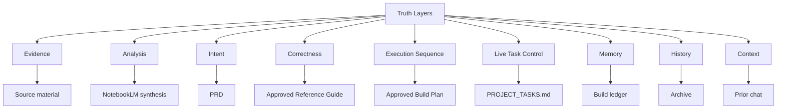

### Diagram 2

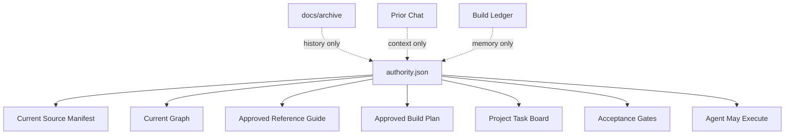

### Diagram 3

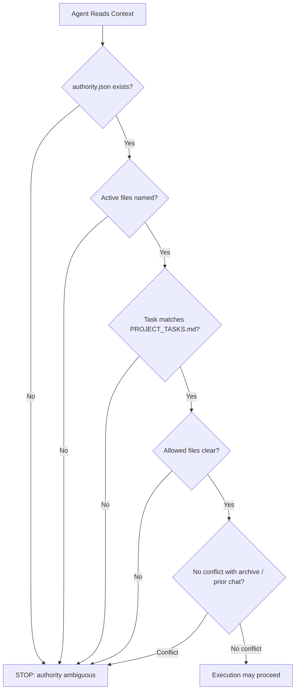

### Truth Layer Hierarchy

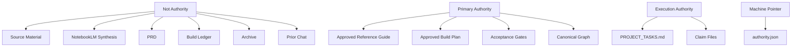

### Truth-Layer Collapse

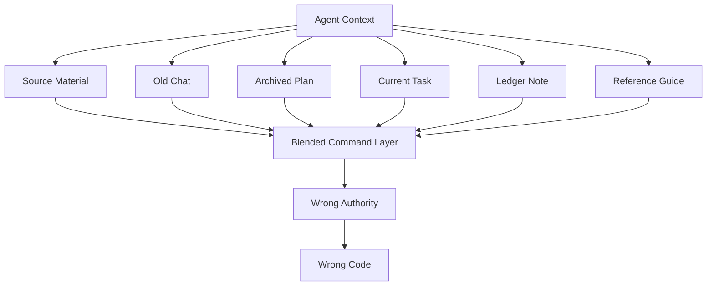

### Authority Rules

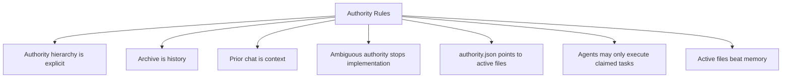

### authority.json

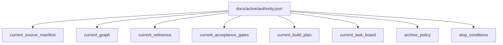

### Active vs Archive

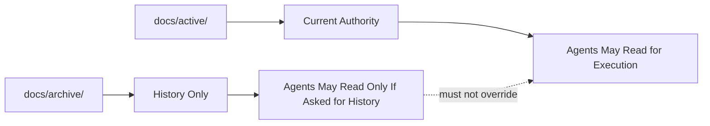

### Authority Ambiguity Stop Rule

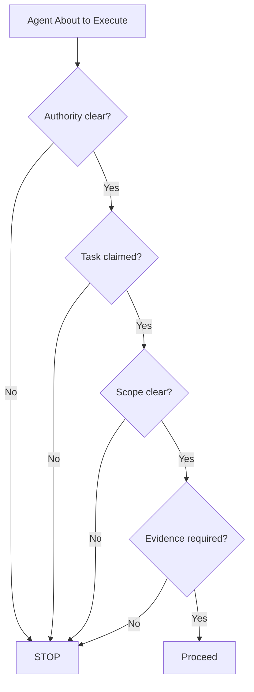

### Primary Hero Lenses

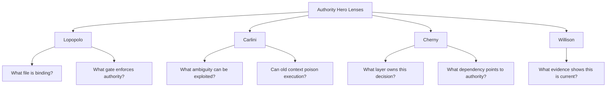

### Gate A1 — Authority Declared

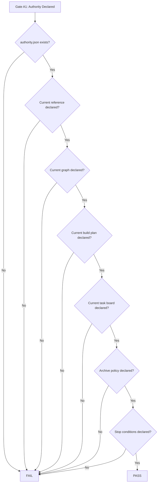

### One-Line Doctrine

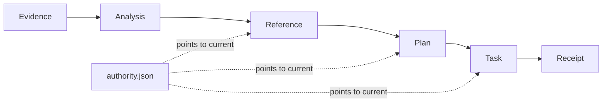

## Chapter 20 — The Authority Capsule

### Diagram 1

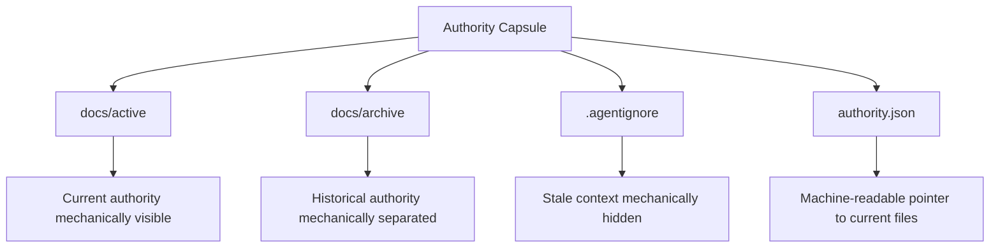

### Diagram 2

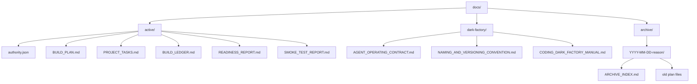

### Diagram 3

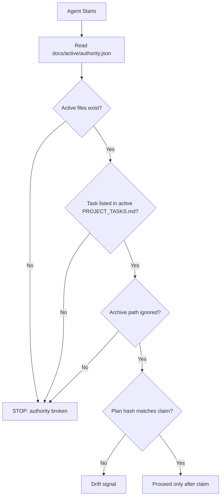

### Diagram 4

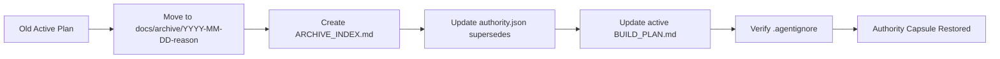

### Required Directory Structure

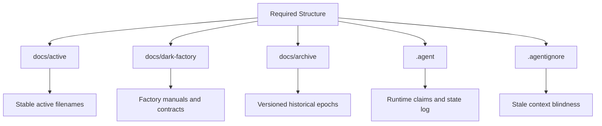

### authority.json

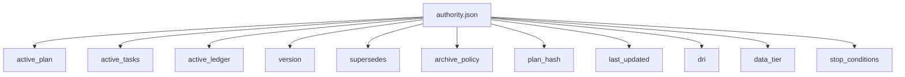

### .agentignore

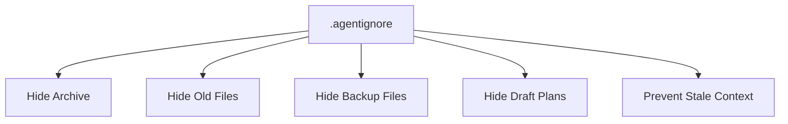

### Key Principles

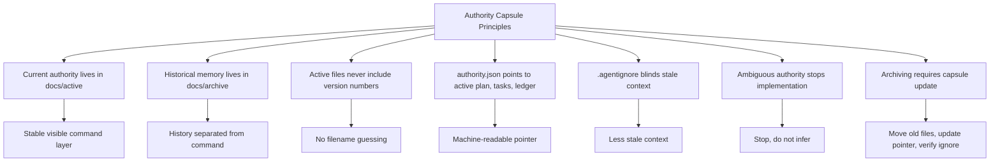

### Gate A2 — Authority Capsule Valid

```mermaid
flowchart TD
    A[Gate A2: Authority Capsule Valid] --> B{docs/active exists?}
    B -->|No| X[FAIL]
    B -->|Yes| C{authority.json exists?}
    C -->|No| X
    C -->|Yes| D{Active plan path resolves?}
    D -->|No| X
    D -->|Yes| E{Active task board path resolves?}
    E -->|No| X
    E -->|Yes| F{Active ledger path resolves?}
    F -->|No| X
    F -->|Yes| G{Archive policy declared?}
    G -->|No| X
    G -->|Yes| H{.agentignore shields archive?}
    H -->|No| X
    H -->|Yes| I[PASS]
```

### Primary Hero Lenses

```mermaid
flowchart TD
    A[Authority Capsule Hero Lenses] --> L[Lopopolo]
    A --> N[Carlini]
    A --> H[Hashimoto]
    A --> W[Willison]
    L --> L1[What machine-readable pointer enforces authority?]
    N --> N1[Can stale context poison execution?]
    H --> H1[Is the filesystem convention simple and usable?]
    W --> W1[What evidence shows the active files are current?]
```

### One-Line Doctrine

```mermaid
flowchart LR
    A[Stable Active Names] --> B[authority.json]
    B --> C[Claimed Task]
    C --> D[Allowed Execution]
```

## Chapter 21 — Claims, Collision Control, and Agent State

### Diagram 1

```mermaid
flowchart TD
    A[PROJECT_TASKS.md] --> B[Shows the Work]
    C[Claim Files] --> D[Lock the Work]
    E[.agent/state.log] --> F[Records the Work]
    B --> G[Human sees status]
    D --> H[Agents avoid collision]
    F --> I[Runtime history is auditable]
```

### Diagram 2

```mermaid
flowchart TD
    A[.agent/] --> B[claims/]
    A --> C[state.log]
    B --> B1[P2-storage-manager.codex-1.json]
    B --> B2[P2-router-interface.codex-2.json]
    B --> B3[task-id.agent-id.json]
    C --> C1[task movements]
    C --> C2[claim events]
    C --> C3[blocked / failed / done events]
```

### Diagram 3

```mermaid
flowchart TD
    A[Agent Wants Task] --> B[Read docs/active/PROJECT_TASKS.md]
    B --> C{Task TODO?}
    C -->|No| D[Skip]
    C -->|Yes| E[Create claim file]
    E --> F[Update task board to IN_PROGRESS]
    F --> G[Record state.log event]
    G --> H[Execute allowed scope]
    H --> I{Touches forbidden file?}
    I -->|Yes| J[Drift event + pause]
    I -->|No| K[Continue]
```

### Diagram 4

```mermaid
flowchart TD
    A[Claim State Check] --> B{Claim file exists?}
    B -->|No| X[STOP]
    B -->|Yes| C{Task board says IN_PROGRESS?}
    C -->|No| X
    C -->|Yes| D{Agent IDs match?}
    D -->|No| X
    D -->|Yes| E{Plan hash matches authority.json?}
    E -->|No| F[Drift signal]
    E -->|Yes| G{Allowed / forbidden files declared?}
    G -->|No| X
    G -->|Yes| H[Claim valid]
```

### Required Runtime Structure

```mermaid
flowchart TD
    A[Required Runtime Structure] --> B[.agent/claims]
    A --> C[.agent/state.log]
    B --> D[Claim files named by task-id and agent-id]
    C --> E[Chronological movement log]
```

### Claim File Schema

```mermaid
flowchart TD
    A[Claim File] --> B[task_id]
    A --> C[agent_id]
    A --> D[claimed_at]
    A --> E[active_plan_hash]
    A --> F[allowed_files]
    A --> G[forbidden_files]
    A --> H[status]
```

### Claim Rules

```mermaid
flowchart TD
    A[Claim Rules] --> R1[No claim, no code]
    A --> R2[Claims do not replace task board]
    A --> R3[Claims prevent task collision]
    A --> R4[Claims declare allowed and forbidden files]
    A --> R5[Claim state must match task board state]
    A --> R6[state.log records movement]
    A --> R7[Plan hash mismatch is drift]
    R1 --> C1[Agent without claim must not touch implementation files]
    R2 --> C2[Both stay in sync]
    R3 --> C3[One task, one active owner]
    R4 --> C4[Scope enforcement]
    R5 --> C5[Mismatch pauses work]
    R6 --> C6[Audit trail]
    R7 --> C7[Pause and verify authority]
```

### state.log

```mermaid
flowchart TD
    A[.agent/state.log] --> B[Claim Created]
    A --> C[Task Started]
    A --> D[Task Blocked]
    A --> E[Task Failed]
    A --> F[Task Done]
    A --> G[Drift Pause]
    A --> H[Human Resume]
```

### Gate A3 — Claim Control Active

```mermaid
flowchart TD
    A[Gate A3: Claim Control Active] --> B{.agent/claims exists?}
    B -->|No| X[FAIL]
    B -->|Yes| C{.agent/state.log exists?}
    C -->|No| X
    C -->|Yes| D{Claim schema defined?}
    D -->|No| X
    D -->|Yes| E{Claims include plan hash?}
    E -->|No| X
    E -->|Yes| F{Claims include allowed / forbidden files?}
    F -->|No| X
    F -->|Yes| G{Task board sync required?}
    G -->|No| X
    G -->|Yes| H[PASS]
```

### Primary Hero Lenses

```mermaid
flowchart TD
    A[Claim Control Hero Lenses] --> L[Lopopolo]
    A --> C[Cherny]
    A --> W[Willison]
    A --> N[Carlini]
    L --> L1[What lock prevents collision?]
    C --> C1[What task boundary is being claimed?]
    W --> W1[What evidence proves state is real?]
    N --> N1[Can an agent exploit ambiguous ownership?]
```

### One-Line Doctrine

```mermaid
flowchart LR
    A[Task Board] --> B[Claim File]
    B --> C[Allowed Scope]
    C --> D[Execution]
    D --> E[State Log]
    E --> F[Receipt]
```

## Chapter 22 — Drift Pause Protocol

### Diagram 1

```mermaid
flowchart TD
    A[Drift Signal] --> B[Stop Implementation]
    B --> C[Verify Authority]
    C --> D[List Files Touched]
    D --> E[Classify Touched Files]
    E --> F[Record State Event]
    F --> G[Record Root Cause]
    G --> H[Human Review]
    H --> I{Resume?}
    I -->|No| J[Hold / Fix / Revert]
    I -->|Yes| K[Resume Under Active Authority]
```

### Diagram 2

```mermaid
flowchart TD
    A[Drift Signals] --> B[Old version names]
    A --> C[Old phase numbers]
    A --> D[Archived task files edited]
    A --> E[Archive treated as authority]
    A --> F[Implementation without claim]
    A --> G[Files outside allowed scope]
    A --> H[Previous plan referenced without verification]
    A --> I[DONE without evidence]
    A --> J[Claim / task board mismatch]
    A --> K[Plan hash mismatch]
```

### Diagram 3

```mermaid
flowchart TD
    A[Touched File] --> B{Correct under active plan?}
    B -->|Yes| C[KEEP]
    B -->|Probably, but needs validation| D[KEEP BUT VERIFY]
    B -->|Unclear| E[HOLD]
    B -->|Incorrect| F[FIX]
    B -->|Low risk, only revert if tests break| G[REVERT ONLY IF BROKEN]
    C --> H[Human Review Packet]
    D --> H
    E --> H
    F --> H
    G --> H
```

### Diagram 4

```mermaid
flowchart LR
    A[Drift] --> B[More Coding]
    B --> C[More Drift]
    D[Drift] --> E[Restore Authority]
    E --> F[Classify State]
    F --> G[Resume Safely]
```

### Drift Signals

```mermaid
flowchart TD
    A[Drift Signal] --> B[Stale Naming]
    A --> C[Wrong Phase Reference]
    A --> D[Archive Usage]
    A --> E[Claim Violation]
    A --> F[Scope Violation]
    A --> G[Evidence Violation]
    A --> H[State Mismatch]
    B --> B1[old version names in filenames]
    C --> C1[old phase numbers referenced]
    D --> D1[archive treated as authority]
    E --> E1[implementation without claim file]
    F --> F1[unexpected files touched]
    G --> G1[phase marked DONE without evidence]
    H --> H1[claim and task board out of sync]
```

### Drift Pause Protocol

```mermaid
flowchart TD
    A[1. Stop implementation] --> B[2. Verify authority.json]
    B --> C[3. Identify active BUILD_PLAN.md]
    C --> D[4. Identify active PROJECT_TASKS.md]
    D --> E[5. List files touched since checkpoint]
    E --> F[6. Classify each touched file]
    F --> G[7. Record event in .agent/state.log]
    G --> H[8. Record root cause in BUILD_LEDGER.md]
    H --> I[9. Human workflow owner reviews]
    I --> J[10. Resume only after approval]
```

### File Classification

```mermaid
flowchart TD
    A[File Classification] --> B[KEEP]
    A --> C[KEEP BUT VERIFY]
    A --> D[HOLD]
    A --> E[FIX]
    A --> F[REVERT ONLY IF BROKEN]
    B --> B1[Correct under active plan]
    C --> C1[Likely correct, verify against active spec]
    D --> D1[May be correct, needs human review]
    E --> E1[Incorrect relative to active plan]
    F --> F1[Low risk, defer revert unless tests break]
```

### Drift Event Record

```mermaid
flowchart TD
    A[Drift Event] --> B[state.log]
    A --> C[BUILD_LEDGER.md]
    A --> D[Human Review Packet]
    B --> B1[Timestamped runtime event]
    C --> C1[Root cause and decision]
    D --> D1[Touched files and classification]
```

### Resume Conditions

```mermaid
flowchart TD
    A[Resume?] --> B{authority.json verified?}
    B -->|No| X[Do not resume]
    B -->|Yes| C{Task board and claim sync restored?}
    C -->|No| X
    C -->|Yes| D{Touched files classified?}
    D -->|No| X
    D -->|Yes| E{Human reviewed HOLD / FIX items?}
    E -->|No| X
    E -->|Yes| F{Repair tasks created if needed?}
    F -->|No| X
    F -->|Yes| G[Resume]
```

### Primary Hero Lenses

```mermaid
flowchart TD
    A[Drift Pause Hero Lenses] --> N[Carlini]
    A --> L[Lopopolo]
    A --> J[Carmack]
    A --> W[Willison]
    N --> N1[Drift is a threat event]
    L --> L1[Stop and restore constraints]
    J --> J1[Verify actual files and runtime state]
    W --> W1[Check evidence before trusting status]
```

### Gate A4 — Drift Resolved

```mermaid
flowchart TD
    A[Gate A4: Drift Resolved] --> B{Implementation stopped?}
    B -->|No| X[FAIL]
    B -->|Yes| C{Authority verified?}
    C -->|No| X
    C -->|Yes| D{Touched files listed?}
    D -->|No| X
    D -->|Yes| E{Touched files classified?}
    E -->|No| X
    E -->|Yes| F{state.log updated?}
    F -->|No| X
    F -->|Yes| G{BUILD_LEDGER.md updated?}
    G -->|No| X
    G -->|Yes| H{Human reviewed classification?}
    H -->|No| X
    H -->|Yes| I[PASS: Resume allowed]
```

### One-Line Doctrine

```mermaid
flowchart LR
    A[Drift Signal] --> B[Stop]
    B --> C[Verify Authority]
    C --> D[Classify State]
    D --> E[Human Review]
    E --> F[Resume]
```

## Chapter 23 — Auto-Approve Mode

### Diagram 1

```mermaid
flowchart TD
    A[Auto-Approve Mode] --> B[Not a Shortcut]
    A --> C[Reward for Completed Workflow]
    A --> D[Bounded Autonomy]
    A --> E[Task-by-Task Execution]
    A --> F[Mandatory Pause Triggers]
    B --> B1[Does not skip reference, plan, review, or authority]
    C --> C1[Enabled only after gates pass]
    D --> D1[Agent operates inside declared plan]
    E --> E1[Claim → execute → validate → DONE → next task]
    F --> F1[Failures, blockers, pivots, scope changes stop autonomy]
```

### Diagram 2

```mermaid
flowchart TD
    A[Human Declares Auto-Approve Mode] --> B{Prerequisite Gates Passed?}
    B -->|No| X[Do Not Enable]
    B -->|Yes| C{Sandbox Confirmed?}
    C -->|No| X
    C -->|Yes| D{Eval Set Defined Per Phase?}
    D -->|No| X
    D -->|Yes| E[Agent Reads authority.json]
    E --> F[Agent Reads PROJECT_TASKS.md]
    F --> G[Claim Next TODO Task]
    G --> H[Execute Within Allowed Scope]
    H --> I[Run Eval + Unit Tests + Validation]
    I --> J{Pass?}
    J -->|No| K[Pause: FAILED / BLOCKED]
    J -->|Yes| L[Mark DONE + Evidence]
    L --> M{More TODO Tasks?}
    M -->|Yes| G
    M -->|No| N[Auto-Approve Complete]
```

### Diagram 3

```mermaid
flowchart TD
    A[Auto-Approve Execution] --> B{Pause Trigger?}
    B -->|Eval failure| C[Pause]
    B -->|Unit test failure| C
    B -->|Validation failure| C
    B -->|BLOCKED task| C
    B -->|FAILED task| C
    B -->|Spec pivot required| C
    B -->|Outside plan scope| C
    B -->|Forbidden file touched| C
    B -->|Production data / credentials / live service action| C
    B -->|Authority drift| C
    B -->|No| D[Continue]
    C --> E[Human Intervention Required]
```

### Diagram 4

```mermaid
flowchart TD
    A[Gate A5: Auto-Approve Safe to Enable] --> B{Reference gates passed?}
    B -->|No| X[FAIL]
    B -->|Yes| C{Planning gates passed?}
    C -->|No| X
    C -->|Yes| D{Review gates passed?}
    D -->|No| X
    D -->|Yes| E{Authority capsule valid?}
    E -->|No| X
    E -->|Yes| F{Claim control active?}
    F -->|No| X
    F -->|Yes| G{Sandbox confirmed?}
    G -->|No| X
    G -->|Yes| H{Eval set defined per phase?}
    H -->|No| X
    H -->|Yes| I{Human declaration recorded?}
    I -->|No| X
    I -->|Yes| J[PASS]
```

### What Auto-Approve Mode Is

```mermaid
flowchart TD
    A[Auto-Approve Mode Is] --> B[Bounded autonomy]
    A --> C[Task-board driven execution]
    A --> D[Claim-controlled workflow]
    A --> E[Evidence-required completion]
    A --> F[Sandboxed acceleration]
    A2[Auto-Approve Mode Is Not] --> G[Shortcut around review]
    A2 --> H[Permission to pivot]
    A2 --> I[Permission to touch production]
    A2 --> J[Permission to ignore tests]
    A2 --> K[Permission to edit authority files]
```

### Conditions to Enable

```mermaid
flowchart TD
    A[Conditions to Enable] --> B[Prerequisite Gates]
    A --> C[Sandbox]
    A --> D[Eval Set]
    A --> E[Authority Capsule]
    A --> F[Claim Control]
    A --> G[Human Written Declaration]
    B --> B1[Reference, planning, review, authority gates passed]
    C --> C1[No production blast radius]
    D --> D1[Per-phase validation exists]
    E --> E1[authority.json current]
    F --> F1[Claim files + state log active]
    G --> G1[Human explicitly enables mode]
```

### Agent Behavior

```mermaid
flowchart TD
    A[Agent Behavior] --> B[Claim Task]
    B --> C[Execute]
    C --> D[Run Eval]
    D --> E[Run Unit Tests]
    E --> F[Run Validation]
    F --> G{All Pass?}
    G -->|Yes| H[Mark DONE]
    H --> I[Record Evidence]
    I --> J[Claim Next Task]
    G -->|No| K[Mark FAILED or BLOCKED]
    K --> L[Pause for Human]
```

### Mandatory Pause Triggers

```mermaid
flowchart TD
    A[Mandatory Pause Triggers] --> B[Eval / test / validation failure]
    A --> C[BLOCKED task]
    A --> D[FAILED task]
    A --> E[Spec change required]
    A --> F[Outside build plan scope]
    A --> G[Forbidden file touched]
    A --> H[Production data / credentials / live services]
    A --> I[Authority drift]
    A --> J[Claim mismatch]
    A --> K[Security concern]
```

### Appropriate Use

```mermaid
flowchart TD
    A[Use Auto-Approve Mode For] --> B[Personal projects]
    A --> C[Solo greenfield builds]
    A --> D[Sandboxed experiments]
    A --> E[Disposable local-first prototypes]
    A --> F[Well-scoped repair passes]
    G[Do Not Use For] --> H[Live production systems]
    G --> I[Enterprise codebases]
    G --> J[Shared ownership systems]
    G --> K[Customer-facing deployments]
    G --> L[Regulatory scope]
    G --> M[Secrets / live credentials / sensitive data]
```

### Phase Promotion Rule

```mermaid
flowchart TD
    A[Phase Tasks Complete] --> B{Phase Gate Passed?}
    B -->|No| C[Pause]
    B -->|Yes| D{Phase Promotion Allowed by Declaration?}
    D -->|No| E[Ask Human]
    D -->|Yes| F{Next Phase Inside Auto-Approve Scope?}
    F -->|No| E
    F -->|Yes| G[Continue to Next Phase]
```

### Auto-Approve Runtime Receipt

```mermaid
flowchart TD
    A[Auto-Approve Session] --> B[Tasks Claimed]
    A --> C[Tasks Completed]
    A --> D[Commands Run]
    A --> E[Evidence Produced]
    A --> F[Failures / Blocks]
    A --> G[Pause Triggers]
    A --> H[Final Status]
    B --> I[AUTO_APPROVE_RECEIPT.md]
    C --> I
    D --> I
    E --> I
    F --> I
    G --> I
    H --> I
```

### Required Outputs

```mermaid
flowchart LR
    A[Auto-Approve Mode] --> B[AUTO_APPROVE_DECLARATION.md]
    A --> C[AUTO_APPROVE_RECEIPT.md]
    A --> D[Updated PROJECT_TASKS.md]
    A --> E[Updated .agent/state.log]
    A --> F[Updated BUILD_LEDGER.md]
```

### Primary Hero Lenses

```mermaid
flowchart TD
    A[Auto-Approve Hero Lenses] --> L[Lopopolo]
    A --> N[Carlini]
    A --> H[Hashimoto]
    A --> J[Carmack]
    A --> W[Willison]
    L --> L1[What gates make autonomy safe?]
    N --> N1[What pause trigger prevents unsafe action?]
    H --> H1[Is autonomous flow operable?]
    J --> J1[What runtime proof exists?]
    W --> W1[What evidence shows the task really passed?]
```

### Gate A5 — Auto-Approve Safe to Enable

```mermaid
flowchart TD
    A[Gate A5: Auto-Approve Safe to Enable] --> B{Reference guide complete?}
    B -->|No| X[FAIL]
    B -->|Yes| C{Build plan and task board approved?}
    C -->|No| X
    C -->|Yes| D{Zero unresolved critical risks?}
    D -->|No| X
    D -->|Yes| E{Authority capsule valid?}
    E -->|No| X
    E -->|Yes| F{Claim control active?}
    F -->|No| X
    F -->|Yes| G{Sandbox confirmed?}
    G -->|No| X
    G -->|Yes| H{Eval set defined per phase?}
    H -->|No| X
    H -->|Yes| I{Human declaration written?}
    I -->|No| X
    I -->|Yes| J[PASS]
```

### One-Line Doctrine

```mermaid
flowchart LR
    A[Workflow Complete] --> B[Authority Declared]
    B --> C[Claims Active]
    C --> D[Sandbox Confirmed]
    D --> E[Human Enables]
    E --> F[Bounded Autonomy]
```

## Chapter 23a — Graph Delta Classification

```mermaid
flowchart TD
    A[Implementation Changed the Graph] --> B{Delta Type?}
    B -->|New leaf node, no boundary crossed| C[Auto-Approved]
    B -->|New edge between existing nodes, same trust zone| C
    B -->|Renamed node, no structural change| C
    B -->|New or removed Trust Boundary| D[Pause for Approval]
    B -->|Edge crosses a Trust Boundary| D
    B -->|Change touches Authority Capsule, authority.json, or graph hash binding| D
    B -->|Change to Model Output Contract or IR Schema| D
    B -->|Removal of a node or edge with dependents| D
    C --> E[Update architecture.mmd + recompute graph hash]
    E --> F[Update authority.json graph_hash]
    F --> G[Record delta in receipt: approved]
    D --> H[Record delta in receipt: blocked]
    H --> I[Surface GRAPH_DELTA_CANDIDATES.md entry]
    I --> J[Human reviews and approves or rejects]
```

## Chapter 24 — Workflow Map

### Diagram 1

```mermaid
flowchart TD
    S0[Stage 0<br/>Objective, Archetype, Authority] --> S1[Stage 1<br/>Reference Guide Build]
    S1 --> S2[Stage 2<br/>Build Plan and Indexed Task Board]
    S2 --> S3[Stage 3<br/>Multi-Model Adversarial Review]
    S3 --> S4[Stage 4<br/>Execution Readiness]
    S4 --> S5[Stage 5<br/>Implementation]
    S5 --> S6[Stage 6<br/>Verification and Validation]
    S6 --> S65[Stage 6.5<br/>Live UI / Browser Smoke]
    S65 --> S7[Stage 7<br/>Stabilization and Runbook]
    S7 --> S8[Stage 8<br/>Retrospective Learning Capture]
    S8 --> L[Updated Workflow / Reference Guide]
```

### Diagram 2

```mermaid
flowchart LR
    A[Objective] --> B[Archetype Declaration]
    B --> C[Usage Mode Declaration]
    C --> D[Determinism Map]
    D --> E[Authority Declaration]
    E --> F[Source Synthesis]
    F --> G[Reference Guide]
    G --> H[Build Plan]
    H --> I[PROJECT_TASKS.md]
    I --> J[Risk Register]
    J --> K[Readiness Report]
    K --> L[Working System]
    L --> M[Learning Cards]
    M --> N[Validation Report]
    N --> O[Smoke Script + Smoke Report]
    O --> P[Runbook]
    P --> Q[OWNER_MANUAL.md]
    Q --> R[RETRO_BUILD_PLAN.md]
    R --> S[Lessons Index Update]
    S --> T[Updated Workflow / Reference Guide]
```

### Diagram 3

```mermaid
flowchart TD
    A[Missing Artifact] --> B{Required for current stage?}
    B -->|No| C[Continue]
    B -->|Yes| D[Gate Failure]
    D --> E[Stop]
    E --> F[Create / repair artifact]
    F --> G[Re-run gate]
```

### Stages

```mermaid
flowchart TD
    A[0–8 Workflow] --> S0[0 — Objective, Archetype, Authority]
    A --> S1[1 — Reference Guide Build]
    A --> S2[2 — Build Plan and Indexed Task Board]
    A --> S3[3 — Multi-Model Adversarial Review]
    A --> S4[4 — Execution Readiness]
    A --> S5[5 — Implementation]
    A --> S6[6 — Verification and Validation]
    A --> S65[6.5 — Live UI / Browser Smoke]
    A --> S7[7 — Stabilization and Runbook]
    A --> S8[8 — Retrospective Learning Capture]
```

### Artifact Chain

```mermaid
flowchart TD
    A[Stage 0] --> A1[Objective]
    A --> A2[ARCHETYPE_DECLARATION.md]
    A --> A3[USAGE_MODE.md]
    A --> A4[DETERMINISM_MAP.md]
    A --> A5[AUTHORITY_DECLARATION.md]
    B[Stage 1] --> B1[SOURCE_SYNTHESIS.md]
    B --> B2[SOURCE_INDEX.md]
    B --> B3[NOTEBOOKLM_QA_LOG.md]
    B --> B4[REFERENCE_GUIDE_DRAFT.md]
    B --> B5[APPROVED_REFERENCE_GUIDE.md]
    C[Stage 2] --> C1[BUILD_PLAN.md]
    C --> C2[PROJECT_TASKS.md]
    C --> C3[PHASE_GATE_TABLE.md]
    C --> C4[DEPENDENCY_MAP.md]
    D[Stage 3] --> D1[MODEL_REVIEW_LOGS/]
    D --> D2[MERGED_RISK_REGISTER.md]
    D --> D3[PLAN_PATCHES.md]
    D --> D4[APPROVED_BUILD_PLAN.md]
    E[Stage 4] --> E1[READINESS_REPORT.md]
    E --> E2[AUTHORITY_CHECK.md]
    E --> E3[ARCHIVE_HYGIENE_CHECK.md]
    F[Stage 5] --> F1[Working System]
    F --> F2[Learning Cards]
    F --> F3[Updated PROJECT_TASKS.md]
```

### Gate Family Naming

```mermaid
flowchart TD
    A[Gate Families] --> R[Reference Gates]
    A --> P[Planning Gates]
    A --> V[Verification / Review Gates]
    A --> A1[Authority Gates]
    A --> S[Stage Gates]
    A --> E[Execution Gates]
    A --> L[Learning Gates]
    S --> S0[Gate S0]
    S --> S1[Gate S1]
    S --> S2[Gate S2]
    S --> S3[Gate S3]
    S --> S4[Gate S4]
    S --> S5[Gate S5]
```

## Chapter 25 — Stage 0: Objective, Archetype, Authority

### Diagram 1

```mermaid
flowchart TD
    A[Stage 0] --> B[Objective]
    A --> C[Archetype Declaration]
    A --> D[Usage Mode Declaration]
    A --> E[Determinism Map]
    A --> F[Trust Boundary Sketch]
    A --> G[Authority Declaration]
    B --> H[Success criteria]
    C --> I[Required gates and sections]
    D --> J[Gate weight and ownership semantics]
    E --> K[Deterministic vs probabilistic boundaries]
    F --> L[Sensitive data / privileged actions / untrusted inputs]
    G --> M[docs/active initialized]
```

### Diagram 2

```mermaid
flowchart TD
    A[Gate S0: Objective, Archetype, Authority] --> B{Success unambiguous?}
    B -->|No| X[FAIL]
    B -->|Yes| C{Archetype declared?}
    C -->|No| X
    C -->|Yes| D{Usage mode declared?}
    D -->|No| X
    D -->|Yes| E{Determinism map complete?}
    E -->|No| X
    E -->|Yes| F{Trust boundary sketched?}
    F -->|No| X
    F -->|Yes| G{Authority initialized?}
    G -->|No| X
    G -->|Yes| H[PASS]
```

### Required Outputs

```mermaid
flowchart LR
    A[Stage 0] --> B[Success Criteria]
    A --> C[Constraints]
    A --> D[Scope Boundary]
    A --> E[Target User / Operator]
    A --> F[Outcome Hypothesis]
    A --> G[Trust Boundary Sketch]
    A --> H[ARCHETYPE_DECLARATION.md]
    A --> I[USAGE_MODE.md]
    A --> J[DETERMINISM_MAP.md]
    A --> K[AUTHORITY_DECLARATION.md]
```

### Project Archetype Declaration

```mermaid
flowchart TD
    A[Project Archetype] --> B[Data Pipeline]
    A --> C[AI App]
    A --> D[Frontend / UI App]
    A --> E[Creative / Product System]
    A --> F[Native / Mobile App]
    A --> G[Infra / Operational]
    A --> H[Design System]
    A --> I[Content / Research Artifact]
    A --> J[Prototype / Throwaway]
    A --> K[Takeover / Fork]
    A --> L[Web3 / Protocol]
    K --> M[Proceed to Chapter 42 before Stage 1]
    J --> N[Objective + Throwaway Contract only]
```

### Determinism Map

```mermaid
flowchart TD
    A[Determinism Map] --> B[Deterministic Logic]
    A --> C[External Data]
    A --> D[LLM / Model Output]
    A --> E[Time / Randomness]
    A --> F[Browser / Local / Device State]
    A --> G[Persistence Layer]
    B --> B1[Pure functions, schema validation, calculations]
    C --> C1[APIs, RPC nodes, market feeds]
    D --> D1[AI-generated content requiring IR/schema guard]
    E --> E1[Timestamps, seeds, clocks]
    F --> F1[localStorage, sessionStorage, sensors]
    G --> G1[DB, BigQuery, filesystem, MERGE/idempotency]
```

### Usage Mode Declaration

```mermaid
flowchart TD
    A[Usage Mode] --> B[Solo Greenfield]
    A --> C[Enterprise Legacy]
    B --> B1[Single human orchestrator]
    B --> B2[Full 0–8 gates]
    B --> B3[Auto-Approve eligible]
    B --> B4[Prototype path available]
    C --> C1[Explicit named owners]
    C --> C2[CI-backed orchestration]
    C --> C3[Enterprise open questions required]
    C --> C4[Auto-Approve disabled for production]
```

### Gate S0 — Is Success Unambiguous?

```mermaid
flowchart TD
    A[Gate S0] --> B{Any engineer knows when done?}
    B -->|No| F[FAIL]
    B -->|Yes| C{Archetype declared?}
    C -->|No| F
    C -->|Yes| D{Determinism map complete?}
    D -->|No| F
    D -->|Yes| E{authority.json initialized in docs/active?}
    E -->|No| F
    E -->|Yes| G[PASS]
```

## Chapter 26 — Stage 1: Reference Guide Build

### Diagram 1

```mermaid
flowchart TD
    A[Stage 1] --> B[Source Synthesis]
    B --> C[NotebookLM Interrogation]
    C --> D[Nine-Question Reference Guide Loop]
    D --> E[Multi-Model Reference Hardening]
    E --> F[Human Approval]
    F --> G[APPROVED_REFERENCE_GUIDE.md]
```

### Diagram 2

```mermaid
flowchart LR
    A[Source Synthesis] --> B[SOURCE_SYNTHESIS.md]
    A --> C[SOURCE_INDEX.md]
    D[NotebookLM] --> E[NOTEBOOKLM_QA_LOG.md]
    F[Nine-Question Loop] --> G[REFERENCE_GUIDE_DRAFT.md]
    H[Hardening] --> I[REFERENCE_GUIDE_REVIEW_LOG.md]
    I --> J[Patches]
    J --> K[APPROVED_REFERENCE_GUIDE.md]
```

### Required Process

```mermaid
flowchart TD
    A[1. Source synthesis] --> B[SOURCE_SYNTHESIS.md + SOURCE_INDEX.md]
    B --> C[2. NotebookLM interrogation]
    C --> D[NOTEBOOKLM_QA_LOG.md]
    D --> E[3. Nine-question reference guide loop]
    E --> F[REFERENCE_GUIDE_DRAFT.md]
    F --> G[4. Multi-model hardening]
    G --> H[REFERENCE_GUIDE_REVIEW_LOG.md + patches]
    H --> I[5. Human approval]
    I --> J[docs/active/APPROVED_REFERENCE_GUIDE.md]
```

### Key Principles

```mermaid
flowchart TD
    A[Stage 1 Principles] --> P1[Source-grounded before model-generated]
    A --> P2[Iterative before final]
    A --> P3[Question-driven before code-driven]
    A --> P4[Multi-model hardened before approved]
    A --> P5[Implementation-readable before handed to agents]
    A --> P6[No guessing remains]
```

### Gate S1 — Can a Coding Agent Implement Without Guessing?

```mermaid
flowchart TD
    A[Gate S1] --> B{Schemas explicit?}
    B -->|No| X[FAIL]
    B -->|Yes| C{Constants and thresholds explicit?}
    C -->|No| X
    C -->|Yes| D{Calculations explicit?}
    D -->|No| X
    D -->|Yes| E{Edge cases and retries defined?}
    E -->|No| X
    E -->|Yes| F{Failure behavior defined?}
    F -->|No| X
    F -->|Yes| G{Trust boundaries defined?}
    G -->|No| X
    G -->|Yes| H{UX states defined?}
    H -->|No| X
    H -->|Yes| I[PASS]
```

## Chapter 27 — Stage 2: Build Plan and Indexed Task Board

### Diagram 1

```mermaid
flowchart TD
    A[APPROVED_REFERENCE_GUIDE.md] --> B[Plan Mode if needed]
    B --> C[BUILD_PLAN.md]
    C --> D[PHASE_GATE_TABLE.md]
    C --> E[DEPENDENCY_MAP.md]
    C --> F[PROJECT_TASKS.md]
    F --> G[Indexed Claimable Work]
```

### Diagram 2

```mermaid
flowchart LR
    A[Correctness] --> B[Phase]
    B --> C[Task]
    C --> D[Allowed Files]
    D --> E[Forbidden Files]
    E --> F[Evidence]
    F --> G[Gate]
```

### Required Outputs

```mermaid
flowchart LR
    A[Stage 2] --> B[BUILD_PLAN.md]
    A --> C[PROJECT_TASKS.md]
    A --> D[PHASE_GATE_TABLE.md]
    A --> E[DEPENDENCY_MAP.md]
```

### Gate S2 — Can the Agent Execute Without Design Decisions?

```mermaid
flowchart TD
    A[Gate S2] --> B{All phases defined?}
    B -->|No| X[FAIL]
    B -->|Yes| C{All tasks have commands and expected outputs?}
    C -->|No| X
    C -->|Yes| D{All dependencies enumerated?}
    D -->|No| X
    D -->|Yes| E{All exit gates measurable?}
    E -->|No| X
    E -->|Yes| F{PROJECT_TASKS.md generated?}
    F -->|No| X
    F -->|Yes| G{All tasks TODO with agent-id column?}
    G -->|No| X
    G -->|Yes| H[PASS]
```

## Chapter 28 — Stage 3: Multi-Model Adversarial Review

### Diagram 1

```mermaid
flowchart TD
    A[Build Plan Packet] --> B[Independent Reviews]
    B --> C[Merged Risk Register]
    C --> D[Plan Patches]
    D --> E{Zero unresolved critical risks?}
    E -->|No| F[Review Loop Continues]
    F --> B
    E -->|Yes| G[APPROVED_BUILD_PLAN.md]
```

### Diagram 2

```mermaid
flowchart LR
    A[Base Packet] --> B[Claude Review]
    A --> C[Gemini Review]
    A --> D[GPT Review]
    A --> E[Grok Review]
    A --> F[DeepSeek Review]
    A --> G[Meta-Style Review]
    B --> H[MODEL_REVIEW_LOGS/]
    C --> H
    D --> H
    E --> H
    F --> H
    G --> H
    H --> I[MERGED_RISK_REGISTER.md]
```

### Required Process

```mermaid
flowchart TD
    A[1. Claude independent review] --> B[2. Gemini independent review]
    B --> C[3. Additional independent reviews]
    C --> D[4. Merge risk logs]
    D --> E[5. Resolve critical items]
    E --> F[6. Update plan]
    F --> G[7. Re-review material changes]
    G --> H{Zero unresolved critical risks?}
    H -->|No| A
    H -->|Yes| I[Approved build plan]
```

### Required Outputs

```mermaid
flowchart LR
    A[Stage 3] --> B[MODEL_REVIEW_LOGS/]
    A --> C[MERGED_RISK_REGISTER.md]
    A --> D[PLAN_PATCHES.md]
    A --> E[APPROVED_BUILD_PLAN.md]
```

### Gate S3 — Zero Unresolved Critical Risks

```mermaid
flowchart TD
    A[Gate S3] --> B{Every risk registered?}
    B -->|No| X[FAIL]
    B -->|Yes| C{Every risk classified?}
    C -->|No| X
    C -->|Yes| D{Unresolved critical risks = 0?}
    D -->|No| X
    D -->|Yes| E{Accepted risks have rationale?}
    E -->|No| X
    E -->|Yes| F{Deferred risks have trigger condition?}
    F -->|No| X
    F -->|Yes| G{Material changes re-reviewed?}
    G -->|No| X
    G -->|Yes| H[PASS]
```

## Chapter 29 — Stage 4: Execution Readiness

### Diagram 1

```mermaid
flowchart TD
    A[Approved Plan] --> B[Environment Check]
    A --> C[Authority Check]
    A --> D[Archive Hygiene Check]
    A --> E[Claims Initialization]
    A --> F[Sandbox Confirmation]
    A --> G[Dry Run]
    A --> H[Determinism Check]
    B --> I[READINESS_REPORT.md]
    C --> J[AUTHORITY_CHECK.md]
    D --> K[ARCHIVE_HYGIENE_CHECK.md]
```

### Diagram 2

```mermaid
flowchart TD
    A[Stage 4] --> B{make doctor passes?}
    B -->|No| X[FAIL]
    B -->|Yes| C{Sandbox confirmed?}
    C -->|No| X
    C -->|Yes| D{Authority valid?}
    D -->|No| X
    D -->|Yes| E{Archive blinded?}
    E -->|No| X
    E -->|Yes| F{Claims initialized?}
    F -->|No| X
    F -->|Yes| G{Dry run clean?}
    G -->|No| X
    G -->|Yes| H{Determinism verified?}
    H -->|No| X
    H -->|Yes| I[PASS]
```

### Readiness Checklist

```mermaid
flowchart TD
    A[Readiness Checklist] --> B[Sandbox]
    A --> C[Security]
    A --> D[Infrastructure]
    A --> E[Auth]
    A --> F[Dependencies]
    A --> G[Runtime]
    A --> H[Doctor]
    A --> I[Observability]
    A --> J[UX Failure Messaging]
    A --> K[Dry Run]
    A --> L[Determinism]
    A --> M[Learning Templates]
    A --> N[Authority]
    A --> O[Archive Hygiene]
    A --> P[Claims]
```

### Required Outputs

```mermaid
flowchart LR
    A[Stage 4] --> B[READINESS_REPORT.md]
    A --> C[AUTHORITY_CHECK.md]
    A --> D[ARCHIVE_HYGIENE_CHECK.md]
```

### Archive Hygiene Gate

```mermaid
flowchart TD
    A[Archive Hygiene] --> B{docs/active exists?}
    B -->|No| X[FAIL]
    B -->|Yes| C{exactly one active plan?}
    C -->|No| X
    C -->|Yes| D{exactly one active task queue?}
    D -->|No| X
    D -->|Yes| E{archive ignored?}
    E -->|No| X
    E -->|Yes| F{supersedes lists prior archive epochs?}
    F -->|No| X
    F -->|Yes| G[PASS]
```

### Gate S4 — Execution Readiness

```mermaid
flowchart TD
    A[Gate S4] --> B{Sandbox confirmed?}
    B -->|No| X[FAIL]
    B -->|Yes| C{make doctor passes?}
    C -->|No| X
    C -->|Yes| D{Dependencies reachable?}
    D -->|No| X
    D -->|Yes| E{Dry run clean?}
    E -->|No| X
    E -->|Yes| F{Determinism verified?}
    F -->|No| X
    F -->|Yes| G{Learning template staged?}
    G -->|No| X
    G -->|Yes| H{Authority capsule valid?}
    H -->|No| X
    H -->|Yes| I{Archive blinded?}
    I -->|No| X
    I -->|Yes| J{Claims initialized?}
    J -->|No| X
    J -->|Yes| K[PASS]
```

## Chapter 30 — Stage 5: Implementation

### Diagram 1

```mermaid
flowchart TD
    A[Stage 5 Implementation] --> B[Claim Task]
    B --> C[Execute Bounded Scope]
    C --> D[Run Eval]
    D --> E[Run Unit Tests]
    E --> F[Run Validation]
    F --> G[Fill Learning Card]
    G --> H[Update PROJECT_TASKS.md]
    H --> I{More Tasks?}
    I -->|Yes| B
    I -->|No| J[Stage 5 Complete Candidate]
```

### Diagram 2

```mermaid
flowchart TD
    A[Failure] --> B[Stop]
    B --> C[Classify Root Cause]
    C --> D{Known Fix in Learning Log?}
    D -->|Yes| E[Apply Known Fix]
    D -->|No| F[Write One-Sentence Root Cause]
    E --> G[Minimum Change]
    F --> G
    G --> H[Retry]
    H --> I{Resolved?}
    I -->|Yes| J[Log Root Cause + Prevention]
    I -->|No| K{Spec Change Required?}
    K -->|Yes| L[PIVOT: Escalate]
    K -->|No| M[Continue Debugging Within Scope]
```

### Diagram 3

```mermaid
flowchart TD
    A[Before Phase DONE] --> B{Eval PASS?}
    B -->|No| X[Not Done]
    B -->|Yes| C{Unit tests PASS?}
    C -->|No| X
    C -->|Yes| D{Validation PASS?}
    D -->|No| X
    D -->|Yes| E{Spec drift gate clean?}
    E -->|No| X
    E -->|Yes| F{Learning card complete?}
    F -->|No| X
    F -->|Yes| G[Phase DONE]
```

### Agent Execution Rules

```mermaid
flowchart TD
    A[Agent Execution Rules] --> R1[No claim, no code]
    A --> R2[No task outside task board]
    A --> R3[No forbidden file touches]
    A --> R4[No silent design decisions]
    A --> R5[Eval before phase complete]
    A --> R6[Tests before phase complete]
    A --> R7[Validation before phase complete]
    A --> R8[Learning card per phase]
    A --> R9[Stop on spec conflict]
```

### Error Handling — Root Cause Automation [L]

```mermaid
flowchart TD
    A[Error] --> B[Stop]
    B --> C[Classify]
    C --> D[Check Learning Log]
    D --> E[Write One-Sentence Root Cause]
    E --> F[Apply Minimum Change]
    F --> G[Retry]
    G --> H{Resolved?}
    H -->|Yes| I[Log Root Cause]
    H -->|No| J{Spec Change Required?}
    J -->|Yes| K[PIVOT]
    J -->|No| L[Continue Within Scope]
```

### Spec Drift Gate

```mermaid
flowchart TD
    A[Phase Change] --> B{Changed semantics?}
    B -->|Yes| X[Not Done]
    B -->|No| C{Changed thresholds?}
    C -->|Yes| X
    C -->|No| D{Changed formulas?}
    D -->|Yes| X
    D -->|No| E{Changed state shape?}
    E -->|Yes| X
    E -->|No| F{Changed user workflow?}
    F -->|Yes| X
    F -->|No| G[Spec Drift Gate Clean]
    X --> H[Update reference guide + tests + version policy]
```

### Per-Phase Learning Card

```mermaid
flowchart TD
    A[Per-Phase Learning Card] --> B[Phase / Build]
    A --> C[Issue Encountered]
    A --> D[Root Cause]
    A --> E[Resolution]
    A --> F[Prevention]
    A --> G[Enforcement Target]
    A --> H[Remaining Risk]
```

### Per-Phase Eval, Unit Test, and Validation Sequence

```mermaid
flowchart LR
    A[Eval] --> B[Unit Tests]
    B --> C[Validation]
    C --> D[Learning Card]
    D --> E[Phase DONE]
```

### Gate S5 — Implementation Complete

```mermaid
flowchart TD
    A[Gate S5] --> B{System runs without runtime errors?}
    B -->|No| X[FAIL]
    B -->|Yes| C{Spec drift gate clean?}
    C -->|No| X
    C -->|Yes| D{Every phase learning card complete?}
    D -->|No| X
    D -->|Yes| E{Every phase eval passed?}
    E -->|No| X
    E -->|Yes| F{Every phase unit tests passed?}
    F -->|No| X
    F -->|Yes| G{Every phase validation passed?}
    G -->|No| X
    G -->|Yes| H{PROJECT_TASKS.md current and all tasks DONE?}
    H -->|No| X
    H -->|Yes| I[PASS]
```

### One-Line Doctrine

```mermaid
flowchart LR
    A[Claim] --> B[Implement]
    B --> C[Eval]
    C --> D[Test]
    D --> E[Validate]
    E --> F[Learn]
    F --> G[DONE]
```

## Chapter 31 — Stage 6: Verification and Validation

### Diagram 1

```mermaid
flowchart TD
    A[Stage 6 Verification and Validation] --> B[Correct]
    A --> C[Useful]
    A --> D[Secure]
    A --> E[Trustworthy]
    A --> F[Aligned with Active Authority]
    B --> B1[Data accuracy / determinism / recovery]
    C --> C1[Product outcome / operator outcome]
    D --> D1[Permissions / injection / exfiltration]
    E --> E1[Observability / alerts / evidence]
    F --> F1[No stale files / no spec drift]
```

### Diagram 2

```mermaid
flowchart TD
    A[Working System Candidate] --> B[Run Validation Domains]
    B --> C{All Thresholds Pass?}
    C -->|No| D[Investigate Failure]
    D --> E[Fix Minimum Cause]
    E --> F[Update Learning Card / Ledger]
    F --> B
    C -->|Yes| G[VALIDATION_REPORT.md]
    G --> H[Gate S6 Candidate]
```

### Diagram 3

```mermaid
flowchart TD
    A[Validation Domains] --> B[Data Accuracy]
    A --> C[Reliability]
    A --> D[Recovery]
    A --> E[Observability]
    A --> F[Retry]
    A --> G[Security]
    A --> H[Product Outcome]
    A --> I[Operator UX]
    A --> J[Spec Drift]
    A --> K[AI Output Contract]
    A --> L[Authority Correctness]
```

### Validation Domains

```mermaid
flowchart TD
    A[Validation] --> B[Measured Behavior]
    A --> C[Calculated Correctness]
    A --> D[Modeled / AI Output Boundaries]
    A --> E[Operational Trust]
    A --> F[Human Outcome]
    B --> B1[Runtime, recovery, alerts]
    C --> C1[Reconciliation, duplicates, thresholds]
    D --> D1[IR schema, compiler, injection tests]
    E --> E1[Authority, observability, security]
    F --> F1[Product outcome, operator UX]
```

### Required Outputs

```mermaid
flowchart LR
    A[Stage 6] --> B[VALIDATION_REPORT.md]
    A --> C[SECURITY_VALIDATION.md]
    A --> D[AUTHORITY_EXECUTION_CHECK.md]
    A --> E[OBSERVABILITY_CHECK.md]
    A --> F[PRODUCT_OUTCOME_CHECK.md]
```

### Gate S6 — Validation Passed Against Active Authority

```mermaid
flowchart TD
    A[Gate S6] --> B{Every eval passes?}
    B -->|No| X[FAIL]
    B -->|Yes| C{Data accuracy passes?}
    C -->|No| X
    C -->|Yes| D{Reliability and recovery pass?}
    D -->|No| X
    D -->|Yes| E{Observability and retry pass?}
    E -->|No| X
    E -->|Yes| F{Security checks pass?}
    F -->|No| X
    F -->|Yes| G{Product / operator outcome checked?}
    G -->|No| X
    G -->|Yes| H{Spec drift = zero undocumented deviations?}
    H -->|No| X
    H -->|Yes| I{Authority correctness clean?}
    I -->|No| X
    I -->|Yes| J[PASS]
```

### One-Line Doctrine

```mermaid
flowchart LR
    A[Running] --> B[Validated]
    B --> C[Trusted]
    C --> D[Promotable]
```

## Chapter 32 — Stage 6.5: Live UI / Browser Smoke

### Diagram 1

```mermaid
flowchart TD
    A[Stage 6.5 Live UI / Browser Smoke] --> B[Real App]
    A --> C[Real UI]
    A --> D[Real User Path]
    A --> E[Real Receipts]
    A --> F[Real Screenshots]
    A --> G[Post-Smoke Gates]
    B --> H[Not just unit tests]
    C --> H
    D --> H
    E --> H
    F --> H
    G --> H
```

### Diagram 2

```mermaid
flowchart TD
    A[Project Archetype] --> B{Human-facing UI?}
    B -->|Frontend / UI App| C[Stage 6.5 Required]
    B -->|Native / Mobile App| C
    B -->|AI / LLM App with interface| C
    B -->|Data Pipeline| D[May Skip]
    B -->|Infra / Operational| D
    B -->|Content Artifact| D
    B -->|Prototype / Throwaway| D
    D --> E[Record skip reason in PROJECT_TASKS.md]
```

### Diagram 3

```mermaid
flowchart TD
    A[Run Smoke Command] --> B[Start Screen Screenshot]
    B --> C[Complete Declared Minimum Flow]
    C --> D[In-Test Screenshot]
    D --> E[Export Receipt]
    E --> F[Export Success Screenshot]
    F --> G[Validate TXT + JSON]
    G --> H[Console Import]
    H --> I[Post-Smoke Commands]
    I --> J[SMOKE_TEST_REPORT.md]
```

### Required Outputs

```mermaid
flowchart LR
    A[Stage 6.5] --> B[Smoke Command]
    A --> C[SMOKE_TEST_REPORT.md]
    A --> D[Screenshots]
    A --> E[Receipt Files]
    A --> F[Console Import Result]
    A --> G[Post-Smoke Command Results]
```

### Verification Domains

```mermaid
flowchart TD
    A[Smoke Domains] --> B[Start Screen Presence]
    A --> C[Completion Rate]
    A --> D[Receipt Filename]
    A --> E[Receipt Metadata]
    A --> F[Banned-Term Scan]
    A --> G[Console Import]
    A --> H[Post-Smoke Gates]
```

### Gate S6.5 — Real App Smoke Passed

```mermaid
flowchart TD
    A[Gate S6.5] --> B{Stage 6.5 applicable?}
    B -->|No| C{Skip reason recorded?}
    C -->|No| X[FAIL]
    C -->|Yes| P[PASS: Skipped with reason]
    B -->|Yes| D{Completion threshold met?}
    D -->|No| X
    D -->|Yes| E{All completed exports valid?}
    E -->|No| X
    E -->|Yes| F{Banned-term scan clean?}
    F -->|No| X
    F -->|Yes| G{Console import succeeds or failure documented?}
    G -->|No| X
    G -->|Yes| H{Post-smoke commands pass?}
    H -->|No| X
    H -->|Yes| I{SMOKE_TEST_REPORT.md complete?}
    I -->|No| X
    I -->|Yes| J[PASS]
```

### One-Line Doctrine

```mermaid
flowchart LR
    A[Tests Pass] --> B[Browser Smoke]
    B --> C[Screenshots]
    C --> D[Receipts]
    D --> E[Import]
    E --> F[Post-Smoke Gates]
```

## Chapter 33 — Stage 7: Stabilization and Runbook

### Diagram 1

```mermaid
flowchart TD
    A[Stage 7 Stabilization] --> B[Burn-In]
    A --> C[Runbook]
    A --> D[Owner Manual]
    A --> E[Alert Verification]
    A --> F[Operational Independence]
    B --> G[N consecutive successful cycles]
    C --> H[Exact commands and playbooks]
    D --> I[Takeover-ready documentation]
    E --> J[Alerts tested]
    F --> K[System can run without builder]
```

### Diagram 2

```mermaid
flowchart TD
    A[Scheduled Cycle] --> B{Success?}
    B -->|Yes| C[Increment streak]
    C --> D{Streak = N?}
    D -->|No| A
    D -->|Yes| E[Burn-In Passed]
    B -->|No| F[Streak resets to zero]
    F --> G[Investigate]
    G --> H[Fix]
    H --> A
```

### Burn-In Rule

```mermaid
flowchart LR
    A[Successful Cycle 1] --> B[Successful Cycle 2]
    B --> C[...]
    C --> D[Successful Cycle N]
    D --> E[Burn-In Passed]
    F[Any Failure] --> G[Reset Streak to Zero]
```

### Runbook Required Sections

```mermaid
flowchart TD
    A[RUNBOOK.md] --> B[Startup Steps]
    A --> C[Daily Monitoring]
    A --> D[Alert Response]
    A --> E[Known Failure Modes]
    A --> F[Escalation Path]
    A --> G[Security Incidents]
    A --> H[Operator Confusion Cases]
    A --> I[Outcome Monitoring]
    A --> J[Shutdown / Backup / Restore]
```

### Required Outputs

```mermaid
flowchart LR
    A[Stage 7] --> B[RUNBOOK.md]
    A --> C[OWNER_MANUAL.md]
    A --> D[BURN_IN_REPORT.md]
    A --> E[ALERT_TEST_REPORT.md]
```

### Gate S7 — Stabilized and Operational

```mermaid
flowchart TD
    A[Gate S7] --> B{N consecutive scheduled runs passed?}
    B -->|No| X[FAIL]
    B -->|Yes| C{All alerts tested and confirmed?}
    C -->|No| X
    C -->|Yes| D{Runbook written?}
    D -->|No| X
    D -->|Yes| E{Runbook verified against actual behavior?}
    E -->|No| X
    E -->|Yes| F{Owner manual complete?}
    F -->|No| X
    F -->|Yes| G[PASS]
```

### One-Line Doctrine

```mermaid
flowchart LR
    A[Validated System] --> B[Burn-In]
    B --> C[Runbook]
    C --> D[Owner Manual]
    D --> E[Operational System]
```

## Chapter 34 — Stage 8: Retrospective Learning Capture

### Diagram 1

```mermaid
flowchart TD
    A[Stage 8 Retrospective Learning] --> B[Learning Cards]
    A --> C[Build Ledger]
    A --> D[Failures]
    A --> E[Surprises]
    A --> F[Successful Patterns]
    B --> G[Enforcement Classification]
    C --> G
    D --> G
    E --> G
    F --> G
    G --> H[Workflow Updates]
    G --> I[Reference Guide Updates]
    G --> J[Runbook Updates]
    G --> K[Lessons Index]
```

### Diagram 2

```mermaid
flowchart LR
    A[Runtime Surprise] --> B[Lesson]
    B --> C[Enforcement Target]
    C --> D[Test / Rule / Constraint / Accepted Risk]
    D --> E[Future Build Safer]
```

### Diagram 3

```mermaid
flowchart TD
    A[Lesson] --> B{Has enforcement target?}
    B -->|No| X[Gate Failure]
    B -->|Yes| C{Implemented or recorded?}
    C -->|No| X
    C -->|Yes| D[Learning Captured]
```

### Learning → Enforcement Classification

```mermaid
flowchart TD
    A[Lesson] --> B[Code Fix]
    A --> C[Unit Test]
    A --> D[Integration Test]
    A --> E[Lint / Type Rule]
    A --> F[Shared Constant / Schema]
    A --> G[Runbook Entry]
    A --> H[Reference Guide Update]
    A --> I[AGENTS.md Rule]
    A --> J[Accepted Risk]
```

### Lessons Index Update

```mermaid
flowchart TD
    A[Learning Cards] --> B[Promote Shareable Findings]
    B --> C[WORKFLOW_LESSONS_INDEX.md]
    C --> D[Indexed by Failure Mode]
    C --> E[Indexed by Archetype]
    C --> F[Indexed by Enforcement Target]
```

### Deliverable 1 — Owner’s Operator Manual

```mermaid
flowchart TD
    A[OWNER_MANUAL.md] --> B[System Overview]
    A --> C[Architecture Map]
    A --> D[One-Command Start]
    A --> E[Configuration Reference]
    A --> F[Known Failure Modes]
    A --> G[Escalation and Ownership]
```

### Deliverable 2 — Retrospective Learning Build Plan

```mermaid
flowchart TD
    A[RETRO_BUILD_PLAN.md] --> B[System Identity]
    A --> C[What We Would Do Differently]
    A --> D[Replication Phase Plan]
    A --> E[Environment Delta]
    A --> F[Estimated Phase Durations]
```

### Stage 8 Required Deliverables

```mermaid
flowchart LR
    A[Stage 8] --> B[OWNER_MANUAL.md]
    A --> C[RETRO_BUILD_PLAN.md]
    A --> D[WORKFLOW_LESSONS_INDEX.md]
    A --> E[Updated Reference Guide]
    A --> F[Updated Runbook]
    A --> G[Version Increment]
```

### Gate S8 — Learning Captured and Enforced

```mermaid
flowchart TD
    A[Gate S8] --> B{Every lesson has enforcement target?}
    B -->|No| X[FAIL]
    B -->|Yes| C{Reference guide updated where needed?}
    C -->|No| X
    C -->|Yes| D{Workflow / runbook updated where needed?}
    D -->|No| X
    D -->|Yes| E{Lessons Index updated?}
    E -->|No| X
    E -->|Yes| F{OWNER_MANUAL.md complete?}
    F -->|No| X
    F -->|Yes| G{RETRO_BUILD_PLAN.md complete?}
    G -->|No| X
    G -->|Yes| H{Version incremented?}
    H -->|No| X
    H -->|Yes| I[PASS]
```

### One-Line Doctrine

```mermaid
flowchart LR
    A[Experience] --> B[Lesson]
    B --> C[Enforcement]
    C --> D[Future Capability]
```

---

## Narrative

PART V — AUTHORITY AND TASK CONTROL

Chapter 19 — Truth Layers and Authority


Key Message

Agents must not collapse evidence, notes, plans, task lists, logs, and prior chat into one blended command.

Each artifact has a distinct role.

When roles are blurred, authority is lost.

The most dangerous agent failure is not ignorance. It is false authority: treating old notes, archived plans, previous chats, synthesis docs, or memory logs as if they were current instructions.

ACDF v7 solves this by making authority explicit, machine-readable, and narrow.

The authority hierarchy is declared.
The active files are named.
The archive is marked as history.
Prior chat is context, not command.
When authority is ambiguous, implementation stops.

⸻

Truth Layer Hierarchy


Layer	Role	Authority Level
Source material	Evidence and inputs	Not authority
NotebookLM synthesis	Analysis and Q&A	Not authority
PRD	Product intent	Intent, not implementation
Approved Reference Guide	Implementation correctness	Primary authority
Canonical Graph	Current system structure, boundaries, flows	Structural authority
Acceptance Gates	Proof requirements	Validation authority
Approved Build Plan	Execution sequence	Primary planning authority
PROJECT_TASKS.md	Live task control	Execution authority
Claim files	Task lock and agent ownership	Execution lock
Build ledger	Session memory	Memory, not command
Archive	History	History, not command
Prior chat	Context	Context, not authority
authority.json	Machine-readable active pointer	Authority pointer

The hierarchy prevents truth-layer collapse.

⸻

Truth-Layer Collapse


Truth-layer collapse happens when an agent treats all visible text as equal.

Examples:

An old build plan overrides the approved build plan.
A prior chat message overrides PROJECT_TASKS.md.
A NotebookLM synthesis becomes treated as implementation instruction.
A source transcript becomes treated as final authority.
An archived plan is used as the current plan.
A ledger memory becomes a new requirement.

The result is coherent but unauthorized implementation.

⸻

Authority Rules


Key principles:

1. Authority hierarchy is explicit, not inferred.
    Agents must not guess which artifact governs.
2. Archive is history.
    Agents must not treat archived plans as active.
3. Prior chat is context.
    It is not a build-plan update.
4. When authority is ambiguous, implementation stops.
    Ambiguity is a blocker, not an invitation to infer.
5. The authority.json file in docs/active/ is the machine-readable authority pointer.
    Agents read it before executing.
6. Execution requires a claimed task.
    The task board controls what may be done now.
7. Active files beat memory.
    If chat memory and active artifacts disagree, active artifacts win.

⸻

authority.json


Minimum authority.json:

{
  "version": "1.0",
  "updated_at": "YYYY-MM-DDTHH:MM:SSZ",
  "current_source_manifest": "docs/active/sources.manifest.json",
  "current_graph": "docs/active/architecture.mmd",
  "current_reference": "docs/active/APPROVED_REFERENCE_GUIDE.md",
  "current_acceptance_gates": "docs/active/acceptance_gates.md",
  "current_build_plan": "docs/active/APPROVED_BUILD_PLAN.md",
  "current_task_board": "PROJECT_TASKS.md",
  "archive_policy": {
    "archive_path": "docs/archive/",
    "archive_is_authority": false
  },
  "execution_policy": {
    "requires_task_claim": true,
    "requires_receipt": true,
    "requires_allowed_files": true
  },
  "stop_conditions": [
    "authority file missing",
    "active reference missing",
    "active build plan missing",
    "task not listed in PROJECT_TASKS.md",
    "task already claimed",
    "allowed files undefined",
    "forbidden files conflict",
    "archive conflicts with active authority"
  ]
}

This file is how agents know what is current.

It is the machine-readable authority pointer, not a suggestion.

⸻

Active vs Archive


Recommended structure:

docs/
  active/
    authority.json
    sources.manifest.json
    architecture.mmd
    APPROVED_REFERENCE_GUIDE.md
    acceptance_gates.md
    APPROVED_BUILD_PLAN.md
  archive/
    old_plans/
    old_reference_guides/
    old_reviews/
    old_chats/

Rules:

- docs/active contains current authority.
- docs/archive contains history.
- Archive files cannot override active files.
- Agents may not use archive files as active instructions.
- If archive and active disagree, active wins.

For stronger enforcement, add archive paths to .agentignore unless the task explicitly requires historical review.

⸻

Authority Ambiguity Stop Rule


Implementation must stop when:

authority.json is missing
authority.json points to missing files
approved reference guide is missing
approved build plan is missing
task is not listed in PROJECT_TASKS.md
task is not TODO or claimable
allowed files are undefined
forbidden files conflict with required work
archive contradicts active authority
prior chat contradicts active authority
proof requirement is missing

Stopping is not failure.
Stopping is authority hygiene.

⸻

Primary Hero Lenses


Primary Hero Lenses:

[L] Lopopolo + [N] Carlini + [C] Cherny

Lopopolo asks:

Which file is binding?
What gate prevents an agent from acting on stale or ambiguous context?

Carlini asks:

What ambiguity can be exploited?
Can old context, archived files, or untrusted text poison execution?

Cherny asks:

Which layer owns this decision?
What artifact should the agent obey?

Useful supporting lens:

[W] Willison

Willison asks what evidence proves the artifact is current.

⸻

Gate A1 — Authority Declared


Gate question:

Does the agent know which artifacts are binding?

PASS: docs/active/authority.json exists and points to the current source manifest, graph, reference guide, acceptance gates, build plan, and task board. Archive policy and stop conditions are declared.

FAIL: Do not allow implementation. Create or repair the authority pointer first.

⸻

One-Line Doctrine


Evidence is not authority.
Memory is not authority.
Archive is not authority.
Prior chat is not authority.
The active authority pointer decides what agents may obey.

When authority is ambiguous, implementation stops.
----
Chapter 20 — The Authority Capsule


Key Message

Agents do not decide what is current.

The filesystem decides.

The authority capsule is the structure that makes current authority mechanically visible and stale authority mechanically invisible.

A coding agent should not have to infer whether BUILD_PLAN_v2_FINAL_FINAL.md, a prior chat, an old task list, or a copied plan is the current source of truth. Active authority must have stable names. Historical files must move to archive. The machine-readable pointer must declare what is current.

In ACDF v7, authority is not a vibe, a memory, or a chat instruction.

Authority is a capsule:

docs/active/       current authority
docs/archive/      historical memory
authority.json     machine-readable pointer
.agentignore       stale-context shield
.agent/claims/     runtime execution locks

⸻

Required Directory Structure


Required structure:

docs/
  active/
    authority.json
    BUILD_PLAN.md
    PROJECT_TASKS.md
    BUILD_LEDGER.md
    READINESS_REPORT.md
    SMOKE_TEST_REPORT.md
  dark-factory/
    AGENT_OPERATING_CONTRACT.md
    NAMING_AND_VERSIONING_CONVENTION.md
    CODING_DARK_FACTORY_MANUAL.md
  archive/
    YYYY-MM-DD-<reason>/
      ARCHIVE_INDEX.md
      [old plan files]
.agent/
  claims/
  state.log
.agentignore

Stable active filenames are mandatory.

The active plan is always:

docs/active/BUILD_PLAN.md

The active task board is always:

docs/active/PROJECT_TASKS.md

The active ledger is always:

docs/active/BUILD_LEDGER.md

Version numbers live in authority.json, not in active filenames.

⸻

authority.json


Example:

{
  "active_plan": "docs/active/BUILD_PLAN.md",
  "active_tasks": "docs/active/PROJECT_TASKS.md",
  "active_ledger": "docs/active/BUILD_LEDGER.md",
  "active_readiness_report": "docs/active/READINESS_REPORT.md",
  "active_smoke_test_report": "docs/active/SMOKE_TEST_REPORT.md",
  "version": "3.0",
  "supersedes": [
    "2026-05-30-v1-2-v1-5-drift",
    "2026-05-30-v2-manual-loop-complete"
  ],
  "archive_policy": "retain",
  "plan_hash": "dev",
  "last_updated": "2026-06-01T00:00:00Z",
  "dri": "alan@example.com",
  "data_tier": 1,
  "execution_policy": {
    "requires_task_claim": true,
    "requires_allowed_files": true,
    "requires_forbidden_files": true,
    "requires_receipt": true
  },
  "stop_conditions": [
    "active plan missing",
    "active task board missing",
    "claim file missing",
    "plan hash mismatch",
    "task board and claim state disagree",
    "allowed files undefined",
    "forbidden files touched",
    "archive treated as authority"
  ]
}

Field notes:

Field	Meaning
active_plan	Stable path to the current active build plan.
active_tasks	Stable path to the current active task board.
active_ledger	Stable path to the current chronological build ledger.
version	Human-facing version metadata. Never appears in the active filename.
supersedes	Archive epochs this plan replaces. Resolves multi-archive ambiguity.
archive_policy	retain or delete. Use delete only in lightweight/disposable mode.
plan_hash	"dev" for disposable local work; real hash for serious implementation.
last_updated	Timestamp of the current authority declaration.
dri	Directly responsible individual.
data_tier	Sensitivity tier for routing and tool-use constraints.
execution_policy	Machine-readable requirements for agent execution.
stop_conditions	Conditions that force implementation to pause.

The supersedes field matters. When a second archive is created, append its folder name here. Never leave archives unlinked.

⸻

.agentignore


The .agentignore file hides stale context from agents that respect it.

Recommended contents:

docs/archive/**
*_OLD.*
*_BACKUP.*
*_DRAFT_v[0-9]*.*
task_list_*.md
build_plan_*.md
**/BUILD_PLAN_v*.md
**/PROJECT_TASKS_v*.md

.agentignore is not a substitute for authority. It is a stale-context shield.

The authority capsule still depends on docs/active/authority.json.

⸻

Key Principles


1. Current authority lives in docs/active/. Stable file names only.
2. Historical memory lives in docs/archive/.
3. Active files never include version numbers in their names.
4. authority.json points to the active plan, task board, ledger, and reports.
5. .agentignore blinds stale context.
6. If authority is ambiguous, implementation stops until the human resolves it.
7. Archiving a plan requires three actions:

1. Move old files to docs/archive/YYYY-MM-DD-<reason>/
2. Update authority.json
3. Verify .agentignore covers the archive path

⸻

Gate A2 — Authority Capsule Valid


Gate question:

Can an agent mechanically identify the current authority and ignore stale authority?

PASS: docs/active/ exists. authority.json exists. Active plan, task board, and ledger paths resolve. Archive policy is declared. .agentignore covers stale context.

FAIL: Stop implementation. Repair the authority capsule first.

⸻

Primary Hero Lenses


Primary Hero Lenses:

[L] Lopopolo + [N] Carlini + [H] Hashimoto

Lopopolo asks what artifact makes authority mechanically enforceable.
Carlini asks how stale context can poison execution.
Hashimoto asks whether the convention is simple enough to use repeatedly.
Willison asks what evidence proves the capsule is current.

⸻

One-Line Doctrine


Agents do not decide what is current.
The filesystem decides.

The authority capsule exists so the current command layer is visible, stable, and machine-readable.

⸻

Chapter 21 — Claims, Collision Control, and Agent State


Key Message

The task board shows the work.

Claim files lock the work.

Without claims, two agents can touch the same task simultaneously and produce irreconcilable state.

A task board alone is not enough when multiple agents or repeated agent sessions can operate on the same repository. The task board is the dashboard. The claim file is the lock. The state log is the audit trail.

In ACDF v7:

PROJECT_TASKS.md shows status.
.agent/claims/*.json locks task ownership.
.agent/state.log records movement.
Receipts prove completion.

⸻

Required Runtime Structure


Required structure:

.agent/
  claims/
    P2-storage-manager.codex-1.json
    P2-router-interface.codex-2.json
  state.log

Claim files are named:

<task-id>.<agent-id>.json

Examples:

P2-storage-manager.codex-1.json
P2-router-interface.codex-2.json
P4-receipt-ledger.codex-3.json

Namespacing by agent prevents two agents’ claims from colliding on the same filename and makes stale or duplicate claims immediately visible in a directory listing.

⸻

Claim File Schema


Example claim file:

{
  "task_id": "P2-storage-manager",
  "agent_id": "codex-1",
  "claimed_at": "2026-06-01T11:45:00Z",
  "active_plan_hash": "dev",
  "allowed_files": ["src/storage/**", "tests/storage/**"],
  "forbidden_files": [
    "docs/archive/**",
    "docs/active/BUILD_PLAN.md",
    "docs/active/PROJECT_TASKS.md",
    "src/router/**"
  ],
  "status": "IN_PROGRESS"
}

active_plan_hash records the plan the task was claimed under.

If authority.json advances to a new plan hash mid-task, the mismatch is a drift signal.

forbidden_files should always include:

docs/archive/**
docs/active/BUILD_PLAN.md
docs/active/PROJECT_TASKS.md
docs/active/authority.json

An implementation agent does not edit the authority capsule.

⸻

Claim Rules


1. No claim, no code.
    An agent without a claim file must not touch implementation files.
2. Claims do not replace the task board.
    Both must stay in sync.
3. Claims prevent two agents from touching the same task.
4. Claims declare allowed and forbidden files.
    Touching a forbidden file is a drift event.
5. Claim state must match task board state.
    Mismatch triggers a pause.
6. .agent/state.log records every task movement.
7. Plan hash mismatch is drift.
    If the active plan changed after the claim, stop and verify.

⸻

state.log


Example entries:

2026-06-01T11:45:00Z CLAIM_CREATED task=P2-storage-manager agent=codex-1 plan_hash=dev
2026-06-01T11:45:15Z TASK_IN_PROGRESS task=P2-storage-manager agent=codex-1
2026-06-01T12:02:44Z DRIFT_PAUSE task=P2-storage-manager reason=forbidden_file_touched file=docs/active/BUILD_PLAN.md
2026-06-01T12:18:20Z HUMAN_RESUME task=P2-storage-manager decision=keep-but-verify
2026-06-01T12:40:02Z TASK_DONE task=P2-storage-manager agent=codex-1 evidence=docs/receipts/P2-storage-manager.md

The state log is not a replacement for receipts. It is the runtime audit trail.

⸻

Gate A3 — Claim Control Active


Gate question:

Can agents claim work without colliding, drifting, or touching authority files?

PASS: .agent/claims/ exists. .agent/state.log exists. Claim schema includes task ID, agent ID, timestamp, plan hash, allowed files, forbidden files, and status. Task board synchronization is required.

FAIL: Do not run multiple agents. Repair claim control first.

⸻

Primary Hero Lenses


Primary Hero Lenses:

[L] Lopopolo + [C] Cherny + [W] Willison

Lopopolo asks what lock makes execution mechanically safe.
Cherny asks what boundary belongs to the task.
Willison asks what evidence proves the claimed state.
Carlini asks whether ambiguous ownership can create unsafe execution.

⸻

One-Line Doctrine


The task board shows the work.
The claim file locks the work.
The state log records the work.
The receipt proves the work.

No claim, no code.

⸻

Chapter 22 — Drift Pause Protocol


Key Message

Drift is not fixed by more coding.

Drift is fixed by restoring authority.

When an agent shows signs of operating against stale, incorrect, ambiguous, or unclaimed authority, the correct response is to stop and verify. Continuing to code only increases the blast radius.

Treat drift as an authority event, not an inconvenience.

Carlini treats drift as a threat event.
Lopopolo stops and restores constraints.
Carmack verifies touched files against actual system state.

⸻

Drift Signals


Drift signals include:

old version names in filenames
old phase numbers referenced
edits to archived task files
archive directory treated as authority
implementation without a claim file
unexpected files touched outside allowed scope
agent references "previous plan" without verification
phase marked DONE without evidence
claim file and task board state out of sync
active_plan_hash mismatch
authority.json points to missing files
task board status changed without state.log entry

Any one of these is enough to pause.

⸻

Drift Pause Protocol


Protocol:

1. Stop implementation immediately.
2. Verify authority.json points to correct active files.
3. Identify active BUILD_PLAN.md.
4. Identify active PROJECT_TASKS.md.
5. List all files touched since the last verified checkpoint.
6. Classify each touched file.
7. Record the event in .agent/state.log.
8. Record the root cause in BUILD_LEDGER.md.
9. Resume only after the human workflow owner reviews classification.

This protocol must run before any repair coding begins.

⸻

File Classification


Classification meanings:

Classification	Meaning	Action
KEEP	Correct under active plan.	Keep and record evidence.
KEEP BUT VERIFY	Correct output, but must be checked against active spec.	Validate before relying on it.
HOLD	May be correct, needs human review.	Do not build on it yet.
FIX	Incorrect relative to active plan.	Create repair task or patch.
REVERT ONLY IF BROKEN	Low risk, defer revert unless it breaks tests or gates.	Track but do not churn.

The classification prevents panic reverts and uncontrolled repair coding.

⸻

Drift Event Record


Record in .agent/state.log:

2026-06-01T13:12:04Z DRIFT_PAUSE agent=codex-2 task=P3-router-interface reason=forbidden_file_touched file=docs/archive/old-plan.md

Record in docs/active/BUILD_LEDGER.md:

## Drift Event — YYYY-MM-DD HH:MM
Agent:
Task:
Signal:
Root cause:
Authority verified:
Active plan:
Active task board:
Files touched:
Classification:
Human decision:
Resume condition:

The ledger entry makes the drift event part of project memory without turning it into future authority.

⸻

Resume Conditions


Resume only when:

authority.json is verified
active plan and task board are identified
claim state matches task board state
touched files are classified
HOLD and FIX items have human review
repair tasks are created where needed
state.log and BUILD_LEDGER.md are updated

Do not resume from memory. Resume from restored authority.

⸻

Primary Hero Lenses


Primary Hero Lenses:

[N] Carlini + [L] Lopopolo + [J] Carmack

Carlini treats drift as a threat event, not an inconvenience.
Lopopolo stops and restores constraints.
Carmack verifies touched files against actual system state.

Useful supporting lens:

[W] Willison

Willison asks what evidence proves the system is back under active authority.

⸻

Gate A4 — Drift Resolved


Gate question:

Has authority been restored before implementation resumes?

PASS: Implementation stopped. Authority was verified. Files touched since the last checkpoint were listed and classified. .agent/state.log and BUILD_LEDGER.md were updated. The human workflow owner reviewed the classification.

FAIL: Do not resume. Continue authority restoration.

⸻

One-Line Doctrine


Drift is not fixed by more coding.
Drift is fixed by restoring authority.

When the agent is no longer operating against the current truth layer, the safest move is to stop.
----
Chapter 23 — Auto-Approve Mode


Key Message

Auto-Approve Mode is not a shortcut through the workflow.

It is the reward for having completed the workflow properly.

Auto-Approve Mode allows the agent to proceed autonomously through tasks once the specification, plan, review, authority capsule, claim controls, sandbox, and evaluation gates are trusted.

It does not remove constraints.
It does not override authority.
It does not permit silent pivots.
It does not authorize production risk.
It does not allow the agent to decide what correct means.

It only removes repeated human approval between bounded tasks that already have clear scope, allowed files, forbidden files, expected outputs, and validation evidence.

⸻

What Auto-Approve Mode Is


Auto-Approve Mode is useful when the project has reached a point where the agent no longer needs human judgment between every task.

The agent follows this loop:

read authority.json
read PROJECT_TASKS.md
claim next TODO task
execute inside allowed files
avoid forbidden files
run required evals, unit tests, and validation
record evidence
mark DONE
claim next task

The agent continues until the task board is fully DONE or a pause trigger occurs.

⸻

Conditions to Enable


Condition	Requirement
Prerequisite gates	Reference gates passed. Planning gates passed. Review gates passed. Authority gates passed. Claim control active. Zero unresolved critical risks.
Sandbox	Sandbox confirmed. The agent can run without touching production data, credentials, live services, or customer-facing systems unless explicitly authorized in the reference guide.
Eval set	Eval, unit test, and validation commands are defined per phase. Expected outputs are known.
Authority capsule	docs/active/authority.json points to the active plan, task board, ledger, and required reports.
Task board	PROJECT_TASKS.md is current, all executable tasks have stable IDs, allowed files, forbidden files, gates, and evidence requirements.
Claims	.agent/claims/ and .agent/state.log are active. No claim, no code.
Human declaration	The human has explicitly declared Auto-Approve Mode in writing.

Example declaration:

AUTO-APPROVE MODE ENABLED
Scope:
- Phases:
- Task IDs:
- Allowed environment:
- Forbidden actions:
- Pause triggers:
- Human owner:
The agent may claim and complete tasks inside this scope without asking for approval between tasks.

⸻

Agent Behavior


Allowed behavior:

Claim task.
Execute within declared scope.
Run per-phase eval.
Run unit tests.
Run validation command.
Record files touched.
Record drift notes.
Record completion evidence.
Mark DONE.
Claim next TODO task.
Continue until all tasks are DONE or a pause trigger occurs.

No human approval is required between tasks within the approved scope.

The agent may not:

change the reference guide
change the approved build plan
change authority.json
edit docs/archive/**
touch forbidden files
change task scope
skip validation
invent new gates
silently pivot architecture
touch production data or live services unless explicitly authorized

⸻

Mandatory Pause Triggers


Mandatory pause triggers:

eval failure
unit test failure
validation failure
any BLOCKED task
any FAILED task
any task requiring a pivot or spec change
any action outside build plan scope
any forbidden file touched
any claim / task board mismatch
any active_plan_hash mismatch
any action touching production data
any action touching credentials
any action touching live services not explicitly listed in the reference guide
any prompt-injection, exfiltration, or privilege concern

Auto-Approve Mode does not override:

error-handling procedure
pivot escalation
drift pause protocol
claim protocol
authority capsule
trust boundaries
human ownership

If a pause trigger occurs, autonomy stops.

⸻

Appropriate Use


Appropriate for:

personal projects
solo greenfield builds
sandboxed experiments
local-first prototypes
well-scoped repair passes
test-only implementation loops

Not appropriate for:

live production systems
enterprise codebases
shared ownership systems
customer-facing deployments
regulatory scope
sensitive data systems
credentialed live-service operations
irreversible infrastructure changes

These require explicit human approval before phase promotion regardless of build plan completeness.

⸻

Phase Promotion Rule


Auto-Approve Mode may operate in two scopes:

Within-phase autonomy:
- Agent may complete tasks inside one phase.
- Human approval required before next phase.
Cross-phase autonomy:
- Agent may continue across phases.
- Only allowed when human declaration explicitly says so.

Default to within-phase autonomy.

Cross-phase autonomy should be reserved for low-risk sandboxed work with strong gates.

⸻

Auto-Approve Runtime Receipt


Auto-Approve sessions require a receipt.

Template:

# AUTO_APPROVE_RECEIPT.md
Mode:
- Auto-Approve Mode
Scope:
- Phases:
- Task IDs:
- Environment:
Human Declaration:
- Path or quote:
Tasks Claimed:
- Task ID / agent / timestamp
Tasks Completed:
- Task ID / evidence / timestamp
Commands Run:
- Eval:
- Unit tests:
- Validation:
Files Touched:
- Path:
- Classification:
Pause Triggers:
- None / list
Final Status:
- completed / paused / failed / blocked
Notes:
- Drift notes:
- Follow-up required:

Completion without a receipt is invalid.

⸻

Required Outputs


Required outputs:

AUTO_APPROVE_DECLARATION.md
AUTO_APPROVE_RECEIPT.md
Updated PROJECT_TASKS.md
Updated .agent/state.log
Updated docs/active/BUILD_LEDGER.md

Output	Purpose
AUTO_APPROVE_DECLARATION.md	Human-written permission, scope, environment, and pause triggers.
AUTO_APPROVE_RECEIPT.md	Session evidence, tasks completed, commands run, files touched, and final status.
Updated PROJECT_TASKS.md	Live task statuses and evidence.
Updated .agent/state.log	Runtime audit trail.
Updated BUILD_LEDGER.md	Human-readable build memory and session summary.

⸻

Primary Hero Lenses


Primary Hero Lenses:

[L] Lopopolo + [N] Carlini + [H] Hashimoto + [J] Carmack

Lopopolo asks what gates make autonomy safe.
Carlini asks what pause trigger prevents unsafe action.
Hashimoto asks whether the autonomous loop is practical and low-friction.
Carmack asks what runtime proof exists.
Willison asks what evidence shows the task really passed.

⸻

Gate A5 — Auto-Approve Safe to Enable


Gate question:

Is bounded autonomous execution safe inside the declared scope?

PASS: Reference guide is complete. Build plan and task board are approved. Zero unresolved critical risks remain. Authority capsule is valid. Claim control is active. Sandbox is confirmed. Eval set is defined per phase. Human declaration is written.

FAIL: Do not enable Auto-Approve Mode. Repair the missing prerequisite or keep human approval between tasks.

⸻

One-Line Doctrine


Auto-Approve Mode is not a shortcut.
It is bounded autonomy after authority, gates, claims, sandbox, and human declaration are in place.

Autonomy is safe only when the agent no longer has to guess.

⸻

Chapter 23a — Graph Delta Classification


An agent does not decide whether a graph delta is approved. It classifies the delta against this table and acts accordingly.

Auto-approved deltas (agent updates graph and authority hash directly):

- A new leaf node added with no trust boundary or authority-file dependency
- A new edge connecting two existing nodes within the same trust zone
- A node or edge rename that does not change connectivity or meaning

Deltas requiring human pause (agent stops, writes to GRAPH_DELTA_CANDIDATES.md, and surfaces the change — does not implement further):

- Any new or removed Trust Boundary node or edge
- Any edge that newly crosses an existing Trust Boundary
- Any change touching the Authority Capsule, authority.json, or the binding graph hash itself
- Any change to a Model Output Contract or IR Schema edge
- Removal of any node or edge that has downstream dependents in the current graph

If a delta does not clearly match an auto-approved pattern, it defaults to pause. The agent's receipt must record graph delta status as one of: none, approved, or blocked — partial or ambiguous classifications are not valid receipt values.

⸻
----
PART VI — THE 0–8 STAGE WORKFLOW

Chapter 24 — Workflow Map


Key Message

The Dark Factory workflow converts intent into implementation through a staged chain of artifacts.

Each stage exists to reduce a different class of failure:

Stage 0 reduces objective ambiguity.
Stage 1 reduces correctness ambiguity.
Stage 2 reduces planning ambiguity.
Stage 3 reduces hidden risk.
Stage 4 reduces environment and authority risk.
Stage 5 reduces execution drift.
Stage 6 reduces false completion.
Stage 6.5 reduces UI/browser illusion.
Stage 7 reduces operational fragility.
Stage 8 reduces repeated failure.

The workflow is not ceremony. It is a controlled path from fuzzy intent to verified system.

A missing artifact is a gate failure.

⸻

Stages


Stages:

0 — Objective, Archetype, Authority
1 — Reference Guide Build
2 — Build Plan and Indexed Task Board
3 — Multi-Model Adversarial Review
4 — Execution Readiness
5 — Implementation
6 — Verification and Validation
6.5 — Live UI / Browser Smoke
7 — Stabilization and Runbook
8 — Retrospective Learning Capture

⸻

Artifact Chain


Artifact chain:

Objective
→ Archetype Declaration
→ Usage Mode Declaration
→ Determinism Map
→ Authority Declaration
→ Source Synthesis
→ Reference Guide
→ Build Plan
→ PROJECT_TASKS.md
→ Risk Register
→ Readiness Report
→ Working System + Learning Cards
→ Validation Report
→ Smoke Script + SMOKE_TEST_REPORT.md + Receipt Fixture Set
→ Runbook
→ OWNER_MANUAL.md
→ RETRO_BUILD_PLAN.md
→ Lessons Index Update
→ Updated Workflow / Reference Guide

A missing artifact is a gate failure.

⸻

Gate Family Naming


The 0–8 workflow keeps the original stage gates, but v7 also uses family-specific gates inside the chapters.

Example:

Gate S0 — Stage 0 passed
Gate R1 — Reference Draft Ready
Gate R2 — Reference Approved
Gate P1 — Build Plan Executable
Gate V1 — Council Review Passed
Gate A2 — Authority Capsule Valid
Gate E1 — Implementation Phase Complete
Gate L1 — Learning Captured

Stage gates are the public workflow checkpoints.
Family gates are the internal mechanism.

⸻

Chapter 25 — Stage 0: Objective, Archetype, Authority


Hero Callout — Taylor + Cherny + Lopopolo [T] [C] [L]

Taylor sharpens the outcome question: whose problem gets better, and how will you know?

Cherny sharpens precision: define the contract before implementation begins.

Lopopolo demands the preflight be binary — explicitly checked.

⸻

Key Message

Lock the success definition, archetype, determinism map, usage mode, trust boundary, and authority structure before any agent, tool, or document is created.

Stage 0 prevents the most expensive early failure: beginning a build before anyone knows what “done” means.

The output of Stage 0 is not code.
The output is a bounded operating frame.

⸻

Required Outputs


Required outputs:

Success criteria — falsifiable, specific, measurable
Constraints — cost ceiling, technology, compliance, timeline
Scope boundary and explicit non-goals
Target user/operator and economic beneficiary
Measurable outcome hypothesis — which metric moves if this works?
Trust boundary sketch — sensitive data, privileged actions, untrusted inputs
ARCHETYPE_DECLARATION.md
USAGE_MODE.md
DETERMINISM_MAP.md
AUTHORITY_DECLARATION.md

AUTHORITY_DECLARATION.md declares:

docs/active/ as authority location
archive policy
.agentignore initialized
authority.json initialized

⸻

Project Archetype Declaration


Before any other Stage 0 work, declare the project archetype or archetypes.

A project may carry multiple archetypes.

Archetypes:

Data Pipeline
AI App
Frontend / UI App
Creative / Product System
Native / Mobile App
Infra / Operational
Design System
Content / Research Artifact
Prototype / Throwaway
Takeover / Fork
Web3 / Protocol

Special rules:

If Takeover or Fork: proceed to Chapter 42 before Stage 1.
If Prototype / Throwaway: produce only Objective + Throwaway Contract. Skip Stages 1–7.

⸻

Determinism Map


Every project must classify each component before Stage 1 begins.

Bucket	What Belongs Here
Deterministic logic	Pure functions, schema validation, calculations — same input always produces same output.
External data	APIs, RPC nodes, market feeds — treat as untrusted until verified.
LLM / model output	Any AI-generated content — requires IR or schema guard downstream.
Time / randomness	Current timestamps, random seeds — isolate; inject clocks in tests.
Browser / local / device state	localStorage, sessionStorage, device sensors — define migration behavior.
Persistence layer	Database, BigQuery, file system — define MERGE/idempotency boundary here.

⸻

Usage Mode Declaration


At Stage 0, declare which usage mode governs the build.

Dimension	Solo Greenfield	Enterprise Legacy
Primary proof	Ten production builds across ten domains. This is the validated use case.	Not yet implemented at team scale. The specification principles generalize; the orchestration mechanism requires CI-backed infrastructure at team scale.
Gate weight	Full 0–8 gates. Auto-Approve Mode eligible. Prototype path available.	Full 0–8 gates plus answers to all enterprise open questions before Gate S0 can pass. Auto-Approve Mode disabled for production systems.
Ownership	Single human orchestrator. All gate decisions belong to one person.	Explicit named owners for design, risk acceptance, production access, rollback, security-sensitive changes, and incident accountability. Must be declared at Stage 0.
Adversarial review	Distributed across free and subsidized model tiers.	Must include internal model reviewers or air-gapped instances. External model APIs may not receive code containing customer data, secrets, or regulated information.

⸻

Gate S0 — Is Success Unambiguous?


Gate question:

Is success unambiguous? Is the archetype declared? Is the determinism map complete? Is authority declared?

PASS: Any engineer reading the objective knows exactly when the project is done. Archetype is declared. Usage mode is declared. Determinism map is complete. authority.json is initialized in docs/active/.

FAIL: Stop. Refine until the success condition is unambiguous, archetype is declared, determinism map is complete, and authority structure is initialized. Do not create any agent, tool, or downstream document before Gate S0 passes.

⸻

Chapter 26 — Stage 1: Reference Guide Build


Hero Callout — Lopopolo + Taylor + Carlini + Schaad [L] [T] [N] [R]

Lopopolo demands explicitness — every rule checkable.

Taylor asks whether the workflow serves a real user job.

Carlini forces mapping of trusted versus untrusted inputs.

Schaad defines states, messages, and latency expectations for any human-facing surface.

⸻

Key Message

Stage 1 builds the approved source of truth for implementation correctness.

This is where fuzzy intent becomes explicit correctness.

The output is not a brainstorm.
The output is the document an agent can use without guessing.

⸻

Required Process


Required process:

1. Source synthesis → SOURCE_SYNTHESIS.md, SOURCE_INDEX.md
2. NotebookLM interrogation → NOTEBOOKLM_QA_LOG.md
3. Nine-question reference guide loop → REFERENCE_GUIDE_DRAFT.md
4. Multi-model hardening → REFERENCE_GUIDE_REVIEW_LOG.md, patches
5. Human approval → APPROVED_REFERENCE_GUIDE.md in docs/active/

⸻

Key Principles


1. Source-grounded before model-generated.
2. Iterative before final.
3. Question-driven before code-driven.
4. Multi-model hardened before approved.
5. Implementation-readable before handed to agents.
6. No guessing remains by the end of the stage.

⸻

Gate S1 — Can a Coding Agent Implement Without Guessing?


Gate question:

Can a coding agent implement without guessing?

PASS: Every schema, constant, threshold, calculation, edge case, retry rule, failure behavior, trust boundary, and UX state is explicitly defined. No material decision is left to agent judgment.

FAIL: Identify what is undefined. Return to iterative questioning for each gap. Do not proceed to Stage 2 with any ambiguous requirement.

⸻

Chapter 27 — Stage 2: Build Plan and Indexed Task Board


Hero Callout — Cherny + Lopopolo + Hashimoto [C] [L] [H]

Cherny contributes Plan Mode decomposition.

Lopopolo contributes determinism and exactness.

Hashimoto asks whether the plan reaches a usable, operable system with minimal friction.

⸻

Key Message

Stage 2 converts the reference system into a deterministic, phase-by-phase execution contract.

It also generates the indexed task board.

The build plan is not allowed to invent new correctness. It must express the approved reference guide as executable phases, measurable gates, and claimable tasks.

⸻

Required Outputs


Required outputs:

BUILD_PLAN.md          in docs/active/
PROJECT_TASKS.md       in docs/active/
PHASE_GATE_TABLE.md
DEPENDENCY_MAP.md

A build plan with no task checklist does not pass Gate S2.

⸻

Gate S2 — Can the Agent Execute Without Design Decisions?


Gate question:

Can a coding agent execute this plan without making design decisions?

PASS: All phases are defined. All tasks have exact commands and expected outputs. All dependencies are enumerated. All exit gates are measurable. PROJECT_TASKS.md is generated with all phases enumerated, all tasks in TODO state, and an agent-id column present.

FAIL: Identify ambiguous phases or missing dependencies. Return to the reference guide if a design decision is unresolved. Re-run Plan Mode for unresolved architectural choices.

⸻

Chapter 28 — Stage 3: Multi-Model Adversarial Review


Hero Callout — Willison + Carlini [W] [N]

Willison assumes the plan is wrong and tests in reality.

Carlini strips away the magic, models the attack surface, and evaluates worst-case adversaries instead of polite ones.

⸻

Key Message

Stage 3 breaks the plan before execution.

Risks found here cost minutes. The same risks found at Stage 5 cost days.

The plan is guilty until proven robust.

⸻

Required Process


Required process:

1. Independent Claude review: full build plan + reference guide.
2. Independent Gemini review: build plan only — no reference guide, no Claude output.
3. Additional independent reviews: GPT, Grok, DeepSeek, Meta-style.
4. Merge risk logs. Classify: Critical / High / Medium / Minor.
5. Resolve all Critical items. Document explicit acceptance rationale for deferred risks.
6. Update plan.
7. Re-review any materially changed sections.
8. Repeat until zero unresolved critical risks remain.

⸻

Required Outputs


Required outputs:

MODEL_REVIEW_LOGS/
MERGED_RISK_REGISTER.md
PLAN_PATCHES.md
APPROVED_BUILD_PLAN.md

APPROVED_BUILD_PLAN.md replaces BUILD_PLAN.md in docs/active/ or is promoted to the active build plan path according to the authority capsule convention.

⸻

Gate S3 — Zero Unresolved Critical Risks


Gate question:

Are there zero unresolved critical risks?

PASS: Every risk is resolved, explicitly accepted with documented rationale, or formally deferred with a trigger condition. Material plan changes have been re-reviewed.

FAIL: Continue the review loop. Return to independent review for any section materially changed after a prior review cycle.

⸻

Chapter 29 — Stage 4: Execution Readiness


Hero Callout — Hashimoto + Lopopolo + Carlini + Schaad [H] [L] [N] [R]

Hashimoto emphasizes one-command operability.

Lopopolo demands deterministic setup.

Carlini demands least privilege.

Schaad reminds you that first-run failure messages and latency handling are part of readiness.

⸻

Key Message

Stage 4 is the last gate before implementation.

The environment must be ready before the first line runs.

A good plan can still fail if the sandbox is not real, dependencies are missing, authority points to stale files, claims are not initialized, or the first command requires manual fixes.

Stage 4 prevents the agent from discovering environment problems by corrupting the build.

⸻

Readiness Checklist


Check	Pass / Fail
Sandbox containment verified — isolated environment confirmed [W]	☐
Lethal Trifecta reviewed — exfiltration leg addressed architecturally [N]	☐
Compute, storage, network, region, and quotas provisioned	☐
Service account created, minimum IAM granted, no secrets in repo, auth tested locally	☐
All external APIs and RPC endpoints reachable from the runtime environment	☐
Runtime version pinned, all libraries installed in .venv	☐
make doctor passes — environment self-diagnosis confirms all configuration	☐
Validation and observability logic operational	☐
UX failure messaging verified — degraded-state messages are clear and actionable [R]	☐
Dry run completes against bounded window without environment errors	☐
Determinism verified: same command twice → identical output	☐
Per-phase learning card template staged in repo	☐
Build ledger row template staged	☐
authority.json validated — points to correct active files	☐
.agentignore covers all archive paths	☐
Claims directory initialized: .agent/claims/	☐
.agent/state.log initialized	☐
Task board current — all tasks in TODO state	☐

⸻

Required Outputs


Required outputs:

READINESS_REPORT.md      in docs/active/
AUTHORITY_CHECK.md
ARCHIVE_HYGIENE_CHECK.md

⸻

Archive Hygiene Gate


ARCHIVE_HYGIENE_CHECK.md records this binary checklist.

[ ] docs/active/ exists
[ ] docs/active/authority.json exists
[ ] docs/active/BUILD_PLAN.md exists
[ ] docs/active/PROJECT_TASKS.md exists
[ ] docs/dark-factory/AGENT_OPERATING_CONTRACT.md exists
[ ] docs/archive/ exists or is explicitly empty
[ ] repo root contains no full build plans
[ ] repo root contains no full task lists
[ ] .agent/claims/ exists
[ ] .agent/state.log exists
[ ] .agentignore exists
[ ] .agentignore excludes docs/archive/
[ ] exactly one active plan exists
[ ] exactly one active task queue exists
[ ] authority.json supersedes lists every prior archive epoch

Gate S4 cannot pass unless every item is true.

At team or enterprise scale, this checklist maps to a CI check that fails the build when docs/active/ contains more than one build plan or task queue. At solo scale, it is the manual Stage 4 gate.

⸻

Gate S4 — Execution Readiness


Gate question:

Can the system start without manual fixes, inside a verified sandbox, with authority confirmed?

PASS: Sandbox confirmed. make doctor passes. All dependencies are reachable. Dry run is clean. Determinism is verified. Learning card template is staged. Authority capsule is valid. Archive is blinded. Claims are initialized.

FAIL: Fix the gap. Do not proceed to Stage 5 with any unresolved environment issue, unconfirmed sandbox, or unvalidated authority capsule.

⸻

Chapter 30 — Stage 5: Implementation


Hero Callout — Lopopolo + Cherny + Willison + Karpathy [L] [C] [W] [K]

Lopopolo forbids silent drift from the reference guide.

Cherny keeps implementation bounded to the current phase.

Willison requires empirical logging, manual simulation, and explicit learning capture when reality bites.

Karpathy enforces think-before-coding, simplicity, surgical changes, and goal-driven execution.

⸻

Key Message

Execute the approved build plan exactly as specified.

One phase at a time.

No improvisation.

Stage 5 is not where agents decide what the system should become. Stage 5 is where agents implement already-approved correctness under claim control, scope control, validation control, and learning capture.

⸻

Agent Execution Rules


Rules:

1. No claim, no code.
2. No task outside the task board.
3. No forbidden file touches.
4. No silent design decisions.
5. Eval before marking phase complete.
6. Tests before marking phase complete.
7. Validation before marking phase complete.
8. Learning card per phase — mandatory, not optional.
9. Stop on spec conflict. Surface as BLOCKED. Do not proceed.

⸻

Error Handling — Root Cause Automation [L]


Procedure:

- Stop. Do not proceed to the next task.
- Classify: code bug / environment issue / source accessibility / spec conflict.
- Check the learning log — known fix? Apply it first.
- Write one sentence: what failed and why. Before fixing.
- Apply minimum change.
- Retry.
- Log root cause if resolved.
- Ask: what harness rule makes this failure class physically harder to repeat?
- Document that rule as a Stage 8 input.
- Spec change required? → PIVOT. Document and escalate before the agent continues.

⸻

Spec Drift Gate


Before marking any phase complete, answer:

Did this phase change semantics, thresholds, formulas, state shape, or user workflow?

If yes, the phase is not done until:

reference guide is updated
tests are updated
version-policy decision is recorded
human approval is recorded

No silent drift.

⸻

Per-Phase Learning Card


At the end of every implementation phase, fill one learning card.

Mandatory, not optional.

A phase with zero issues still gets a card marked:

no issues — pattern confirmed

Field	Value
Phase / Build	Example: Phase 3 — AI routing layer
Issue encountered	What broke or was unclear
Root cause	Underlying cause, not symptom
Resolution	Exactly what changed
Prevention	Rule, test, or harness added
Enforcement target	Code fix / Unit test / Integration test / Lint rule / Shared constant / Runbook entry / Ref-guide update / AGENTS.md rule / Accepted risk
Remaining risk	What is still unresolved

⸻

Per-Phase Eval, Unit Test, and Validation Sequence


Every build plan phase ends with a mandatory three-step verification sequence before the phase can be marked DONE.

Step	What it checks	Pass condition
1. Eval	Does this phase’s output match the reference guide spec? Run the phase-specific eval set defined in the build plan.	All eval criteria return PASS. No partial pass. Any failure triggers error handling before proceeding.
2. Unit Tests	Run the full unit test suite scoped to this phase’s modules.	Zero failing tests. Zero regressions. New tests for this phase: all green. Skipped tests must be documented.
3. Validation	End-to-end correctness of this phase’s output against real inputs or a bounded data window.	All thresholds met. No undefined behavior. Validation summary written to build ledger.

⸻

Gate S5 — Implementation Complete


Gate question:

Does the system run without runtime errors? Is the spec drift gate clean? Is every per-phase learning card complete? Did every phase pass eval, unit test, and validation? Is PROJECT_TASKS.md current?

PASS: All phases executed. All tasks validated. All logs generated. No silent deviations. Learning cards filled per phase. Every phase passed its eval, unit test, and validation sequence. PROJECT_TASKS.md shows all tasks DONE.

FAIL: Apply the error-handling procedure. Update the learning log. If a spec change is needed, that is a Pivot — escalate before continuing. A phase with no learning card is not complete.

⸻

One-Line Doctrine


Implementation is bounded execution under claim, gate, evidence, and learning control.

No claim, no code.
No evidence, no DONE.
No learning card, no phase completion.
----
Chapter 31 — Stage 6: Verification and Validation


Hero Callout — Willison + Taylor + Carlini + Schaad + Carmack [W] [T] [N] [R] [J]

Willison contributes evidence over vibes.

Taylor contributes business and operator outcome checks.

Carlini contributes boundary and attack validation.

Schaad contributes clarity of states, latency, and feedback under stress.

Carmack requires measured evidence — no runtime claim passes without proof.

⸻

Key Message

Stage 6 confirms the system is correct, useful, secure, and trustworthy — not merely running.

A system that runs can still be wrong.

It can run against stale authority.
It can generate duplicate writes.
It can pass unit tests while failing real recovery.
It can have alerts that never fire.
It can produce plausible AI output without a schema boundary.
It can look successful while violating the reference guide.

Stage 6 exists to prevent false completion.

⸻

Validation Domains


Domain	Tests & Threshold
Data accuracy	Reconciliation: Path A vs Path B. Supply validation. Duplicate detection. Freshness. Threshold: match ≥99%, delta ≤0.01%, zero duplicates, ≤8h stale unless reference guide defines another threshold.
Reliability	Run twice → identical output. Threshold: zero drift between runs.
Recovery	Interrupt mid-run → restart → verify no duplicate writes. Threshold: clean resume; MERGE or idempotency boundary prevents duplication.
Observability	Trigger each alert condition intentionally. Threshold: all alerts fire within expected window.
Retry	Simulate failures → verify backoff → verify stop. Threshold: max 3 retries, exponential backoff, clean stop unless reference guide defines another policy.
Security [N]	Permission boundary test, prompt-injection test, exfiltration path test. Threshold: all clean.
Product outcome [T]	Spot-check target metric against expected direction. Threshold: metric moves as hypothesized or variance is explained.
Operator UX [R]	Degraded-state message clarity, latency under load, error feedback actionability. Threshold: within SLA; errors actionable.
Spec drift	Compare running system to reference guide for thresholds, formulas, state shape, and workflow touched in Stage 5. Threshold: zero undocumented deviations.
AI output contract	IR round-trip test, schema validation, provider mock test, injection test. Threshold: output cannot bypass schema/compiler boundary.
Authority correctness	Confirm system executed against correct active authority. Threshold: zero stale file references.

⸻

Required Outputs


Required outputs:

VALIDATION_REPORT.md
SECURITY_VALIDATION.md
AUTHORITY_EXECUTION_CHECK.md
OBSERVABILITY_CHECK.md
PRODUCT_OUTCOME_CHECK.md
Updated BUILD_LEDGER.md
Updated PROJECT_TASKS.md

For small builds, the sub-reports may be sections inside VALIDATION_REPORT.md. For serious builds, keep them separate.

⸻

Gate S6 — Validation Passed Against Active Authority


Gate question:

Do all validation thresholds pass against the active authority?

PASS: Every eval passes. Data accuracy, reliability, recovery, observability, security, product outcome, operator UX, spec drift, AI output contract, and authority correctness checks all meet defined thresholds.

FAIL: Investigate and fix before promoting any run. Partial pass is a fail. Do not proceed to Stage 7 with unresolved validation failure.

⸻

One-Line Doctrine


Running is not validated.
Validated means the system passed defined thresholds against active authority.

No proof, no promotion.

⸻

Chapter 32 — Stage 6.5: Live UI / Browser Smoke


Hero Callout — Willison + Schaad + Hashimoto + Carmack [W] [R] [H] [J]

Willison tests the real UI.

Schaad checks experience.

Hashimoto keeps it runnable.

Carmack requires proof: screenshots, exports, receipts, logs, or measured behavior.

⸻

Key Message

Stage 6.5 proves the real app works as a real user would experience it.

Code passing tests is necessary. It is not always sufficient.

For UI products, educational tools, assessment apps, AI apps, and human-facing workflows, the system must survive real interaction: start screen, inputs, task flow, completion, export, console import, and post-smoke regression commands.

A real agent clicking through the real UI is the point.

⸻

Applicability

Required for any project with these archetypes:

Frontend / UI App
Native / Mobile App
AI / LLM App with a human-facing interface

May be skipped for:

Data Pipeline
Infra / Operational
Content / Research Artifact
Prototype / Throwaway

If skipped, record the skip reason explicitly in PROJECT_TASKS.md.

Silent omission is a gate failure.

⸻

Required Outputs


Required outputs:

Smoke script registered as npm run smoke:browser-{persona}-{grade} or equivalent
SMOKE_TEST_REPORT.md in docs/active/
Per tile: start screen screenshot
Per tile: in-test screenshot
Per tile: export success screenshot
Per tile: exported receipt files .txt and .json
Console import result
Post-smoke command results:
  npm test
  npm run typecheck
  npm run build
  project-specific validation commands

For non-Node projects, replace npm commands with the declared one-command equivalent.

⸻

Verification Domains


Domain	Check	Threshold
Start screen presence	Every test tile shows the shared start screen before item 1. Student name, grade, timer mode, and duration fields exist.	Zero tiles missing start screen.
Completion rate	Agent completes the declared minimum questions per tile and reaches the export screen.	≥ declared threshold; default 10/12 tiles.
Receipt filename	Every exported file matches declared naming convention.	Zero malformed filenames.
Receipt metadata	Every export contains all declared required fields: student identity, timing, accuracy, telemetry event array.	Zero missing required fields.
Banned-term scan	Scan exported receipts, visible UI, and student-facing rendered text for prohibited terms.	Zero banned terms in consumer-facing surfaces.
Console import	Psychometric Console or equivalent imports receipt files without crashing.	Import succeeds or failure is documented with root cause.
Post-smoke gates	npm test, npm run typecheck, npm run build, and project-specific commands pass after smoke run.	All pass, zero regressions.

⸻

Gate S6.5 — Real App Smoke Passed


Gate question:

Does the real app work as a real user would experience it?

PASS: Completion threshold is met. All completed exports have valid filenames and metadata. Banned-term scan is clean. Console import succeeds or failure is documented. All post-smoke commands pass. SMOKE_TEST_REPORT.md exists and is complete.

FAIL: Any unmet threshold is a fail. Partial smoke passes do not exist. Fix the blocker, re-run the full smoke loop, and regenerate SMOKE_TEST_REPORT.md before Gate S6.5 can pass. Do not promote to Stage 7 with unresolved smoke failure.

⸻

One-Line Doctrine


A UI is not done until the real interface works under a real user path.

No screenshot, no smoke.
No receipt, no proof.

⸻

Chapter 33 — Stage 7: Stabilization and Runbook


Hero Callout — Hashimoto + Schaad + Taylor [H] [R] [T]

Hashimoto wants a practical operating machine.

Schaad wants the operator experience to feel clear under healthy and unhealthy states.

Taylor wants the machine to keep producing value, not just uptime.

⸻

Key Message

Stage 7 makes the system independently operational.

If it requires the builder every cycle, it is not done.

A system can be validated and still not be operable. Stage 7 turns a successful build into a machine that someone else can start, monitor, diagnose, recover, and own.

⸻

Burn-In Rule


Run N consecutive scheduled cycles without a failure.

Any failure resets the streak to zero.

Partial streaks do not count.

N should be declared in the reference guide or build plan. If not declared, use:

N = 3 scheduled cycles for solo greenfield builds

Production, enterprise, regulated, or high-value systems may require a larger burn-in.

⸻

Runbook Required Sections


Section	Must Contain
Startup steps	Exact commands. One-command entry point first.
Daily monitoring	What to check, what healthy looks like, which queries to run.
Alert response	3-step diagnostic and resolution path per alert type. Exact commands.
Known failure modes	Root cause and fix per failure type. Drawn from learning log.
Escalation path	When to escalate vs debug. What to include when escalating.
Security incidents [N]	Response steps, isolation procedure, who to notify.
Operator confusion cases [R]	Degraded-mode playbooks. What to say, what to do.
Outcome monitoring [T]	Which metric, cadence, threshold, and owner.
Shutdown / backup / restore	Safe stop, version history, restore procedure.

⸻

Required Outputs


Required outputs:

RUNBOOK.md
OWNER_MANUAL.md
BURN_IN_REPORT.md
ALERT_TEST_REPORT.md
Updated BUILD_LEDGER.md

⸻

Gate S7 — Stabilized and Operational


Gate question:

Does the system run unattended for a full burn-in cycle?

PASS: N consecutive successful scheduled runs. All alerts tested and confirmed to fire. Runbook written, reviewed, and verified against actual system behavior. Owner manual complete.

FAIL: Investigate the failure that broke the burn-in streak. Fix, reset the counter to zero, and restart.

⸻

One-Line Doctrine


A system is not done until someone else can operate it.

If it requires the builder every cycle, it is still a build artifact, not an operating machine.

⸻

Chapter 34 — Stage 8: Retrospective Learning Capture


Hero Callout — Willison + Lopopolo + Carmack [W] [L] [J]

Willison makes failure data sacred.

Lopopolo turns lessons into workflow rules.

Carmack asks what reality revealed.

Runtime surprises must become tests, checks, rules, constraints, or accepted risks.

⸻

Key Message

Stage 8 converts build experience into reusable capability.

This is where the workflow improves.

A build that teaches nothing has wasted part of its cost. A failure that becomes a test is no longer just a failure. A surprise that becomes a runbook entry is no longer tribal knowledge. A pattern that becomes a reference-guide rule becomes future speed.

The workflow is not complete until learning is enforced.

⸻

Learning → Enforcement Classification


Every lesson from the build must be assigned exactly one enforcement target.

Prose-only lessons are a gate failure.

Enforcement Target	Where It Goes
Code fix	A defect corrected in the codebase.
Unit test	A new test that catches this failure class automatically.
Integration test	A new test covering the boundary or system interaction that failed.
Lint / type rule	A static check added to the harness.
Shared constant / schema	A versioned, centralized definition replacing an inline assumption.
Runbook entry	A new section or update to the operational runbook.
Reference-guide update	A new rule or section added to the approved reference guide.
AGENTS.md rule	A new constraint added to the agent operating contract.
Accepted risk	Documented explicitly with owner, trigger condition, and review date.

⸻

Lessons Index Update


Promote shareable findings to the global lessons index, indexed by failure mode and archetype.

WORKFLOW_LESSONS_INDEX.md fields:

Field	Value
Lesson ID	Unique ID, for example L-2026-047.
Archetype(s)	Data Pipeline / AI App / Frontend / Native / etc.
Failure mode	One sentence describing the failure class.
Lesson summary	One or two sentences: what to do instead.
Enforcement target	One of the nine targets above.
Source build	Project name and stage where this was learned.

⸻

Deliverable 1 — Owner’s Operator Manual


OWNER_MANUAL.md is a standalone document written for any operator — human or AI agent — who takes over the system after build completion.

It must assume zero prior context.

Section	What It Must Cover
System overview	What this system does, who it serves, what problem it solves. One paragraph maximum.
Architecture map	Components, data flows, external dependencies, trust boundaries, and determinism classification of each module.
One-command start	Exact entry point command. What healthy looks like on first run. What to do if the first run fails.
Configuration reference	Every environment variable, secret reference, IAM role, and external endpoint. Format: name │ purpose │ where to find it. No values in the document.
Known failure modes	Drawn from learning cards and build ledger. Format: symptom │ root cause │ resolution.
Escalation and ownership	Who owns this system. When to escalate vs debug autonomously.

⸻

Deliverable 2 — Retrospective Learning Build Plan


RETRO_BUILD_PLAN.md is a distilled, replication-ready build plan synthesized from the completed build.

Its purpose is to allow this system to be deployed again with materially fewer errors and less discovery time.

Section	What It Contains
System identity	Project name, archetype(s), tech stack, build duration, agents used.
What we would do differently	Top 3–5 decisions that would change on a repeat build. Source: learning cards and build ledger.
Replication phase plan	Corrected, condensed phase sequence a new agent team could execute to deploy this system to a new environment.
Environment delta	What must change when deploying to a new region, cloud project, or client.
Estimated phase durations	Actual time per phase from build ledger, adjusted for known errors now resolved.

⸻

Stage 8 Required Deliverables


Required deliverables:

OWNER_MANUAL.md
RETRO_BUILD_PLAN.md
WORKFLOW_LESSONS_INDEX.md
Updated RUNBOOK.md
Updated APPROVED_REFERENCE_GUIDE.md or reference-guide patch
Updated AGENTS.md or agent operating contract if needed
Version increment

⸻

Gate S8 — Learning Captured and Enforced


Gate question:

Did every lesson become a constraint, test, rule, or explicit accepted risk?

PASS: Reference guide, workflow, and runbook all reflect lessons from this build. Every lesson has an enforcement target. Lessons Index updated. Retrospective published. Owner’s Operator Manual complete. Retrospective Learning Build Plan complete. Version incremented.

FAIL: Capture the missing lessons. Assign enforcement targets. Update the Lessons Index. The workflow is not complete until Stage 8 is complete.

⸻

One-Line Doctrine


Runtime surprises must become tests, checks, rules, constraints, or accepted risks.

The build is not finished when the system works once.
The build is finished when what was learned becomes reusable.
----
