## Diagram Map

## Chapter 41 — Frontend / UI App Overlay

### Diagram 1

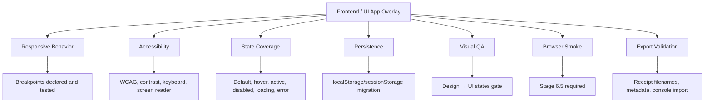

### Diagram 2

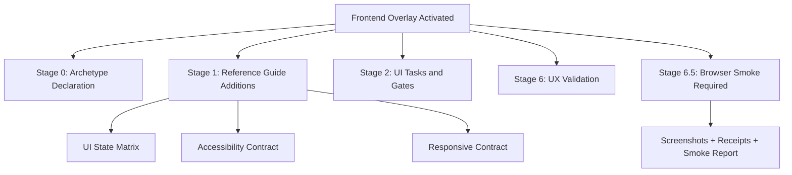

### Required Reference-Guide Additions

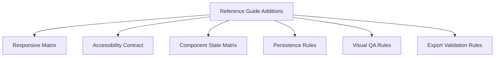

### Required Outputs

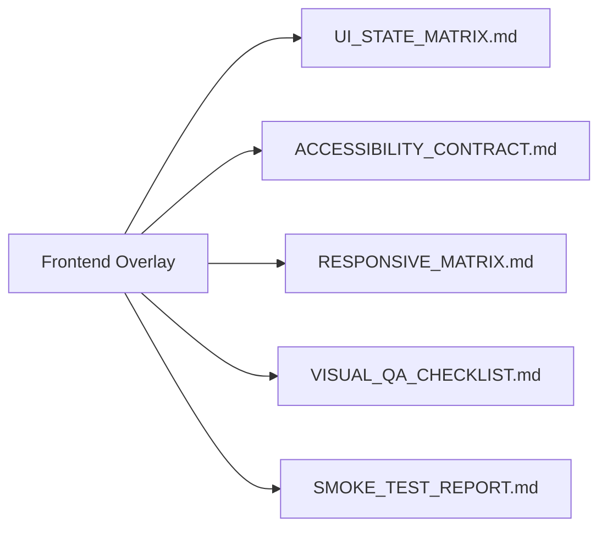

### Gate O-UI — Frontend Overlay Complete

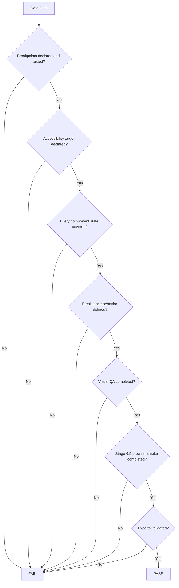

### Primary Hero Lenses

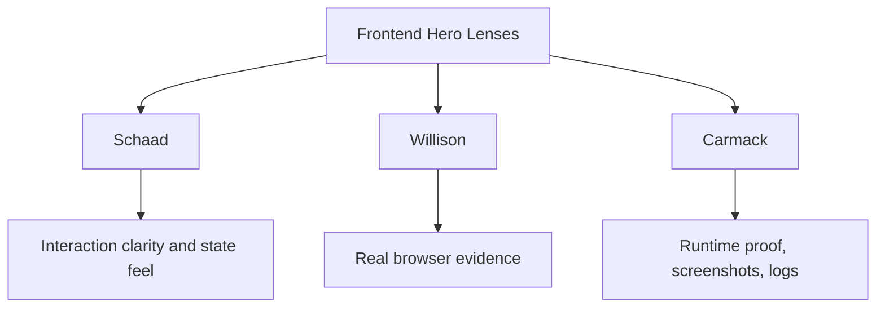

### One-Line Doctrine

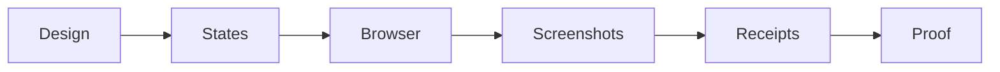

## Chapter 42 — Creative / Product System Overlay

### Diagram 1

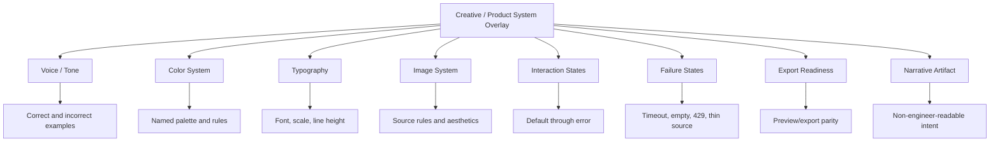

### Diagram 2

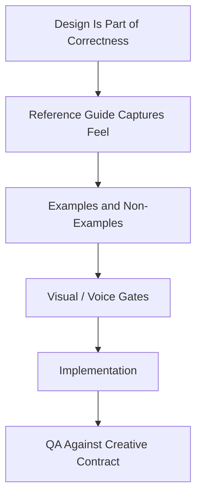

### Required Reference-Guide Additions

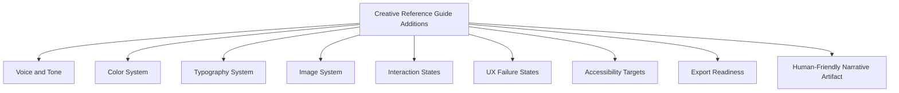

### Required Outputs

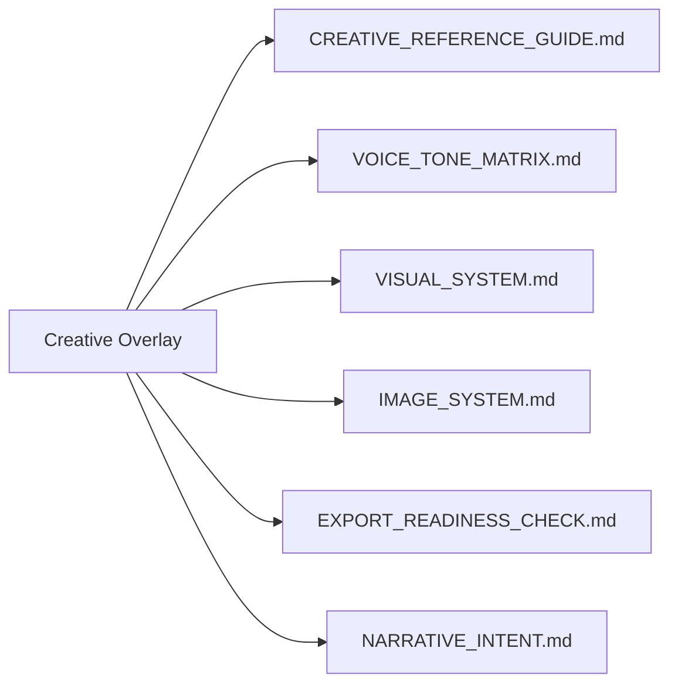

### Gate O-CREATIVE — Creative Contract Complete

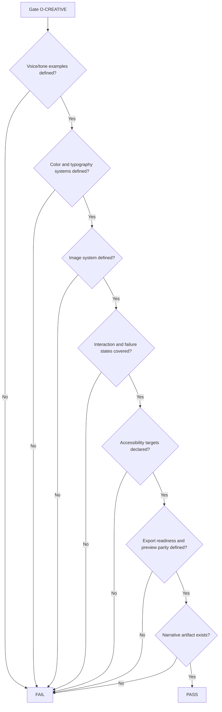

### Primary Hero Lenses

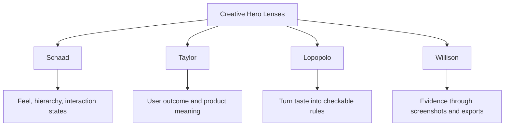

### One-Line Doctrine

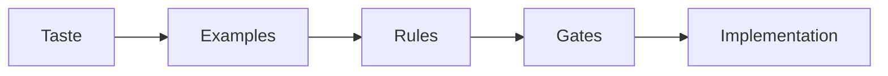

## Chapter 43 — Native / Mobile Overlay

### Diagram 1

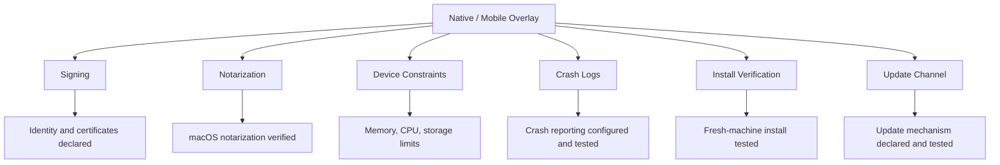

### Diagram 2

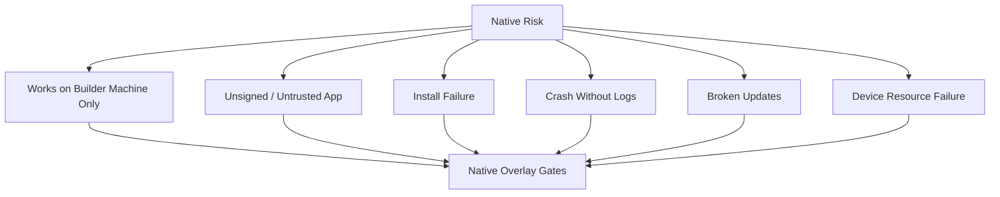

### Required Reference-Guide Additions

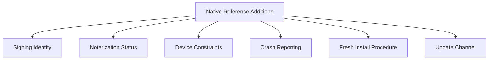

### Required Outputs

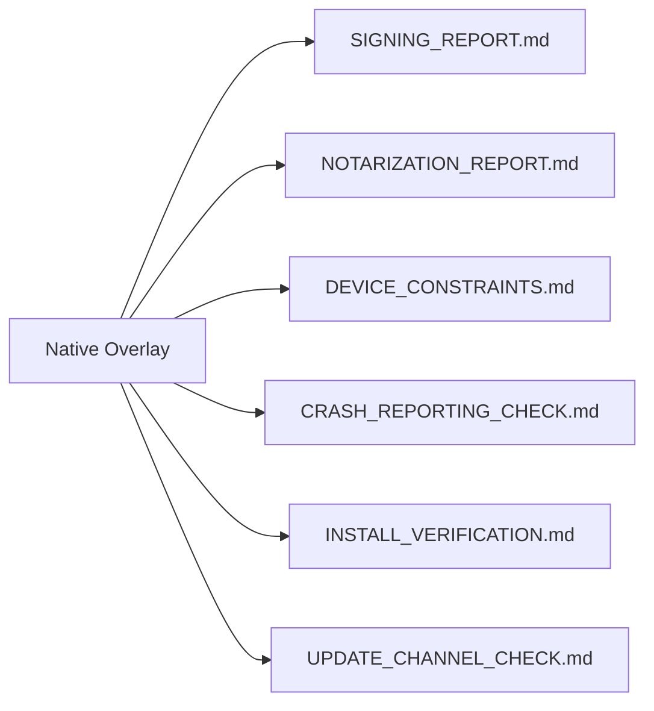

### Gate O-NATIVE — Native Distribution Ready

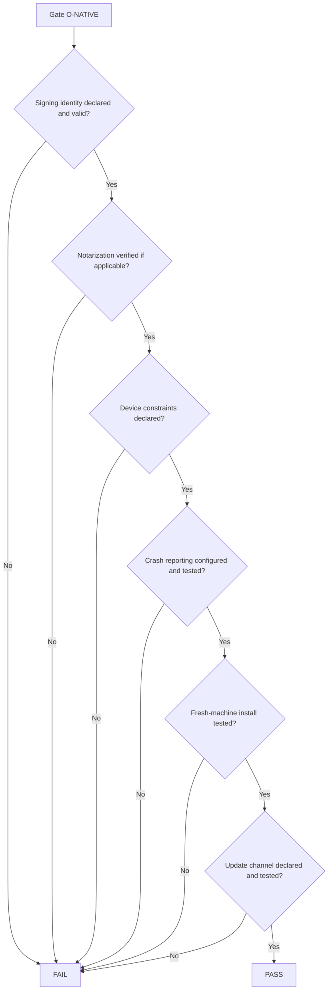

### Primary Hero Lenses

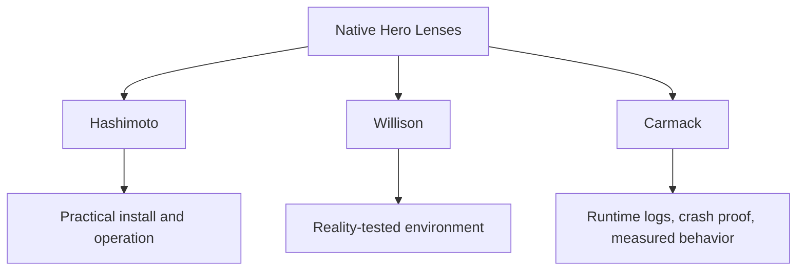

### One-Line Doctrine

```mermaid
flowchart LR
    A[Builds Locally] --> B[Installs Fresh]
    B --> C[Runs Native]
    C --> D[Crashes Diagnosably]
    D --> E[Updates Safely]
```

## Chapter 44 — Takeover / Fork Overlay

### Diagram 1

```mermaid
flowchart TD
    A[Takeover / Fork Overlay] --> B[Snapshot Gate]
    B --> C[Behavior Map]
    C --> D[Delta Intent]
    D --> E[Regression Baseline]
    E --> F[Delta-Only Implementation]
    F --> G[0–8 Workflow Continues]
```

### Diagram 2

```mermaid
flowchart LR
    A[Greenfield] --> B[Reference Guide Defines System Before Code]
    C[Takeover / Fork] --> D[Existing Code Already Behaves Somehow]
    D --> E[Understand What Exists]
    E --> F[Declare What Changes]
    F --> G[Preserve Baseline]
```

### Why Takeovers Are Different

```mermaid
flowchart TD
    A[Existing Codebase] --> B[Agent Starts Modifying]
    B --> C[Unmapped Behavior Changes]
    C --> D[Regression Baseline Lost]
    D --> E[Cannot Tell What Broke]
    E --> F[Takeover Failure]
    G[Snapshot First] --> H[Behavior Map]
    H --> I[Delta Intent]
    I --> J[Safe Change Boundary]
```

### Step A — Snapshot Gate

```mermaid
flowchart TD
    A[Step A: Snapshot Gate] --> B[git tag takeover-baseline]
    A --> C[Run build]
    A --> D[Run tests]
    A --> E[Run lint]
    A --> F[Record previous-owner disclosures]
    A --> G[TAKEOVER_SNAPSHOT.md]
    G --> H[Commit Snapshot]
```

### Gate F-0 — Baseline Snapshot Complete

```mermaid
flowchart TD
    A[Gate F-0] --> B{Baseline tagged?}
    B -->|No| X[FAIL]
    B -->|Yes| C{Build result recorded?}
    C -->|No| X
    C -->|Yes| D{Test result recorded?}
    D -->|No| X
    D -->|Yes| E{Lint result recorded?}
    E -->|No| X
    E -->|Yes| F{TAKEOVER_SNAPSHOT.md committed?}
    F -->|No| X
    F -->|Yes| G[PASS]
```

### Step B — Behavior Map

```mermaid
flowchart TD
    A[EXISTING_BEHAVIOR_MAP.md] --> B[Entry Points]
    A --> C[Data Flows]
    A --> D[External Dependencies]
    A --> E[Determinism Classification]
    A --> F[Current Correctness Source]
    A --> G[Known Technical Debt]
    A --> H[API Key Exposure]
```

### Step C — Delta Intent

```mermaid
flowchart TD
    A[DELTA_INTENT.md] --> B[What Must Change]
    A --> C[What Must Be Preserved]
    A --> D[What Will Be Discarded]
    A --> E[Regression Baseline]
```

### Gate F-1 — Behavior Map and Delta Intent Complete

```mermaid
flowchart TD
    A[Gate F-1] --> B{EXISTING_BEHAVIOR_MAP.md committed?}
    B -->|No| X[FAIL]
    B -->|Yes| C{DELTA_INTENT.md committed?}
    C -->|No| X
    C -->|Yes| D{Regression baseline identified?}
    D -->|No| X
    D -->|Yes| E[PASS]
```

### Additional Rules for Stages 2–8

```mermaid
flowchart TD
    A[Takeover Rules] --> R1[Preserve regression baseline]
    A --> R2[Delta-only scope discipline]
    A --> R3[Technical debt not in scope by default]
    A --> R4[Open-source fork rule]
    R1 --> C1[Breaking baseline is a Pivot]
    R2 --> C2[Every phase maps to DELTA_INTENT.md]
    R3 --> C3[Flag debt, do not silently fix]
    R4 --> C4[Document upstream version, license, divergence]
```

### Required Outputs

```mermaid
flowchart LR
    A[Takeover Overlay] --> B[TAKEOVER_SNAPSHOT.md]
    A --> C[EXISTING_BEHAVIOR_MAP.md]
    A --> D[DELTA_INTENT.md]
    A --> E[REGRESSION_BASELINE.md]
    A --> F[FORK_DIVERGENCE_PLAN.md]
```

### Primary Hero Lenses

```mermaid
flowchart TD
    A[Takeover Hero Lenses] --> W[Willison]
    A --> C[Cherny]
    A --> L[Lopopolo]
    A --> J[Carmack]
    W --> W1[Observe before changing]
    C --> C1[Map existing structure and delta]
    L --> L1[Baseline gates prevent silent deviation]
    J --> J1[Measured runtime behavior over guesses]
```

### One-Line Doctrine

```mermaid
flowchart LR
    A[Snapshot] --> B[Map Behavior]
    B --> C[Declare Delta]
    C --> D[Preserve Baseline]
    D --> E[Change Safely]
```

## Chapter 45 — Web3 / Protocol Overlay

### Diagram 1

```mermaid
flowchart TD
    A[Web3 / Protocol Overlay] --> B[Actor Map]
    A --> C[Chain Assumptions]
    A --> D[Invariants]
    A --> E[Incentives]
    A --> F[Composability]
    A --> G[Emergency Controls]
    A --> H[Exploit Review]
    B --> B1[Roles, permissions, trust levels]
    C --> C1[Finality, reorgs, RPC dependency]
    D --> D1[Formal always-true statements]
    E --> E1[Fees, rewards, slashing]
    F --> F1[External protocol assumptions]
    G --> G1[Pause, upgrade, multisig]
    H --> H1[MEV, oracle, sybil, griefing, governance, agent loops]
```

### Diagram 2

```mermaid
flowchart TD
    A[Protocol-Like Behavior] --> B[Activate Wood]
    B --> C[Define Actors]
    C --> D[Define Invariants]
    D --> E[Define Incentives]
    E --> F[Define Attack Surfaces]
    F --> G[Convert Each Exploit to Enforcement Target]
    G --> H[Reference Guide + Build Plan + Review]
```

### Activation Conditions

```mermaid
flowchart TD
    A[Does the project include...] --> B[Smart contracts]
    A --> C[Wallets]
    A --> D[Stablecoins]
    A --> E[x402 / payment rails]
    A --> F[Governance]
    A --> G[On-chain data]
    A --> H[Token incentives]
    A --> I[Multi-agent economic behavior]
    A --> J[Protocol composability]
    B --> K[Activate Web3 / Protocol Overlay]
    C --> K
    D --> K
    E --> K
    F --> K
    G --> K
    H --> K
    I --> K
    J --> K
```

### Required Reference-Guide Additions

```mermaid
flowchart TD
    A[Protocol Reference Additions] --> B[Actor Map]
    A --> C[Chain Assumptions]
    A --> D[Invariants]
    A --> E[Incentives]
    A --> F[Composability]
    A --> G[Emergency Controls]
    A --> H[Exploit Review]
```

### Protocol Invariant Template

```mermaid
flowchart TD
    A[Invariant] --> B[Statement]
    A --> C[Threat]
    A --> D[Enforcement Target]
    A --> E[Evidence]
    A --> F[Owner]
```

### Required Outputs

```mermaid
flowchart LR
    A[Web3 / Protocol Overlay] --> B[PROTOCOL_ACTOR_MAP.md]
    A --> C[CHAIN_ASSUMPTIONS.md]
    A --> D[PROTOCOL_INVARIANTS.md]
    A --> E[INCENTIVE_MODEL.md]
    A --> F[COMPOSABILITY_MAP.md]
    A --> G[EMERGENCY_CONTROLS.md]
    A --> H[EXPLOIT_REVIEW.md]
```

### Gate O-WEB3 — Protocol Assumptions Enforced

```mermaid
flowchart TD
    A[Gate O-WEB3] --> B{Actor map complete?}
    B -->|No| X[FAIL]
    B -->|Yes| C{Chain assumptions declared?}
    C -->|No| X
    C -->|Yes| D{Invariants defined?}
    D -->|No| X
    D -->|Yes| E{Each invariant has enforcement target?}
    E -->|No| X
    E -->|Yes| F{Incentives modeled?}
    F -->|No| X
    F -->|Yes| G{Composability assumptions documented?}
    G -->|No| X
    G -->|Yes| H{Emergency controls defined?}
    H -->|No| X
    H -->|Yes| I{Exploit review converted to tests/sims/monitors/risks?}
    I -->|No| X
    I -->|Yes| J[PASS]
```

### Primary Hero Lenses

```mermaid
flowchart TD
    A[Web3 / Protocol Hero Lenses] --> G[Wood]
    A --> N[Carlini]
    A --> J[Carmack]
    A --> L[Lopopolo]
    A --> H[Hashimoto]
    G --> G1[Actors, incentives, invariants, composability]
    N --> N1[Exploit surface and adversarial behavior]
    J --> J1[Runtime proof and invariant evidence]
    L --> L1[Convert invariants to gates]
    H --> H1[Emergency operations and usability]
```

### One-Line Doctrine

```mermaid
flowchart LR
    A[Actors] --> B[Incentives]
    B --> C[Invariants]
    C --> D[Exploit Review]
    D --> E[Tests / Simulations / Monitors]
```

## Chapter 46 — Level 5 Harness

### Diagram 1

```mermaid
flowchart TD
    A[Level 5 Harness] --> B[Repository-Level Operating Contract]
    A --> C[Stricter Rule Wins]
    A --> D[Controls Agent Behavior]
    A --> E[Protects Workflow Integrity]
    A --> F[Turns Lessons into Constraints]
    B --> B1[Applies underneath every stage]
    C --> C1[Workflow vs harness conflict resolves to stricter rule]
    D --> D1[Agents cannot route around constraints]
    E --> E1[Prevents silent drift]
    F --> F1[Retrospectives tighten the harness]
```

### Diagram 2

```mermaid
flowchart TD
    A[Human Intent] --> B[Reference Guide]
    B --> C[Build Plan]
    C --> D[Task Board]
    D --> E[Agent Execution]
    E --> F[Receipts]
    F --> G[Learning Cards]
    G --> H[Harness Updates]
    I[Level 5 Harness] -. constrains .-> B
    I -. constrains .-> C
    I -. constrains .-> D
    I -. constrains .-> E
    I -. constrains .-> F
    I -. constrains .-> G
```

### Diagram 3

```mermaid
flowchart TD
    A[Rule Conflict] --> B{Harness or workflow stricter?}
    B --> C[Apply stricter rule]
    C --> D{Agent can continue safely?}
    D -->|Yes| E[Proceed]
    D -->|No| F[Surface conflict to human]
    F --> G[Do not route around constraint]
```

### Harness Rules

```mermaid
flowchart TD
    A[Harness Rules] --> B[Human-write-only constraints]
    A --> C[0% human implementation]
    A --> D[Plan Mode before implementation]
    A --> E[Red / Green TDD]
    A --> F[Sandbox first]
    A --> G[Root-cause automation]
    A --> H[Repo-centric truth]
    A --> I[Sub-minute inner loop]
    A --> J[Security by architecture]
    A --> K[Scaffolding is temporary]
    A --> L[Lessons must be enforced]
    A --> M[Authority by filesystem]
```

### Harness Violation Handling

```mermaid
flowchart TD
    A[Harness Violation] --> B[Stop]
    B --> C[Classify Violation]
    C --> D{Can agent repair without weakening harness?}
    D -->|Yes| E[Create repair task]
    D -->|No| F[Surface to human]
    E --> G[Update ledger]
    F --> G
    G --> H[Create learning card]
    H --> I[Add enforcement target]
```

### Operational Mantras

```mermaid
flowchart TD
    A[Operational Mantras] --> B[Constrain hard]
    A --> C[Plan clearly]
    A --> D[Test honestly]
    A --> E[Attack your own system]
    A --> F[Specification is scarce]
    A --> G[Transferable memory is scarce]
    A --> H[Separate data from instructions]
    A --> I[Silent deviation is poison]
```

### Required Outputs

```mermaid
flowchart LR
    A[Level 5 Harness] --> B[AGENT_OPERATING_CONTRACT.md]
    A --> C[HARNESS_RULES.md]
    A --> D[AGENTS.md]
    A --> E[WORKFLOW_LESSONS_INDEX.md]
    A --> F[BUILD_LEDGER.md]
```

### Gate H1 — Harness Active

```mermaid
flowchart TD
    A[Gate H1: Harness Active] --> B{Harness rules documented?}
    B -->|No| X[FAIL]
    B -->|Yes| C{Agents forbidden from weakening constraints?}
    C -->|No| X
    C -->|Yes| D{Authority by filesystem declared?}
    D -->|No| X
    D -->|Yes| E{Learning enforcement required?}
    E -->|No| X
    E -->|Yes| F{Security by architecture declared?}
    F -->|No| X
    F -->|Yes| G[PASS]
```

### Primary Hero Lenses

```mermaid
flowchart TD
    A[Level 5 Hero Lenses] --> L[Lopopolo]
    A --> W[Willison]
    A --> N[Carlini]
    A --> C[Cherny]
    A --> J[Carmack]
    L --> L1[Constraints and gates]
    W --> W1[Evidence and reality checks]
    N --> N1[Security architecture]
    C --> C1[Plan discipline]
    J --> J1[Measured runtime proof]
```

### One-Line Doctrine

```mermaid
flowchart LR
    A[Harness] --> B[Constrains Workflow]
    B --> C[Constrains Agents]
    C --> D[Constrains Code]
    D --> E[Produces Receipts]
    E --> F[Improves Harness]
```

## Chapter 47 — Structured Output Compiler Pattern

### Diagram 1

```mermaid
flowchart LR
    A[LLM] --> B[Semantic IR]
    B --> C[Deterministic Compiler]
    C --> D[Final Artifact]
    D --> E[Validation]
    F[Avoid] -.-> G[LLM Directly Produces Final Artifact]
```

### Diagram 2

```mermaid
flowchart TD
    A[Model Output] --> B{Valid IR?}
    B -->|No| C[Reject / Retry / Surface Error]
    B -->|Yes| D[Compile Deterministically]
    D --> E{Final Artifact Valid?}
    E -->|No| F[Compiler or schema bug]
    E -->|Yes| G[Export Package]
```

### Diagram 3

```mermaid
flowchart TD
    A[LLM → Final Artifact] --> B[Markdown Wrapping]
    A --> C[Malformed JSON]
    A --> D[Missing Sections]
    A --> E[Field Mutation]
    A --> F[Structural Hallucination]
    G[LLM → IR → Compiler] --> H[Schema Validation]
    H --> I[Deterministic Artifact]
    I --> J[Binary Validation]
```

### Why This Pattern Exists

```mermaid
flowchart TD
    A[Apple News Generator Build] --> B[LLM Direct JSON Attempt]
    B --> C[Malformed Output]
    B --> D[Structural Hallucinations]
    B --> E[Invalid Apple News JSON]
    A --> F[LLM → Semantic IR → Compiler]
    F --> G[Valid IR]
    G --> H[Deterministic Compiler]
    H --> I[Valid Apple News JSON]
```

### Required Definition

```mermaid
flowchart TD
    A[Compiler Pattern Definition] --> B[Semantic IR]
    A --> C[IR Schema]
    A --> D[Compiler Target]
    A --> E[Validation Target]
    A --> F[Round-Trip Tests]
    A --> G[Export Package Contract]
```

### Compiler Boundary Rules

```mermaid
flowchart TD
    A[Compiler Boundary Rules] --> R1[LLM cannot write final artifact directly]
    A --> R2[IR schema must be explicit]
    A --> R3[Compiler must be deterministic]
    A --> R4[Final artifact must validate]
    A --> R5[No markdown wrapping]
    A --> R6[No silent partial export]
    A --> R7[Export package must be declared]
```

### Required Outputs

```mermaid
flowchart LR
    A[Structured Output Compiler Pattern] --> B[SEMANTIC_IR_SCHEMA.md]
    A --> C[compiler module]
    A --> D[VALIDATION_TARGET.md]
    A --> E[ROUND_TRIP_TESTS.md]
    A --> F[EXPORT_PACKAGE_CONTRACT.md]
```

### Gate P-COMPILER — Structured Output Boundary Valid

```mermaid
flowchart TD
    A[Gate P-COMPILER] --> B{IR schema explicit?}
    B -->|No| X[FAIL]
    B -->|Yes| C{Final artifact generated by deterministic compiler?}
    C -->|No| X
    C -->|Yes| D{Validation target defined?}
    D -->|No| X
    D -->|Yes| E{Round-trip tests pass?}
    E -->|No| X
    E -->|Yes| F{Malformed / empty / markdown-wrapped output handled?}
    F -->|No| X
    F -->|Yes| G{Export package contract validated?}
    G -->|No| X
    G -->|Yes| H[PASS]
```

### Primary Hero Lenses

```mermaid
flowchart TD
    A[Compiler Pattern Hero Lenses] --> L[Lopopolo]
    A --> C[Cherny]
    A --> W[Willison]
    A --> J[Carmack]
    L --> L1[Make structure checkable]
    C --> C1[Separate semantic layer from compiler layer]
    W --> W1[Test model output against reality]
    J --> J1[Validate actual generated artifacts]
```

### One-Line Doctrine

```mermaid
flowchart LR
    A[LLM] --> B[Semantic IR]
    B --> C[Compiler]
    C --> D[Validated Artifact]
```

## Chapter 48 — Creative / Product Reference Guide Pattern

### Diagram 1

```mermaid
flowchart TD
    A[Creative / Product Reference Guide] --> B[Voice / Tone]
    A --> C[Color System]
    A --> D[Typography]
    A --> E[Image System]
    A --> F[Interaction States]
    A --> G[UX Failure States]
    A --> H[Accessibility Targets]
    A --> I[Export Readiness]
    A --> J[Narrative Artifact]
    B --> K[Design becomes correctness]
    C --> K
    D --> K
    E --> K
    F --> K
    G --> K
    H --> K
    I --> K
    J --> K
```

### Diagram 2

```mermaid
flowchart LR
    A[Taste] --> B[Examples]
    B --> C[Rules]
    C --> D[State Matrix]
    D --> E[Reference Guide]
    E --> F[Build Plan]
    F --> G[Visual QA]
```

### Required Sections

```mermaid
flowchart TD
    A[Required Sections] --> B[Voice / Tone]
    A --> C[Color System]
    A --> D[Typography]
    A --> E[Image System]
    A --> F[Interaction States]
    A --> G[UX Failure States]
    A --> H[Accessibility Targets]
    A --> I[Export Readiness States]
    A --> J[Human-Friendly Narrative Artifact]
```

### Correct / Incorrect Example Rule

```mermaid
flowchart TD
    A[Creative Rule] --> B{Has examples?}
    B -->|No| X[Too vague]
    B -->|Yes| C{Has non-examples?}
    C -->|No| X
    C -->|Yes| D[Usable by agent]
```

### Required Outputs

```mermaid
flowchart LR
    A[Creative Pattern] --> B[CREATIVE_REFERENCE_GUIDE.md]
    A --> C[STATE_MATRIX.md]
    A --> D[VISUAL_QA_CHECKLIST.md]
    A --> E[EXPORT_PARITY_CHECK.md]
    A --> F[NARRATIVE_INTENT.md]
```

### Gate P-CREATIVE — Creative Reference Is Implementable

```mermaid
flowchart TD
    A[Gate P-CREATIVE] --> B{Voice has correct and incorrect examples?}
    B -->|No| X[FAIL]
    B -->|Yes| C{Color and typography exact?}
    C -->|No| X
    C -->|Yes| D{Image rules exact?}
    D -->|No| X
    D -->|Yes| E{Interaction states complete?}
    E -->|No| X
    E -->|Yes| F{Failure states specified?}
    F -->|No| X
    F -->|Yes| G{Export readiness defined?}
    G -->|No| X
    G -->|Yes| H{Narrative artifact exists?}
    H -->|No| X
    H -->|Yes| I[PASS]
```

### Primary Hero Lenses

```mermaid
flowchart TD
    A[Creative Pattern Hero Lenses] --> R[Schaad]
    A --> T[Taylor]
    A --> L[Lopopolo]
    A --> W[Willison]
    R --> R1[Feel, hierarchy, interaction]
    T --> T1[User outcome and product meaning]
    L --> L1[Turn taste into checkable rules]
    W --> W1[Evidence from real output]
```

### One-Line Doctrine

```mermaid
flowchart LR
    A[Creative Intent] --> B[Examples]
    B --> C[Rules]
    C --> D[Gates]
    D --> E[Correct Product]
```

## Chapter 49 — AI App Failure Checklist

### Diagram 1

```mermaid
flowchart TD
    A[AI App Failure Checklist] --> B[Structured Output Failures]
    A --> C[Partial Generation]
    A --> D[Prompt Injection]
    A --> E[Thin Source]
    A --> F[Provider Failures]
    A --> G[Unsupported Claims]
    A --> H[Preview / Export Divergence]
    A --> I[Provider Substitution]
    B --> J[Stage 3 Review]
    C --> J
    D --> J
    E --> J
    F --> J
    G --> J
    H --> J
    I --> J
```

### Diagram 2

```mermaid
flowchart TD
    A[Failure Scenario] --> B{Has defined behavior?}
    B -->|No| C[Stage 3 Risk]
    C --> D[Patch Reference Guide / Build Plan]
    B -->|Yes| E{Has test or gate?}
    E -->|No| F[Add test / gate]
    E -->|Yes| G[Ready for implementation]
```

### Failure Checklist

```mermaid
flowchart TD
    A[Failure Scenarios] --> B[JSON Wrapped in Markdown]
    A --> C[Section N of M Fails]
    A --> D[Number Mutation]
    A --> E[Prompt Injection via Source Text]
    A --> F[Thin Source Material]
    A --> G[Provider 429]
    A --> H[Visually Correct, Factually Unsupported]
    A --> I[Preview / Export Divergence]
    A --> J[Model Returns Empty]
    A --> K[Provider Substitution]
```

### Required Patch Targets

```mermaid
flowchart TD
    A[AI Failure Finding] --> B{Patch Target}
    B -->|Undefined behavior| C[Reference Guide]
    B -->|Missing handling step| D[Build Plan]
    B -->|Missing schema| E[IR Schema]
    B -->|Missing test| F[Eval / Unit / Integration Test]
    B -->|Security surface| G[Trust Boundaries]
    B -->|Export issue| H[Export Contract]
    B -->|Operator confusion| I[UX Failure States]
```

### Required Outputs

```mermaid
flowchart LR
    A[AI App Failure Checklist] --> B[AI_FAILURE_REVIEW.md]
    A --> C[AI_FAILURE_PATCHES.md]
    A --> D[UPDATED_TRUST_BOUNDARIES.md]
    A --> E[UPDATED_EXPORT_CONTRACT.md]
```

### Gate P-AI — AI Failure Modes Covered

```mermaid
flowchart TD
    A[Gate P-AI] --> B{Markdown-wrapped structured output handled?}
    B -->|No| X[FAIL]
    B -->|Yes| C{Partial generation handled?}
    C -->|No| X
    C -->|Yes| D{Number mutation detectable?}
    D -->|No| X
    D -->|Yes| E{Prompt injection boundary defined?}
    E -->|No| X
    E -->|Yes| F{Thin source behavior defined?}
    F -->|No| X
    F -->|Yes| G{Provider 429 behavior defined?}
    G -->|No| X
    G -->|Yes| H{Unsupported claims detectable?}
    H -->|No| X
    H -->|Yes| I{Preview/export parity tested?}
    I -->|No| X
    I -->|Yes| J{Empty output handled?}
    J -->|No| X
    J -->|Yes| K{Provider substitution preserves contract?}
    K -->|No| X
    K -->|Yes| L[PASS]
```

### Primary Hero Lenses

```mermaid
flowchart TD
    A[AI Failure Checklist Hero Lenses] --> N[Carlini]
    A --> W[Willison]
    A --> L[Lopopolo]
    A --> C[Cherny]
    N --> N1[Adversarial input and exfiltration]
    W --> W1[Reality checks and empirical failure tests]
    L --> L1[Convert failure scenarios to gates]
    C --> C1[Define system boundaries and fallback behavior]
```

### One-Line Doctrine

```mermaid
flowchart LR
    A[Known AI Failure] --> B[Defined Behavior]
    B --> C[Test / Gate]
    C --> D[Safe AI App]
```

## Chapter 50 — Build Ledger Pattern

### Diagram 1

```mermaid
flowchart TD
    A[BUILD_LEDGER.md] --> B[Chronological Audit Trail]
    A --> C[One Row Per Build Session]
    A --> D[Referenced by Learning Cards]
    A --> E[Synthesized in Stage 8]
    A --> F[Memory, Not Authority]
    B --> G[What happened]
    C --> H[When and by whom]
    D --> I[What was learned]
    E --> J[What changes next time]
    F --> K[Does not override active plan]
```

### Diagram 2

```mermaid
flowchart LR
    A[Build Session] --> B[Ledger Row]
    B --> C[Learning Card]
    C --> D[Stage 8 Retrospective]
    D --> E[Lessons Index]
    E --> F[Workflow / Harness Update]
```

### Diagram 3

```mermaid
flowchart TD
    A[BUILD_LEDGER.md] --> B[Session Memory]
    B --> C[Stage 8 Input]
    D[authority.json] --> E[Active Command Layer]
    E --> F[Plan / Tasks / Reference]
    A -. does not override .-> D
```

### Ledger Location

```mermaid
flowchart TD
    A[Build Ledger] --> B[docs/active/BUILD_LEDGER.md]
    B --> C[Active memory artifact]
    C --> D[Referenced by Stage 5, 7, and 8]
```

### Ledger Row Fields

```mermaid
flowchart TD
    A[Ledger Row] --> B[Build ID]
    A --> C[Date]
    A --> D[Build Name / Phase]
    A --> E[Plan Source]
    A --> F[Agents Used]
    A --> G[Files Touched]
    A --> H[Commands Run]
    A --> I[Build Result]
    A --> J[Failures Encountered]
    A --> K[Deviations From Plan]
    A --> L[Tests Added]
    A --> M[Learning Cards Produced]
    A --> N[Unresolved Risks]
    A --> O[Next Gated Phase]
```

### Ledger Row Template

```mermaid
flowchart TD
    A[Ledger Entry] --> B[Session Summary]
    A --> C[Evidence]
    A --> D[Failures]
    A --> E[Learning]
    A --> F[Next Gate]
```

### Ledger Rules

```mermaid
flowchart TD
    A[Ledger Rules] --> R1[One entry per build session]
    A --> R2[Record commands, not summaries only]
    A --> R3[Record deviations explicitly]
    A --> R4[Link learning cards]
    A --> R5[Never override authority]
    A --> R6[Stage 8 must synthesize ledger]
```

### Required Outputs

```mermaid
flowchart LR
    A[Build Ledger Pattern] --> B[BUILD_LEDGER.md]
    A --> C[LEARNING_CARDS.md]
    A --> D[WORKFLOW_LESSONS_INDEX.md]
```

### Gate P-LEDGER — Build Memory Captured

```mermaid
flowchart TD
    A[Gate P-LEDGER] --> B{Ledger entry created for session?}
    B -->|No| X[FAIL]
    B -->|Yes| C{Commands run recorded?}
    C -->|No| X
    C -->|Yes| D{Files touched recorded?}
    D -->|No| X
    D -->|Yes| E{Failures and deviations recorded?}
    E -->|No| X
    E -->|Yes| F{Learning cards linked?}
    F -->|No| X
    F -->|Yes| G{Next gated phase declared?}
    G -->|No| X
    G -->|Yes| H[PASS]
```

### Primary Hero Lenses

```mermaid
flowchart TD
    A[Build Ledger Hero Lenses] --> W[Willison]
    A --> J[Carmack]
    A --> L[Lopopolo]
    W --> W1[Evidence over vibes]
    J --> J1[Measured runtime facts]
    L --> L1[Make learning enforceable]
```

### One-Line Doctrine

```mermaid
flowchart LR
    A[Build Session] --> B[Ledger]
    B --> C[Learning Card]
    C --> D[Stage 8]
    D --> E[Future Constraint]
```

---

## Narrative

Chapter 41 — Frontend / UI App Overlay


Key Message

Any human-facing interface makes UI behavior part of correctness.

A frontend is not correct because components render. It is correct when states, breakpoints, accessibility, persistence, failure behavior, receipts, and real-user smoke paths are defined and verified.

For Frontend / UI App archetypes, Stage 6.5 is required. It is not skippable.

⸻

Required Reference-Guide Additions


Required additions:

Responsive behavior:
- Breakpoints declared.
- Layout behavior defined per breakpoint.
- Tested on declared viewport widths.
Accessibility:
- WCAG level declared.
- Contrast ratios defined.
- Keyboard navigation expectations defined.
- Screen reader expectations defined.
State coverage:
- Every interactive component defines default, hover, active, disabled, loading, and error states.
Persistence:
- localStorage/sessionStorage behavior defined.
- Migration behavior defined.
- Empty, stale, corrupt, or incompatible local state handled.
Visual QA:
- Design → UI states gate required.
- Screenshots required for core states.
Browser smoke:
- Stage 6.5 required.
- Not skippable for this archetype.
Export validation:
- Receipt filenames validated.
- Receipt metadata validated.
- Console import validated where applicable.

⸻

Required Outputs


Required outputs:

UI_STATE_MATRIX.md
ACCESSIBILITY_CONTRACT.md
RESPONSIVE_MATRIX.md
VISUAL_QA_CHECKLIST.md
SMOKE_TEST_REPORT.md
EXPORT_VALIDATION_REPORT.md

For small solo builds, these may be sections inside APPROVED_REFERENCE_GUIDE.md. For serious UI builds, keep them as separate active artifacts.

⸻

Gate O-UI — Frontend Overlay Complete


Gate question:

Does the real interface behave correctly across states, viewports, accessibility paths, persistence states, and export flows?

PASS: Breakpoints are declared and tested. Accessibility target is declared and validated. Component states are covered. Persistence behavior is defined. Visual QA is complete. Browser smoke passes. Exports validate.

FAIL: Fix missing UI state coverage, accessibility gaps, responsive failures, smoke failures, or export-validation failures before promotion.

⸻

Primary Hero Lenses


Primary Hero Lenses:

[R] Schaad + [W] Willison + [J] Carmack

Schaad checks human-facing states and interaction quality.
Willison tests the real app.
Carmack requires measured proof.

⸻

One-Line Doctrine


A UI is not correct until real users can complete real paths through real states.

⸻

Chapter 42 — Creative / Product System Overlay


Key Message

For creative and product systems, design is not polish.

Design is part of correctness.

If the project depends on voice, tone, visual identity, image style, interaction feel, export quality, or user trust, then the reference guide must define those qualities before implementation. Otherwise agents will fill the gap with generic output.

The Creative / Product System Overlay forces taste into artifacts.

⸻

Required Reference-Guide Additions


Required additions:

Voice / tone:
- Adjectives.
- Correct examples.
- Incorrect examples.
- Prohibited phrases.
Color system:
- Named palette with hex values.
- Usage rules.
- Contrast ratios.
Typography:
- Font family.
- Weight.
- Size scale.
- Line height.
- Letter spacing.
Image system:
- Source rules.
- Aspect ratios.
- Quality floor.
- Prohibited aesthetics.
Interaction states:
- Default, hover, active, disabled, loading, error.
UX failure states:
- API timeout.
- Model returns empty.
- Provider returns 429.
- Source text is too thin.
- Export fails.
- Partial generation occurs.
Accessibility targets:
- WCAG level.
- Contrast ratios.
- Keyboard navigation.
- Screen reader expectations.
Export readiness:
- What ready to export means.
- Preview/export parity gate.
Human-friendly narrative artifact:
- One document a non-engineer can read to understand the intended feel.

⸻

Required Outputs


Required outputs:

CREATIVE_REFERENCE_GUIDE.md
VOICE_TONE_MATRIX.md
VISUAL_SYSTEM.md
IMAGE_SYSTEM.md
UX_FAILURE_STATES.md
EXPORT_READINESS_CHECK.md
NARRATIVE_INTENT.md

For small builds, NARRATIVE_INTENT.md may be a section inside the creative reference guide. For multi-stakeholder builds, it should be standalone.

⸻

Gate O-CREATIVE — Creative Contract Complete


Gate question:

Can an agent implement the intended feel without guessing?

PASS: Voice, tone, color, typography, image rules, interaction states, failure states, accessibility targets, export readiness, and narrative intent are defined with examples and non-examples.

FAIL: Continue creative reference-guide work. Do not let implementation agents invent taste silently.

⸻

Primary Hero Lenses


Primary Hero Lenses:

[R] Schaad + [T] Taylor + [L] Lopopolo

Schaad defines the intended feel.
Taylor checks whether design serves the user outcome.
Lopopolo turns taste into checkable constraints.
Willison verifies the real rendered output.

⸻

One-Line Doctrine


If design is part of correctness, taste must become an artifact.

⸻

Chapter 43 — Native / Mobile Overlay


Key Message

Native and mobile apps have correctness surfaces that web apps do not.

An app that runs in development is not necessarily installable, trusted by the OS, crash-diagnosable, updateable, or safe under real device constraints.

The Native / Mobile Overlay makes packaging, signing, installation, updates, and crash reporting part of the reference guide and validation path.

⸻

Required Reference-Guide Additions


Required additions:

Signing:
- Code signing identity declared.
- Certificates current.
- Expiry and renewal owner defined.
Notarization:
- macOS notarization status verified where applicable.
- Failure path documented.
Device constraints:
- Memory limits declared.
- CPU expectations declared.
- Storage limits declared.
- Offline behavior declared.
Crash logs:
- Crash reporting configured.
- Crash reporting tested.
- Log retrieval documented.
Install verification:
- Fresh-machine install procedure documented.
- Fresh-machine install tested.
- First-run behavior documented.
Update channel:
- Update mechanism declared.
- Update mechanism tested.
- Rollback or downgrade policy documented.

⸻

Required Outputs


Required outputs:

SIGNING_REPORT.md
NOTARIZATION_REPORT.md
DEVICE_CONSTRAINTS.md
CRASH_REPORTING_CHECK.md
INSTALL_VERIFICATION.md
UPDATE_CHANNEL_CHECK.md

⸻

Gate O-NATIVE — Native Distribution Ready


Gate question:

Can the app be installed, trusted, diagnosed, and updated on a real target device?

PASS: Signing is valid. Notarization is verified where applicable. Device constraints are declared. Crash reporting works. Fresh-machine install is tested. Update channel is declared and tested.

FAIL: Do not treat native app as complete. Fix packaging, signing, install, crash, or update gaps first.

⸻

Primary Hero Lenses


Primary Hero Lenses:

[H] Hashimoto + [W] Willison + [J] Carmack

Hashimoto asks whether the app is usable in the real world.
Willison checks the real environment.
Carmack requires runtime evidence.

⸻

One-Line Doctrine


A native app is not done until it installs, runs, reports crashes, and updates on a real target device.

⸻

Chapter 44 — Takeover / Fork Overlay


Key Message

Greenfield builds and takeover/fork builds share the 0–8 stage structure, but Stage 0 and Stage 1 have different procedures when inheriting an existing codebase.

In a greenfield build, the reference guide defines the system before code exists.

In a takeover, the system already exists — and it may be correct, partially correct, accidental, fragile, or wrong.

You must understand what is before you change it.

The snapshot gate prevents the primary takeover failure mode: changing behavior you did not understand.

⸻

Why Takeovers Are Different


A takeover build begins with evidence preservation.

Before an agent improves anything, it must preserve the baseline.

⸻

Step A — Snapshot Gate


Before reading, analyzing, or modifying a single file, create a deterministic snapshot of the codebase as received.

Required actions:

git tag takeover-baseline
Run npm run build. Record pass / fail / error output.
Run npm run test. Record pass count / fail count / error output.
Run npm run lint. Record error count.
Document every command and exact output in TAKEOVER_SNAPSHOT.md.
Record any issues the previous owner disclosed.
Commit TAKEOVER_SNAPSHOT.md before modification.

For non-Node projects, replace npm commands with the declared build/test/lint equivalents.

⸻

Gate F-0 — Baseline Snapshot Complete


Gate question:

Is the baseline snapshot complete and committed before any modification?

PASS: Baseline tagged. Build result recorded. Test result recorded. Lint result recorded. TAKEOVER_SNAPSHOT.md committed.

FAIL: Stop. Do not modify any file before the snapshot gate passes. Every change before this gate is an untraceable deviation.

⸻

Step B — Behavior Map


EXISTING_BEHAVIOR_MAP.md must document:

entry points
data flows
external dependencies
determinism classification
where correctness is currently defined
known technical debt
API key or secret exposure
current test coverage
known runtime failure modes

⸻

Step C — Delta Intent


DELTA_INTENT.md must include:

what must change — one item per line
what must be preserved — behavior, API contracts, data formats
what will be discarded — with rationale
regression baseline — which tests must pass throughout

Every implementation phase must map to a line in DELTA_INTENT.md.

⸻

Gate F-1 — Behavior Map and Delta Intent Complete


Gate question:

Is the behavior map complete? Is the delta intent documented? Is the regression baseline defined?

PASS: EXISTING_BEHAVIOR_MAP.md committed. DELTA_INTENT.md committed. Regression baseline identified.

FAIL: Do not modify code before the behavior map and delta intent are complete. Modifying without understanding is the primary root cause of takeover failures.

⸻

Additional Rules for Stages 2–8


Rules:

- Preserve the regression baseline. Any change that breaks a baseline test is a Pivot, not a silent fix.
- Delta-only scope discipline. Every phase must map to a line in DELTA_INTENT.md.
- Changes not in the delta intent require a Pivot before proceeding.
- Technical debt is not in scope by default. Agents may flag debt but may not address it silently.
- Open-source fork rule. Document upstream version, license, and divergence plan.

⸻

Required Outputs


Required outputs:

TAKEOVER_SNAPSHOT.md
EXISTING_BEHAVIOR_MAP.md
DELTA_INTENT.md
REGRESSION_BASELINE.md
FORK_DIVERGENCE_PLAN.md if open-source fork

⸻

Primary Hero Lenses


Primary Hero Lenses:

[W] Willison + [C] Cherny + [L] Lopopolo

Willison demands empirical baseline evidence.
Cherny maps structure before change.
Lopopolo turns baseline preservation into a gate.
Carmack verifies what the existing system actually does.

⸻

One-Line Doctrine


In a takeover, observe before changing.

Every unsnapshotted change is an untraceable deviation.

⸻

Chapter 45 — Web3 / Protocol Overlay


Key Message

The Web3 / Protocol Overlay activates when a build has protocol rules, decentralized actors, smart contracts, x402 payments, stablecoins, wallets, token incentives, governance, on-chain data, or multi-agent economic behavior.

This overlay activates [G] Wood.

Wood’s job is narrow but important: when a build behaves like a protocol, protocol assumptions must enter the reference guide, build plan, adversarial review, tests, simulations, monitors, and accepted-risk records before agents write code.

Wood does not weaken Lopopolo’s determinism requirement.
Wood does not override Hashimoto’s operator-utility standard.
Wood does not replace Taylor’s product-outcome discipline.
Wood does not dilute Carlini’s security model.

Wood forces protocol assumptions into explicit artifacts.

⸻

Activation Conditions


Activate this overlay for projects with:

protocol rules
decentralized actors
smart contracts
x402 payments
stablecoins
wallets
token incentives
governance
on-chain data
multi-agent economic behavior
external protocol composability

⸻

Required Reference-Guide Additions


Required additions:

Actor map:
- Every actor.
- Role.
- Permissions.
- Trust level.
- Economic incentives.
Chain assumptions:
- Finality model.
- Reorg depth.
- RPC dependency.
- Indexer dependency.
- Confirmation policy.
Invariants:
- Formal statements of what must always be true.
- Each invariant mapped to test, simulation, monitor, or accepted risk.
Incentives:
- Fee logic.
- Reward structure.
- Slashing conditions.
- Payment settlement assumptions.
- Attack incentives.
Composability:
- External protocols depended on.
- Integration assumptions.
- Failure behavior if dependency changes or degrades.
Emergency controls:
- Pause mechanism.
- Upgrade authority.
- Multisig requirements.
- Key rotation.
- Emergency communication path.
Exploit review:
- MEV / ordering risk.
- Oracle manipulation.
- Sybil.
- Griefing.
- Governance capture.
- Agent-loop failure.
- Wallet signing confusion.
- Payment replay or double-spend risk.

Every exploit review item must become one of:

test
simulation
constraint
monitor
accepted-risk record

⸻

Protocol Invariant Template


Use this template:

## Invariant: [Name]
Statement:
- What must always be true?
Actors affected:
- 
Threats:
- 
Enforcement target:
- test / simulation / constraint / monitor / accepted risk
Evidence:
- command, report, or monitor proving enforcement
Owner:
- 

Example:

## Invariant: Payment receipt cannot be accepted twice
Statement:
- A payment receipt ID may be redeemed exactly once.
Threats:
- replay
- duplicated callback
- indexer race
- chain reorg
Enforcement target:
- integration test
- idempotent persistence constraint
- monitor for duplicate receipt IDs

⸻

Required Outputs


Required outputs:

PROTOCOL_ACTOR_MAP.md
CHAIN_ASSUMPTIONS.md
PROTOCOL_INVARIANTS.md
INCENTIVE_MODEL.md
COMPOSABILITY_MAP.md
EMERGENCY_CONTROLS.md
EXPLOIT_REVIEW.md

⸻

Gate O-WEB3 — Protocol Assumptions Enforced


Gate question:

Are protocol assumptions explicit, enforced, and reviewed before implementation?

PASS: Actor map is complete. Chain assumptions are declared. Invariants are defined and mapped to enforcement targets. Incentives are modeled. Composability assumptions are documented. Emergency controls are defined. Exploit review items are converted into tests, simulations, constraints, monitors, or accepted-risk records.

FAIL: Do not proceed to implementation. Protocol ambiguity becomes exploit surface.

⸻

Primary Hero Lenses


Primary Hero Lenses:

[G] Wood + [N] Carlini + [J] Carmack

Wood forces actor, incentive, invariant, and composability assumptions into the system.

Carlini models adversaries and exploit paths.

Carmack demands runtime proof that invariants hold.

Useful supporting lenses:

[L] Lopopolo + [H] Hashimoto

Lopopolo turns invariants into gates.
Hashimoto checks emergency controls and operator usability.

⸻

One-Line Doctrine


Protocol assumptions are not commentary.
They are invariants, tests, simulations, monitors, or accepted risks.

When a build behaves like a protocol, the protocol must be specified before agents write code.
----
PART IX — REUSABLE PATTERNS

Chapter 46 — Level 5 Harness


Key Message

The Level 5 Harness is the repository-level operating contract that sits underneath the workflow.

It defines the rules agents may not violate even when a task is difficult, a test is failing, a deadline is tight, or a model wants to take a shortcut.

When the harness and workflow conflict, the stricter rule wins.

The harness exists to make process integrity stronger than model convenience.

⸻

Harness Rules


Harness Rule	Meaning
Human-write-only constraints [L]	Agents may not modify harness files, lint rules, tests, permanent constraints, or gate definitions merely to get a task to pass. Surface the conflict. Do not route around it.
0% human implementation [L]	Humans design constraints and intent. Agents generate and regenerate implementation. A human touching implementation code is a process failure unless explicitly declared as emergency/manual mode.
Plan Mode before implementation [C]	Medium and hard tasks require options, tradeoffs, selected plan, rationale, and markdown to-do list before code is touched.
Red / Green TDD [L] [W]	Write or identify a failing test before implementation. No valid failing test or equivalent eval means no merge for testable behavior.
Sandbox first [W]	Autonomous execution is allowed only inside contained environments. Containment first. Velocity second.
Root-cause automation [L]	Do not patch isolated bugs in a loop. Add a lint, test, rule, schema, guardrail, or constraint that makes the failure class harder to repeat.
Repo-centric truth [L]	If it is not in the repo, it does not exist to the agent. Slack, chat, memory, and verbal intent are context, not command.
Sub-minute inner loop [L]	Build and test loops should complete in under 60 seconds. If exceeded, stop feature work and fix the build graph or create smaller scoped commands.
Security by architecture [N]	Prompt wording does not count as a primary security mechanism. Use architecture-level controls: isolation, least privilege, validation, allowlists, and exfiltration blocking.
Scaffolding is temporary [C]	Label any temporary guardrail TEMPORARY. State the removal trigger. Delete it when the condition is met.
Lessons must be enforced	Every stage-end learning card must assign an enforcement target. A card with no target is a harness violation.
Authority by filesystem	The active plan, task board, ledger, reference guide, and authority pointer are determined by docs/active/ and authority.json. Agents do not infer authority from filenames or chat history.

⸻

Harness Violation Handling


A harness violation is not a normal bug.

It means the build process attempted to weaken the system that controls the build.

Examples:

agent edits lint rule to pass task
agent deletes failing test
agent changes reference guide instead of implementation
agent writes code without claim file
agent marks task DONE without evidence
agent uses archived plan as authority
agent patches symptom without adding prevention
agent keeps TEMPORARY scaffold after removal trigger

The correct response is to stop, classify, record, and repair the process.

⸻

Operational Mantras


Constrain hard. Plan clearly. Test honestly. Attack your own system.

The scarce resource is not code. It is specification.

Measure customer or operator value — not feature count.

The second scarce resource is transferable memory. Index your lessons.

Separate data from instructions.

Every retrospective must tighten either the harness or the workflow.

Never let a silent deviation rewrite correctness.

Latency, copy, and feedback are part of correctness.

The factory does not care what you are building. It cares whether the right truth is in command.

⸻

Required Outputs


Required outputs:

docs/dark-factory/AGENT_OPERATING_CONTRACT.md
docs/dark-factory/HARNESS_RULES.md
AGENTS.md
WORKFLOW_LESSONS_INDEX.md
docs/active/BUILD_LEDGER.md

For small builds, HARNESS_RULES.md may be embedded in AGENTS.md. For serious builds, keep it separate and human-write-only.

⸻

Gate H1 — Harness Active


Gate question:

Does the repository contain a binding operating contract that agents may not weaken?

PASS: Harness rules are documented. Agents may not modify constraints to pass tasks. Authority by filesystem is declared. Learning enforcement is required. Security by architecture is declared.

FAIL: Do not run autonomous implementation until the harness is active.

⸻

Primary Hero Lenses


Primary Hero Lenses:

[L] Lopopolo + [W] Willison + [N] Carlini

Lopopolo protects constraints.
Willison demands empirical checks.
Carlini prevents security-by-prompt.
Cherny supports decomposition.
Carmack demands runtime proof.

⸻

One-Line Doctrine


The harness is the rule layer beneath the workflow.

When in doubt, the stricter rule wins.

⸻

Chapter 47 — Structured Output Compiler Pattern


Key Message

Use the Structured Output Compiler Pattern for any AI system producing strict structured artifacts: JSON, XML, SQL, PowerPoint, HTML reports, Apple News JSON, Terraform, API schemas, or any format where correctness is binary.

The core rule:

Prefer:  LLM → Semantic IR → Deterministic Compiler → Final Artifact
Avoid:   LLM → Final Artifact

The LLM is useful for semantic generation.

It is unreliable as a strict compiler.

The compiler boundary converts probabilistic model output into deterministic artifact generation.

⸻

Why This Pattern Exists


This pattern was discovered empirically during the Apple News Generator build.

Attempting to produce Apple News JSON directly from the LLM resulted in malformed output and structural hallucinations.

The LLM → Semantic IR → Compiler architecture eliminated the problem by forcing the model to produce a simpler semantic representation, then using deterministic code to compile that representation into the final strict format.

⸻

Required Definition


Component	What It Covers
Semantic IR	The intermediate representation the LLM generates. Defined by explicit schema.
IR schema	Every field, type, required/optional status. No TBD fields.
Compiler target	The final format the compiler produces: Apple News JSON, .pptx, Terraform HCL, SQL, API schema, etc.
Validation target	The schema, parser, linter, or specification the compiler output must satisfy.
Drift / round-trip tests	LLM output → compiler → validate → compare to expected. Must catch field mutation, missing sections, markdown wrapping, empty output, and invalid structure.
Export package contract	What files the export produces, their names, their schemas, and their validation commands.

⸻

Compiler Boundary Rules


Rules:

- The LLM may generate semantic IR.
- The LLM may not generate the final strict artifact directly.
- The IR schema must be explicit and versioned.
- The compiler must be deterministic.
- Compiler output must pass a validation target.
- Markdown-wrapped JSON must be rejected or stripped before schema validation by a declared sanitizer.
- Empty, partial, or malformed IR must not compile.
- Export package contents must be declared and validated.

⸻

Required Outputs


Required outputs:

SEMANTIC_IR_SCHEMA.md
Compiler implementation
VALIDATION_TARGET.md
ROUND_TRIP_TESTS.md
EXPORT_PACKAGE_CONTRACT.md

For TypeScript projects, the schema should be backed by a runtime validator such as Zod or JSON Schema. For Python projects, use Pydantic, JSON Schema, or equivalent.

⸻

Gate P-COMPILER — Structured Output Boundary Valid


Gate question:

Does every strict artifact pass through semantic IR, deterministic compilation, and validation?

PASS: IR schema is explicit. Final artifact is generated by deterministic compiler. Validation target exists. Round-trip tests pass. Malformed, empty, and markdown-wrapped outputs are handled. Export package contract is validated.

FAIL: Do not ship LLM-generated strict artifacts directly.

⸻

Primary Hero Lenses


Primary Hero Lenses:

[L] Lopopolo + [C] Cherny + [W] Willison

Lopopolo demands strict schemas and gates.
Cherny separates semantic generation from deterministic compilation.
Willison tests model output against reality.
Carmack validates actual generated artifacts.

⸻

One-Line Doctrine


Let the LLM decide meaning.
Let deterministic code decide structure.

Never trust a model to be a compiler for a binary-correctness artifact.

⸻

Chapter 48 — Creative / Product Reference Guide Pattern


Key Message

Use the Creative / Product Reference Guide Pattern for any AI app or product system where design is part of correctness.

Tone matters.
Typography is spec.
Color is behavior.
Failure copy is trust.
Export parity is product integrity.

When the intended feel is not specified, agents generate generic software.

This pattern makes design executable.

⸻

Required Sections


Required Section	What It Must Define
Voice / tone	Adjectives describing the writing, examples of correct and incorrect copy, prohibited phrases.
Color system	Named palette with hex values, usage rules per color, contrast ratios for accessibility compliance.
Typography	Font family, weight, size scale, line height, letter spacing. No “roughly” or “similar to.”
Image system	Source rules, aspect ratios, quality floor, prohibited aesthetics.
Interaction states	Every interactive component: default, hover, active, disabled, loading, error. Named and specified.
UX failure states	What the user sees when API times out, model returns empty, provider returns 429, source text is too thin, export fails, or generation is partial.
Accessibility targets	WCAG level, contrast ratios, keyboard navigation, screen reader expectations.
Export readiness states	What “ready to export” means. Preview/export parity gate.
Human-friendly narrative artifact	One document a non-engineer can read to understand the intended feel.

⸻

Correct / Incorrect Example Rule


Creative standards require examples and non-examples.

Bad:

Make it premium and clean.

Good:

Voice: editorial, restrained, exact.
Correct: "Your receipt is ready. Export includes timing, accuracy, and telemetry."
Incorrect: "Great job superstar! Your awesome report is ready!"
Prohibited: gamified praise, infantilizing language, vague wellness framing.

The agent cannot implement taste from adjectives alone.

⸻

Required Outputs


Required outputs:

CREATIVE_REFERENCE_GUIDE.md
STATE_MATRIX.md
VISUAL_QA_CHECKLIST.md
EXPORT_PARITY_CHECK.md
NARRATIVE_INTENT.md

⸻

Gate P-CREATIVE — Creative Reference Is Implementable


Gate question:

Can an implementation agent reproduce the intended product feel without guessing?

PASS: Creative rules are exact, examples and non-examples exist, visual system is specified, interaction and failure states are complete, export readiness is defined, and narrative intent exists.

FAIL: Continue reference-guide work. Do not ask coding agents to invent taste.

⸻

Primary Hero Lenses


Primary Hero Lenses:

[R] Schaad + [T] Taylor + [L] Lopopolo

Schaad defines interaction feel.
Taylor protects product outcome.
Lopopolo turns subjective taste into checkable rules.
Willison checks real output.

⸻

One-Line Doctrine


If design is correctness, specify design as correctness.

⸻

Chapter 49 — AI App Failure Checklist


Key Message

The AI App Failure Checklist is a reusable Stage 3 adversarial prompt set.

Run it against any plan that includes LLM-driven output before Stage 5 begins.

AI apps fail in predictable ways: malformed JSON, markdown wrapping, unsupported claims, prompt injection, provider 429s, partial artifacts, thin source material, empty output, and preview/export divergence.

If the plan does not define what happens in these scenarios, the agent will improvise.

⸻

Failure Checklist


Failure Scenario	Gate Question
JSON wrapped in markdown	What happens if the model returns ```json ... ``` instead of raw JSON? Does the compiler catch it or corrupt silently?
Section N of M fails	If the model fails on section 4 of 6, does the pipeline checkpoint, retry, or produce a partial artifact silently?
Number mutation	If the model changes a numeric value, what catches it before it reaches the final artifact?
Prompt injection via source text	If the user pastes “Ignore previous instructions,” does it reach the model with data access?
Thin source material	If the user pastes 40 words as the source for a 6-page document, what does the system do?
Provider 429	If the model API returns 429, does the pipeline retry with backoff, queue, or surface a clear error?
Visually correct, factually unsupported	If the output is beautifully formatted but contains claims not in the source, what catches it?
Preview / export divergence	If the preview and exported artifact differ, which one is authoritative? Is this tested?
Model returns empty	If the model returns an empty string, what does the compiler do?
Provider substitution	If the fallback provider is used, does the output contract still hold?

⸻

Required Patch Targets


Every checklist finding must become one of:

reference-guide rule
IR schema rule
compiler guard
test
eval
trust-boundary update
export-contract update
UX failure-state rule
accepted risk with owner and trigger

⸻

Required Outputs


Required outputs:

AI_FAILURE_REVIEW.md
AI_FAILURE_PATCHES.md
UPDATED_TRUST_BOUNDARIES.md
UPDATED_EXPORT_CONTRACT.md

For small builds, these may be sections inside the Stage 3 review log.

⸻

Gate P-AI — AI Failure Modes Covered


Gate question:

Does the plan define and test the predictable failure modes of LLM-driven output?

PASS: Every listed AI failure mode has defined behavior and at least one enforcement target.

FAIL: Do not proceed to Stage 5. Patch the reference guide, compiler boundary, trust boundary, export contract, or tests.

⸻

Primary Hero Lenses


Primary Hero Lenses:

[N] Carlini + [W] Willison + [L] Lopopolo

Carlini attacks the prompt and trust boundary.
Willison tests what actually happens.
Lopopolo turns failure scenarios into gates.
Cherny clarifies boundaries and fallbacks.

⸻

One-Line Doctrine


Predictable AI failures must not be left to agent improvisation.

If an LLM can fail that way, the plan must say what happens.

⸻

Chapter 50 — Build Ledger Pattern


Key Message

The build ledger is the chronological audit trail that learning cards reference and Stage 8 synthesizes.

One row per build session.

The ledger records what happened. It does not command what happens next.

In ACDF v7, the ledger is memory, not authority. Its job is to preserve evidence of execution, failure, deviation, commands, files touched, and lessons produced so the system can learn without relying on chat history.

⸻

Ledger Location


Canonical location:

docs/active/BUILD_LEDGER.md

The ledger lives in docs/active/ because it is current memory, but it is not execution authority.

Authority remains with:

authority.json
APPROVED_REFERENCE_GUIDE.md
BUILD_PLAN.md
PROJECT_TASKS.md
acceptance_gates.md

⸻

Ledger Row Fields


Field	Value
Build ID	Example: B-2026-014.
Date	YYYY-MM-DD.
Build name / phase	Example: Phase 9 — BigQuery shadow signal views.
Plan source	Example: PRD v3, Stage 5 build plan, ad hoc pivot from Phase 8.
Agent(s) used	Codex / Claude / Gemini / manual / other.
Files touched	List or count.
Commands run	make build, make test, make doctor, etc.
Build result	Pass / Fail / Partial — describe.
Failures encountered	Brief description, one per line.
Deviations from plan	None or description of deviation.
Tests added	Count and description.
Learning cards produced	IDs of cards filled this session.
Unresolved risks	Anything that should be reviewed before next build.
Next gated phase	What must happen before the next build begins.

⸻

Ledger Row Template


Use this template:

## Build [B-YYYY-NNN] — [Build Name / Phase]
Date:
Plan source:
Agent(s) used:
Files touched:
- 
Commands run:
- 
Build result:
- Pass / Fail / Partial
Failures encountered:
- 
Deviations from plan:
- None / details
Tests added:
- 
Learning cards produced:
- 
Unresolved risks:
- 
Next gated phase:
- 

⸻

Ledger Rules


Rules:

- One entry per build session.
- Record actual commands run.
- Record files touched.
- Record deviations from plan explicitly.
- Link learning cards by ID.
- Record unresolved risks before the next gate.
- Do not treat ledger notes as active requirements.
- Stage 8 must synthesize ledger entries into lessons.

⸻

Required Outputs


Required outputs:

docs/active/BUILD_LEDGER.md
LEARNING_CARDS.md
WORKFLOW_LESSONS_INDEX.md

⸻

Gate P-LEDGER — Build Memory Captured


Gate question:

Did this build session leave enough memory for Stage 8 to learn from it?

PASS: Ledger entry exists. Commands, files touched, result, failures, deviations, learning cards, unresolved risks, and next gated phase are recorded.

FAIL: Update the ledger before treating the build session as complete.

⸻

Primary Hero Lenses


Primary Hero Lenses:

[W] Willison + [J] Carmack + [L] Lopopolo

Willison asks what evidence exists.
Carmack asks what actually happened at runtime.
Lopopolo asks what the ledger should force into a future rule, test, or gate.

⸻

One-Line Doctrine


The ledger remembers what happened.
Stage 8 decides what the memory becomes.

Memory is not authority, but without memory the factory cannot improve.
----
