## Diagram Map

## Chapter 51 — Usage Modes

### Diagram 1

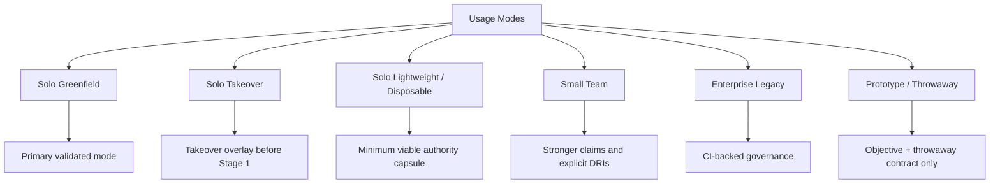

### Diagram 2

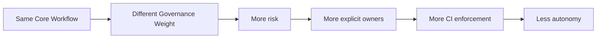

### Diagram 3

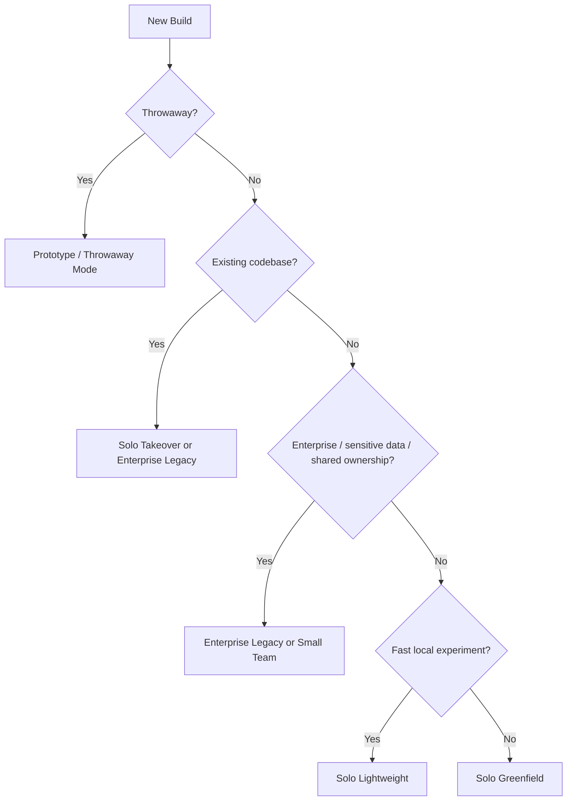

### Modes

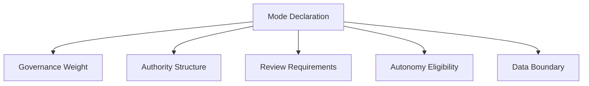

### Mode Decision Matrix

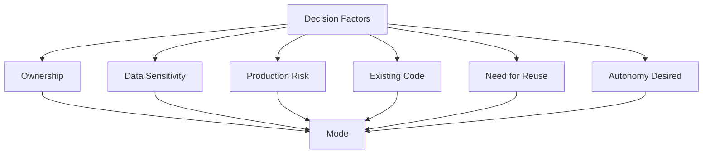

### Required Output

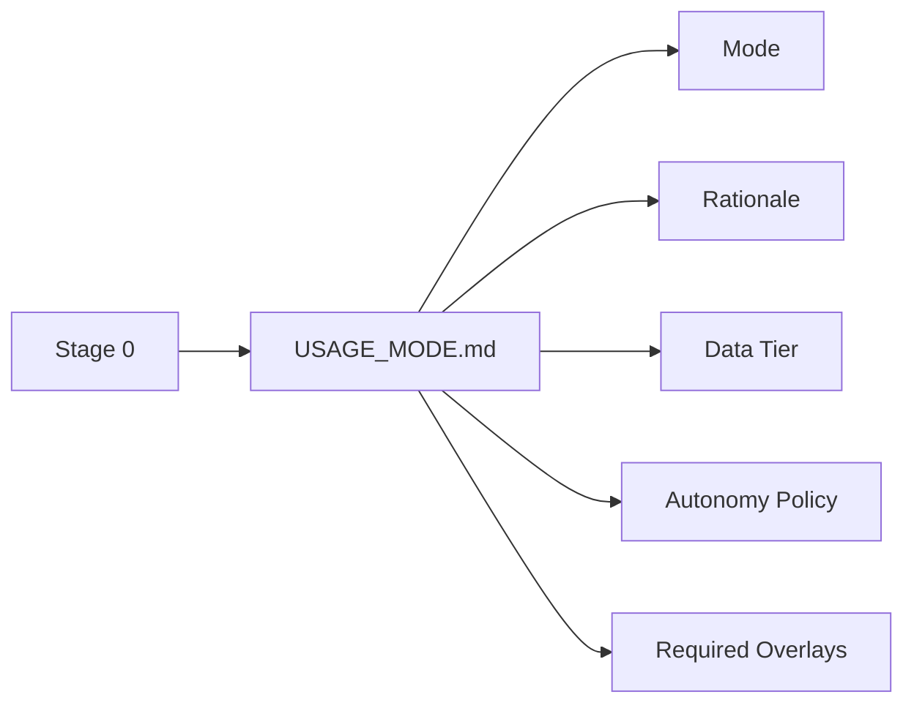

### Gate G0 — Usage Mode Declared

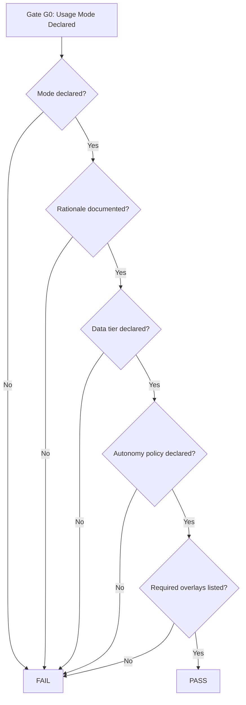

### One-Line Doctrine

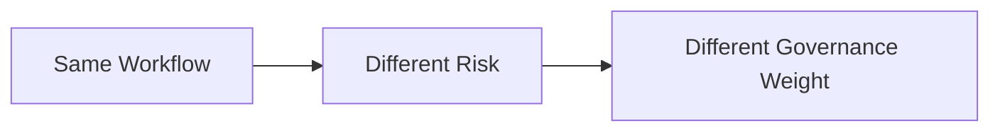

## Chapter 52 — Solo / Lightweight Mode

### Diagram 1

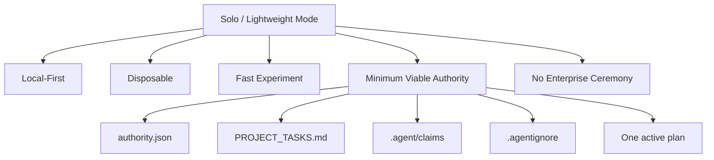

### Diagram 2

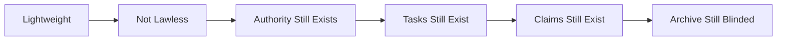

### Minimum Viable Authority Capsule

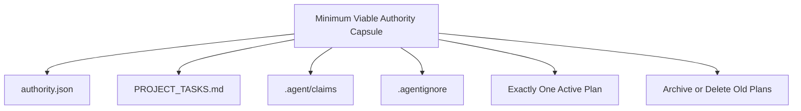

### Lightweight Directory Structure

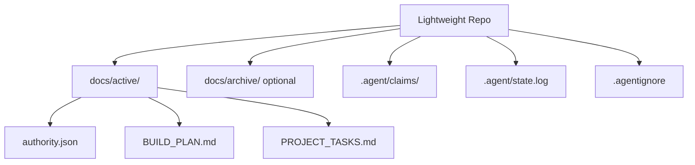

### Lightweight Rules

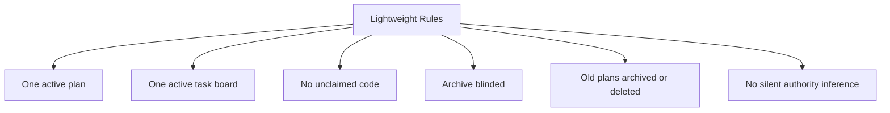

### Gate G-LITE — Lightweight Invariants Preserved

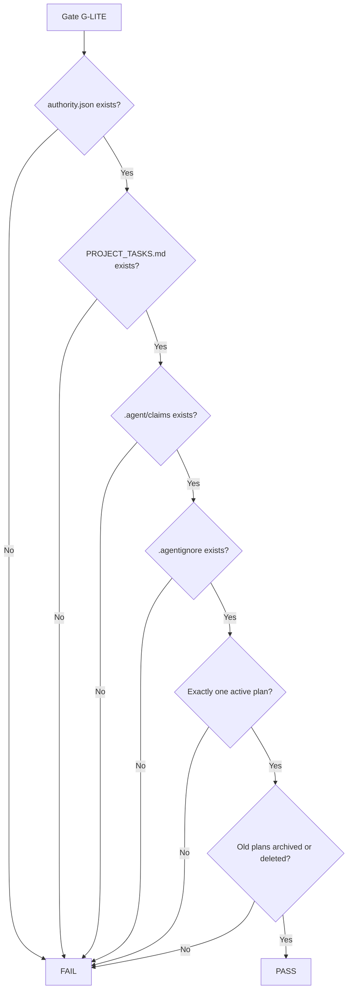

### Primary Hero Lenses

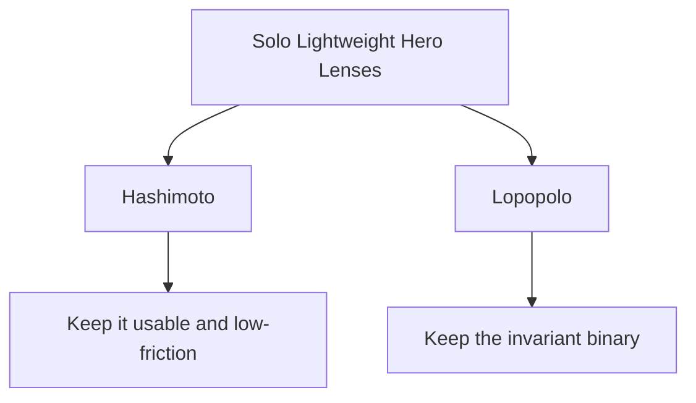

### One-Line Doctrine


## Chapter 53 — Enterprise Limits

### Diagram 1

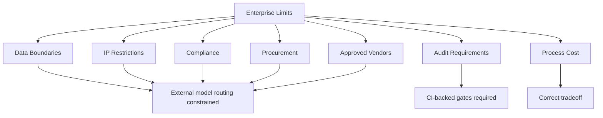

### Diagram 2

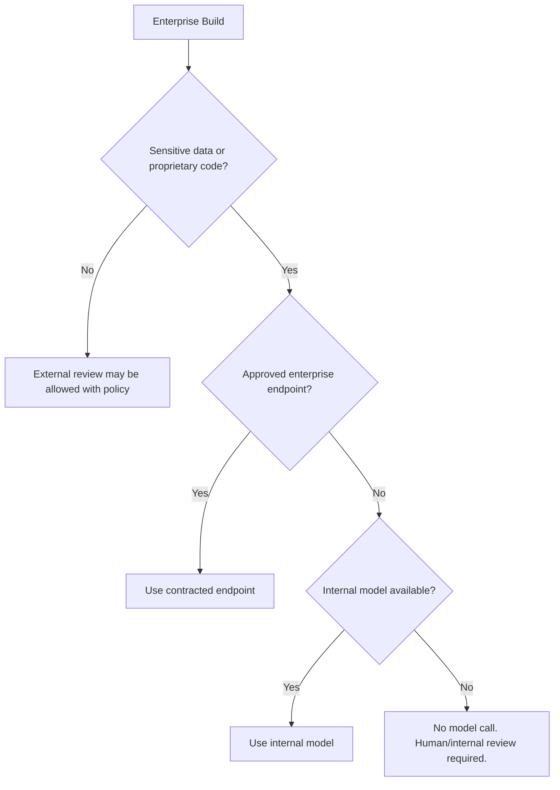

### Enterprise Limits

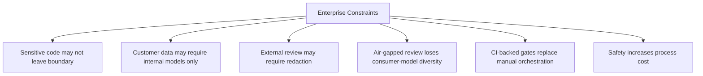

### What Changes in Enterprise Mode

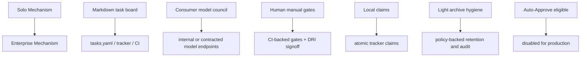

### Primary Hero Lenses

```mermaid
flowchart TD
    A[Enterprise Limits Hero Lenses] --> N[Carlini]
    A --> L[Lopopolo]
    A --> T[Taylor]
    N --> N1[Data boundary and exfiltration]
    L --> L1[CI-backed gates and constraints]
    T --> T1[Correct tradeoff between speed and institutional risk]
```

### One-Line Doctrine

```mermaid
flowchart LR
    A[Enterprise Safety] --> B[More Process Cost]
    B --> C[Correct Tradeoff]
```

## Chapter 54 — Enterprise Governance Contract

### Diagram 1

```mermaid
flowchart TD
    A[Enterprise Governance Contract] --> Q1[Human Accountability]
    A --> Q2[Data Boundary]
    A --> Q3[Traceability]
    A --> Q4[Rollback]
    A --> Q5[Autonomy Limits]
    A --> Q6[Learning Enforcement]
    Q1 --> P[Enterprise-Safe Workflow]
    Q2 --> P
    Q3 --> P
    Q4 --> P
    Q5 --> P
    Q6 --> P
```

### Diagram 2

```mermaid
flowchart TD
    A[Enterprise Review] --> B{All six governance questions yes?}
    B -->|No| C[Not enterprise-safe yet]
    B -->|Yes| D[Enterprise governance accepted]
```

### J.1 — Is there a named human accountable for every agent-generated change?

```mermaid
flowchart LR
    A[Agent Change] --> B[Named DRI]
    B --> C[Release Signature]
    C --> D[Rollback Ownership]
```

### J.2 — Does sensitive data stay inside your boundary?

```mermaid
flowchart TD
    A[Data Tier] --> B{Tier 1}
    A --> C{Tier 2}
    A --> D{Tier 3}
    B --> B1[Public-safe]
    C --> C1[Internal / contracted endpoint]
    D --> D1[Air-gapped / internal only]
```

### J.3 — Are changes traceable and auditable?

```mermaid
flowchart LR
    A[Objective] --> B[Reference]
    B --> C[Plan]
    C --> D[Tasks]
    D --> E[Claims]
    E --> F[Receipts]
    F --> G[Ledger]
    G --> H[Lessons]
```

### J.4 — Can the system be rolled back in under five minutes?

```mermaid
flowchart TD
    A[Rollback Path] --> B{One command?}
    B -->|No| X[Gate fails]
    B -->|Yes| C{Works without SSH-only heroics?}
    C -->|No| X
    C -->|Yes| D{Under five minutes?}
    D -->|No| X
    D -->|Yes| E[Rollback requirement satisfied]
```

### J.5 — Are there limits on what the agent can do autonomously?

```mermaid
flowchart TD
    A[Agent Autonomy] --> B[Requires Gates]
    A --> C[Cannot Modify Governance Files]
    A --> D[Out-of-Scope Action Pauses]
    A --> E[Tier 3 Prohibits Auto-Approve]
```

### J.6 — Does the workflow get better at your company’s failure modes over time?

```mermaid
flowchart LR
    A[Failure] --> B[Learning Card]
    B --> C[Enforcement Target]
    C --> D[Lint / Test / CI Gate]
    D --> E[Institutional Memory]
```

### Required Enterprise Artifacts

```mermaid
flowchart LR
    A[Enterprise Contract] --> B[accountability.yaml]
    A --> C[model_bindings.yaml]
    A --> D[tasks.yaml]
    A --> E[debt_register.yaml]
    A --> F[CI Gate Config]
```

### Gate G-ENT — Enterprise Governance Accepted

```mermaid
flowchart TD
    A[Gate G-ENT] --> B{Named DRI?}
    B -->|No| X[FAIL]
    B -->|Yes| C{Data tier enforced?}
    C -->|No| X
    C -->|Yes| D{Changes traceable?}
    D -->|No| X
    D -->|Yes| E{Rollback under five minutes?}
    E -->|No| X
    E -->|Yes| F{Agent autonomy bounded?}
    F -->|No| X
    F -->|Yes| G{Lessons become enforcement?}
    G -->|No| X
    G -->|Yes| H[PASS]
```

### One-Line Doctrine

```mermaid
flowchart LR
    A[Agent Work] --> B[Human Accountability]
    B --> C[Data Boundary]
    C --> D[Audit]
    D --> E[Rollback]
    E --> F[Learning Enforcement]
```

## Chapter 55 — Orchestration Bridge

### Diagram 1

```mermaid
flowchart TD
    A[Orchestration Bridge] --> B[State Layer]
    A --> C[CI Gates]
    A --> D[Model Routing]
    A --> E[Task Orchestration]
    A --> F[Monorepo State Distribution]
    A --> G[Preflight Validation]
    B --> H[Machine-readable source of truth]
    C --> I[Workflow becomes enforceable]
    D --> J[Data tier controls endpoints]
    E --> K[Claims become atomic]
    F --> L[Service-local state]
    G --> M[Environment proven before first use]
```

### Diagram 2

```mermaid
flowchart LR
    A[accountability.yaml] --> D[CI + Agent Runtime]
    B[tasks.yaml] --> D
    C[debt_register.yaml] --> D
    D --> E[Generated Markdown Views]
    D --> F[Tracker Issues]
    D --> G[Gate Enforcement]
```

### K.1 — Establish the State Layer

```mermaid
flowchart TD
    A[State Layer] --> B[accountability.yaml]
    A --> C[tasks.yaml]
    A --> D[debt_register.yaml]
    B --> B1[DRI, data tier, rollback, SLO]
    C --> C1[Tasks, status, owner, enforcement target]
    D --> D1[Debt, evidence, risk, owner, status]
```

### K.2 — Wire Gates to CI

```mermaid
flowchart TD
    A[Workflow Gate] --> B[CI Check]
    B --> C{Pass?}
    C -->|No| D[Block]
    C -->|Yes| E[Allow Next Stage]
```

### K.3 — Configure Model Routing by Data Tier

```mermaid
flowchart TD
    A[Agent Wants Model Call] --> B[Read accountability.yaml]
    B --> C{Data Tier}
    C -->|Tier 1| D[External API allowed if policy permits]
    C -->|Tier 2| E[Enterprise contracted API / zero retention]
    C -->|Tier 3| F[Internal hosted only / air-gapped]
    D --> G{Endpoint matches tier?}
    E --> G
    F --> G
    G -->|Yes| H[Model call allowed]
    G -->|No| I[Stop and surface to DRI]
```

### K.4 — Set Up Task Orchestration

```mermaid
flowchart TD
    A[tasks.yaml] --> B{Solo / small team?}
    B -->|Yes| C[Repo-local YAML sufficient]
    B -->|Concurrent multi-agent| D[Convert to tracker issues]
    D --> E[Atomic claim]
    E --> F[One agent per open task]
    F --> G[Pre-task hook]
    G --> H[Agent executes]
    H --> I[Post-task hook]
    I --> J{CI failure?}
    J -->|No| K[Close task]
    J -->|Yes| L[Check debt_register.yaml]
    L --> M{Known pattern?}
    M -->|Yes| N[Apply and retry once]
    M -->|No| O[Halt + create debt item + surface to DRI]
```

### K.5 — Distribute State Across the Monorepo

```mermaid
flowchart TD
    A[src/services/] --> B[service-a]
    A --> C[service-b]
    B --> B1[accountability.yaml]
    B --> B2[tasks.yaml]
    B --> B3[debt_register.yaml]
    C --> C1[accountability.yaml]
    C --> C2[tasks.yaml]
    C --> C3[debt_register.yaml]
    D[Build System] --> E[Aggregates Service State]
    B --> D
    C --> D
```

### K.6 — Validate the Wiring Before First Use

```mermaid
flowchart TD
    A[Validate Wiring] --> B[validate-schema passes]
    B --> C[make doctor clean container passes]
    C --> D[Test task claims and closes]
    D --> E[Simulated CI failure routes to debt register]
    E --> F[DRI rollback command under five minutes]
    F --> G[Enterprise-ready candidate]
```

### Required Outputs

```mermaid
flowchart LR
    A[Orchestration Bridge] --> B[accountability.yaml]
    A --> C[tasks.yaml]
    A --> D[debt_register.yaml]
    A --> E[model_bindings.yaml]
    A --> F[CI Gate Config]
    A --> G[WIRING_VALIDATION_REPORT.md]
```

### Gate G-BRIDGE — Enterprise Orchestration Ready

```mermaid
flowchart TD
    A[Gate G-BRIDGE] --> B{State files exist?}
    B -->|No| X[FAIL]
    B -->|Yes| C{Schemas validate?}
    C -->|No| X
    C -->|Yes| D{CI gates wired?}
    D -->|No| X
    D -->|Yes| E{Model routing respects data tier?}
    E -->|No| X
    E -->|Yes| F{Task claims atomic or service-local?}
    F -->|No| X
    F -->|Yes| G{Debt routing works?}
    G -->|No| X
    G -->|Yes| H{Rollback verified?}
    H -->|No| X
    H -->|Yes| I[PASS]
```

### Primary Hero Lenses

```mermaid
flowchart TD
    A[Orchestration Bridge Hero Lenses] --> L[Lopopolo]
    A --> N[Carlini]
    A --> H[Hashimoto]
    A --> C[Cherny]
    A --> T[Taylor]
    L --> L1[Make gates enforceable]
    N --> N1[Respect data boundary]
    H --> H1[Keep operations runnable]
    C --> C1[Map state cleanly]
    T --> T1[Enterprise value and accountability]
```

### One-Line Doctrine

```mermaid
flowchart LR
    A[Markdown Workflow] --> B[Machine-Readable State]
    B --> C[CI Gates]
    C --> D[Enterprise-Safe Execution]
```

### APPENDICES

```mermaid
flowchart TD
    A[Appendices] --> B[Appendix A<br/>Glossary]
    A --> C[Appendix B<br/>Example Repo Structures]
    A --> D[Appendix C<br/>Domain Expert Guidance]
    A --> E[Appendix D<br/>External Convergence Note]
    A --> F[Appendix E<br/>Case Study: UCC History Story Map]
    B --> B1[Shared language]
    C --> C1[Filesystem patterns]
    D --> D1[Stage 0 and Stage 1 help for non-engineers]
    E --> E1[Optional external alignment]
    F --> F1[Origin of the Authority Engine]
```

## Appendix A — Glossary

```mermaid
flowchart TD
    A[Glossary] --> B[Authority]
    A --> C[Truth]
    A --> D[Execution]
    A --> E[Review]
    A --> F[Learning]
    A --> G[AI Output]
    B --> B1[Authority Capsule]
    B --> B2[DRI]
    C --> C1[Truth-Layer Collapse]
    C --> C2[Reference Guide]
    D --> D1[Task Board]
    D --> D2[Claim]
    E --> E1[Expert Council]
    E --> E2[Gate]
    F --> F1[Harness]
    F --> F2[Learning Card]
    G --> G1[IR]
    G --> G2[Compiler Boundary]
```

## Appendix B — Example Repo Structures

```mermaid
flowchart TD
    A[Repo Structures] --> B[Solo Greenfield]
    A --> C[Frontend / AI App]
    A --> D[Enterprise Service]
    A --> E[Takeover / Fork]
    B --> B1[Markdown authority and local claims]
    C --> C1[Smoke assets and receipts]
    D --> D1[YAML state and CI gates]
    E --> E1[Snapshot, behavior map, delta intent]
```

### Minimum Lightweight Structure

```mermaid
flowchart TD
    A[Minimum Lightweight] --> B[authority.json]
    A --> C[BUILD_PLAN.md]
    A --> D[PROJECT_TASKS.md]
    A --> E[.agent/claims]
    A --> F[.agentignore]
```

## Appendix C — Stage 0 and Stage 1 Guidance for Domain Experts

```mermaid
flowchart TD
    A[Domain Expert Guidance] --> B[Stage 0]
    A --> C[Stage 1]
    B --> B1[Turn goals into falsifiable outcomes]
    B --> B2[Declare archetype]
    B --> B3[Declare data tier]
    B --> B4[Draw trust boundary]
    C --> C1[Define schemas]
    C --> C2[Define calculations]
    C --> C3[Define thresholds]
    C --> C4[Define edge cases]
    C --> C5[Define trust boundaries]
```

### C.1 — Stage 0: Defining the Objective

```mermaid
flowchart LR
    A[Business Goal] --> B[Testable Outcome]
    B --> C[Success Condition]
    C --> D[Gate S0]
```

### C.2 — Archetype Declaration for Business Tools

```mermaid
flowchart TD
    A[Business Tool] --> B{Produces rankings, scores, summaries, or recommendations?}
    B -->|Yes| C[AI App]
    A --> D{Ingests, cleans, reconciles, or transforms records?}
    D -->|Yes| E[Data Pipeline]
    A --> F{Has a human-facing dashboard, form, or workflow?}
    F -->|Yes| G[Frontend / UI App]
    A --> H{Design, tone, brand, or export feel is correctness?}
    H -->|Yes| I[Creative / Product System]
```

### C.3 — Data Tier Declaration

```mermaid
flowchart TD
    A[Data Tier] --> B[Tier 1<br/>Public-safe]
    A --> C[Tier 2<br/>Internal / confidential]
    A --> D[Tier 3<br/>Regulated / air-gapped]
    C --> E[When unsure, default Tier 2]
    D --> F[No external model endpoints]
```

### C.4 — Stage 1: Writing the Reference Guide as a Domain Expert

```mermaid
flowchart TD
    A[Domain Expertise] --> B[Schemas]
    A --> C[Calculation Rules]
    A --> D[Thresholds]
    A --> E[Edge Cases]
    A --> F[Trust Boundaries]
    A --> G[UX States]
    B --> H[Implementation Correctness]
    C --> H
    D --> H
    E --> H
    F --> H
    G --> H
```

### One-Line Doctrine

```mermaid
flowchart LR
    A[Domain Knowledge] --> B[Rules]
    B --> C[Schemas]
    C --> D[Gates]
    D --> E[Buildable System]
```

---

## Narrative

PART X — GOVERNANCE MODES

Chapter 51 — Usage Modes


Key Message

The Dark Factory workflow runs at different governance weights depending on context.

The spine remains the same:

objective → reference → plan → review → readiness → implementation → validation → stabilization → learning

What changes is the weight of evidence, ownership, CI enforcement, data boundary, and autonomy.

Solo work can use Markdown and local artifacts.
Enterprise work needs CI-backed state and named owners.
Disposable work can stay lightweight but must preserve the invariants that prevent drift.

The mode is declared at Stage 0.

⸻

Modes


Mode	Description
Solo Greenfield	Primary validated mode. Single orchestrator. Full 0–8 gates. Auto-Approve eligible. PROJECT_TASKS.md as local Markdown. Free-tier and consumer-tier model review allowed when data permits.
Solo Takeover	Requires Takeover / Fork Overlay before Stage 1. Otherwise same as Solo Greenfield. Snapshot, behavior map, delta intent, and regression baseline are mandatory before modification.
Solo Lightweight / Disposable	Keep authority.json, PROJECT_TASKS.md, .agent/claims/, and .agentignore. Shallow archive or delete old plans if not useful. Never allow two active plans.
Small Team	Stronger claim discipline required. Explicit DRI per phase. Consider CI-backed task tracking, atomic claims, and generated Markdown views.
Enterprise Legacy	Full 0–8 gates plus enterprise governance contract. CI-backed gates. Named owners for all sensitive decisions. Auto-Approve disabled for production. Internal models for sensitive data.
Prototype / Throwaway	Explicit throwaway declaration required. Reduced chain: objective + throwaway contract only. Skips Stages 1–7. Stage 8 may still capture useful lessons.

⸻

Mode Decision Matrix


Dimension	Low Weight	High Weight
Ownership	One human orchestrator	Shared ownership, multiple teams, named accountable roles
Data sensitivity	Public or synthetic	Customer data, secrets, regulated data, proprietary code
Production risk	Local sandbox	Live services, customer-facing deployment, irreversible infra
Existing code	Greenfield	Fork, takeover, legacy migration
Need for reuse	Disposable experiment	Repeatable system, operator handoff, enterprise service
Autonomy	Auto-Approve eligible	Human signoff required between phases

The mode should be chosen by risk, not ego.

⸻

Required Output


USAGE_MODE.md must declare:

Mode:
Rationale:
Data tier:
Autonomy policy:
Required overlays:
Named owner / DRI:
CI enforcement required: yes / no
External model routing allowed: yes / no

⸻

Gate G0 — Usage Mode Declared


Gate question:

Does the project know which governance weight applies before Stage 1 begins?

PASS: Usage mode, rationale, data tier, autonomy policy, required overlays, and owner are declared.

FAIL: Stop. Pick the mode before building the reference guide.

⸻

One-Line Doctrine


The workflow stays stable.
The governance weight changes.

⸻

Chapter 52 — Solo / Lightweight Mode


Key Message

Solo / Lightweight Mode is for local-first, disposable, or fast experiments.

It removes enterprise ceremony. It does not remove the invariants.

The lightweight path exists because not every experiment deserves a full enterprise governance layer. But the drift failures remain the same: stale plans, ambiguous authority, unclaimed implementation, archive contamination, and two active plans.

Keep the invariant. Cut the ceremony.

⸻

Minimum Viable Authority Capsule


Minimum viable authority capsule:

1. Keep authority.json — even with plan_hash: dev.
2. Keep PROJECT_TASKS.md — even as a short flat list.
3. Keep .agent/claims/ — even if only one agent runs.
4. Keep .agentignore — cover old plan files and docs/archive/.
5. Never allow two active plans in docs/active/.
6. Archive old plans or delete them — but do not let them coexist with the current plan.

These files cost almost nothing and prevent the primary drift failure.

⸻

Lightweight Directory Structure


Recommended minimum:

docs/
  active/
    authority.json
    BUILD_PLAN.md
    PROJECT_TASKS.md
.agent/
  claims/
  state.log
.agentignore

Optional:

docs/archive/
docs/active/BUILD_LEDGER.md
docs/active/READINESS_REPORT.md

For disposable local work, archive may be shallow or old plans may be deleted. The invariant is not “keep every historical file.” The invariant is “do not let stale plans compete with the active plan.”

⸻

Lightweight Rules


Rules:

- One active plan only.
- One active task board only.
- No claim, no code.
- Archive paths ignored by agents.
- Old plans archived or deleted.
- authority.json decides what is active.
- Chat memory does not update the plan.

⸻

Gate G-LITE — Lightweight Invariants Preserved


Gate question:

Have we removed ceremony without removing authority?

PASS: Minimum authority capsule exists, one active plan exists, claims exist, .agentignore covers stale context, and old plans do not compete with the current plan.

FAIL: Repair authority hygiene before running agents.

⸻

Primary Hero Lenses


Primary Hero Lenses:

[H] Hashimoto + [L] Lopopolo

Hashimoto keeps the lightweight mode practical.
Lopopolo keeps the constraints from dissolving.

⸻

One-Line Doctrine


Lightweight does not mean authority-free.

⸻

Chapter 53 — Enterprise Limits


Key Message

Enterprises may not be able to use the full consumer multi-model expert council.

That is not a weakness in the enterprise. It is a consequence of data boundaries, IP protection, compliance obligations, procurement rules, and audit requirements.

Solo builders gain speed from routing freedom.

Enterprises gain safety from boundary control.

The enterprise version of the Dark Factory must preserve the core principles while changing the mechanism: internal models, redacted review packets, air-gapped review, CI-backed gates, named owners, and auditable state.

⸻

Enterprise Limits


Enterprise constraints:

1. Sensitive code may not leave company boundaries.
2. Customer data may require internal models only.
3. External review may require redaction or sanitization.
4. Air-gapped review loses consumer-model diversity but maintains independence.
5. CI-backed gates replace solo manual orchestration.
6. Enterprise safety increases process cost — this is the correct tradeoff.

⸻

What Changes in Enterprise Mode


Solo Mechanism	Enterprise Mechanism
Markdown PROJECT_TASKS.md	tasks.yaml, tracker issues, CI state, generated Markdown views
Consumer model council	Internal, contracted, zero-retention, or air-gapped models
Manual gate checks	CI-backed gates plus DRI signoff
Local .agent/claims/	Atomic claims through tracker or task service
Lightweight archive hygiene	Policy-backed retention and audit
Auto-Approve eligible	Disabled for production systems

⸻

Primary Hero Lenses


Primary Hero Lenses:

[N] Carlini + [L] Lopopolo + [T] Taylor

Carlini protects data boundaries.
Lopopolo turns policy into gates.
Taylor keeps the tradeoff honest.

⸻

One-Line Doctrine


Enterprise safety costs process.
That cost is the point.

⸻

Chapter 54 — Enterprise Governance Contract


Key Message

The Enterprise Governance Contract is written for the IT, security, compliance, or platform reviewer evaluating whether this workflow is safe inside an organization.

It reduces the review to six yes/no questions.

If all six are yes, the workflow is enterprise-safe in principle.

If any answer is no, the workflow may still be useful, but it is not ready for enterprise production use.

⸻

J.1 — Is there a named human accountable for every agent-generated change?


Yes.

Every build declares a single Directly Responsible Individual before any agent runs.

That person signs the release, owns rollback, and can be paged.

The agent is a tool.
The human is the owner.

This is enforced by the workflow, not by trust.

Required artifact:

accountability.yaml

⸻

J.2 — Does sensitive data stay inside your boundary?


Yes.

Every build declares a data tier at Stage 0.

Tier 1 — public-safe
Tier 2 — internal only or contracted zero-retention endpoint
Tier 3 — air-gapped: no external model endpoints, no external network calls, no exceptions

The tier declaration is checked before any agent workspace is provisioned.

⸻

J.3 — Are changes traceable and auditable?


Yes.

Every phase produces a signed artifact.

Every decision has a build ledger entry.

Every lesson produces an enforcement target.

Nothing is prose-only.

The full chain from objective to deployed system is reconstructible from the repo and CI state.

⸻

J.4 — Can the system be rolled back in under five minutes?


Yes.

Rollback capability is a Gate S7 requirement.

If the DRI cannot demonstrate a clean rollback path without SSH-only heroics, the build does not pass stabilization.

This is verified, not assumed.

⸻

J.5 — Are there limits on what the agent can do autonomously?


Yes.

Auto-Approve Mode requires prerequisite gates to pass first.

Agents cannot modify governance files, eval definitions, harness rules, or authority files to get a task to pass.

Any action outside the build plan scope triggers a mandatory human pause.

Tier 3 builds prohibit Auto-Approve entirely.

⸻

J.6 — Does the workflow get better at your company’s failure modes over time?


Yes.

Every build produces learning cards with enforcement targets.

Lessons become linters, tests, schemas, monitors, or CI gates — not unread documentation.

The workflow compounds institutional memory rather than accumulating prose.

⸻

Required Enterprise Artifacts


Required artifacts:

accountability.yaml
model_bindings.yaml
tasks.yaml
debt_register.yaml
CI gate configuration
rollback verification record

⸻

Gate G-ENT — Enterprise Governance Accepted


Gate question:

Can the workflow satisfy enterprise accountability, data boundary, audit, rollback, autonomy, and learning requirements?

PASS: All six governance questions are answered yes with artifacts and CI enforcement where required.

FAIL: Enterprise production use is not approved.

⸻

One-Line Doctrine


Enterprise-safe AI coding requires accountable humans, bounded data, traceable changes, fast rollback, limited autonomy, and enforced learning.

⸻

Chapter 55 — Orchestration Bridge


Key Message

The Orchestration Bridge translates the solo Markdown workflow into enterprise-enforceable state.

In solo mode, Markdown can be the working control layer.

In enterprise mode, Markdown alone is not enforceable. The authoritative state must be machine-readable, schema-validated, CI-visible, and owned.

Markdown views are generated for humans. YAML or tracker state governs automation.

⸻

K.1 — Establish the State Layer


Create three files in the service directory before any other work begins.

# accountability.yaml
accountable_dri: name@company.com
data_tier: 1 # 1 | 2 | 3
rollback_path: "<one command that reverts the deployment>"
slo_target: 99.9
# tasks.yaml
# Replaces PROJECT_TASKS.md as enforceable state.
# Each task:
# - id
# - description
# - status
# - owner
# - enforcement_target
# debt_register.yaml
# Each item:
# - id
# - area
# - evidence
# - risk
# - impact
# - owner
# - enforcement_target
# - status

These three files are authoritative enterprise state.

Markdown views may be generated from them.

Nothing that lives only in Markdown is enforceable.

⸻

K.2 — Wire Gates to CI


Gate	CI Check	Blocks
Gate S0	Schema validation of accountability.yaml	Workspace creation
Gate S1	Presence and completeness of reference_guide.yaml or approved reference artifact	Plan generation
Gate S3	Zero unresolved criticals in risk register	Implementation start
Gate S5	Eval + unit + validation sequence	Phase close
Gate S6	DRI signature present	Deployment
Gate S7	Error budget <0.1% over 7 days or declared SLO window	Production promotion
Gate S8	Every lesson has enforcement_target	Retrospective close

If CI cannot enforce a gate, treat it as a human signoff requirement and log the exception in accountability.yaml.

⸻

K.3 — Configure Model Routing by Data Tier


model_bindings.yaml:

tier_1:
  endpoint: any_external_api
  examples:
    - public docs
    - OSS tooling
tier_2:
  endpoint: enterprise_contracted_api
  requirement: zero_retention_agreement
tier_3:
  endpoint: internal_hosted_only
  requirement:
    - air_gapped
    - no_external_network

The agent reads data_tier from accountability.yaml before every model call.

If the declared tier does not match the available endpoint, the agent stops and surfaces the conflict to the DRI.

⸻

K.4 — Set Up Task Orchestration


For solo or small team use, tasks.yaml in the repo is sufficient.

For concurrent multi-agent use:

- Convert tasks.yaml to tracker issues via API.
- One agent per open task.
- Use atomic claim.
- No shared file claims.
- Pre-task hook: make doctor && validate-schema.
- Post-task hook: check-error-budget && update-debt-register.
- On CI failure: check debt_register.yaml for matching pattern with enforcement_target.
- If known, apply and retry once.
- If novel, halt, create debt item, surface to DRI.

⸻

K.5 — Distribute State Across the Monorepo


Never create a global debt_register.yaml or tasks.yaml for a multi-service monorepo.

State files live in the service directory they govern.

Your build system aggregates them.

This prevents merge conflicts when multiple teams operate concurrently.

Recommended structure:

src/services/
  service-a/
    debt_register.yaml
    accountability.yaml
    tasks.yaml
  service-b/
    debt_register.yaml
    accountability.yaml
    tasks.yaml

⸻

K.6 — Validate the Wiring Before First Use


Run this sequence before declaring the environment enterprise-ready:

1. validate-schema passes on all three state files.
2. make doctor passes in a clean container.
3. A test task claims, executes, and closes without human intervention.
4. A simulated CI failure routes correctly to debt_register.yaml.
5. DRI rollback command executes cleanly in under five minutes.

If any of the five fail, fix the gap before running a real build.

⸻

Required Outputs


Required outputs:

accountability.yaml
tasks.yaml
debt_register.yaml
model_bindings.yaml
CI gate configuration
WIRING_VALIDATION_REPORT.md
Generated Markdown views if needed

⸻

Gate G-BRIDGE — Enterprise Orchestration Ready


Gate question:

Can the workflow run inside enterprise infrastructure with enforceable state, data-tier routing, CI gates, and rollback?

PASS: State files exist. Schemas validate. CI gates are wired. Model routing respects data tier. Task claims are atomic or service-local. Debt routing works. Rollback is verified.

FAIL: Do not run a real enterprise build. Repair the bridge first.

⸻

Primary Hero Lenses


Primary Hero Lenses:

[L] Lopopolo + [N] Carlini + [H] Hashimoto

Lopopolo turns workflow gates into CI checks.
Carlini enforces data-tier boundaries.
Hashimoto keeps the orchestration runnable.
Cherny supports state modeling.
Taylor keeps accountability connected to enterprise value.

⸻

One-Line Doctrine


In enterprise mode, Markdown explains.
Machine-readable state enforces.

The bridge exists so the Dark Factory can leave the solo laptop without losing control.
----
APPENDICES


The appendices are not a dumping ground.

They exist for five purposes:

1. Define shared language.
2. Show concrete repo shapes.
3. Help non-engineering domain experts use Stage 0 and Stage 1.
4. Preserve useful external convergence without making it load-bearing.
5. Record the empirical case that forced the Authority Engine into the core workflow.

The deprecated-patterns appendix has been removed.

Deprecation is now handled implicitly by the active doctrine: stable active filenames, authority by filesystem, claim files, archive blindness, receipts, and enforced learning. The manual does not need a graveyard of old habits unless a migration guide is required for a specific repo.

⸻

Appendix A — Glossary


Term	Definition
Authority capsule	The filesystem structure that makes current authority mechanically visible and stale authority mechanically invisible. Minimum form: docs/active/, authority.json, .agentignore, active plan, active task board, and active ledger.
Truth-layer collapse	When an agent blends evidence, notes, old plans, active plans, tasks, logs, and memory into one false command layer, producing coherent but unauthorized implementation.
Hero lens	A compact behavioral prior applied at task time. It changes what the agent optimizes for, avoids, uses as evidence, and treats as failure mode.
Expert council	The synthetic adversarial review board assembled from multiple frontier models or reviewers, each reviewing independently before synthesis.
Source synthesis	The process of gathering, indexing, and interrogating source material before reference guide creation. Produces evidence artifacts such as SOURCE_SYNTHESIS.md and SOURCE_INDEX.md.
Reference guide	The approved implementation correctness contract. Defines schemas, constants, thresholds, edge cases, trust boundaries, UX states, and proof expectations. Not the same as the PRD.
PRD	Product intent document. Explains why the product exists and what user or business problem it addresses. Intent, not implementation authority.
Gate	A binary checkpoint between workflow stages. A gate either passes or fails. Partial passes do not exist. Missing artifacts cause gate failure.
Claim	A JSON file in .agent/claims/ that locks a task to a specific agent, declares allowed and forbidden files, records active plan hash, and synchronizes with the task board.
Task board	PROJECT_TASKS.md or enterprise equivalent. The live execution contract and human control tower. Shows tasks, status, agent, evidence, allowed files, forbidden files, and phase gate checklist.
Overlay	An archetype-specific set of additional gates and reference-guide sections that supplements the base 0–8 workflow. Overlays add proof. They do not weaken base gates.
Harness	The Level 5 repo-level operating contract. When it conflicts with any other document, the stricter rule wins.
IR	Intermediate Representation. The semantic output the LLM generates before deterministic code compiles the final artifact.
Compiler boundary	The architectural division between LLM semantic generation and deterministic output generation. Prevents structural hallucinations in strict-format artifacts.
Drift pause	The protocol activated when an agent shows signs of operating against stale, ambiguous, or incorrect authority. Stop → verify authority → classify touched files → human review → resume.
Spec drift	When a phase changes semantics, thresholds, formulas, user workflow, or state shape without updating the reference guide and tests.
DRI	Directly Responsible Individual. The single named human accountable for a build. Owns release, rollback, escalation, and risk acceptance.
Receipt	Evidence artifact proving that a task, phase, model call, smoke test, or validation run actually happened and met declared thresholds.
Learning card	Stage-end record of issue, root cause, resolution, prevention, enforcement target, and remaining risk. A learning card without enforcement target is invalid.
Active authority	The currently binding reference, plan, task board, gates, and ledger declared by authority.json.
Archive	Historical project material. Useful for memory and investigation, but never active command unless explicitly promoted back into docs/active/.

⸻

Appendix B — Example Repo Structures


Solo Greenfield

docs/
  active/
    authority.json
    BUILD_PLAN.md
    PROJECT_TASKS.md
    BUILD_LEDGER.md
    APPROVED_REFERENCE_GUIDE.md
    READINESS_REPORT.md
  dark-factory/
    AGENT_OPERATING_CONTRACT.md
    CODING_DARK_FACTORY_MANUAL.md
  archive/
.agent/
  claims/
  state.log
.agentignore
src/
tests/

Use for:

solo production builds
local-first apps
serious personal systems
Auto-Approve eligible workflows

⸻

Frontend / AI App

docs/
  active/
    authority.json
    BUILD_PLAN.md
    PROJECT_TASKS.md
    BUILD_LEDGER.md
    APPROVED_REFERENCE_GUIDE.md
    SMOKE_TEST_REPORT.md
    VALIDATION_REPORT.md
  dark-factory/
    AGENT_OPERATING_CONTRACT.md
  archive/
.agent/
  claims/
  state.log
.agentignore
src/
tests/
smoke/
  screenshots/
  receipts/
  scripts/

Required when Stage 6.5 applies.

This structure makes screenshots, receipts, browser smoke, and post-smoke regression evidence first-class artifacts.

⸻

Enterprise Service

src/services/service-name/
  docs/
    active/
      authority.json
      BUILD_PLAN.md
      PROJECT_TASKS.md
      APPROVED_REFERENCE_GUIDE.md
  accountability.yaml
  tasks.yaml
  debt_register.yaml
  model_bindings.yaml
  src/
  tests/

Use when the workflow must integrate with enterprise CI, ownership, data-tier routing, tracker issues, rollback controls, and audit requirements.

Markdown can remain as a generated view. Machine-readable state enforces.

⸻

Takeover / Fork

docs/
  active/
    authority.json
    BUILD_PLAN.md
    PROJECT_TASKS.md
    TAKEOVER_SNAPSHOT.md
    EXISTING_BEHAVIOR_MAP.md
    DELTA_INTENT.md
    REGRESSION_BASELINE.md
  archive/
.agent/
  claims/
  state.log
.agentignore
src/
tests/

Takeover builds require snapshot and behavior mapping before code modification.

The rule is simple:

Snapshot first.
Map behavior second.
Declare delta third.
Modify code fourth.

⸻

Minimum Lightweight Structure

docs/
  active/
    authority.json
    BUILD_PLAN.md
    PROJECT_TASKS.md
.agent/
  claims/
.agentignore

Lightweight does not mean authority-free.

⸻

Appendix C — Stage 0 and Stage 1 Guidance for Domain Experts


This appendix is for business-function builders who are the domain expert but not the engineer.

The workflow does not change.

This appendix clarifies the two stages where non-technical builders most often stall.

⸻

C.1 — Stage 0: Defining the Objective


The hardest part of Stage 0 for a domain expert is writing a success condition that is falsifiable.

Business language naturally produces goals.

The workflow requires outcomes.

Business Language	Stage 0 Requires
Improve vendor scoring	Vendor score produces a ranked list where the top selection matches manual review in 9 of 10 test cases.
Speed up resume screening	Screening output classifies candidates into three tiers with zero unclassified records.
Automate campaign briefs	Brief output passes brand voice checklist with zero prohibited terms.
Improve reporting quality	Report output reconciles to source data with zero missing required fields and no unsupported claims.
Make customer support easier	Support draft suggests a response category, priority, and next action with ≥95% agreement against a labeled test set.

If you cannot write a sentence that tells an agent exactly when the project is done, Stage 0 is not complete.

Rewrite the success condition until it is a test, not a goal.

⸻

C.2 — Archetype Declaration for Business Tools


Most business-function tools are one or more of:

AI App
Data Pipeline
Frontend / UI App
Creative / Product System

Declare all that apply.

A scoring engine that ingests records and produces a report is usually:

AI App + Data Pipeline + Frontend / UI App

⸻

C.3 — Data Tier Declaration


The data tier is the most consequential Stage 0 decision for a domain expert.

If unsure, default to Tier 2 and confirm with IT before adversarial review or model routing.

⸻

C.4 — Stage 1: Writing the Reference Guide as a Domain Expert


Stage 1 is where domain expertise becomes implementation correctness.

This is where the domain expert has the advantage over the engineer: the domain expert knows the rules of the work.

Answer these questions:

⸻

Schemas

What exact fields does your tool produce?

Name every field, type, allowed values, and whether it is required.

Example:

vendor_id: string, required
score: integer, 0–100, required
recommendation: approve | hold | reject, required
rationale: string, max 200 words, required
missing_fields: string[], optional

No TBD.

No “etc.”

No unnamed output.

⸻

Calculation Rules

How is every derived value computed?

Write the formula in plain English precise enough that two different people applying it would get the same answer.

Example:

Score = (price_weight × price_score)
      + (delivery_weight × delivery_score)
      + (quality_weight × quality_score)
Weights must sum to 1.0.
If weights do not sum to 1.0, validation fails.

⸻

Thresholds

What are the exact cutoffs?

Example:

score >= 80: approve
score >= 60 and score < 80: hold
score < 60: reject
missing required source field: hold, regardless of score

⸻

Edge Cases

What happens when input data is missing, contradictory, stale, duplicated, or outside expected range?

Example:

If vendor has no delivery history:
- delivery_score = null
- recommendation cannot be approve
- output must include missing_fields: ["delivery_history"]

⸻

Trust Boundaries

What data does the agent see?

What does it never see?

What actions can it suggest but not perform?

Example:

Agent may read:
- vendor records
- price quotes
- delivery logs
Agent may not read:
- payroll records
- customer PII
- private legal notes
Agent may suggest:
- approve / hold / reject
Agent may not:
- send approval email
- update procurement system
- contact vendor

The reference guide is complete when a coding agent could implement the tool without asking a single clarifying question.

⸻

One-Line Doctrine


Domain expertise becomes software only when it becomes explicit rules.

⸻

