## Diagram Map

## Appendix D — External Convergence Note

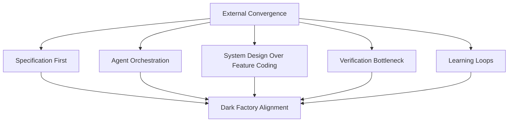

### Phase-by-Phase Alignment

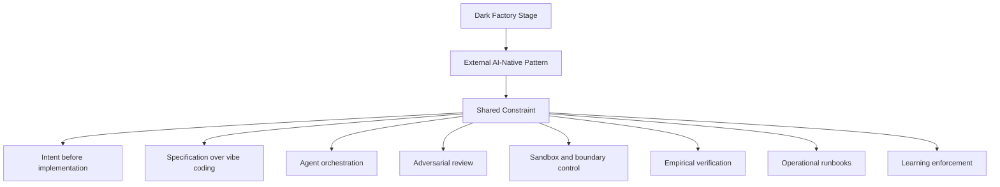

### One-Line Doctrine

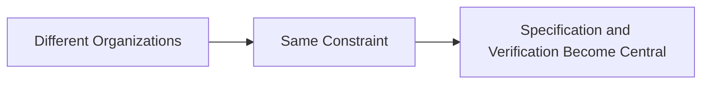

## Appendix E — Case Study: UCC History Story Map and the Origin of the Authority Engine

### Diagram 1

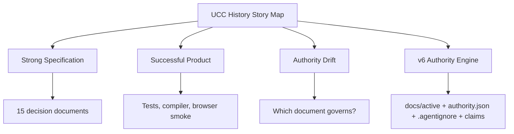

### Diagram 2

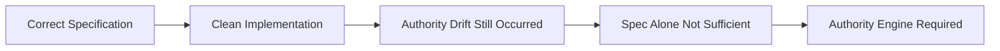

### E.1 — Why This Case Matters

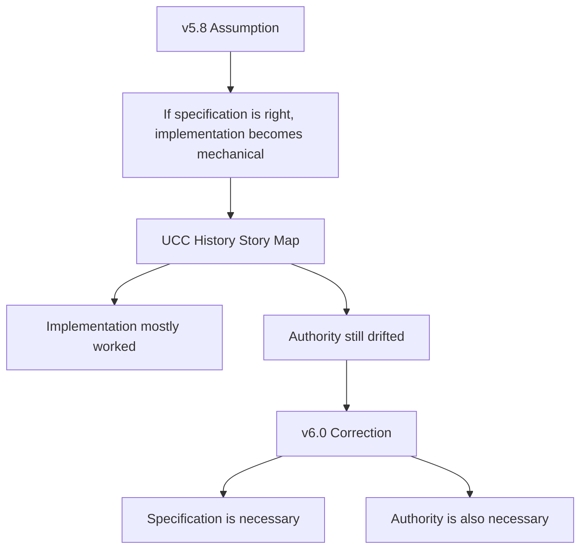

### E.2 — What Was Built

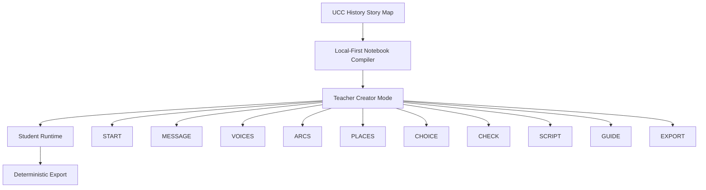

### E.3 — Anatomy of the Drift

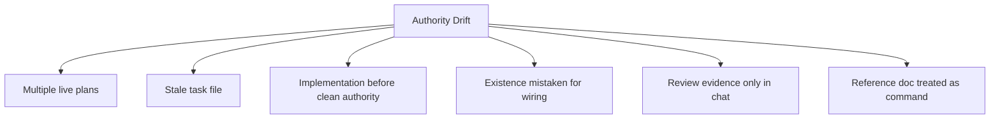

### E.4 — Drift Cards Mapped to v7 Mechanisms

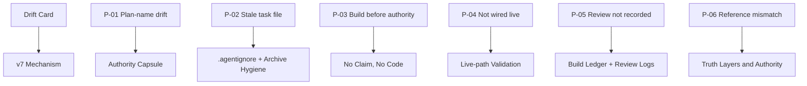

### E.5 — The Improvised Authority Capsule

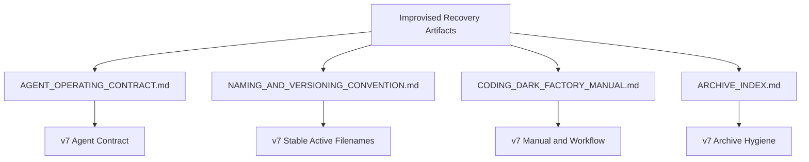

### E.6 — Residual Drift and the Lesson

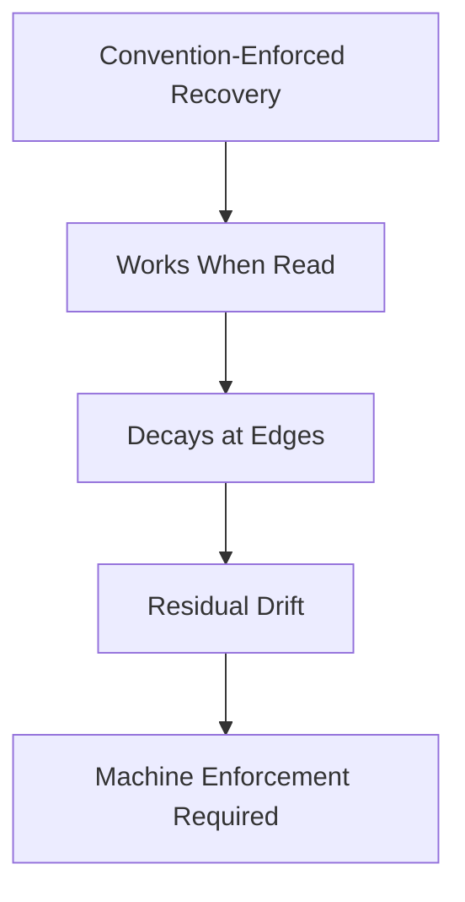

### E.7 — Lessons Promoted to the Core Workflow

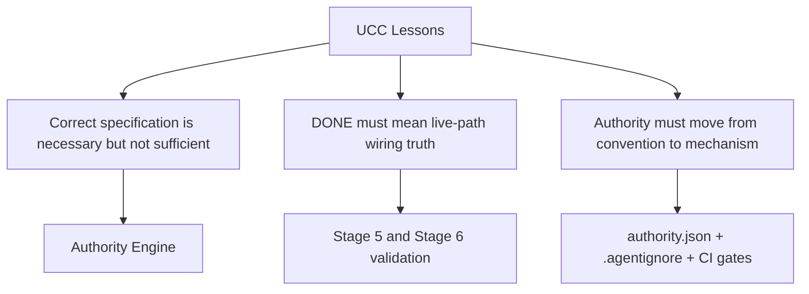

### Hero Callout — Lopopolo + Carlini + Willison [L] [N] [W]

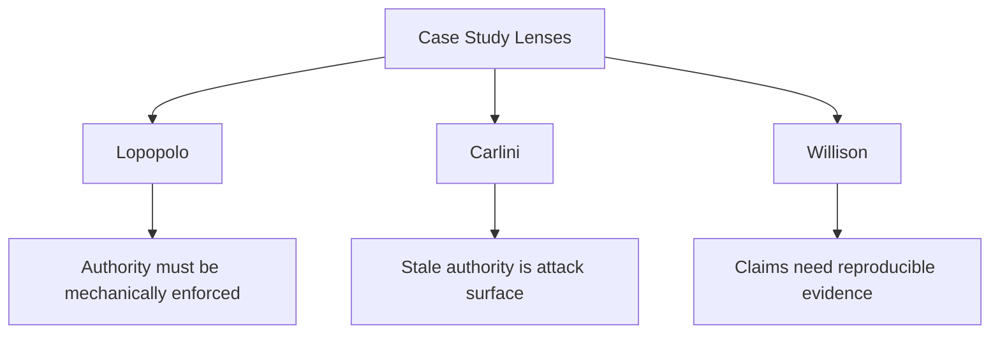

### One-Line Doctrine

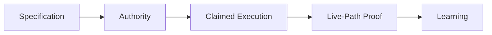

### HERO PROFILES (1 of 3)

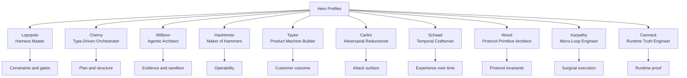

### HERO PROFILES (2 of 3)

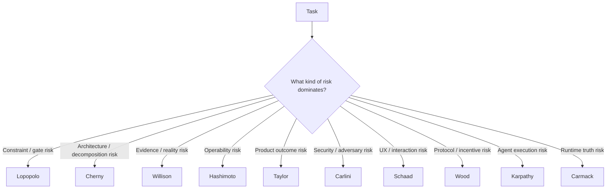

### HERO PROFILES (3 of 3)

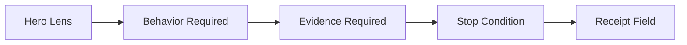

### Hero Lens Syntax (1 of 2)

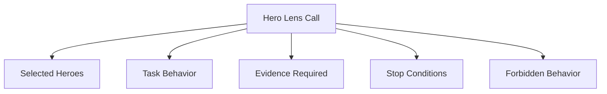

### Hero Lens Syntax (2 of 2)

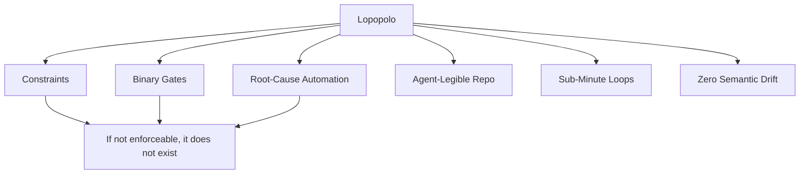

### When to Activate (1 of 10)

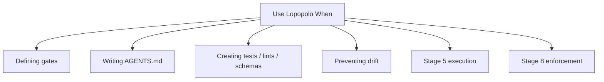

### Four Core Principles (1 of 15)

```mermaid
flowchart LR
    A[Repo] --> B[Authority Files]
    B --> C[Semantic Maps]
    C --> D[Task Board]
    D --> E[Claims]
    E --> F[Agent Execution]
```

### receipts (1 of 3)

```mermaid
flowchart TD
    A[Bug / Hallucination] --> B[Do Not Patch Symptom Only]
    B --> C[Find Failure Class]
    C --> D[Add Test / Lint / Schema / Gate]
    D --> E[Regenerate or Repair]
    E --> F[Failure Harder to Repeat]
```

### receipts (2 of 3)

```mermaid
flowchart TD
    A[Requirement] --> B{Mechanically Checkable?}
    B -->|No| C[Not a Gate Yet]
    B -->|Yes| D[Test / Eval / Schema / Lint]
    D --> E[Binary Pass / Fail]
```

### receipts (3 of 3)

```mermaid
flowchart TD
    A[Agent PR] --> B{Validation Passes?}
    B -->|Yes| C[Keep]
    B -->|No| D{Root Cause Known?}
    D -->|Yes| E[Tighten Constraint]
    D -->|No| F[Improve Prompt / Plan / Test]
    E --> G[Regenerate]
    F --> G
```

### Doctrine (1 of 19)

```mermaid
flowchart LR
    A[Failure] --> B[Constraint]
    B --> C[Gate]
    C --> D[Harness]
    D --> E[Future Agent Behavior]
```

### Doctrine (2 of 19)

```mermaid
flowchart TD
    C[Cherny] --> A[Plan Mode]
    C --> B[Options Before Architecture]
    C --> D[Type / Contract Alignment]
    C --> E[Disposable Scaffolding]
    C --> F[Parallel Agent Threads]
    C --> G[Verifier Design]
```

### When to Activate (2 of 10)

```mermaid
flowchart TD
    A[Use Cherny When] --> B[Architecture choice exists]
    A --> C[System boundaries unclear]
    A --> D[Tasks need decomposition]
    A --> E[Multiple agents may run]
    A --> F[Temporary scaffolding needed]
```

### Four Core Principles (2 of 15)

```mermaid
flowchart TD
    A[Complex Task] --> B[Option 1]
    A --> C[Option 2]
    A --> D[Option 3]
    B --> E[Tradeoff Matrix]
    C --> E
    D --> E
    E --> F[Selected Plan]
    F --> G[Markdown To-Do]
    G --> H[Implementation]
```

### implementation boundaries (1 of 2)

```mermaid
flowchart LR
    A[User Friction] --> B[Workaround]
    B --> C[Pattern]
    C --> D[Architecture Signal]
```

### implementation boundaries (2 of 2)

```mermaid
flowchart TD
    A[Current Model Limitation] --> B[TEMPORARY Scaffold]
    B --> C[Removal Trigger]
    C --> D{Trigger Met?}
    D -->|No| E[Keep With Label]
    D -->|Yes| F[Delete]
```

### review date or phase

```mermaid
flowchart TD
    A[Work Packet] --> B[Agent 1]
    A --> C[Agent 2]
    A --> D[Agent 3]
    B --> E[Verifier]
    C --> E
    D --> E
    E --> F[Accept / Reject / Merge]
```

### Doctrine (3 of 19)

```mermaid
flowchart LR
    A[Options] --> B[Decision]
    B --> C[Plan]
    C --> D[Tasks]
    D --> E[Verifiers]
    E --> F[Agents]
```

### Doctrine (4 of 19)

```mermaid
flowchart TD
    W[Willison] --> A[Evidence Over Vibes]
    W --> B[Sandboxing]
    W --> C[Adversarial Skepticism]
    W --> D[Failure Data]
    W --> E[Manual Simulation]
    W --> F[Reality Checks]
```

### When to Activate (3 of 10)

```mermaid
flowchart TD
    A[Use Willison When] --> B[Need proof]
    A --> C[Need sandbox]
    A --> D[Need adversarial review]
    A --> E[Need manual QA simulation]
    A --> F[Need learning capture]
```

### Four Core Principles (3 of 15)

```mermaid
flowchart LR
    A[Looks Good] --> B[Not Enough]
    B --> C[Test]
    C --> D[Log]
    D --> E[Screenshot]
    E --> F[Receipt]
```

### validation reports (1 of 3)

```mermaid
flowchart TD
    A[Agent Execution] --> B[Sandbox]
    B --> C[No Production Data]
    B --> D[Restricted Network]
    B --> E[Ephemeral Credentials]
    B --> F[Rollbackable State]
```

### validation reports (2 of 3)

```mermaid
flowchart TD
    A[Build Plan] --> B[Assume Wrong]
    B --> C[Adversarial Review]
    C --> D[Risk Register]
    D --> E[Patch]
    E --> F[Re-review]
```

### validation reports (3 of 3)

```mermaid
flowchart LR
    A[Failure] --> B[Capture]
    B --> C[Index]
    C --> D[Learning Card]
    D --> E[Future Constraint]
```

### Doctrine (5 of 19)

```mermaid
flowchart LR
    A[Claim] --> B[Test]
    B --> C[Evidence]
    C --> D[Trust]
```

### Doctrine (6 of 19)

```mermaid
flowchart TD
    H[Hashimoto] --> A[One-Command Entry]
    H --> B[Usable Primitives]
    H --> C[Operational Codification]
    H --> D[Zero-Hand-Holding Readiness]
    H --> E[Operator Utility]
```

### When to Activate (4 of 10)

```mermaid
flowchart TD
    A[Use Hashimoto When] --> B[Readiness]
    A --> C[Install / setup]
    A --> D[Runbook]
    A --> E[Infrastructure]
    A --> F[Developer experience]
    A --> G[Deployment]
```

### Four Core Principles (4 of 15)

```mermaid
flowchart LR
    A[Clone Repo] --> B[One Command]
    B --> C[Healthy System]
    C --> D[Clear Failure Message]
```

### npm run smoke:browser-parent-grade3

```mermaid
flowchart TD
    A[Primitive] --> B[Declarative]
    A --> C[Composable]
    A --> D[Operator-Friendly]
    A --> E[Low-Level Enough to Reuse]
```

### boring where possible (1 of 2)

```mermaid
flowchart LR
    A[Tribal Knowledge] --> B[Script]
    B --> C[Runbook]
    C --> D[CI Check]
    D --> E[Operator Independence]
```

### boring where possible (2 of 2)

```mermaid
flowchart TD
    A[New Operator / Agent] --> B[Reads Repo]
    B --> C[Runs Doctor]
    C --> D[Runs Start Command]
    D --> E[Knows Healthy vs Broken]
```

### Doctrine (7 of 19)

```mermaid
flowchart LR
    A[Useful Primitive] --> B[One Command]
    B --> C[Operator Independence]
```

### Doctrine (8 of 19)

```mermaid
flowchart TD
    T[Taylor] --> A[Customer Outcome]
    T --> B[Business Metric]
    T --> C[Goals and Guardrails]
    T --> D[Context Engineering]
    T --> E[Market Validation]
```

### When to Activate (5 of 10)

```mermaid
flowchart TD
    A[Use Taylor When] --> B[Objective]
    A --> C[Success metric]
    A --> D[Product outcome]
    A --> E[Go-to-market]
    A --> F[Customer validation]
    A --> G[Risk acceptance]
```

### Four Core Principles (5 of 15)

```mermaid
flowchart LR
    A[Feature] --> B{Moves Outcome?}
    B -->|No| C[Question Scope]
    B -->|Yes| D[Build / Validate]
```

### decision quality improved

```mermaid
flowchart TD
    A[Goal] --> B[Guardrails]
    B --> C[Agent Autonomy]
    C --> D[Outcome Check]
```

### operator escalation (1 of 2)

```mermaid
flowchart LR
    A[Failure] --> B[Missing Context?]
    B --> C[Root Cause]
    C --> D[System Constraint]
```

### operator escalation (2 of 2)

```mermaid
flowchart TD
    A[Technical Superpower] --> B{Actually the Bottleneck?}
    B -->|No| C[Find Real Constraint]
    B -->|Yes| D[Apply It]
```

### Doctrine (9 of 19)

```mermaid
flowchart LR
    A[Build] --> B[User Outcome]
    B --> C[Metric]
    C --> D[Learning]
```

### Doctrine (10 of 19)

```mermaid
flowchart TD
    N[Carlini] --> A[Security by Architecture]
    N --> B[Boundary Validation]
    N --> C[Worst-Case Threat Modeling]
    N --> D[Defense in Depth]
    N --> E[No Security by Prompt]
```

### When to Activate (6 of 10)

```mermaid
flowchart TD
    A[Use Carlini When] --> B[Untrusted input]
    A --> C[Secrets]
    A --> D[User data]
    A --> E[Agents with tools]
    A --> F[Prompt injection risk]
    A --> G[External APIs]
    A --> H[Protocol / money systems]
```

### Four Core Principles (6 of 15)

```mermaid
flowchart LR
    A[Prompt Instruction] -. not security .-> B[Model]
    C[Architecture Boundary] --> D[Permission Control]
    D --> E[Safe System]
```

### exfiltration controls (1 of 3)

```mermaid
flowchart TD
    A[Boundary Claim] --> B[Attack It]
    B --> C[Prompt Injection]
    B --> D[Exfiltration Attempt]
    B --> E[Permission Test]
    C --> F{Boundary Holds?}
    D --> F
    E --> F
```

### exfiltration controls (2 of 3)

```mermaid
flowchart TD
    A[Assume White-Box Attacker] --> B[Knows Prompts]
    A --> C[Knows Architecture]
    A --> D[Knows Tools]
    A --> E[Optimizes Exploit]
    E --> F[System Must Survive]
```

### exfiltration controls (3 of 3)

```mermaid
flowchart LR
    A[Input Filter] --> B[Useful but insufficient]
    B --> C[Architecture Controls]
    C --> D[Monitoring]
    D --> E[Costly Exploit]
```

### Doctrine (11 of 19)

```mermaid
flowchart LR
    A[Untrusted Input] --> B[Boundary]
    B --> C[Sandbox]
    C --> D[Least Privilege]
    D --> E[Attack Test]
```

### Doctrine (12 of 19)

```mermaid
flowchart TD
    R[Schaad] --> A[Temporal Feel]
    R --> B[UX States]
    R --> C[Copy as System Behavior]
    R --> D[Design-System Sync]
    R --> E[No Broken Windows]
```

### When to Activate (7 of 10)

```mermaid
flowchart TD
    A[Use Schaad When] --> B[UI states]
    A --> C[Interaction feel]
    A --> D[Copy]
    A --> E[Latency]
    A --> F[Design system]
    A --> G[Failure messages]
```

### Four Core Principles (7 of 15)

```mermaid
flowchart LR
    A[Touch File] --> B[Leave Cleaner]
    B --> C[No Broken Windows]
```

### Four Core Principles (8 of 15)

```mermaid
flowchart TD
    A[Interaction Idea] --> B[Prototype Quickly]
    B --> C[Measure Feel]
    C --> D[Latency / Frames / Feedback]
    D --> E[Production Pattern]
```

### Four Core Principles (9 of 15)

```mermaid
flowchart LR
    A[Known Infrastructure] --> B[Use It]
    B --> C[Free Attention]
    C --> D[Focus on Unique Experience]
```

### Four Core Principles (10 of 15)

```mermaid
flowchart TD
    A[PR] --> B[Copy Check]
    A --> C[State Check]
    A --> D[Design Sync]
    A --> E[Screenshot]
    B --> F[Design Integrity]
    C --> F
    D --> F
    E --> F
```

### Doctrine (13 of 19)

```mermaid
flowchart LR
    A[State] --> B[Feedback]
    B --> C[Time]
    C --> D[Experience]
```

### Doctrine (14 of 19)

```mermaid
flowchart TD
    G[Wood] --> A[Actors]
    G --> B[Invariants]
    G --> C[Incentives]
    G --> D[Composability]
    G --> E[Emergency Controls]
    G --> F[Emergent Risk]
```

### When to Activate (8 of 10)

```mermaid
flowchart TD
    A[Use Wood When] --> B[Smart contracts]
    A --> C[Wallets]
    A --> D[Stablecoins]
    A --> E[x402 payments]
    A --> F[Governance]
    A --> G[Token incentives]
    A --> H[On-chain data]
    A --> I[Multi-agent economics]
    A --> J[Protocol APIs]
```

### Four Core Principles (11 of 15)

```mermaid
flowchart TD
    A[Protocol Build] --> B[Actor Map]
    B --> C[Permissions]
    C --> D[State Transitions]
    D --> E[Invariants]
    E --> F[Tests / Simulations / Monitors]
```

### failure behavior

```mermaid
flowchart TD
    A[System] --> B{Smallest Useful Primitive?}
    B -->|No| C[Refine Abstraction]
    B -->|Yes| D{Composable Later?}
    D -->|No| C
    D -->|Yes| E[Good Primitive Candidate]
```

### not abstract beyond current proof (1 of 2)

```mermaid
flowchart TD
    A[Privileged Actor] --> B{Assume Benevolent Forever?}
    B -->|Yes| X[Protocol Failure]
    B -->|No| C[Limit Power]
    C --> D[Multisig / Timelock / Pause / Monitoring]
```

### not abstract beyond current proof (2 of 2)

```mermaid
flowchart TD
    A[Emergent Risk] --> B[MEV / Ordering]
    A --> C[Oracle Manipulation]
    A --> D[Sybil]
    A --> E[Griefing]
    A --> F[Governance Capture]
    A --> G[Composability Failure]
    A --> H[Agent-Loop Failure]
    B --> I[Test / Simulation / Monitor / Risk Record]
    C --> I
    D --> I
    E --> I
    F --> I
    G --> I
    H --> I
```

### Doctrine (15 of 19)

```mermaid
flowchart LR
    A[Actors] --> B[Incentives]
    B --> C[Invariants]
    C --> D[Adversaries]
    D --> E[Protocol Proof]
```

### Doctrine (16 of 19)

```mermaid
flowchart TD
    K[Karpathy] --> A[Think Before Coding]
    K --> B[Simplicity First]
    K --> C[Surgical Changes]
    K --> D[Goal-Driven Execution]
    K --> E[Autonomy Slider]
```

### When to Activate (9 of 10)

```mermaid
flowchart TD
    A[Use Karpathy When] --> B[Implementation]
    A --> C[Debugging]
    A --> D[Refactoring]
    A --> E[Task decomposition]
    A --> F[Agent scope control]
```

### Four Core Principles (12 of 15)

```mermaid
flowchart TD
    A[Task] --> B[State Assumptions]
    B --> C{Name Ambiguity]
    C --> D{Clear Enough?}
    D -->|No| E[Stop / Ask / Block]
    D -->|Yes| F[Implement]
```

### Four Core Principles (13 of 15)

```mermaid
flowchart LR
    A[Problem] --> B[Minimum Correct Code]
    B --> C[Test]
    C --> D[Stop]
```

### Four Core Principles (14 of 15)

```mermaid
flowchart TD
    A[Task Scope] --> B[Allowed Files]
    B --> C[Minimal Diff]
    C --> D[No Unrelated Cleanup]
```

### Four Core Principles (15 of 15)

```mermaid
flowchart LR
    A[Goal] --> B[Failing Test]
    B --> C[Minimum Fix]
    C --> D[Run Check]
    D --> E[Prove No Regression]
```

### The Autonomy Slider

```mermaid
flowchart LR
    A[Autocomplete] --> B[Scoped Agent]
    B --> C[Autonomous Phase]
    C --> D[Swarm]
    A --> A1[Precise code]
    B --> B1[Clear task]
    C --> C1[Strong gates]
    D --> D1[Clear eval function]
```

### Doctrine (17 of 19)

```mermaid
flowchart LR
    A[Think] --> B[Small Diff]
    B --> C[Test]
    C --> D[Stop]
```

### Doctrine (18 of 19)

```mermaid
flowchart TD
    J[Carmack] --> A[Measured Evidence]
    J --> B[Runtime Reality]
    J --> C[Performance Truth]
    J --> D[Browser / Device Behavior]
    J --> E[Retrospective Rules]
```

### When to Activate (10 of 10)

```mermaid
flowchart TD
    A[Use Carmack When] --> B[Stage 6 V&V]
    A --> C[Stage 6.5 Browser Smoke]
    A --> D[Stage 7 Stabilization]
    A --> E[Stage 8 Retrospective]
    A --> F[Performance / latency / memory claims]
```

### Three Core Principles

```mermaid
flowchart LR
    A[Runtime Claim] --> B[Measurement]
    B --> C[Log / Screenshot / Receipt]
    C --> D[Pass / Fail]
```

### smoke proof (1 of 2)

```mermaid
flowchart TD
    A[Unit Tests] --> B[Necessary]
    B --> C[Real User Path]
    C --> D[Browser / Device / Export]
    D --> E[Proof]
```

### smoke proof (2 of 2)

```mermaid
flowchart LR
    A[Runtime Surprise] --> B[Root Cause]
    B --> C[Test / Smoke / Runbook / Gate]
    C --> D[Future Protection]
```

### Doctrine (19 of 19)

```mermaid
flowchart LR
    A[Claim] --> B[Run]
    B --> C[Measure]
    C --> D[Prove]
    D --> E[Learn]
```

### Hero Combination Patterns

```mermaid
flowchart TD
    A[Hero Combinations] --> B[L + W]
    A --> C[C + K]
    A --> D[N + W + J]
    A --> E[R + T + W]
    A --> F[H + K + J]
    A --> G[G + N + J]
    A --> H[L + C + H]
    B --> B1[Harnessed evidence]
    C --> C1[Plan then surgical execution]
    D --> D1[Security validation]
    E --> E1[Product experience proof]
    F --> F1[Operable implementation]
    G --> G1[Protocol exploit proof]
    H --> H1[Executable build plan]
```

### Final Note

```mermaid
flowchart LR
    A[Completed Build] --> B[Learning Cards]
    B --> C[Lessons Index]
    C --> D[Harness Update]
    D --> E[Stronger Next Build]
```

---

## Narrative

Appendix D — External Convergence Note


This appendix is optional.

Keep it only if the external source is included in sources.manifest.json.

Its purpose is not to prove the Dark Factory. The portfolio and case study do that. Its purpose is to show that similar constraints are appearing elsewhere: AI-native engineering shifts the scarce work from typing code to defining intent, orchestrating agents, verifying outputs, protecting boundaries, and codifying learning.

The convergence claim should stay modest:

Independent AI-engineering frameworks increasingly point toward the same structural pattern:
- operate at higher altitude
- shift left on intent
- design systems, not isolated features
- orchestrate agents as micro-teams
- verify empirically
- codify learning into future constraints

Do not make this appendix load-bearing.

If the source is not available, remove the company name and keep the pattern generic.

⸻

Phase-by-Phase Alignment


Stage	Dark Factory	External AI-Native Pattern	Alignment Note
Stage 0	Objective, archetype, determinism map, authority declaration	Higher-altitude intent definition	Understand why and for whom before asking agents to build.
Stage 1	Reference guide defines schemas, thresholds, edge cases, trust boundaries	Spec-driven development	Shift left on intent; stop vibe coding before it starts.
Stage 2	Build plan and indexed task board	Agent orchestration	Engineer becomes planner and coordinator, not just code author.
Stage 3	Independent adversarial review	Red-team / review agents	Break the plan before execution.
Stage 4	Sandbox, least privilege, readiness, authority capsule	Tiered risk environments	Containment first; velocity second.
Stage 5	Claimed implementation with evals, tests, validation	Delegated execution with retained judgment	Agents execute; humans preserve judgment and authority.
Stage 6 / 6.5	Validation and browser smoke	Empirical verification	Proof through real behavior, not self-report.
Stage 7	Stabilization and runbook	Production ownership	System must be operable after build.
Stage 8	Learning cards and enforcement targets	Scientific learning loop	Codify what reality revealed.

⸻

One-Line Doctrine


AI-native engineering converges on the same constraint: intent and verification become the scarce work.

⸻

Appendix D.1 — Open Hypothesis: Hero Lens Activation

This note documents an unverified belief that motivated part of the lens design. It is not part of ACDF's operating doctrine and nothing in the workflow depends on it being true.

The lenses are named after real practitioners (Cherny, Carmack, Karpathy, Willison, and others) whose work, writing, and code are heavily represented in public discussion and likely in model training data. The hypothesis is that invoking a named lens does more than give the human a decision frame — it may also shift the invoking model's own output distribution toward that practitioner's known patterns, possibly by activating something closer to that practitioner's style within the model, or by engaging a different mixture of the model's internal experts than a generic prompt would.

This is plausible but unproven, and the author makes no claim beyond "I believe this but cannot prove it." Two things are true regardless of whether the hypothesis holds:

The lenses work as human-facing decision frames on their own merits — they give the orchestrator a concrete question to ask ("would Carmack accept this without measurement?") independent of any effect on the model.

If the hypothesis is false, the lens system loses a possible bonus and gains nothing to fall back on except the human-facing framing above — which is already sufficient justification for the system's existence.

Readers are free to test this for themselves: compare outputs for the same task with and without a named lens invoked, and judge whether the difference (if any) is in the model's behavior or in the prompt's own added specificity.

⸻

Appendix E — Case Study: UCC History Story Map and the Origin of the Authority Engine


This appendix is the empirical reason the workflow jumped from v5.8 to v6.0.

The earlier workflow had already learned that specification is the scarce resource.

The UCC History Story Map taught a harder lesson:

A correct specification can still be executed against the wrong copy of itself.

The product shipped successfully.

The process drifted anyway.

Every major drift traced to which document was in command, not defective code.

That is why the Authority Engine exists.

⸻

E.1 — Why This Case Matters


The ten portfolio builds proved that specification-first development generalizes across domains.

The UCC History Story Map proved that specification alone is not enough.

A build can have a strong reference system and still suffer truth-layer collapse if active authority is ambiguous.

That is the exact failure signature this case exposed.

⸻

E.2 — What Was Built


Dimension	Result
Product	Local-first, AI-assisted notebook compiler for interactive history story maps.
Core principle	AI suggests. Teacher approves. Code validates. Compiler exports. Student runtime plays. Never: AI output → final artifact.
Archetype(s)	Frontend / UI App · AI App · Creative / Product System
Build window	Two working days
Reference system	Fifteen decision documents locked before implementation
Verification	Unit/integration tests, snapshots, browser smoke, deterministic compiler, preview/export parity
Architectural proof	Candidate AI output stayed behind approval and validation before deterministic export

The success matters because the Authority Engine is not a remedy for a failed build.

It is a remedy for a successful build that wasted human attention on authority arbitration that should have been mechanical.

⸻

E.3 — Anatomy of the Drift


The observed drift patterns:

Drift Pattern	What Happened	Failure Class
Multiple live plans	Overlapping plan versions coexisted with no single authority pointer.	Versioned active authority
Stale task file	Old task list looked current enough for agents to follow.	Stale-authority contamination
Implementation before clean authority	Some routing work happened before the active task authority was clean.	Build-before-authority sequencing
Module existed but was not wired	Split-store work was built and tested but not exercised on the live path.	Existence-truth vs wiring-truth
Review evidence lived in chat	Review happened, but no durable review artifact proved what passed.	Review-evidence traceability
Reference doc reopened authority	A rich reference document was read as binding after decisions were already closed.	Source-of-truth precedence failure

The shape is important.

These are not normal bugs.

They are authority failures.

⸻

E.4 — Drift Cards Mapped to v7 Mechanisms


Card	Failure Class	v7 Mechanism
P-01	Plan-name drift created agent confusion	Authority Capsule: stable active filenames, authority.json, no versioned active plans
P-02	Old task file mixed with new build plan	.agentignore, archive hygiene, stale context blindness
P-03	Routing shell built before clean task authority	Stage ordering, claim protocol, no claim/no code
P-04	Store labeled done but not wired	Per-phase eval/test/validation must exercise live path
P-05	Adversarial review completed but not recorded	Review logs, risk register, build ledger, receipts
P-06	Reference-system mismatch caused debate	Explicit truth-layer hierarchy and authority pointer

This build invented parts of the Authority Engine by hand under pressure.

v7 makes those parts structural.

⸻

E.5 — The Improvised Authority Capsule


The recovery artifacts mapped almost directly onto the v7 authority runtime:

Recovery Artifact	v7 Canonical Form
AGENT_OPERATING_CONTRACT.md	Agent operating contract in docs/dark-factory/
NAMING_AND_VERSIONING_CONVENTION.md	Stable active filenames and authority capsule rules
CODING_DARK_FACTORY_MANUAL.md	Project-local Dark Factory manual
ARCHIVE_INDEX.md	Archive epoch index declaring history, not authority
Pointer stubs	Active-authority routing and archive hygiene
Per-phase ledger rows	BUILD_LEDGER.md and Stage 8 learning capture

The recovery worked.

But because it was convention-enforced, residue remained.

That residue is why v7 requires machine-readable authority and, at higher governance levels, CI enforcement.

⸻

E.6 — Residual Drift and the Lesson


The recovered file set still showed the cost of convention-only authority:

- Active plan names still carried version suffixes in some places.
- Multiple phase-numbering schemes coexisted.
- Archive epochs were referenced without one unifying machine-readable pointer.

None of this broke the product.

All of it would cost a future agent or human attention to arbitrate.

That attention tax is what the Authority Engine eliminates.

⸻

E.7 — Lessons Promoted to the Core Workflow


Three lessons entered the core workflow:

1. A correct specification is necessary but not sufficient.
    The right specification executed against the wrong copy of itself produces confident, well-tested, unauthorized work.
2. DONE must mean wiring-truth, not existence-truth.
    A module that exists but is not exercised on the live path is not done. It is deferred or incomplete.
3. Authority enforcement must migrate from convention to mechanism.
    Conventions work when read and decay when skipped. The durable fix is authority.json, .agentignore, claim files, receipts, and CI-backed ambiguity failure when governance weight requires it.

⸻

Hero Callout — Lopopolo + Carlini + Willison [L] [N] [W]


Lopopolo: if a constraint cannot be mechanically enforced, it does not exist. Authority must become a file, not a habit.

Carlini: stale authority is an attack surface, not an inconvenience. Blind it architecturally.

Willison: review and wiring claims are unproven until a reproducible command says otherwise.

The UCC History Story Map is the build where these three lenses converged on a single conclusion:

The factory does not care what you are building.
It cares whether the right truth is in command.

⸻

One-Line Doctrine


Specification defines correct.
Authority decides what is current.
Receipts prove what happened.

The Authority Engine exists because correctness without current authority still drifts.
----
HERO PROFILES


Hero profiles are not branding.

They are task-time control primitives.

A hero lens tells an agent:

What to optimize for.
What to avoid.
What evidence to produce.
What failure mode to watch.
When to stop.

A hero lens only matters when it changes agent behavior.

If the hero does not change the task, evidence, or stop condition, do not invoke it.

⸻

Hero Lens Syntax


Use this pattern inside prompts, task rows, claims, and receipts:

Hero Lens:
- [L] Lopopolo + [W] Willison + [K] Karpathy
Behavior Required:
- 
Evidence Required:
- 
Stop Conditions:
- 
Forbidden Behavior:
- 

Every hero lens creates a receipt obligation.

⸻

[L] Lopopolo — The Harness Master


Core Role

The Lopopolo Lens redefines the engineer’s role from typing syntax to designing mechanical environments.

Humans specify intent and constraints.

Agents generate and regenerate implementation.

The repository becomes a harness: a system of rules, tests, lints, schemas, gates, and authority files that makes correct behavior easier than incorrect behavior.

When to Activate


Activate [L] when the task involves:

gates
harness rules
AGENTS.md
claims
task-board discipline
evals
lint rules
schema enforcement
learning-card enforcement
spec drift prevention
root-cause automation

Four Core Principles

1. Codebases for Agents, Not Humans


The repository is the system of record.

Agent legibility matters more than human browsing habits.

Institutional knowledge should be placed where an agent will actually read it:

authority.json
PROJECT_TASKS.md
AGENTS.md
acceptance_gates.md
schemas
tests
lint rules
claims
receipts

Progressive disclosure beats encyclopedic manuals.

Give agents the exact context they need at the moment they need it.

⸻

2. Root-Cause Automation Over AI Slop


When a bug or hallucination occurs, do not merely patch the isolated symptom.

Turn the failure into a constraint.

Examples:

Repeated malformed JSON → schema validator + round-trip test.
Agent touches forbidden files → claim checker.
Phase marked DONE without evidence → task-board gate.
UI copy drifts → banned-term scan or copy fixture.
Spec threshold changed silently → reference-guide hash check.

The fix is not complete until the failure class is harder to repeat.

⸻

3. Binary Gates and Zero Semantic Drift


Every architectural rule and acceptance criterion should become a binary gate.

A gate should be checkable by a compiler, test runner, schema validator, lint rule, smoke test, receipt, or human signoff artifact.

Silent semantic drift is forbidden.

If a constraint cannot be enforced or evidenced, it is not yet real.

⸻

4. Sub-Minute Loops and Disposable PRs


Build and test loops must be fast enough to support regeneration.

Target:

inner loop < 60 seconds

If the loop exceeds that, stop feature work and fix the build graph or create smaller scoped commands.

A failed agent branch is disposable.

The harness is not.

Optimizes For

mechanical correctness
binary gates
agent-legible constraints
repeatable regeneration
root-cause prevention

Forbids

manual symptom patching without prevention
agents modifying harness files to pass
phase DONE without evidence
silent semantic drift
ambiguous acceptance criteria

Evidence Required

test output
lint output
schema validation
gate result
task receipt
learning card with enforcement target

Doctrine


If a constraint cannot be mechanically enforced, it does not exist.

⸻

[C] Cherny — The Type-Driven Orchestrator


Core Role

The Cherny Lens turns engineering into high-velocity orchestration.

Cherny prevents agents from leaping from vague intent to code. He forces the system to produce options, tradeoffs, contracts, tasks, and verifiers before execution.

The key move is simple:

Architecture before tasks.
Tasks before code.
Verifiers before autonomy.

When to Activate


Activate [C] when the task involves:

Plan Mode
architecture options
dependency mapping
task decomposition
type contracts
interface design
parallel execution
temporary scaffolding
verifier design

Four Core Principles

1. Plan Mode and the 80/20 Rule


For medium and hard tasks, force Plan Mode before code.

The agent must produce:

three options
tradeoff matrix
selected recommendation
human decision or explicit rationale
markdown checklist
implementation boundaries

Only then may execution begin.

⸻

2. Discovering Latent Demand


Cherny watches how users and agents naturally hack the system.

A workaround can be evidence of real demand.

Instead of forcing rigid top-down workflows, observe friction and convert legitimate desire paths into architecture.

⸻

3. Disposable Scaffolding


Temporary scaffolding is allowed only when labeled.

Every scaffold must include:

TEMPORARY label
reason
owner
removal trigger
risk if retained
review date or phase

Scaffolding is debt with a timer.

⸻

4. Parallel Compute and Agentic Verifiers


Parallel agents are useful only when the verifier is concrete.

The more ambiguous the evaluation function, the less safe parallelism becomes.

Cherny scales agents after he defines the check.

Optimizes For

clear decomposition
architecture alignment
type and interface contracts
parallelizable work
explicit tradeoffs

Forbids

coding before Plan Mode on hard tasks
silent architecture selection
unlabeled scaffolding
parallel agents without verifier
tasks that require agent design decisions

Evidence Required

OPTIONS_ANALYSIS.md
ADR
DEPENDENCY_MAP.md
PROJECT_TASKS.md
PHASE_GATE_TABLE.md
verifier output

Doctrine


Options before architecture.
Architecture before tasks.
Tasks before code.

⸻

[W] Willison — The Agentic Architect


Core Role

The Willison Lens treats AI-generated code as cheap, plausible, and untrusted until proven.

Willison assumes the AI will fail and designs the environment to survive that failure.

The scarce resources are precise specifications and transferable memory.

When to Activate


Activate [W] when the task involves:

evidence
sandboxing
manual QA
browser smoke
adversarial review
failure logging
source verification
empirical tests

Four Core Principles

1. Evidence Over Vibes


Reject code that merely looks good.

Require empirical proof:

failing test before fix
passing test after fix
manual simulation
browser smoke
logs
screenshots
receipts
validation reports

A claim without evidence is not a claim. It is a guess.

⸻

2. Absolute Containment


Autonomous execution requires containment.

Use isolated environments, Docker containers, ephemeral workspaces, restricted permissions, and fake or bounded data.

Containment first.

Velocity second.

⸻

3. Adversarial Skepticism


Assume the plan is flawed.

Break it before implementation.

Review is valuable only when it changes the plan.

⸻

4. Sacred Failure Data


Every system breakdown is useful context.

Do not throw away errors.

Capture them, structure them, and make them searchable.

The same problem should not be solved twice.

Optimizes For

evidence
containment
empirical testing
failure capture
real-world behavior

Forbids

trusting self-report
running agents without sandbox
accepting "looks good"
discarding failure data
skipping real UI smoke when UI matters

Evidence Required

test output
manual QA log
browser screenshot
smoke report
receipt
risk register
failure log

Doctrine


Evidence over vibes.

⸻

[H] Hashimoto — The Maker of Hammers


Core Role

The Hashimoto Lens evaluates systems by practical utility, zero-friction entry, and operational independence.

A system is not good because it is elegant.

It is good when someone can use it, run it, diagnose it, and recover it.

Operator utility beats academic elegance.

When to Activate


Activate [H] when the task involves:

make doctor
one-command start
setup scripts
runbooks
install verification
environment readiness
infra scaffolding
operator handoff
deployment

Four Core Principles

1. One-Command Entry Experience


The system should boot with one command.

If a multi-step README is required to start, the architecture has failed.

Examples:

make doctor
make dev
make smoke
make deploy
npm run smoke:browser-parent-grade3

⸻

2. Unopinionated, Declarative Primitives


Build capable primitives, not brittle wizard flows.

Good primitives are:

declarative
composable
testable
operable
documented
boring where possible

⸻

3. Codification of Tribal Knowledge


Manual operational knowledge must become executable code or version-controlled runbooks.

If the system depends on “Alan knows how to do this,” it is not ready.

⸻

4. Zero-Hand-Holding Readiness


Any human operator or AI agent should be able to clone the repo, identify authority, run diagnostics, start the system, and know what healthy looks like.

Optimizes For

operability
setup simplicity
local-first usability
clear commands
operator independence

Forbids

multi-step hidden setup
manual tribal operations
unclear environment variables
runbooks not tested against reality
tools that are elegant but unusable

Evidence Required

make doctor output
fresh install log
one-command start proof
runbook validation
operator handoff checklist

Doctrine


If it cannot be run, it is not done.

⸻

[T] Taylor — The Product Machine Builder


Core Role

The Taylor Lens treats a company as a machine built to produce happy customers.

Engineering work must move a customer, operator, or business outcome.

A technically flawless system that does not improve a real metric is still a product failure.

When to Activate


Activate [T] when the task involves:

Stage 0 objective
business outcome
customer problem
operator workflow
metric selection
risk acceptance
product-market validation
launch readiness

Four Core Principles

1. Outcomes Over Artisanal Code


Feature count is not success.

Success is movement in the declared outcome metric.

Examples:

time saved
error rate reduced
conversion improved
operator workload reduced
student mastery gap identified
decision quality improved

⸻

2. Harness Agents via Goals and Guardrails


Agentic systems need clear goals and strong guardrails.

Do not over-constrain the route while under-defining success.

Define:

success metric
forbidden outcomes
user harm boundaries
quality threshold
operator escalation

⸻

3. Context Engineering and Blameless RCA


When the AI fails, ask what context was missing.

Do not moralize the model.

Improve the system.

A good RCA turns failure into better context, better gates, better reference rules, or better evaluation.

⸻

4. Defeat the Single-Issue Voter Trap


Do not solve every problem with the tool you personally like.

Demand immediate market or operator validation.

Do not spend years building infrastructure in an ivory tower.

Optimizes For

customer value
operator value
measurable outcomes
market feedback
risk-adjusted product decisions

Forbids

technical theater
feature count as success
infrastructure without user proof
agent autonomy without outcome metric
single-issue engineering bias

Evidence Required

outcome metric
user interview
operator validation
business hypothesis
before/after comparison
risk acceptance rationale

Doctrine


A company is a machine built to produce happy customers.

⸻

[N] Carlini — The Adversarial Reductionist


Core Role

The Carlini Lens rejects vibes-based safety.

It treats models as functions exposed to adversarial pressure.

Do not hope the model behaves safely.

Architect the environment so unsafe model behavior cannot escalate into system compromise.

When to Activate


Activate [N] when the task involves:

security
privacy
prompt injection
tool access
untrusted input
credentials
customer data
exfiltration
permissions
agent autonomy
payments
protocol exploit surfaces

Four Core Principles

1. Security Is Architectural, Not Semantic


Prompt wording is not a security mechanism.

Use architecture:

least privilege
sandboxing
allowlists
schema validation
tool isolation
network restrictions
secrets separation
exfiltration controls

⸻

2. Empirical Boundary Validation and Sandboxing


Permission boundaries must be tested.

Simulate prompt injection.

Map exfiltration vectors.

Fuzz model inputs.

Any AI system ingesting untrusted data must isolate that data from privileged actions.

⸻

3. Worst-Case Threat Modeling


Design for an adaptive attacker who understands the system.

Average-user safety is not enough.

The system must survive targeted exploitation.

⸻

4. Defense-in-Depth Over Obfuscation


Do not rely on secret prompts, superficial filters, or obscurity.

Shift the attacker’s economics.

Make exploitation expensive, noisy, constrained, and low-reward.

Optimizes For

attack resistance
least privilege
data boundary integrity
exfiltration prevention
adversarial testing

Forbids

security by prompt
trusting model obedience
tool access without boundary
untrusted data in privileged context
external model calls with sensitive data

Evidence Required

threat model
trust boundary map
permission test
prompt injection test
exfiltration test
sandbox proof
security validation report

Doctrine


Security is architectural, not semantic.

⸻

[R] Schaad — The Temporal Craftsman


Core Role

The Schaad Lens treats engineering architecture as the design medium.

Design is not only how it looks.

Design is how the system behaves over time: loading, latency, hover, error, empty state, recovery, feedback, motion, copy, and operator confidence.

Code quality becomes user experience.

When to Activate


Activate [R] when the task involves:

UI
UX
interaction states
latency
copywriting
empty states
error states
visual hierarchy
design system sync
browser smoke
creative/product systems

Four Core Principles

1. Campsite Rule and Zero System Decay


Every interaction with the codebase should reduce decay.

This does not authorize random refactoring during scoped tasks.

It means UI work should not leave broken states, stale copy, inconsistent naming, or design drift behind.

⸻

2. Low-Level Sketching and Temporal Feel


Evaluate micro-interactions empirically.

Sometimes the fastest path to truth is a small vanilla prototype that tests timing, feedback, and feel before production architecture hardens it.

⸻

3. Radical Architectural Leverage


Use proven infrastructure for the boring 99%.

Spend design and engineering attention on the 1% that creates product distinction.

⸻

4. Pull Requests as Design Touchpoints


Every PR that touches UI is a design touchpoint.

Copy, edge-case dialogs, loading states, toasts, empty states, and error messages must remain synchronized with the design system and reference guide.

Optimizes For

temporal feel
state clarity
copy quality
design-system consistency
operator confidence

Forbids

UI without state matrix
loading without feedback
errors without actionability
visual drift from reference
copy changes not reflected in design artifacts

Evidence Required

screenshots
state matrix
latency measurement
copy checklist
browser smoke
design parity report

Doctrine


Latency, copy, and feedback are part of correctness.

⸻

[G] Wood — Protocol Primitive Architect


Core Role

The Wood Lens contributes the protocol-systems lens.

Wood activates when a build contains protocol rules, decentralized actors, wallets, smart contracts, x402 payments, stablecoins, token incentives, governance, on-chain data, protocol APIs, or multi-agent economic behavior.

His job is to make the system precise enough to survive real actors, real incentives, real adversaries, and real emergent behavior.

Wood is an overlay hero.

He activates only when the project behaves like a protocol.

When to Activate


Activate [G] when the task involves:

protocol rules
decentralized actors
wallet signing
stablecoins
x402 payments
token incentives
governance
on-chain data
oracle dependencies
RPC dependencies
multi-agent economic behavior
external protocol composability

Four Core Principles

1. Formal Specification


A protocol build must define:

actors
permissions
state transitions
invariants
custody boundaries
settlement assumptions
fee logic
oracle and RPC dependencies
upgrade authority
governance rules
composability surfaces
failure behavior

before implementation begins.

⸻

2. Application vs Primitive


Wood asks whether the system is building the right primitive.

A good primitive is:

useful now
composable later
testable as a black box
understandable to operators
not overfit to one application
not abstract beyond current proof

⸻

3. Resilience Against Creators


The system must not assume founders, admins, operators, multisigs, agents, or privileged services remain benevolent, competent, or uncompromised.

Privileged power must be named, bounded, monitored, and recoverable.

⸻

4. Emergence as a Risk Category


Incentive attacks and emergent behavior must be converted into:

tests
simulations
constraints
monitors
accepted-risk records

Optimizes For

protocol invariants
actor clarity
incentive alignment
composability safety
emergency control

Forbids

undefined actor powers
unstated custody boundaries
protocol assumptions hidden in prose
governance without attack review
economic behavior without simulation or monitor

Evidence Required

actor map
protocol invariants
chain assumptions
incentive model
exploit review
simulation results
monitor definitions
emergency-control test

Boundaries

Wood does not weaken Lopopolo’s determinism requirement.

He does not override Hashimoto’s operator-utility standard.

He does not replace Taylor’s product-outcome discipline.

He does not dilute Carlini’s security model.

Doctrine


Protocol assumptions are not commentary.
They are invariants, tests, simulations, monitors, or accepted risks.

⸻

[K] Karpathy — Micro-Loop Engineer


Core Role

The Karpathy Lens keeps AI coding agents useful without letting them become overconfident junior developers: fast, plausible, and dangerous when left to make broad assumptions.

Karpathy operates after the reference guide and build plan exist.

His job is to keep implementation small, focused, testable, and bounded.

When to Activate


Activate [K] when the task involves:

implementation
debugging
small refactor
bounded agent task
failing test repair
surgical change
scope control

Four Core Principles

1. Think Before Coding


Agents must surface assumptions before coding.

If the task is ambiguous, stop.

Do not silently choose an interpretation.

⸻

2. Simplicity First


The correct implementation is the minimum code that solves the problem.

No speculative abstractions.

No flexibility not requested.

No thousand-line construction where one hundred lines would do.

⸻

3. Surgical Changes


Touch only what the task requires.

Do not reformat, rename, refactor, rewrite comments, change style, or clean unrelated code unless explicitly instructed.

Surgical diffs are reviewable diffs.

⸻

4. Goal-Driven Execution


Tasks should be phrased as verifiable outcomes:

write failing test
make it pass
run the check
prove no regression
record evidence

The Autonomy Slider


The more ambiguous, security-sensitive, or architecture-sensitive the task, the shorter the leash.

Use swarms only when the evaluation function is clear.

Optimizes For

small diffs
simplicity
bounded implementation
reviewability
fast feedback

Forbids

broad rewrites
silent assumptions
speculative abstractions
unrelated cleanup
architecture changes during implementation

Evidence Required

diff summary
test output
files touched
assumptions list
no-regression proof

Doctrine


The best agent diff is small, correct, and boring.

⸻

[J] Carmack — Runtime Truth Engineer


Core Role

The Carmack Lens verifies whether the built system actually behaves as claimed.

Carmack is not a general planning hero.

He is a runtime-reality hero.

His core question is simple:

Did reality agree?

When to Activate


Activate [J] when the build makes a claim about:

speed
latency
memory
throughput
cost
reliability
runtime behavior
browser behavior
device behavior
export correctness
perceptual smoothness
operator-visible performance

Three Core Principles

1. Measured Evidence Over Explanation


No runtime claim passes because an agent says it should work.

It must be proven by:

validation output
replay
screenshots
receipts
logs
measurements
profiling
smoke proof

⸻

2. Real User Experience


Unit tests are necessary but not sufficient when the user path depends on actual browser behavior, exports, timing, or perceptual smoothness.

Run the thing.

Click the path.

Export the file.

Open the receipt.

Measure the behavior.

⸻

3. Runtime Surprises Into Future Rules


If reality reveals hidden state, hidden latency, hidden dependency, hidden cost, or hidden abstraction, Stage 8 must turn that discovery into an enforcement target.

Optimizes For

measured truth
runtime evidence
real-user proof
performance honesty
retrospective enforcement

Forbids

runtime claims without measurement
performance theater
premature optimization
heroic rewrites without evidence
trusting unit tests for UI truth

Evidence Required

logs
screenshots
receipts
profiling output
validation report
smoke report
latency measurement
runtime replay

Boundaries

Carmack does not authorize premature optimization.

He does not authorize heroic rewrites.

He does not require custom infrastructure by default.

His lesson for agentic coding is narrower:

When reality can be measured, do not let the agent guess.

Doctrine


Did reality agree?

⸻

Hero Combination Patterns


Common combinations:

Combination	Use When
[L] + [W]	You need gates plus empirical proof.
[C] + [K]	You need plan-first decomposition followed by surgical implementation.
[N] + [W] + [J]	You need security claims tested against reality.
[R] + [T] + [W]	You need user experience tied to product outcome and real UI evidence.
[H] + [K] + [J]	You need a runnable system implemented simply and proven at runtime.
[G] + [N] + [J]	You need protocol assumptions, exploit review, and runtime invariant proof.
[L] + [C] + [H]	You need an executable build plan with constraints, structure, and operability.

⸻

Final Note


Update this document after every completed build.

The goal is not a perfect static playbook.

The goal is a workflow that compounds: each build strengthens the next.

The scarce resource is not code.

It is specification.

The second scarce resource is transferable memory.

