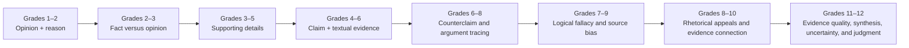

# Argument and Evidence Progression

This UCC-critical strand connects literacy to judgment, History Story Maps, and conundrum reasoning.

**Legend:** Arrows show a useful diagnostic spiral. A later argument challenge may call for evidence on an earlier move, not an assumption of deficiency.
