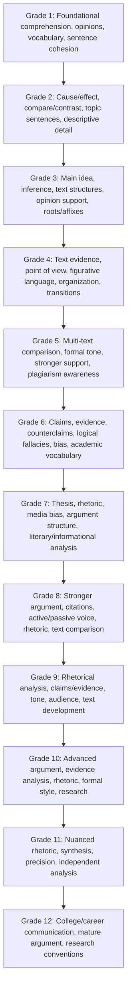

# California Common Core ELA Progression Spine

This broad grade-equivalence map shows recurring ELA emphases. It is reference terrain, not a mandatory learning schedule.

**Legend:** Arrows show grade-reference order only. ELA development spirals and may be uneven across strands.
