# Reading Comprehension Progression

Comprehension revisits the same moves with increasingly complex texts, independence, and analysis through Grades 1–12.

```mermaid
flowchart LR
  A["Grades 1–2<br/>Main topic and key details"] --> B["Grades 2–3<br/>Cause/effect and sequence"]
  B --> C["Grades 3–4<br/>Inference and theme"]
  C --> D["Grades 4–5<br/>Point of view and text structure"]
  D --> E["Grades 5–6<br/>Multi-text comparison and evidence"]
  E --> F["Grades 6–8<br/>Argument tracing and informational analysis"]
  F --> G["Grades 9–10<br/>Rhetorical and literary analysis"]
  G --> H["Grades 11–12<br/>Synthesis, uncertainty, and nuanced interpretation"]
```

**Legend:** Each node is a recurring emphasis, not a mastery checkpoint that must precede every later node.
