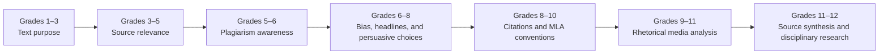

# Research and Media Literacy Progression

Research and media judgment grow from recognizing purpose to evaluating, citing, and synthesizing sources.

**Legend:** Source-evaluation evidence belongs in receipts and artifacts; this graph is a terrain map.
