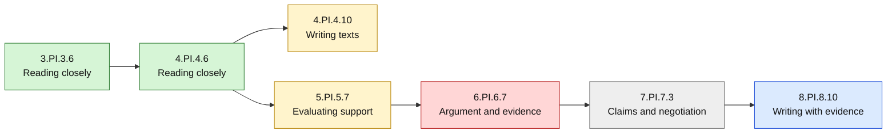

# Sample ELA Learner Heat Map

> **Fictional sample only — not real learner data.** This is an ad hoc diagnostic example, not core app UI.

**Legend:** green = mastered; yellow = learning; red = foundational-repair candidate; gray = needs evidence; blue = advanced. Status must come from actual overlay evidence.
