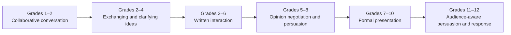

# Speaking, Listening, and Collaboration

Collaboration moves between listening, exchanging ideas, negotiating opinions, and formal communication.

**Legend:** Speaking, listening, and writing can develop at different rates and should be evidenced separately.
