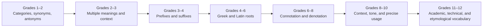

# Vocabulary and Language Progression

Word knowledge grows through repeated encounters with morphology, context, nuance, and discipline-specific language.

**Legend:** Vocabulary strands support comprehension, writing, and argument in parallel.
