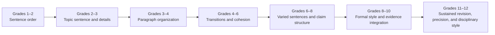

# Writing Structure Progression

Writing develops by revisiting organization and craft with greater scope, control, audience awareness, and revision.

**Legend:** Writing artifacts provide evidence; benchmark nodes only locate the terrain.
