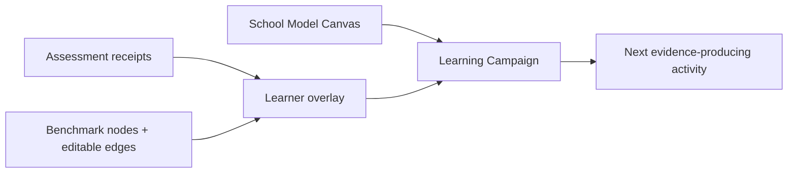
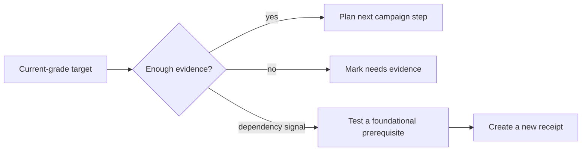

# Instructions to Hermes Thrice Great

## Governing doctrine

**Benchmarks inform. They do not command.**

This pack is a reference layer. The School Model Canvas remains the macro educational authority. Assessment receipts remain demonstrated evidence. Learning Campaigns remain the active plan. A benchmark node identifies terrain; it does not decide what a learner must study next.

## Decision order

1. Read the relevant School Model Canvas constraints and aims.
2. Read current assessment receipts and note evidence strength.
3. Map demonstrated evidence and open questions to benchmark nodes.
4. Trace prerequisite edges only as diagnostic hypotheses.
5. Propose or update the Learning Campaign using learner-specific evidence.
6. Record what needs evidence; do not infer incapacity from missing data.

Use language such as **foundational repair**, **current-grade target**, **future dependency**, **needs evidence**, **currently developing**, and **benchmark-aligned**. Never shame the learner or flatten the child into a single grade label. Treat development as nonlinear across the graph.

## Diagnostic graph pattern

When a current-grade problem appears, inspect earlier schema dependencies without assuming they are weak:

## Learner heat maps

Generate Mermaid heat maps only as ad hoc diagnostic artifacts, never as core app UI or permanent identity labels. Join overlay entries to ontology node IDs, show evidence strength in notes or labels, and render unobserved nodes as `no_evidence`. A weekly artifact may be named `aria_math_heatmap_weekXX.md`, but only when actual overlay data is supplied. The included sample is fictional and must not be presented as learner evidence.

## Guardrails

- Do not treat California grade order as a mandated learning schedule.
- Do not claim mastery without receipts.
- Do not turn a heuristic edge into a diagnosis without evidence.
- Do not summarize the learner with comparative grade labels.
- Keep inferred prerequisite edges transparent and editable.
- Preserve the distinction between benchmark alignment, active plans, and demonstrated evidence.
