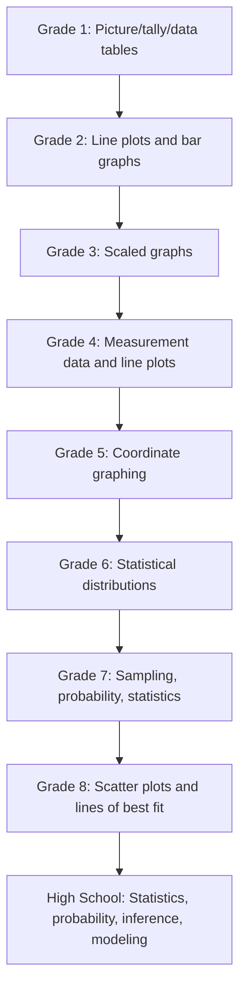

# Data, Statistics, and Probability Progression

The data spine moves from representations toward inference and modeling.

**Legend:** These are broad grade references; not every source grade uses the same domain label.
