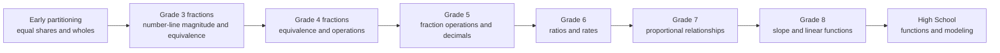

# Fractions to Ratios to Functions

This map highlights a conceptual route from partitioning to proportional and functional reasoning.

**Legend:** Nodes summarize benchmark terrain; learner evidence may be uneven or nonlinear across the route.
