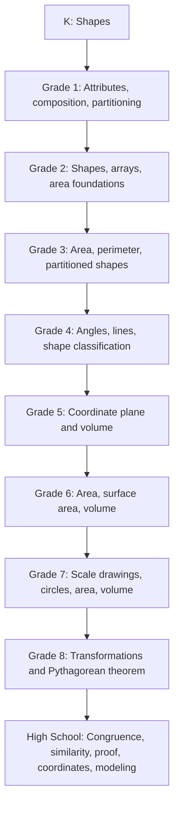

# Geometry Progression

The geometry spine preserves grade-equivalence landmarks while allowing nonlinear evidence.

**Legend:** Each arrow marks neighboring benchmark terrain; use receipts to determine the learner's actual starting point.
