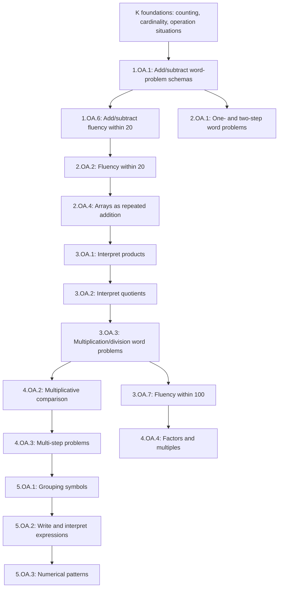

# Operations and Algebraic Thinking Progression

Selected K–5 nodes show how operation meanings, fluency, schemas, and expressions develop.

**Legend:** Solid arrows are selected progression hypotheses for diagnosis. Consult ontology edges and receipts before using them in a campaign.
