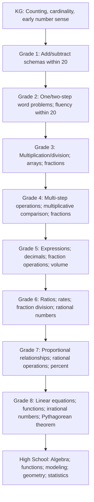

# California Common Core Math Progression Spine

This is a broad grade-equivalence reference map, not a required learning schedule.

**Legend:** Arrows preserve the official grade sequence as reference terrain; they do not command an individual learner's path.
