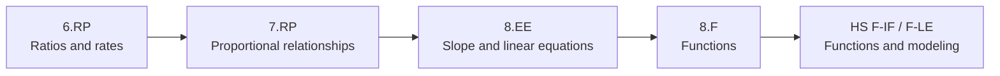

# Ratios to Linear Functions

Selected domains connect unit-rate reasoning to slope, equations, and functions.

**Legend:** Domain-level arrows are editable prerequisite hypotheses, not learner labels.
