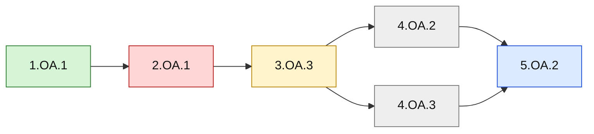

# Sample Learner Heat Map

> **Fictional sample only — not real learner data.** This demonstrates an ad hoc diagnostic overlay and is not core app UI.

**Legend:** green = mastered; yellow = learning; red = weak/foundational repair candidate; gray = needs evidence; blue = advanced. Status must come from overlay evidence, never from this sample.
