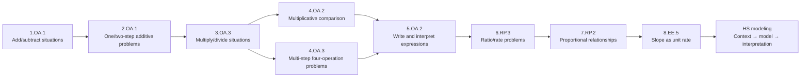

# Word-Problem Schema Chain

This diagnostic chain helps Hermes test whether a current-grade word-problem issue may depend on an earlier schema. It is not a diagnosis by itself.

**Legend:** Arrows mean “inspect as a possible dependency,” not “must be mastered in this order.”
