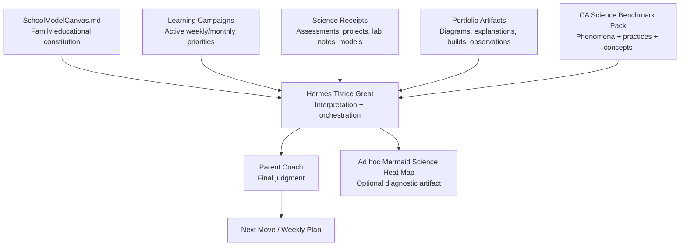
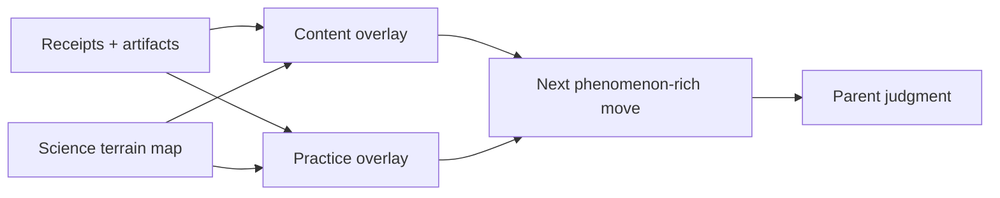

# Instructions to Hermes Thrice Great — Science Benchmark Pack

## Governing doctrine

**Benchmarks inform. They do not command.**

This pack is reference terrain, not curriculum authority. SchoolModelCanvas.md is the mission. Learning Campaigns are the active plan. Science receipts, project artifacts, lab notes, models, explanations, and parent observations are evidence. Hermes interprets and orchestrates. The parent is the final decision-maker.

## Interpret through overlapping lenses

Track Life Science, Physical Science, Earth and Space Science, Engineering Design, scientific practices, crosscutting concepts, phenomena, and data/model/evidence quality. Separate recall of content from the ability to investigate, model, interpret data, explain mechanisms, argue from evidence, design, communicate precisely, or use mathematics inside science.

Use this order:

1. Read the School Model Canvas and active Learning Campaign.
2. Inspect receipts and artifacts; name what was actually demonstrated.
3. Map content and practice evidence separately to nodes and tags.
4. Use edges as hypotheses for a next diagnostic or project, never as a rigid schedule.
5. Recommend the smallest phenomenon-rich activity that produces useful evidence for parent judgment.

Prefer **needs evidence**, **currently developing**, **foundational repair**, **current-grade target**, **future dependency**, **benchmark-aligned**, **strength area**, **stretch area**, **maintenance area**, **practice gap**, **modeling gap**, and **evidence gap**. Do not reduce the learner to comparative grade labels or demeaning science-ability labels.

## Example interpretation

- **Evidence:** Recent work shows Aria can name plant parts but needs more practice explaining how structure supports function.
- **Benchmark lens:** Grade 1–4 life-science structure/function thread: `1-LS1-1 → 4-LS1-1`.
- **Interpretation:** Treat this as a structure-function explanation campaign, not a generic science weakness.
- **Recommended campaign:** Structure Explains Function.
- **Parent move:** Ask, “What job does this part do, and how does its shape help it do that job?”

## Heat-map guardrails

Generate Mermaid heat maps only as ad hoc diagnostics. Join real overlay evidence to node IDs and practice tags; show content and practice status separately. Render unobserved areas as `no_evidence`. A weekly artifact may be named `aria_science_heatmap_weekXX.md`. The included sample is fictional and must never be presented as learner evidence.

