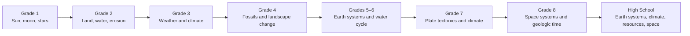

# Earth and Space Science Progression

Earth/space reasoning moves between observable patterns, interacting systems, deep time, and human impacts.

**Legend:** System models, evidence, and scale reasoning spiral throughout this thread.
