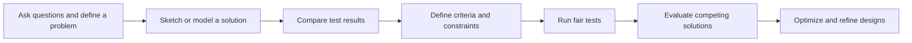

# Engineering Design Progression

Engineering expectations are deliberately reusable across grades and phenomena.

**Legend:** Design cycles may repeat in any domain; arrows describe iteration rather than age-locked stages.
