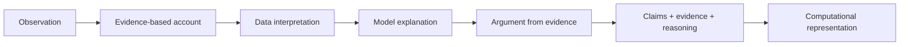

# Evidence, Argument, and Modeling Progression

This UCC-critical-thinking thread emphasizes how observations become defensible scientific explanations.

**Legend:** A content-correct answer does not automatically demonstrate the practice represented by the next node.
