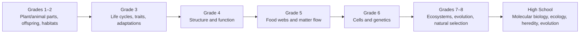

# Life Science Progression

Life-science ideas spiral from observable structures toward cellular, ecological, and evolutionary mechanisms.

**Legend:** Each transition is a conceptual thread, not a universal prerequisite claim.
