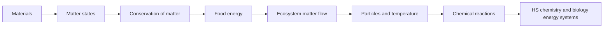

# Matter, Energy, and Systems Progression

This cross-disciplinary thread links physical and life-science accounts of flows, cycles, and conservation.

**Legend:** Track whether evidence concerns vocabulary, system models, quantitative conservation, or explanation.
