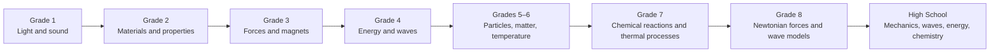

# Physical Science Progression

Physical-science terrain connects observable phenomena to particle, force, wave, and energy models.

**Legend:** Content knowledge and modeling/investigation evidence should be tracked separately.
