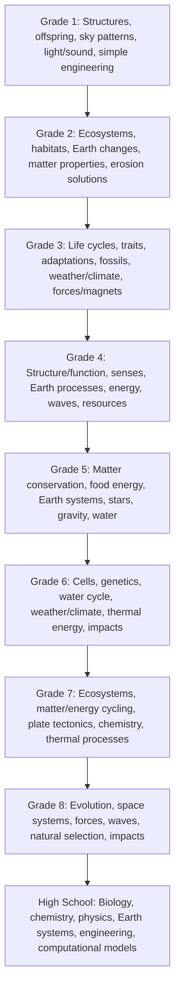

# California Science Progression Spine

This broad grade-equivalence view is reference terrain, not a required science schedule.

**Legend:** Arrows preserve grade-reference order only. Phenomena, concepts, and practices may develop nonlinearly.
