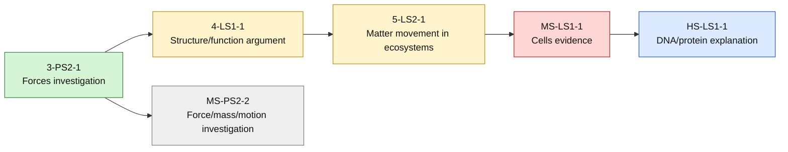

# Sample Science Learner Heat Map

> **Fictional sample only — not real learner data.** This is an ad hoc diagnostic artifact, not core app UI.

**Legend:** green = mastered; yellow = learning; red = foundational-repair candidate; gray = needs evidence; blue = advanced. Use only actual overlay evidence for real learners.
