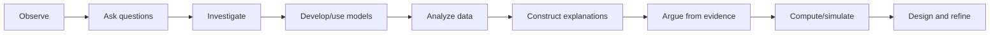

# Scientific Practices Progression

Scientific practices grow through repeated use with increasing precision, independence, and complexity.

**Legend:** This is a practice repertoire, not a one-way sequence; investigations often loop among nodes.
