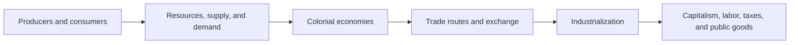

# Economics and Incentives Progression

Economic reasoning connects choices and resources to institutions and historical consequences.

**Legend:** Ask who gains, who bears costs, which incentives matter, and what changes over time.
