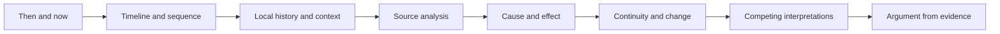

# Historical Reasoning Progression

Historical reasoning develops through recurring work with time, context, causality, continuity, and evidence.

**Legend:** This is a reasoning repertoire, not a one-way mastery ladder.
