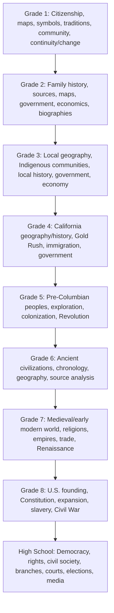

# California Social Studies Progression Spine

This grade-equivalence view is reference terrain, not a mandated historical sequence.

**Legend:** Arrows preserve grade-reference order only; content and reasoning may develop nonlinearly.
