# Sample Social Studies Learner Heat Map

> **Fictional sample only — not real learner data.** This is an ad hoc diagnostic artifact, not core app UI.

```mermaid
flowchart LR
  A["1.1 Citizenship"] --> B["2.1 Family history + sources"] --> C["3.4 Rules/laws/government"]
  C --> D["4.5 Local/state/federal government"] --> E["5.5 Revolution causes"]
  E --> F["Grade 6 source analysis"] --> G["8.2 Constitution"] --> H["HS 12.1 Democracy"]

  classDef mastered fill:#d6f5d6,stroke:#2e7d32,color:#111
  classDef learning fill:#fff4cc,stroke:#b8860b,color:#111
  classDef weak fill:#ffd6d6,stroke:#b71c1c,color:#111
  classDef noEvidence fill:#eeeeee,stroke:#777,color:#111
  classDef advanced fill:#dbeafe,stroke:#1d4ed8,color:#111
  class A mastered
  class B learning
  class C mastered
  class D learning
  class E learning
  class F weak
  class G noEvidence
  class H advanced
```

**Legend:** green = mastered; yellow = learning; red = foundational-repair candidate; gray = needs evidence; blue = advanced. Real status must come from overlay evidence.
