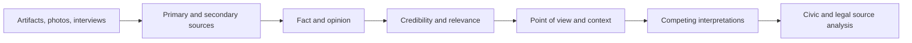

# Source Analysis Progression

Source work grows from family evidence toward credibility, context, interpretation, and civic/legal analysis.

**Legend:** A retelling is content evidence; sourcing and corroboration are separate reasoning evidence.
