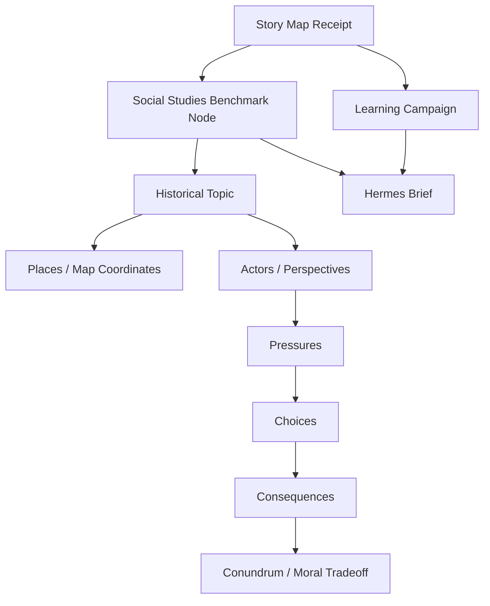

# Story Map and Conundrum Alignment

This workflow maps benchmark terrain into a UCC History Story Map and an evidence-producing campaign.

**Legend:** Benchmark = terrain; Story Map receipt = evidence; campaign = active plan; parent = final judgment.
