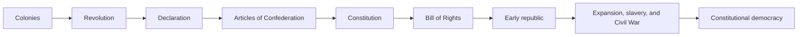

# U.S. History and Constitution Progression

This thread connects colonial pressures to constitutional democracy and unresolved conflicts.

**Legend:** Use Story Maps to expose actors, omitted perspectives, institutional constraints, and moral tradeoffs.
