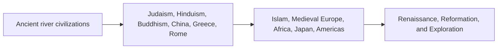

# World History and Civilizations Progression

This content map supports comparative questions across civilizations without reducing history to recall.

**Legend:** Compare geography, institutions, beliefs, trade, pressures, choices, and consequences.
