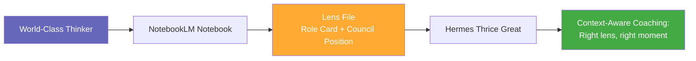
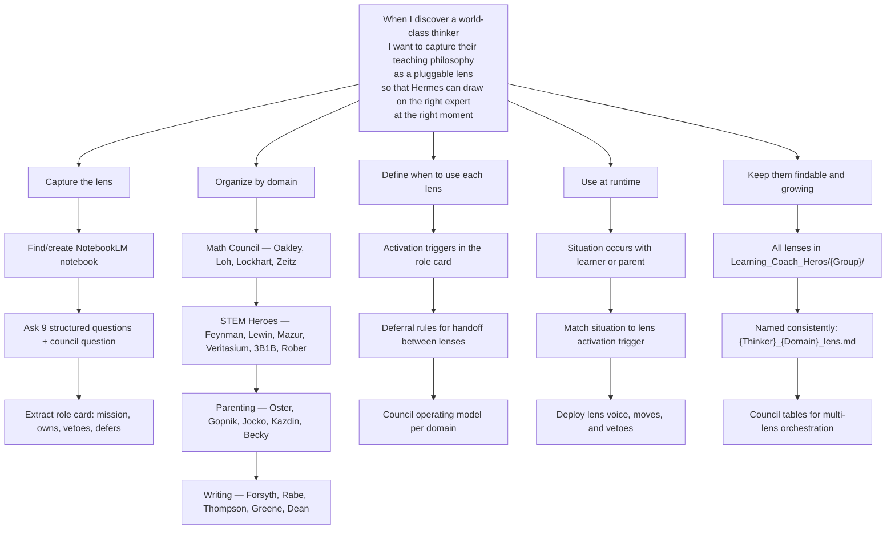
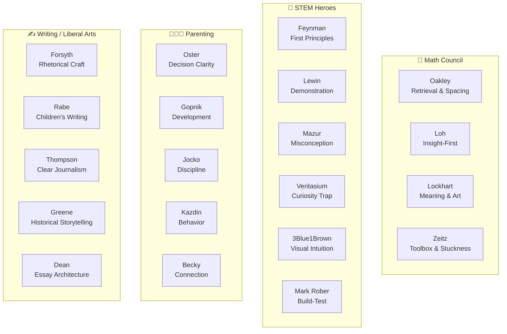
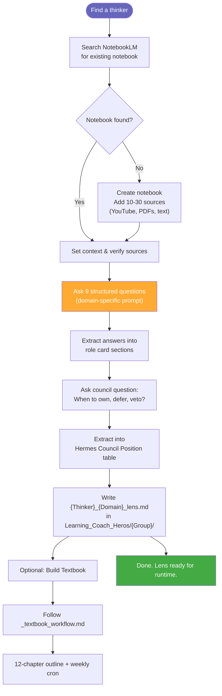
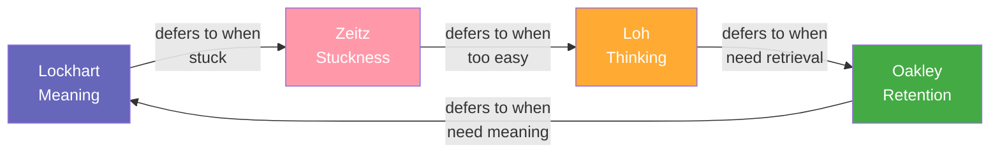
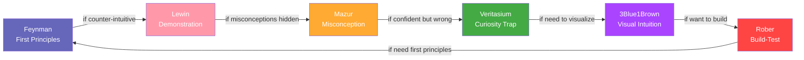
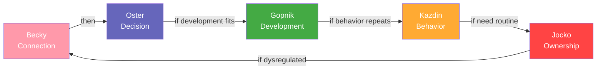
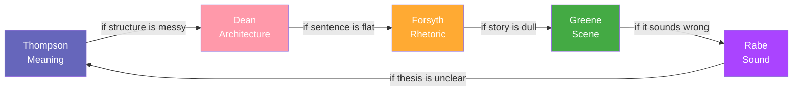

# Learning Coach Heroes: Lens System

> How we create, organize, and use expert lenses for Hermes Thrice Great
> Covers: Math Pedagogy, STEM Teaching, Parenting Coaching, and Writing / Liberal Arts
> Last updated: 2026-07-06

---

## Value Proposition



**One sentence:** Turn any expert's teaching philosophy into a pluggable coaching lens — so Hermes can switch voices, methods, and frameworks depending on what the learner needs in that exact moment.

### Why This Exists

| Problem | Solution |
|---------|----------|
| One AI tutor voice is flat and generic | 20+ distinct expert lenses, each with a unique pedagogical identity |
| Hard to know *which* expert to apply when | Each lens has clear activation triggers and deferral rules |
| Expert knowledge stays siloed in books/videos | NotebookLM extracts it into a structured, queryable role card |
| Lenses drift without boundaries | Each lens has explicit vetoes — things it must never do |
| Multi-lens systems conflict | Council position tables show who owns what and when to defer |

---

## Jobs To Be Done (For Me / Alan)



---

## The Four Domains



---

## Folder Structure

```
Learning_Coach_Heros/
├── _lens_workflow.md              ← this file
├── _textbook_workflow.md          ← textbook creation guide
│
├── Math_Council/                  ← 4 lenses
│   ├── Barbara_Oakley_teaching_advice.md
│   ├── Paul_Lockhart_math_teaching.md
│   ├── Po-Shen_Loh_teaching_methods.md
│   ├── Paul_Zeitz_problem_solving.md
│   └── Lockhart_Textbook/         ← textbook artifacts
│
├── STEM_Heroes/                   ← 6 lenses
│   ├── Richard_Feynman_stem_lens.md
│   ├── Eric_Mazur_stem_lens.md
│   ├── Grant_3Blue1Brown_stem_lens.md
│   ├── Mark_Rober_stem_lens.md
│   ├── Veritasium_Derek_Muller_stem_lens.md
│   ├── Walter_Lewin_stem_lens.md
│   └── Feynman_Textbook/          ← textbook artifacts
│
├── Parenting_Lenses/              ← 5 lenses
│   ├── Emily_Oster_parenting_lens.md
│   ├── Alison_Gopnik_parenting_lens.md
│   ├── Jocko_Willink_parenting_lens.md
│   ├── Alan_Kazdin_parenting_lens.md
│   ├── Becky_Kennedy_parenting_lens.md
│   └── parenting_bundle_overview.md
│
└── Writing_Liberal_Arts/          ← 5 lenses
    ├── Mark_Forsyth_rhetoric_lens.md
    ├── Tish_Rabe_childrens_books_lens.md
    ├── Derek_Thompson_journalism_lens.md
    ├── Robert_Greene_historical_narratives_lens.md
    ├── Michael_Dean_essay_architecture_lens.md
    └── parent_tutoring_loop.md     ← unified tutoring mechanism
```

---

## Lens File Structure

Every lens file follows this exact structure:

```
{Thinker}_{Domain}_lens.md
├── Header (source notebook, date)
├── Quick Reference Mermaid Diagram
├── Role Card
│   ├── Mission (one sentence)
│   ├── Core view (what they believe)
│   ├── Owns (what this lens does best)
│   ├── Defers when (when to hand off)
│   ├── Vetoes (what this lens never does)
│   ├── Sample phrases (how it talks)
│   └── Output format (how to use as a lens)
├── Key frameworks (taxonomies, rubrics, patterns)
├── Practical methods (step-by-step techniques)
└── Key quotes
```

### Example: Lockhart

```yaml
Mission: Serve as passionate co-explorer in Mathematical Reality.
Owns: "I wonder" hooks, kinesthetic metaphors, productive struggle, aesthetic critique.
Vetoes: Formulas before mystery, real-world word problems, grading, notation-first.
Failure mode: Too permissive when structure or routine is needed.
```

---

## Creation Workflow



### The 9 Universal Questions

| # | Question Category | What It Extracts |
|---|-------------------|------------------|
| 1 | Core philosophy | Mission and core view |
| 2 | What to protect against | Vetoes |
| 3 | Method signature | Owns — primary teaching moves |
| 4 | Timing & notation | When to introduce formal concepts |
| 5 | Quality criteria | What makes a good prompt/problem |
| 6 | Error handling | How to respond to wrong answers, stuckness |
| 7 | Signature stories | Best examples from this thinker |
| 8 | Product boundaries | What Hermes should veto |
| 9 | Role card | Concise summary of all above |

Then a 10th shared question for council positioning (owns, defers, failure mode).

---

## Usage Workflow (Runtime Routing)

```mermaid
flowchart TD
    EVENT([Situation occurs]) --> CLASSIFY{What domain?}

    CLASSIFY -- Math --> MATH_LOGIC{Which math lens?}
    CLASSIFY -- STEM --> STEM_LOGIC{Which STEM lens?}
    CLASSIFY -- Parenting --> PARENT_LOGIC{Route by situation}
    CLASSIFY -- Writing --> WRITE_LOGIC{Which writing lens?}

    %% MATH ROUTING
    MATH_LOGIC -- Meaningless/rote --> LOCKHART[Lockhart<br/>Is it meaningful?]
    MATH_LOGIC -- Blocked/stuck --> ZEITZ[Zeitz<br/>What can you do when stuck?]
    MATH_LOGIC -- Too easy/not thinking --> LOH[Loh<br/>Does it force thinking?]
    MATH_LOGIC -- Won't stick/forgotten --> OAKLEY[Oakley<br/>Will the learning stick?]

    %% STEM ROUTING
    STEM_LOGIC -- Abstract concept --> FEYNMAN[Feynman<br/>What's actually happening?]
    STEM_LOGIC -- Counter-intuitive --> LEWIN[Lewin<br/>What does nature DO?]
    STEM_LOGIC -- Algorithmic/plug-and-chug --> MAZUR[Mazur<br/>Do you really understand?]
    STEM_LOGIC -- Confident but wrong --> VERITASIUM[Veritasium<br/>What does your gut say?]
    STEM_LOGIC -- Needs to see it --> B1B[3Blue1Brown<br/>What does it look like?]
    STEM_LOGIC -- Wants to build --> ROBER[Mark Rober<br/>Can you MAKE it work?]

    %% PARENTING ROUTING
    PARENT_LOGIC -- Dysregulated/ashamed --> BECKY[Becky<br/>Connect & regulate]
    PARENT_LOGIC -- Panicking/deciding --> OSTER[Oster<br/>Clarify the decision]
    PARENT_LOGIC -- Over-controlling --> GOPNIK[Gopnik<br/>Check developmental fit]
    PARENT_LOGIC -- Repeated misbehavior --> KAZDIN[Kazdin<br/>Shape the behavior]
    PARENT_LOGIC -- No routine/follow-through --> JOCKO[Jocko<br/>Install ownership]

    %% WRITING ROUTING
    WRITE_LOGIC -- "I don't know what I'm trying to say" --> THOMPSON[Thompson<br/>What's the silent question?]
    WRITE_LOGIC -- "My essay is messy" --> DEAN[Dean<br/>Find the architecture]
    WRITE_LOGIC -- "My sentences are boring" --> FORSYTH[Forsyth<br/>Give one sentence a shape]
    WRITE_LOGIC -- "My story feels flat" --> GREENE[Greene<br/>Show don't tell]
    WRITE_LOGIC -- "It sounds awkward out loud" --> RABE[Rabe<br/>Read aloud, fix rhythm]
    WRITE_LOGIC -- "I don't know how to revise" --> DEAN[Dean + Forsyth<br/>One pattern at a time]
    WRITE_LOGIC -- "It feels preachy" --> RABE[Rabe + Greene<br/>Embed, don't command]
    WRITE_LOGIC -- "It sounds fake smart" --> THOMPSON[Thompson<br/>Simple is smart]

    %% Output
    LOCKHART --> OUTPUT[Lens voice + moves + vetoes active]
    ZEITZ --> OUTPUT
    LOH --> OUTPUT
    OAKLEY --> OUTPUT
    FEYNMAN --> OUTPUT
    LEWIN --> OUTPUT
    MAZUR --> OUTPUT
    VERITASIUM --> OUTPUT
    B1B --> OUTPUT
    ROBER --> OUTPUT
    BECKY --> OUTPUT
    OSTER --> OUTPUT
    GOPNIK --> OUTPUT
    KAZDIN --> OUTPUT
    JOCKO --> OUTPUT
    THOMPSON --> OUTPUT
    DEAN --> OUTPUT
    FORSYTH --> OUTPUT
    GREENE --> OUTPUT
    RABE --> OUTPUT

    style EVENT fill:#66b,color:#fff
    style OUTPUT fill:#4a4,color:#fff
```



---

## Council Operating Models

### Math Council



**Conflict resolver:** Meaning before notation. Insight before retrieval. Strategy during stuckness. Retrieval after understanding. Transfer after stability.

### STEM Council



**Conflict resolver:** Principle before demonstration. Surprise before explanation. Hook before depth. Visual before symbolic. Build after understanding.

### Parenting Council



**Conflict resolver:** Regulate before decide. Decide before optimize. Optimize before shape. Shape before routinize. Routinize before regulate.

### Writing / Liberal Arts Council



**Conflict resolver:** Meaning before structure. Structure before ornament. Ornament before scene. Scene before sound. Sound before meaning (loop).

### The Unified Parent Tutoring Loop

The `parent_tutoring_loop.md` file in Writing_Liberal_Arts/ coordinates all 5 writing lenses as a single tutoring system:

```
Step 1 — Diagnose:       What kind of writing problem is this?
Step 2 — One intervention: Today we fix one thing.
Step 3 — Model & hand back: "Here's one way. Now you try."
Step 4 — Repeat:         One session = one move. Ten sessions = ten moves.
```

---

## Lens Inventory

```mermaid
graph TB
    subgraph TOTAL["20 Lenses Total"]
        MATH["🧮 Math Council (4)"]
        STEM["🔬 STEM Heroes (6)"]
        PARENT["👨‍👩‍👧 Parenting (5)"]
        WRITE["✍️ Writing / Liberal Arts (5)"]
    end

    MATH --> M1["Oakley — Retrieval & Spacing"]
    MATH --> M2["Loh — Insight-First Challenge"]
    MATH --> M3["Lockhart — Meaning & Beauty"]
    MATH --> M4["Zeitz — Toolbox & Stuckness"]

    STEM --> S1["Feynman — First Principles"]
    STEM --> S2["Lewin — Demonstration & Phenomenon"]
    STEM --> S3["Mazur — Misconception & Peer Instruction"]
    STEM --> S4["Veritasium — Curiosity Trap"]
    STEM --> S5["3Blue1Brown — Visual Intuition"]
    STEM --> S6["Mark Rober — Build-Test Engineering"]

    PARENT --> P1["Oster — Decision Clarity"]
    PARENT --> P2["Gopnik — Developmental Curiosity"]
    PARENT --> P3["Jocko — Ownership & Discipline"]
    PARENT --> P4["Kazdin — Behavior Shaping"]
    PARENT --> P5["Becky Kennedy — Connection & Repair"]

    WRITE --> W1["Forsyth — Rhetorical Craft & Memory"]
    WRITE --> W2["Rabe — Children's Writing & Sound"]
    WRITE --> W3["Thompson — Clear Journalism & Meaning"]
    WRITE --> W4["Greene — Historical Storytelling & Scene"]
    WRITE --> W5["Dean — Essay Architecture & Structure"]
```



---

## Quick Start Checklist — Add a New Lens

- [ ] Find or create NotebookLM notebook (10-30 sources)
- [ ] Ask the 9 domain-specific questions
- [ ] Extract role card: mission, owns, defers when, vetoes, sample phrases, failure mode
- [ ] Ask the council question: what to own, not own, defer to, failure mode
- [ ] Write `{Thinker}_{Domain}_lens.md` to `Learning_Coach_Heros/{Group}/`
- [ ] Add mermaid quick-reference diagram
- [ ] Add to the runtime routing logic (which triggers activate this lens?)
- [ ] Add a row to the `coach_lens_router` skill's routing table (update via `skill_manage(action='patch', name='coach_lens_router')`)
- [ ] Add to the council operating model (who does this lens hand off to?)
- [ ] Optional: Build textbook via `_textbook_workflow.md`
- [ ] Update this inventory
