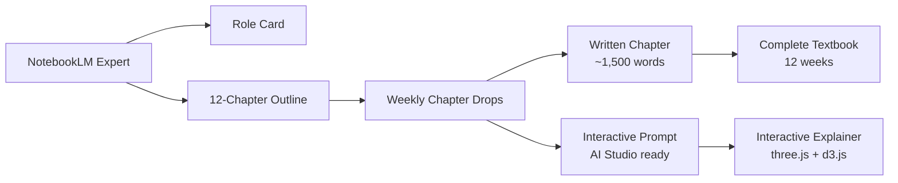
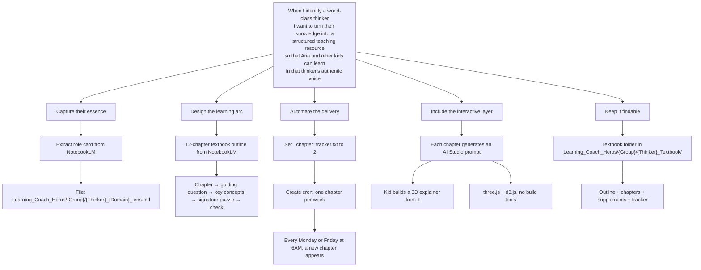
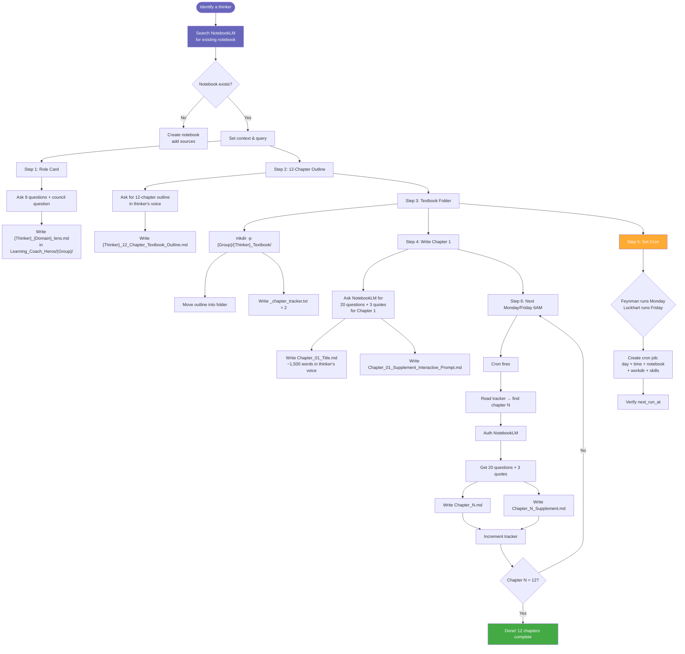
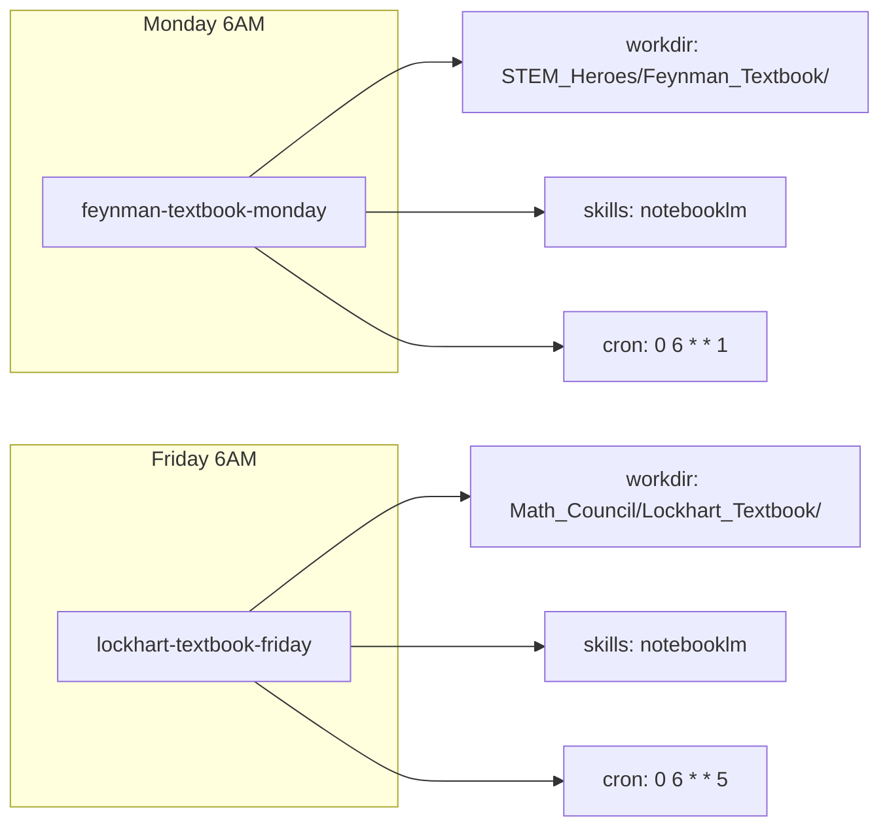
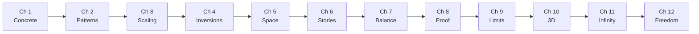
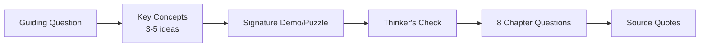

# Textbook Creation Workflow

> How we turn a NotebookLM expert notebook into a 12-chapter interactive textbook with weekly delivery
> Covers: Math Council (Lockhart), STEM Heroes (Feynman), Parenting, Writing
> Last updated: 2026-07-06

---

## Value Proposition



**One sentence:** Turn any world-class thinker's body of work into a structured, chapter-by-chapter interactive textbook — delivered one piece per week, with zero ongoing effort after setup.

### Why This Exists

| Problem | Solution |
|---------|----------|
| AI-generated content is shallow and generic | Each chapter is grounded in a specific thinker's actual source material from NotebookLM |
| Building a full textbook is overwhelming | 12 weeks, one chapter at a time, automated delivery |
| Kids need more than text — they need to play | Every chapter includes a prompt for an interactive 3D explainer |
| Each thinker's voice gets lost in generic tutoring | Role cards, lens files, and textbook maintain distinct pedagogical identity |
| Textbook creation is manual and fragile | Cron-driven, tracker-based, self-healing auth — set and forget |

---

## Jobs To Be Done (For Me / Alan)



---

## Workflow Steps



---

## File Naming Convention

Every thinker textbook follows this exact structure:

```
Learning_Coach_Heros/
└── {Group}/
    └── {Thinker}_Textbook/
        ├── {Thinker}_12_Chapter_Textbook_Outline.md          # The full arc — written once
        ├── _chapter_tracker.txt                               # Current chapter number (integer)
        ├── Chapter_01_{Title}.md                              # Written chapter, ~1,500 words
        ├── Chapter_01_Supplement_Interactive_Prompt.md        # AI Studio prompt for 3D explainer
        ├── Chapter_02_{Title}.md                              # (cron delivers weekly)
        ├── Chapter_02_Supplement_Interactive_Prompt.md
        └── ...                                                # Through Chapter 12
```

### Current Real Examples

| Thinker | Group Folder | Textbook Path |
|---------|-------------|---------------|
| Feynman | STEM_Heroes/ | `Learning_Coach_Heros/STEM_Heroes/Feynman_Textbook/` |
| Lockhart | Math_Council/ | `Learning_Coach_Heros/Math_Council/Lockhart_Textbook/` |

### Naming Rules

| File | Convention | Example |
|------|-----------|---------|
| Outline | `{Thinker}_12_Chapter_Textbook_Outline.md` | `Feynman_12_Chapter_Textbook_Outline.md` |
| Tracker | `_chapter_tracker.txt` (always this name) | Contains integer `2` meaning "chapter 2 is next" |
| Chapter | `Chapter_{NN}_{ShortTitle}.md` | `Chapter_01_Atoms_in_Motion.md` |
| Supplement | `Chapter_{NN}_Supplement_Interactive_Prompt.md` | `Chapter_01_Supplement_Interactive_Prompt.md` |

---

## Cron Configuration



### Creating a New Cron

```bash
cronjob action=create \
  name="{thinker}-textbook-{day}" \
  schedule="0 6 * * {1=Mon,5=Fri}" \
  skills='["notebooklm"]' \
  workdir="/path/to/Learning_Coach_Heros/{Group}/{Thinker}_Textbook/"
```

The cron prompt must be self-contained (it runs with no conversation history) and must handle NotebookLM auth expiry by checking and logging in.

---

## The 12-Chapter Arc Pattern

Every textbook follows this progression:



| Phase | Chapters | What happens |
|-------|----------|-------------|
| **Foundation** | 1–4 | Concrete, tangible ideas (atoms, counting, grouping, fractions) |
| **Construction** | 5–8 | Building tools (geometry, equations, proof) |
| **Frontiers** | 9–12 | Abstract, surprising ideas (irrationals, infinity, complex numbers) |

Each chapter has the same internal structure:



---

## What Each Chapter File Contains

```
# Chapter N: Title
> From: *Book Title*

--- [ hook ] ---
Opens with the Guiding Mystery or Question — the thing that makes you lean in.

--- [ body ] ---
3-5 key concepts explained in the thinker's voice using their signature
metaphors, analogies, and storytelling devices.

--- [ signature ] ---
The Signature Puzzle or Demonstration — the one thing that makes the
concept click. Described vividly enough to do at home.

--- [ check ] ---
The {Thinker} Check — a question the reader should be able to answer
in simple language to prove real understanding.

--- [ questions ] ---
8 Chapter Questions drawn from the NotebookLM 20 Socratic questions.

--- [ quotes ] ---
3 Source Quotes with attribution.

--- [ word count ] ---
~1,200-1,500 words total — about 6 pages.
```

---

## What Each Supplement Prompt Contains

```
# Chapter N Supplement: Interactive HTML Explainer
> Level: 9-year-old
> Tech: three.js + d3.js
> Prompt for: Google AI Studio

--- [ The Prompt ] ---
A single markdown code block labeled "## The Prompt" containing:

- DESIGN PHILOSOPHY (thinker's voice)
- 4-6 SCENES with specific interactions
- THREE.JS REQUIREMENTS (CDN, OrbitControls, lighting)
- D3.JS REQUIREMENTS (visualizations)
- UI/UX REQUIREMENTS (nav, character, responsiveness)
- THE 3 QUOTES to display at key moments

--- [ How to Use ] ---
Copy the prompt, paste into AI Studio, generate the HTML, save alongside chapter.

--- [ Learning Objectives Table ] ---
| Scene | Concept | Thinker's Metaphor |

--- [ Tech Stack Notes ] ---
CDN URLs for three.js, OrbitControls, d3.js
```

---

## Quick Start Checklist

When adding a new thinker:

- [ ] Find or create the NotebookLM notebook
- [ ] Ask 9 role-card questions → write `{Thinker}_{Domain}_lens.md` to `Learning_Coach_Heros/{Group}/`
- [ ] Ask 12-chapter outline → write `{Thinker}_12_Chapter_Textbook_Outline.md`
- [ ] Create `Learning_Coach_Heros/{Group}/{Thinker}_Textbook/` folder
- [ ] Move outline into folder
- [ ] Write `_chapter_tracker.txt = 2`
- [ ] Ask 20 questions + 3 quotes for Chapter 1
- [ ] Write `Chapter_01_Title.md`
- [ ] Write `Chapter_01_Supplement_Interactive_Prompt.md`
- [ ] Create cron job (Monday or Friday 6AM) with workdir pointing to the textbook folder
- [ ] Verify first cron fires at `next_run_at`

---

## Current Textbook Status

| Thinker | Group | Phase | Cron | Chapters Written | Next Chapter | Completion |
|---------|-------|-------|------|------------------|-------------|------------|
| **Feynman** | STEM_Heroes/ | Active | Mon 6AM | Ch 1 done | Ch 2 (July 13) | 1/12 |
| **Lockhart** | Math_Council/ | Active | Fri 6AM | Ch 1 done | Ch 2 (July 10) | 1/12 |
| Oakley | Math_Council/ | Not started | — | — | — | 0/12 |
| Loh | Math_Council/ | Not started | — | — | — | 0/12 |
| Zeitz | Math_Council/ | Not started | — | — | — | 0/12 |
| Feynman (full) | STEM_Heroes/ | Active | Mon 6AM | — | — | 1/12 |
| Lewin | STEM_Heroes/ | Not started | — | — | — | 0/12 |
| Mazur | STEM_Heroes/ | Not started | — | — | — | 0/12 |
| Veritasium | STEM_Heroes/ | Not started | — | — | — | 0/12 |
| 3Blue1Brown | STEM_Heroes/ | Not started | — | — | — | 0/12 |
| Mark Rober | STEM_Heroes/ | Not started | — | — | — | 0/12 |
