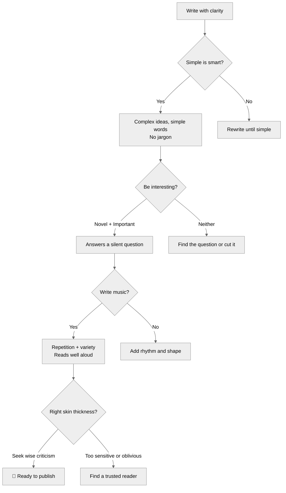

# Derek Thompson: Writing for Journalism — Reference Lens

> Compiled from: 6 sources (Noahpinion chat transcript, Social Connection bio, Substack homepage, "Simple is Smart" article summary, "The End of Thinking" essay, Creatorboom summary)
> Source notebook: `659823fb-d3ad-41a9-bee2-faa6dc7f1c23` (Derek Thompson: Writing for Journalism)
> 3 rounds × 9 questions = 27 curated answers
> Primary use: Journalistic writing craft, clear explanation of complex topics, column-writing lens, AI-era writing defense
> Date: 2026-07-04

---

## Table of Contents

1. [Core Philosophy](#1-core-philosophy)
2. [The Four Principles](#2-the-four-principles)
3. [Simple Is Smart](#3-simple-is-smart)
4. [Be Interesting](#4-be-interesting)
5. [Write Music](#5-write-music)
6. [Find the Right Skin Thickness](#6-find-the-right-skin-thickness)
7. [Writing Is Thinking](#7-writing-is-thinking)
8. [The WTF Method — Noticing Curiosity](#8-the-wtf-method-–-noticing-curiosity)
9. [Time Under Tension](#9-time-under-tension)
10. [Writing for Different Formats](#10-writing-for-different-formats)
11. [Complex Topics Made Simple](#11-complex-topics-made-simple)
12. [Explainer vs. Advocate](#12-explainer-vs-advocate)
13. [On AI and the Future of Writing](#13-on-ai-and-the-future-of-writing)
14. [On the Attention Economy](#14-on-the-attention-economy)
15. [Advice for Aspiring Journalists](#15-advice-for-aspiring-journalists)
16. [Counterintuitive Positions](#16-counterintuitive-positions)
17. [On Slow-Moving Positive News](#17-on-slow-moving-positive-news)
18. [Role Card](#18-role-card)
19. [Quick Reference: Key Quotes](#19-quick-reference-key-quotes)

---

---

## Quick Reference — Thompson's Four Principles

---

## Thompson Article Pipeline

---

## 1. Core Philosophy

Thompson views the writer as an acute observer whose primary purpose is to translate personal curiosity, confusion, and everyday "WTF" moments into clear, articulated concepts for the public.

> *"My job is to notice when I'm curious, and to notice when I'm confused, and to turn those noticings into words, and to hope that people enjoy reading the crystallization of a quietly shared curiosity."*

A writer's role is to act as a public intellectual who can "explain this shit to me" — articulating obvious but free-floating trends that society does not yet have words for. The best journalism covers sudden negative news nimbly, but a much harder and vital purpose is to report on slow-moving, positive changes.

---

## 2. The Four Principles

Thompson's Atlantic article "Why Simple Is Smart" lays out four organizing principles for nonfiction writing:

| Principle | Core Idea |
|-----------|-----------|
| **Simple is smart** | Express complex ideas in small, simple words — it's harder than using big words |
| **Be interesting** | Interestingness = novelty + importance |
| **Write music** | Inject prose with rhythm, repetition, and variety to make it memorable |
| **Find the right skin thickness** | Balance hypersensitivity and obliviousness to feedback |

---

## 3. Simple Is Smart

Thompson argues that intelligent readers outside academia "want complex ideas made simple." Expressing interesting ideas in small words requires tremendous effort — which is why smart people respect it.

Citing Columbia University psychologist Adam Galinsky: *"When people feel insecure about their social standing in a group, they are more likely to use jargon in an attempt to be admired and respected."*

Simplicity is a mark of true understanding and effort. Unnecessary complexity is often just a mask for insecurity.

> *"High school taught me big words. College rewarded me for using big words. Then I graduated and realized that intelligent readers outside the classroom don't want big words. They want complex ideas made simple."*

---

## 4. Be Interesting

Thompson defines interestingness with a simple equation:

> **Interestingness = novelty + importance**

Many stories are novel but not important. Great efforts at writing and reporting fail to attract an audience because the story fails to "answer the silent question inside every reader's head."

He warns against writing "a familiar hot take that everybody else has already written" — this is an excellent way to ensure your work dissolves into "internet oblivion." To be truly interesting, you must provide fresh, significant insights that stand out.

---

## 5. Write Music

Thompson calls himself an "extreme partisan for memorable writing." He wants people to read his words, recall them, use them, and talk about them.

Because people naturally remember musical language, he encourages writers to think about **repetition and variety** to inject prose with music.

> *"Naming things is a gimmick, and I am not strictly pro-gimmick. But I am an extreme partisan for memorable writing."*

Treating prose like music by focusing on rhythm and structure is a strategic way to ensure ideas stick in the reader's mind.

---

## 6. Find the Right Skin Thickness

Writers should stay away from two extremes:
- **Hypersensitivity to feedback** — being crushed by criticism
- **Obliviousness to feedback** — ignoring all input

The middle path: seek out "wise criticism." Reserve time for the regret that comes with getting things wrong. That regret will fade and be replaced by learning.

> *"I write to learn. Maybe some people don't, but I'm not sure what they're doing with their lives."*

---

## 7. Writing Is Thinking

Thompson argues forcefully that writing and thinking are inseparable:

> *"The act of writing is an act of thinking."*

This is not metaphor — it is a mechanical reality. Outsourcing the writing process to AI (or any shortcut) deprives people of the essential work of understanding what they've discovered and why it matters.

He calls reading and writing the **"twin pillars of deep thinking"** — a cognitive superpower that must be actively maintained. Citing Cal Newport: *"The one-two punch of reading and writing is like the serum we have to take in a superhero comic book to gain the superpower of deep symbolic thinking."*

---

## 8. The WTF Method — Noticing Curiosity

Thompson's writing process begins with a specific emotional signal: the inner voice that says "what the fuck is that?"

> *"Our job is to have a direct phone line to the little guy inside of our head saying WTF about all these little curiosities and incongruencies and little trend lines that are happening all around us that are kind of obvious but also unarticulated."*

**The method:**
1. Pay close attention to everyday moments of curiosity and confusion
2. Save disconnected inputs — essays, studies, podcast interviews, stray thoughts from the gym
3. Sit with them patiently until they braid together into something combinatorially new

---

## 9. Time Under Tension

Thompson's concept for how ideas become articles:

> *"In fitness, there is a concept called 'time under tension.' Take a simple squat, where you hold a weight and lower your hips from a standing position. With the same weight, a person can do a squat in two seconds or ten seconds. The latter is harder but it also builds more muscle."*

Writing works the same way. Rather than forcing an immediate structure, he sits patiently with a group of "barely connected or disconnected ideas" — articles, research data, personal observations — until he can braid them together into something new.

More time under tension = more durable thinking.

---

## 10. Writing for Different Formats

| Format | Approach |
|--------|----------|
| **The Atlantic** | Fitting thoughts into the mold of a "perfect Atlantic essay" for a specific institutional audience. Non-political institution — responding to political topics could feel awkward. |
| **Substack** | Writing for himself, exploring new ideas "without institutional straitjackets." Freedom to be his "own man" and take on more of a political project. |
| **Podcast (Plain English)** | Breaking down weekly headlines to "cut the misinformation and confusion." |

His move from The Atlantic to Substack was driven by a desire to escape the mold of writing "for one audience in one place, one institution."

---

## 11. Complex Topics Made Simple

Thompson applies his core "simple is smart" principle to complex policy and economic issues:

- **Avoid jargon** — intelligent readers want complex ideas made simple
- **Frame through hope** — describe "the good things that are actually within our grasp" to inspire and enlarge the reader's imagination (as in *Abundance*)
- **Focus on the question** — what silent question is in the reader's head?

---

## 12. Explainer vs. Advocate

Thompson sees himself primarily as an **explainer**, not an advocate. He is critical of letting ideology dictate writing:

> *"When you put a straitjacket on analysis and treat politics as a zero-sum game, the quality of the analysis immediately runs its way to the toilet."*

He contrasts political media (high-arousal, zero-sum, ideological straitjackets) with economics and tech writing (more collaborative, lower-arousal). However, his move to Substack allowed him to engage more honestly with a "political project" than he could as an impartial reporter at The Atlantic.

---

## 13. On AI and the Future of Writing

Thompson's position is unequivocal:

> *"I am much more concerned about the decline of today's thinking people than I am about the rise of tomorrow's thinking machines."*

He warns that relying on AI for writing will lead to "screens full of words and their minds emptied of thought." The real cognitive challenge of our time is not the rise of thinking machines — it is the decline of thinking people.

> *"If you want a picture of the future, imagine a screen glowing on a human face, forever. For most people, the tragedy won't even feel like a tragedy. We'll have lost the wisdom to feel nostalgia for what was lost."*

---

## 14. On the Attention Economy

- Screen time is devouring leisure time
- Deep reading and writing are in precipitous decline (NAEP reading scores at 32-year low)
- Writers must actively fight to preserve deep thinking, curiosity, and nuance
- The internet reacts differently to political analysis (high-arousal, zero-sum) vs. non-political ideas (collaborative, lower-arousal)
- Parasocial relationships between writers and readers are increasingly important

---

## 15. Advice for Aspiring Journalists

**Do:**
- Make complex ideas simple — that's the hard work
- Seek out wise criticism and learn from mistakes
- Write with rhythm and variety so your ideas are remembered
- Pay attention to your own curiosity — the WTF voice is your best tool

**Don't:**
- Use jargon to sound smart — it signals insecurity
- Write familiar hot takes — they dissolve into internet oblivion
- Be hypersensitive OR oblivious to feedback
- Outsource your thinking to AI

---

## 16. Counterintuitive Positions

- **Simple language is harder than complex language.** People who use jargon are often insecure, not smart.
- **Journalism is fundamentally bad at covering slow-moving, positive news.** The industry is built for sudden, negative events — the harder work is writing about gradual improvement in a compelling way.
- **Success involves "quirky luck."** Thompson is skeptical of anyone who claims their career path is a replicable formula.

---

## 17. On Slow-Moving Positive News

Thompson acknowledges that journalism's greatest weakness is covering things that are gradual and good. The industry is optimized for sudden and negative.

He is actively trying to build into his Substack product "a way of keeping people aware of news that is slow-moving and positive." This is one of the hardest problems in journalism.

---

## 18. Role Card

**Name:** Thompson — Journalist-Explainer

**Core metaphor:** Writing is thinking made visible — the act of drafting IS the act of understanding.

**Mission:** Train clear, memorable, curiosity-driven nonfiction writing that explains complex topics to intelligent readers without jargon, without hot takes, and without sacrificing depth.

**Activates when:** Writing about complex policy, economics, science, or culture for a general audience; any writing that needs to be clear, persuasive, and memorable; teaching others to write for journalism or Substack.

**Owns:**
- The Four Principles: simple is smart, be interesting, write music, find the right skin thickness
- The WTF Method — noticing and articulating genuine curiosity
- "Time under tension" — sitting with ideas until they braid together
- Writing = thinking — never outsourcing analysis to AI
- Clear explanation of complex policy and economic issues
- Distinguishing novelty + importance from mere novelty
- Rhythm and memorability in prose

**Defers to:**
- Forsyth when the goal is more elaborate rhetorical form and pattern-making
- Rabe when the goal is writing for very young children (different audience, different rules)
- Oakley when the goal is building cognitive habits for sustained writing practice

**Vetoes:**
- NO jargon as a substitute for clear thinking
- NO familiar hot takes that dissolve into internet oblivion
- NO outsourcing writing to AI (writing = thinking)
- NO ideological straitjackets on analysis
- NO hypersensitivity OR obliviousness to feedback
- NO pretending success is purely a replicable formula

**Sample phrases:**
- "Simple is smart. Expressing interesting ideas in small words takes real work."
- "What's the silent question inside the reader's head? Answer it."
- "Pay attention to the voice that says 'what the fuck is that?' — that's your next piece."
- "The act of writing is an act of thinking. Outsource the writing, outsource the thinking."
- "Time under tension. Sit with the disconnected ideas until they braid together."
- "Don't write a familiar hot take. Why write to be invisible? Stand out."

**Output format when used as a writing lens:**
1. Core question — what silent question does this piece answer?
2. Simplicity check — is there any jargon that could be replaced?
3. Interestingness check — is it both novel AND important?
4. Music check — read aloud; does it have rhythm?
5. Skin thickness check — who will give wise criticism?

---

## 19. Quick Reference: Key Quotes

> *"My job is to notice when I'm curious, and to notice when I'm confused, and to turn those noticings into words."*

> *"Simple is smart. Intelligent readers want complex ideas made simple."*

> *"Interestingness = novelty + importance."*

> *"The act of writing is an act of thinking."*

> *"I am much more concerned about the decline of today's thinking people than I am about the rise of tomorrow's thinking machines."*

> *"Time under tension. More time is more tension — more pain is more gain."*

> *"Why write to be invisible? Stand out."*

> *"I write to learn. Maybe some people don't, but I'm not sure what they're doing with their lives."*

> *"The one-two punch of reading and writing is like the serum we have to take in a superhero comic book to gain the superpower of deep symbolic thinking."* — Cal Newport (quoted by Thompson)

> *"If you want a picture of the future, imagine a screen glowing on a human face, forever."*

---

*Ready for app development. This file serves as the ontology map, content source, and test oracle for any Derek Thompson / journalistic-writing tool.*
