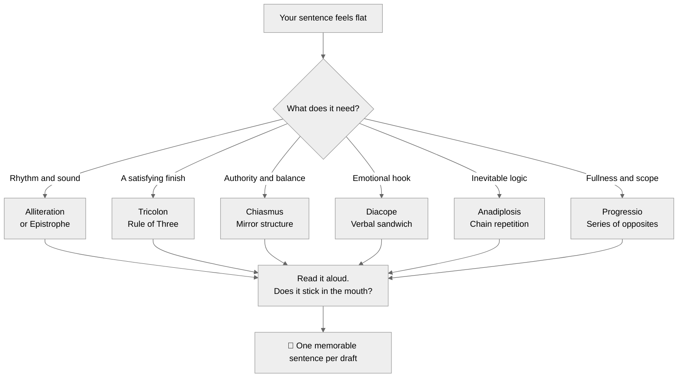
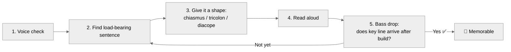

# Mark Forsyth: Rhetoric for Memorable Writing — Reference Lens

> Compiled from: 9 sources (2 full EPUB books, 5 YouTube videos, 2 custom markdown documents)
> Source notebook: `8908dba5-50c0-43b5-b9ca-2df2511459f5` (Mark Forsyth: Rhetoric for Memorable Writing)
> 3 rounds × 9 questions = 27 curated answers
> Primary use: Writing craft rubric, rhetorical device reference, teaching lens for memorable prose
> Date: 2026-07-04

---

## Quick Reference — Forsyth Decision Tree

---

## Forsyth Writing Lens — Quick Flow

---: 9 sources (2 full EPUB books, 5 YouTube videos, 2 custom markdown documents)
> Source notebook: `8908dba5-50c0-43b5-b9ca-2df2511459f5` (Mark Forsyth: Rhetoric for Memorable Writing)
> 3 rounds × 9 questions = 27 curated answers
> Primary use: Writing craft rubric, rhetorical device reference, teaching lens for memorable prose
> Date: 2026-07-04

---

## Table of Contents

1. [Core Thesis](#1-core-thesis)
2. [Critique of Modern Writing Instruction](#2-critique-of-modern-writing-instruction)
3. [The 7 Key Rhetorical Figures](#3-the-7-key-rhetorical-figures)
4. [Why Rhetorical Patterns Work on the Brain](#4-why-rhetorical-patterns-work-on-the-brain)
5. [Form vs. Meaning](#5-form-vs-meaning)
6. [Sound, Rhythm, and Musicality](#6-sound-rhythm-and-musicality)
7. [Rhetoric as Manipulation vs. Clarity](#7-rhetoric-as-manipulation-vs-clarity)
8. [The Historical Argument](#8-the-historical-argument)
9. [Inevitability — What Makes a Sentence Feel Unchangeable](#9-inevitability-–-what-makes-a-sentence-feel-unchangeable)
10. [Practice Methods: The Writer's Scales](#10-practice-methods-the-writers-scales)
11. [The Mechanism of Chiasmus](#11-the-mechanism-of-chiasmus)
12. [Types of Tricolon](#12-types-of-tricolon)
13. [Diacope — The Verbal Sandwich](#13-diacope-–-the-verbal-sandwich)
14. [Anadiplosis and Progressio — Chain Logic](#14-anadiplosis-and-progressio-–-chain-logic)
15. [The Periodic Sentence](#15-the-periodic-sentence)
16. [Rhetoric Across Domains](#16-rhetoric-across-domains)
17. [Voice and Formula](#17-voice-and-formula)
18. [The Unexpected and the Deliberate Mistake](#18-the-unexpected-and-the-deliberate-mistake)
19. [When NOT to Use Rhetoric](#19-when-not-to-use-rhetoric)
20. [Assessing Writing — Forsyth's Diagnostic](#20-assessing-writing-–-forsyths-diagnostic)
21. [Ethics and Truth](#21-ethics-and-truth)
22. [Underused Figures Worth Reviving](#22-underused-figures-worth-reviving)
23. [Teaching a Young Writer](#23-teaching-a-young-writer)
24. [Role Card](#24-role-card)
25. [Quick Reference: Key Quotes](#25-quick-reference-key-quotes)

---

## 1. Core Thesis

Forsyth's core thesis: **Eloquent writing is not the result of innate genius or profound thoughts. It is the result of applying specific, repeatable rhetorical formulas.** Rhetoric acts as "cognitive engineering" — these structural patterns fit into specific memory receptors in the human brain, making language "stick." You do not need something fundamentally important to say if you have a memorable way to say it.

> *"The aim of this book has been to make clear what is done, a clarity and knowledge that has been abandoned for a couple of centuries now. It is as though we had decided to forget about structural engineering, and instead build our buildings by chance."*

---

## 2. Critique of Modern Writing Instruction

Forsyth explicitly attacks the "bleak and imbecilic idea" that the sole aim of writing is to express ideas clearly in plain, concise English. He argues:

- Writing exclusively for utility is as foolish as dressing only for utility
- Pure conciseness is suited for dishwasher manuals, not for writing meant to be remembered
- Modern education obsesses over *what* a writer meant rather than studying *how* they phrased it
- The Romantic movement popularized the myth that great writing springs naturally from passion rather than learned formulas

> *"A poet is not somebody who has great thoughts. That is the menial duty of the philosopher. A poet is somebody who expresses his thoughts, however commonplace they may be, exquisitely."*

He also rejects schoolroom grammar rules (split infinitives, no sentences starting with "and", no ending with prepositions) as "such stuff as dreams are made on" — fabricated rules that great writers ignore.

---

## 3. The 7 Key Rhetorical Figures

| Figure | Definition | Classic Example |
|--------|-----------|-----------------|
| **Alliteration** | Repeating the same starting letter or sound | "Full fathom five thy father lies" |
| **Tricolon** | Three words, phrases, or clauses in sequence | "Life, liberty, and the pursuit of happiness" |
| **Chiasmus** | Mirroring concepts A-B / B-A | "Ask not what your country can do for you..." |
| **Anadiplosis** | Last word of one clause = first word of next | "Fear leads to anger; anger leads to hate; hate leads to suffering" |
| **Diacope** | Verbal sandwich — repeat word after brief interruption | "Bond, James Bond" |
| **Progressio** | A long series of antitheses | "It was the best of times, it was the worst of times" |
| **Epistrophe** | Ending each unit with the same word | "...of the people, by the people, for the people" |

---

## 4. Why Rhetorical Patterns Work on the Brain

Humans are not entirely rational — we are wired to love symmetry, repetition, and rhythm.

- **Tricolon works** because when the brain sees two things, it naturally connects them; adding a third provides satisfying completion or breaks the pattern for surprise
- **Chiasmus works** because humans adore symmetry (like architecture), and applying symmetry to language makes the thought feel structured, logical, and inherently true
- **Alliteration works** because sound overrides logic — a well-alliterated phrase can make nonsense feel like profound folk wisdom
- **Diacope works** because repetition with a brief interruption creates a sense of finality and judgment

> *"Our minds have memory receptors in certain shapes."*

**False memory phenomenon:** People misremember the Wicked Witch of the West saying "Fly, my pretties, fly" from *The Wizard of Oz* — she actually shouted "Fly! Fly! Fly! Fly!" The brain overwrites history to fit the satisfying rhetorical pattern.

---

## 5. Form vs. Meaning

**Form is significantly more important than content.** The same factual information carries no emotional weight without a poetic form.

> *"Your father's corpse is 9.144 metres below sea level"* — just bad news.
> *"Full fathom five thy father lies"* — immortal poetry.

Form is the mechanism that generates meaning, beauty, and emotional impact. An idea is only as powerful as the shape it is given.

---

## 6. Sound, Rhythm, and Musicality

Writing is an extreme form of communicating without face, tone, or gestures. The writer must rebuild those human elements using sound and rhythm.

- English is a naturally rhythmic language, heavily driven by iambic pentameter (da-DUM da-DUM)
- Prose must be **read aloud** — if it has no sound, it has no life
- Alliteration adds musical quality that can make even nonsensical statements feel profound
- A writer is a composer — you must script the rhythm so the reader's inner ear "hears" the intended melody

---

## 7. Rhetoric as Manipulation vs. Clarity

Forsyth openly acknowledges that beautifully phrased language can persuade people of untruths. He embraces this tension:

- Anadiplosis gives the "illusion of logic"
- Alliteration can make us believe absurdities
- Humans are beautifully irrational creatures
- Rhetorical manipulation is what makes language glorious and enjoyable

> *"Stern people dislike rhetoric, and unfortunately it's usually stern people who are in charge: solemn fools who believe that truth is more important than beauty."*

---

## 8. The Historical Argument

- Rhetorical formulas were collected by Ancient Greeks and Romans, who observed and categorized the best phrases
- These figures became the foundation of Renaissance education — Shakespeare learned to write this way at Stratford Grammar School
- Rhetoric was largely abandoned during the Romantic movement, which popularized the myth of natural genius
- Forsyth argues for its revival because these techniques are timeless "memory technologies" that still govern political speeches and pop songs

---

## 9. Inevitability – What Makes a Sentence Feel Unchangeable

A sentence feels inevitable when its structural symmetry or repetition perfectly satisfies the brain's cognitive expectations. Altering a single word would collapse the entire structure.

Examples:
- **Chiasmus:** *"Ask not what your country can do for you, but what you can do for your country"* — exact reversal creates flawless symmetry
- **Diacope:** *"Bond, James Bond"* — a deliberately dull name made immortal through phrasing
- **Anadiplosis:** *"Fear leads to anger; anger leads to hate; hate leads to suffering"* — chain-link repetition forces inescapable progression

---

## 10. Practice Methods: The Writer's Scales

Forsyth compares mastering rhetorical figures to a jazz musician learning scales:

- **Improvise nonsense iambic pentameter** while walking down the street ("the chair is on the carpet in the room")
- Shakespeare mastered figures through Latin composition exercises — they were "beaten into him" at school
- **Practice the technical structures first, then write the whole thing very fast.** Rapid drafting preserves natural conversational flow; improvisation comes "off a very, very well trained head"

> *"Pope said: 'They walk best who have learned to dance.'"*

---

## 11. The Mechanism of Chiasmus

Chiasmus mirrors the words or concepts of the first half of a sentence in the second (A-B / B-A). It feels authoritative because human beings instinctively love and equate symmetry with logic, balance, and justice.

> *"Here the thoughts seem to be symmetrical, and thus they somehow seem to be logical as well. The sentence has the air of a clear, well-thought-out argument."*

Key examples:
- "Ask not what your country can do for you, but what you can do for your country"
- "Mankind must put an end to war, or war will put an end to mankind"
- "Let us never negotiate out of fear, but let us never fear to negotiate"

---

## 12. Types of Tricolon

Because the human brain naturally links two things into a pattern, adding a third creates completion or a twist.

| Type | Effect | Example |
|------|--------|---------|
| **Surprise Tricolon** | Sets up pattern, breaks on third | "Lies, damned lies, and statistics" |
| **Sound-Driven Tricolon** | Uses alliteration or rhyme for the twist | "Wine, women and song" |
| **Lengthening Tricolon** | Third element is physically longer | "Life, liberty and the pursuit of happiness" |
| **Brutish Tricolon** | Short and aggressive | "Nasty, brutish and short" |

Tricolons sound "statesmanlike" — Barack Obama packed 21 into his victory speech. Even if the three items are logically redundant ("government of the people, by the people, for the people"), the three beats make it sound complete.

---

## 13. Diacope – The Verbal Sandwich

Diacope repeats a word with a brief interruption in between. "Bond, James Bond" takes a deliberately boring name and makes it immortal purely through rhythmic wording.

**Three variants:**

| Variant | Structure | Example |
|---------|-----------|---------|
| **Vocative** | Word + name/title + word | "Game over, man, game over", "Live, baby, live" |
| **Elaboration** | Word + adjective + word | "From sea to shining sea", "O Captain! My Captain!" |
| **Extended** | AABA structure | "A horse! A horse! My kingdom for a horse!" |

---

## 14. Anadiplosis and Progressio – Chain Logic

**Anadiplosis** repeats the last word of a clause as the first word of the next. It creates the "illusion of logic" — the chain feels strong, structured, and certain.

> *"Fear leads to anger; anger leads to hate; hate leads to suffering."*

**Progressio** builds a long sequence of opposites (antitheses) to dramatize the totality of a situation:

> *"It was the best of times, it was the worst of times... it was the season of Light, it was the season of Darkness..."*

Both figures force the reader to ride a wave of seemingly inescapable progression.

---

## 15. The Periodic Sentence

A periodic sentence delays the main verb or syntax-completing clause until the very end. It builds intense suspense because the reader grammatically "can't stop" until the syntax resolves.

**Example:** Kipling's "If" — one 294-word sentence, 273 words of which are conditional clauses. The main verb arrives on line 31.

---

## 16. Rhetoric Across Domains

| Domain | Dominant Figure | Why |
|--------|----------------|-----|
| **Pop Music** | Epistrophe | Repeated endings create inescapable, obsessive conclusion — perfect for love and heartbreak songs |
| **Advertising** | Isocolon | Parallel grammatical structures imply two things are synonymous ("Have a break. Have a Kit-Kat") |
| **Political Speech** | Anaphora + Tricolon | Anaphora hammers one message home; tricolons sound statesmanlike and complete |
| **Journalism** | Metonymy | "Downing Street was left red-faced" |
| **Business Writing** | Progressio | Dramatizing the fullness of a complex idea through opposites |

---

## 17. Voice and Formula

There is no tension between authentic voice and rhetorical formulas. Forsyth resolves it through **preparation then speed**:

1. Thoroughly practice technical structures beforehand
2. Sit down and write the whole thing very fast
3. The rapid draft preserves natural conversational flow

**Voice is established in the first paragraph** — it's the "establishing shot" of a movie. Simple word choices cue the reader on how to hear you:

> *"A man was walking down the street"* → voiceless
> *"A chap was sauntering down the street"* → English and posh
> *"A dude was walking down the street"* → American

The default writer's voice is the machine voice of a subway announcer: "Please stand clear of the closing doors." You must prove otherwise within the first paragraph.

---

## 18. The Unexpected and the Deliberate Mistake

Breaking a pattern forces a line to stick in memory.

- **Catachresis:** An expression so "startlingly wrong that it's right" — "I will speak daggers to her." It acts like a slap in the face that forces the reader to stop and remember.
- **Enallage:** A deliberate grammatical mistake — "Mistah Kurtz — he dead." Far more memorable than proper grammar.
- **Metrical breaks:** Throwing a sudden trochee into steady iambic rhythm acts like a "drum fill" to jolt the reader.

**Rule:** You must master the foundational rhythm first (as Shakespeare mastered pentameter) so that when you break the pattern, the audience registers it as a dramatic jolt, not sloppy incompetence.

---

## 19. When NOT to Use Rhetoric

Plain, minimal, concise English is appropriate when writing:
- Instruction manuals
- Functional documents (legal terms, API docs, bug reports)
- Mountaineering communications (mere utility to avoid death)

Rhetorical ornament becomes inappropriate when it is "overused, or used in the wrong place and at the wrong time," or when complex rhetoric is treated as decoration rather than a vehicle for a load-bearing idea.

---

## 20. Assessing Writing – Forsyth's Diagnostic

In order of priority:

1. **Voice** — First paragraph must act as establishing shot. Does the reader know how to hear the tone?
2. **Rhythm** — Read it aloud. If it lacks natural cadence, delete and start over rather than micro-editing.
3. **Rhetorical shape** — Are load-bearing ideas placed into recognizable patterns (symmetry, triads) to make them memorable?
4. **Bass drop discipline** — Does the key line arrive after build-up, not randomly?

**What makes him stop reading:** Prose that is "over-edited into deadness," lacks auditory rhythm, or reads with the robotic default "machine voice."

---

## 21. Ethics and Truth

Forsyth does not offer a moral framework for rhetoric. He prioritizes aesthetics over factual logic:

> *"Poetry is much more important than truth, and, if you don't believe that, try using the two methods to get laid."*

He observes that humans will believe nonsensical phrases ("curiosity killed the cat," "a robin redbreast in a cage / Puts all Heaven in a rage") simply because rhetorical form makes them sound irrefutably true. The form of a statement, not its factual accuracy, determines whether it lodges in memory.

---

## 22. Underused Figures Worth Reviving

| Figure | Why It's Valuable |
|--------|-------------------|
| **Isocolon** | Calm, grammatically balanced sentences — "rather forgotten" by the modern world |
| **Hypotaxis (Periodic Sentences)** | Complex long sentences — "a ridiculed rarity" replaced by brutalist short sentences |
| **Personification** | Giving vivid human details to abstract concepts — a dying art |
| **Hyperbole** | "We do not use hyperbole enough." True hyperbole must be beyond anything vaguely possible |

---

## 23. Teaching a Young Writer

Based on Forsyth's view of writing as a mechanical craft learned through practice:

**First three figures to teach a child (age 9-10):**

1. **Alliteration** — "Pretty damned easy," instantly adds musicality, teaches how sound overrides pure logic
2. **Tricolon** — Teaches pattern expectation: set up two things, then complete or surprise with the third
3. **Diacope** — A simple verbal sandwich ("Run, Toto, run") shows how a boring sentence becomes an immortal line

---

## 24. Role Card

**Name:** Forsyth — Rhetorical Architect

**Core metaphor:** Writing is structural engineering — a craft of repeatable formulas, not mystical genius.

**Mission:** Train memorable, patterned, voiced, rhythmic writing by treating rhetoric as the writer's scales — mechanical formulas that fit ideas into the brain's memory receptors.

**Activates when:** Writing needs to be memorable; a sentence needs shape; a draft sounds flat, dead, or machine-voiced.

**Owns:**
- Rhetorical figure identification and application (chiasmus, tricolon, diacope, anadiplosis, alliteration, epistrophe, progressio)
- Voice establishment in the first paragraph (the "establishing shot")
- Rhythm and cadence — prose must be read aloud
- The "writer's scales" practice method (improvising nonsense iambic pentameter)
- Bass drop discipline — build before the key line
- False memory awareness — form can overwrite factual memory

**Defers to:**
- Lockhart when the goal is discovery rather than craft (different intent, not conflict)
- Oakley when the writer needs to build retrieval habits for rhetorical figures
- Loh when the writer needs to prediction-force their way into a structure they don't know yet

**Vetoes:**
- NO pure plain-English utilitarianism for anything meant to be remembered
- NO pretending great writing is natural genius
- NO over-editing prose into deadness
- NO rhetorical ornament without a load-bearing idea
- NO breaking patterns without having first mastered them

**Sample phrases:**
- "If it doesn't sound good aloud, it isn't finished."
- "The first paragraph is your establishing shot. What voice does the reader hear?"
- "Find the sentence that matters most. Give it symmetry, repetition, or three beats."
- "You don't need something important to say. You need a memorable way to say it."
- "Practice iambic pentameter by walking down the street saying nonsense. The chair is on the carpet in the room."

**Output format when used as a writing lens:**
1. Voice check — does the opening establish tone?
2. Load-bearing sentence — which line matters most?
3. Shape it — chiasmus, tricolon, diacope, or anadiplosis?
4. Read aloud — does it have rhythm?
5. Bass drop — does the key line land after build-up?

---

## 25. Quick Reference: Key Quotes

> *"Any phrase, so long as it alliterates, is memorable and will be believed even if it's a bunch of nonsense."*

> *"The technical names do not matter... it's the formulas and the tactics that really make the difference."*

> *"Writing is an extreme version of being on the radio — you have to reproduce tone of voice from scratch."*

> *"Figures of rhetoric are the writer's scales. Jazz musicians practice scales for hours. Then they improvise."*

> *"They walk best who have learned to dance."* — Alexander Pope (quoted by Forsyth)

> *"The figures grow like wildflowers, but they can be cultivated too."*

> *"Full fathom five thy father lies" is immortal. "Your father's corpse is 9.144 metres below sea level" is a coastguard with bad news.*

---

*Ready for app development. This file serves as the ontology map, content source, and test oracle for any Forsyth-rhetoric or memorable-writing tool.*
