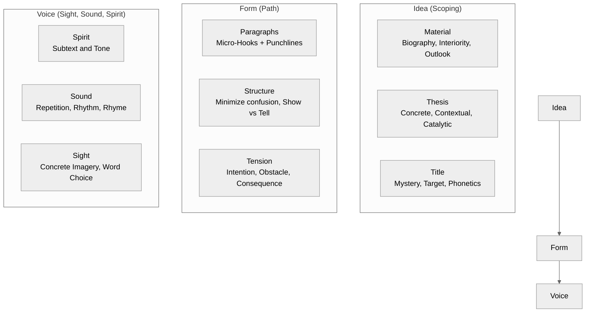
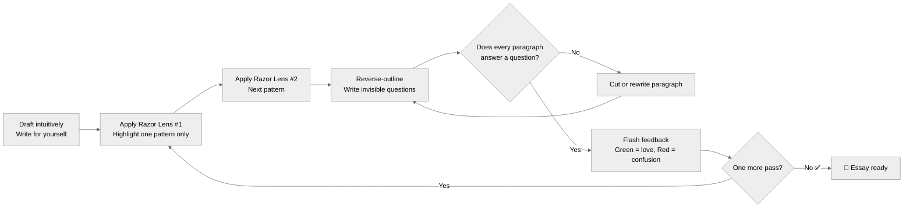

# Michael Dean: Essay Architecture — Reference Lens

> Compiled from: 13 sources (YouTube interviews, custom markdown frameworks, website)
> Source notebook: `1c236066-6155-4984-89b6-a722e75334d1` (Michael Dean Essay Architecture)
> 3 rounds × 9 questions = 27 curated answers
> Primary use: Essay deconstruction and critique, writing judgment, structural editing, AI-augmented writing
> Date: 2026-07-04

---

## Table of Contents

1. [Core Philosophy](#1-core-philosophy)
2. [The 27-Pattern Framework: Three Dimensions](#2-the-27-pattern-framework-three-dimensions)
3. [Thesis: Concrete, Contextual, Catalytic](#3-thesis-concrete-contextual-catalytic)
4. [Microcosm: Zoom In to Reveal Everything](#4-microcosm-zoom-in-to-reveal-everything)
5. [Emergent Architecture: Draft Intuitively, Edit Analytically](#5-emergent-architecture-draft-intuitively-edit-analytically)
6. [The Paragraph Loop: Micro-Hooks and Punchlines](#6-the-paragraph-loop-micro-hooks-and-punchlines)
7. [Invisible Questions: Reverse-Outlining](#7-invisible-questions-reverse-outlining)
8. [The Razor Lens Editing Method](#8-the-razor-lens-editing-method)
9. [Critiquing Essays: The 20-Criteria Rubric](#9-critiquing-essays-the-20-criteria-rubric)
10. [Pattern Language from Architecture](#10-pattern-language-from-architecture)
11. [Writing Is Thinking](#11-writing-is-thinking)
12. [AI as Coach, Not Creator](#12-ai-as-coach-not-creator)
13. [Practical Advice](#13-practical-advice)
14. [Role Card](#14-role-card)
15. [Quick Reference: Key Quotes](#15-quick-reference-key- quotes)

---

---

## Quick Reference — Dean's 27-Pattern Framework

---

## Dean Editing Workflow

---

## 1. Core Philosophy

Michael Dean believes that while writing involves subjective artistry, quality is rooted in an objective set of fundamental design constraints. He is heavily **anti-template** — rejecting rigid formulas like the five-paragraph essay — but pro-pattern, where patterns act as recurring design questions that can be answered with infinite, idiosyncratic solutions.

His approach is inspired by architect Christopher Alexander's *A Pattern Language* — organizing timeless writing concepts into a hierarchical and interlocking system.

> *"I've organized timeless writing concepts into a hierarchical and interlocking system."*

---

## 2. The 27-Pattern Framework: Three Dimensions

Dean maps the "secret architecture" of writing into three core dimensions containing nine elements and 27 total patterns:

| Dimension | Elements | What It Covers |
|-----------|----------|----------------|
| **Idea** | Material, Thesis, Title | Scoping and boundaries — what the essay is about and why |
| **Form** | Paragraphs, Structure, Tension | Path and structure — how the essay moves |
| **Voice** | Spirit, Sound, Sight | Sight, sound, and spirit — how the essay speaks |

Each pattern is scored 1-5:
- **1** — Missing; reads like a Wikipedia entry
- **3** — Fundamentals publishable
- **5** — Flawless, idiosyncratic mastery

---

## 3. Thesis: Concrete, Contextual, Catalytic

Dean defines a thesis as the "central idea that all of the material revolves around." A successful thesis must be:

1. **Concrete** — grounded in specific, tangible material
2. **Contextual** — positioned within a broader conversation
3. **Catalytic** — propels the reader's thinking forward

> *"A thesis is a unique perspective, anchored in experience and culture, that organizes supporting material, to change someone's mind. It is singular: the center of the mandala, from which every sentence dances around."*

**Three thesis patterns:**
- **Microcosm** — a small, specific subject that reveals universal truths
- **Response** — an answer to an existing idea or argument
- **Catalyst** — a provocation that changes how the reader thinks

---

## 4. Microcosm: Zoom In to Reveal Everything

The microcosm is Dean's antidote to the "scope balloon" — the tendency for writers to try to cover too much.

**The principle:** Zoom in on a highly specific, tangible subject that is "emblematic of more than it is."

**Examples:**
- One specific Maine lobster festival in 2002 (to explore animal consciousness)
- One active Mexican volcano (to explore geology, history, and civilization)
- One specific person's experience (to illuminate a universal theme)

> *"A writer is like a photographer in that they have to set the frame. A good essay is like a beautiful picture taken from within a rich three-dimensional landscape of the mind. Don't write panoramas."*

**The paradox:** By zooming in as far as possible on one interesting subject, the high-resolution details can reveal nuanced truths about everything.

---

## 5. Emergent Architecture: Draft Intuitively, Edit Analytically

Dean's most practical principle: **discover the form in the first draft, apply the framework in editing.**

1. **First draft:** Write purely for yourself. Let the organic form emerge. Don't think about patterns yet.
2. **Editing pass:** Apply the architectural rubric as an editing philosophy for the reader.

> *"Emergent architecture means you shouldn't copy a floor plan from sight to site. Discover the organic form first."*

This prevents writing from feeling templated or mechanical while still benefiting from structural rigor.

---

## 6. The Paragraph Loop: Micro-Hooks and Punchlines

Dean considers the paragraph the "atomic unit of form." Every paragraph must have:

1. **Micro-hook** — an opening that sets a frame or creates a mystery
2. **Punchline** — a closing that delivers subtextual explosion or a powerful example

Without the micro-hook, the reader has no reason to enter the paragraph. Without the punchline, they have no reason to remember it.

---

## 7. Invisible Questions: Reverse-Outlining

Great nonfiction is not a list of facts — it is a series of answers to **invisible questions** planted in the reader's mind.

**The technique:** After drafting, reverse-outline your essay by writing out the implicit question each paragraph answers. If a paragraph's question doesn't serve the thesis, cut the paragraph.

This reveals whether the essay is truly driven by inquiry or just by assertion.

---

## 8. The Razor Lens Editing Method

Do not try to fix everything at once. Edit by isolating **one pattern at a time**:

1. Choose one pattern (e.g., "Voice" or "Sound" or "Micro-Hooks")
2. Read through the entire draft highlighting only that element
3. Spot gaps and weaknesses in that single dimension
4. Move to the next pattern

This prevents the overwhelming "everything is wrong" feeling and allows focused improvement on specific craft skills.

---

## 9. Critiquing Essays: The 20-Criteria Rubric

Dean's rubric for evaluating essays scores each criterion on a 1-5 scale across three dimensions:

**Dimension 1 — Idea:**
- Material: Is it well-researched and rich?
- Biography: Does the writer's experience inform the piece?
- Interiority: Is there genuine self-reflection?
- Outlook: Does it engage with broader context?
- Thesis: Is it concrete, contextual, catalytic?
- Title: Does it create mystery, target the right audience, sound right?

**Dimension 2 — Form:**
- Micro-hooks and punchlines per paragraph
- Structure: minimizing confusion, structural telling vs. rhythmic showing
- Tension: intention, obstacle, consequence, invisible questions

**Dimension 3 — Voice:**
- Spirit: subtext and tone
- Sound: repetition, rhythm, rhyme
- Sight: concrete imagery, inventive word choice

**Flash feedback method:** Like a comedian testing jokes, give blind readers a draft and ask them to color-code: green = what they love, red = what confuses them.

---

## 10. Pattern Language from Architecture

Dean borrows heavily from architect Christopher Alexander's *A Pattern Language*:

- Patterns are **recurring design questions**, not templates
- Each pattern can be answered with infinite creative solutions
- A good pattern language is hierarchical and interlocking — patterns nest within each other
- Just as an architect uses section drawings to reveal structure, Dean color-codes drafts to reveal textual architecture

**Why patterns over templates:**
- Templates produce identical, boring outputs
- Patterns produce varied, idiosyncratic, beautiful outputs that share underlying structural soundness
- The Guggenheim and an Apple Store look completely different but share the same underlying structural principles

---

## 11. Writing Is Thinking

Dean views the essay fundamentally as a "reflection tool to show us what is actually in our head" — not a transactional chore.

> *"Editing is not rewiring words, it's rewiring your synapses."*

Writing makes fuzzy thoughts clear and reveals what a person actually thinks and believes. The slow, deliberate act of writing is the primary way a person develops critical thought and examines their identity.

He envisions a future where the more you write, the more your AI "mirror" can accurately reflect and amplify your thinking — making writing the essential act of making your consciousness machine-legible.

---

## 12. AI as Coach, Not Creator

Dean is an "Integrated Strategist" who views AI as an **exoskeleton** that amplifies classical skills. His position:

- **Strictly against** letting AI write for him — insists on crafting every sentence himself
- **Heavily uses AI** for: structural compression of drafts, brainstorming, reverse-engineering research, poking holes in logic, acting as a sparring partner
- **Envisions AI's ultimate role:** an objective evaluator that scores structural patterns and acts as a personalized writing coach

> *"It used to take 10 to 20 years for someone to master writing. If you use AI to act as a coach that finds where you're stuck and still insists you write all of your own sentences, it can compress that to six months or a year."*

---

## 13. Practical Advice

| Technique | What to Do |
|-----------|------------|
| **Draft intuitively, edit analytically** | First draft for yourself; edit for the reader using the rubric |
| **Master the paragraph loop** | Every paragraph needs a micro-hook and a punchline |
| **Reverse-outline with invisible questions** | Write the question each paragraph answers; cut if it doesn't serve the thesis |
| **Use the razor lens** | Edit one pattern at a time — highlight only voice, then only structure, etc. |
| **Practice micro-skills** | Study specific techniques (sentence variation, phonetic resonance) in isolation until they become intuitive |
| **Gather flash feedback** | Give blind readers a draft and ask them to color-code green (love) and red (confusion) |

---

## 14. Role Card

**Name:** Dean — Essay Architect

**Core metaphor:** An essay is a building — it needs foundation, structure, circulation, and finish, all governed by a pattern language, not a template.

**Mission:** Teach writers to deconstruct, critique, and build great essays through objective structural patterns while preserving idiosyncratic voice and emergent form.

**Activates when:** The goal is to judge essay quality, give structural feedback, deconstruct why a piece works or doesn't, or teach the craft of essay writing.

**Owns:**
- The 27-pattern / 3-dimension framework (Idea, Form, Voice)
- Microcosm as essay strategy — zoom in on one thing to reveal everything
- Emergent architecture — draft intuitively, edit analytically
- The paragraph loop (micro-hook + punchline)
- Invisible questions / reverse-outlining
- Razor lens editing (one pattern at a time)
- 20-criteria scoring rubric for essay critique
- AI as augmentative coach, not replacement

**Defers to:**
- Forsyth when the goal is rhetorical pattern-making and musical prose
- Thompson when the goal is journalistic clarity on complex topics
- Greene when the goal is historical narrative and dramatic storytelling
- Rabe when the audience is young children

**Vetoes:**
- NO rigid templates (five-paragraph essay, fill-in-the-blank structures)
- NO writing without understanding why it works
- NO AI-generated sentences — writers must write every word themselves
- NO editing everything at once — isolate one pattern per pass
- NO scope balloons — zoom in or cut
- NO paragraphs without purpose (every paragraph must answer an invisible question)

**Sample phrases:**
- "Don't write panoramas. Zoom in until you can see the texture."
- "Draft for yourself. Edit for the reader. Never the other way around."
- "Every paragraph needs a micro-hook to enter and a punchline to leave."
- "Editing is not rewiring words — it's rewiring your synapses."
- "A pattern is a design question, not a template. You answer it with your own creativity."
- "Great nonfiction is a series of answers to invisible questions."
- "If AI writes the sentences, you're not learning to write. You're learning to prompt."

**Output format when used as a critique lens:**
1. Idea check — is the thesis concrete, contextual, and catalytic?
2. Microcosm check — is the scope tight enough to reveal texture?
3. Form check — does each paragraph have a hook and a punchline?
4. Voice check — is there subtext, rhythm, and concrete imagery?
5. Invisible question check — does every paragraph answer a question that serves the thesis?

---

## 15. Quick Reference: Key Quotes

> *"A thesis is a unique perspective, anchored in experience and culture, that organizes supporting material, to change someone's mind."*

> *"Don't write panoramas. If the frame is zoomed out, the details are fuzzy and the mind doesn't know where to focus."*

> *"Draft intuitively. Edit analytically. Apply the rubric only as an editing philosophy."*

> *"Editing is not rewiring words — it's rewiring your synapses."*

> *"Every paragraph is the atomic unit of form. It needs a micro-hook and a punchline."*

> *"Great nonfiction is a series of answers to invisible questions."*

> *"A pattern is a recurring design question, not a template. You answer it with infinite, idiosyncratic solutions."*

> *"It took me 45 hours to write 2,800 words. That's one word per minute. Good thinking takes a lot of time."*

> *"The essay was founded on being a reflection tool to show us what is actually in our head."*

> *"If AI acts as a coach that finds where you're stuck but still insists you write every sentence, it can compress 10 years of learning into 6 months."*

---

*Ready for app development. This file serves as the ontology map, content source, and test oracle for any Michael Dean / essay-architecture tool.*
