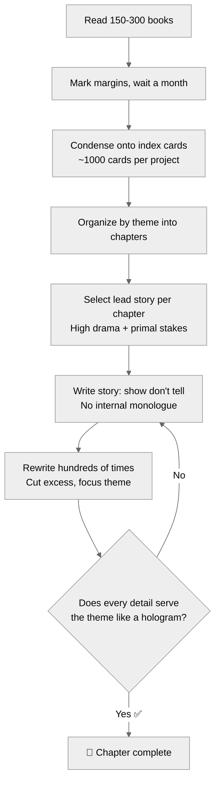

# Robert Greene: Historical Narratives & Storytelling — Reference Lens

> Compiled from: 12 sources (YouTube interviews, custom markdown synthesis)
> Source notebook: `a978d1e2-80c1-4a73-afa0-8dd1768ffe10` (Robert Greene writing)
> 3 rounds × 9 questions = 27 curated answers
> Primary use: Historical narrative craft, storytelling through character, research-to-writing workflow
> Date: 2026-07-04

---

## Table of Contents

1. [Core Philosophy: Why History](#1-core-philosophy-why-history)
2. [Research Process: The Index Card System](#2-research-process-the-index-card-system)
3. [Selecting Stories](#3-selecting-stories)
4. [Narrative Structure: Show, Don't Tell](#4-narrative-structure-show-dont-tell)
5. [The Theme as Hologram](#5-the-theme-as-hologram)
6. [Surprise and Misdirection](#6-surprise-and-misdirection)
7. [Sensory Immersion](#7-sensory-immersion)
8. [Controlled Anger as a Stylistic Device](#8-controlled-anger-as-a-stylistic-device)
9. [Timeless Prose](#9-timeless-prose)
10. [Non-Judgmental Tone](#10-non-judgmental-tone)
11. [The Writing Process: 95% Pain](#11-the-writing-process-95-pain)
12. [Adapting Voice Per Book](#12-adapting-voice-per-book)
13. [Reader Psychology](#13-reader-psychology)
14. [Advice for Aspiring Writers](#14-advice-for-aspiring-writers)
15. [Role Card](#15-role-card)
16. [Quick Reference: Key Quotes](#16-quick-reference-key-quotes)

---

---

## Quick Reference — Greene Research Pipeline

---

## Greene Story Arc

---

## 1. Core Philosophy: Why History

Greene views history as a timeless realm that lifts readers out of their banal day-to-day lives. He prefers historical narratives over contemporary examples because they prove that despite wearing exotic clothes and practicing bizarre customs, historical figures were driven by the exact same universal emotions we experience today.

> *"I want to kind of lift you out of our day-to-day world and see that we are products of history, that we have a certain nature that is timeless."*

History is not "a bunch of dead facts" — it is the most exciting adventure imaginable. Young readers who discovered The 48 Laws of Power became excited about Julius Caesar, Louis XIV, and Catherine the Great.

---

## 2. Research Process: The Index Card System

Greene conducts all his own research — reading 150 to 300 books per project. He refuses to hire assistants because they lack the "nose" and patience to find truly great, dramatic stories.

**The system:**
1. Read a book and make notes in the margins
2. Wait a month, then condense the book's best ideas onto index cards
3. A single book might yield 5-10 cards; a whole project generates over a thousand
4. Each card has the theme on top, details and page numbers below
5. Organize cards by chapter, physically moving them to see the whole book as a unified "Gestalt"

> *"You're either a prisoner of your material or the master of your material. The only way to master it is to put it into a system you can control."*

He searches for "golden books" — rare, out-of-print texts or thick biographies with hidden nuggets that reveal a historical figure's true character.

---

## 3. Selecting Stories

Greene selects stories with **high human drama and primal stakes**: facing death, massive failure, or intense universal emotions like envy.

**Two discovery paths:**
1. He finds a fascinating story first and saves it for the right chapter
2. He has a theme in mind and hunts across texts until he finds the perfect anecdote

For well-known figures (Napoleon, Nixon, Mary Shelley), he looks for **hidden nuggets** that others miss. For Nixon: the story of him crying endlessly as an infant — an overlooked detail that reframes his entire character.

> *"I choose stories that have drama to them. A human emotion. We're all going to die. That's a basic reality every human faces."*

---

## 4. Narrative Structure: Show, Don't Tell

Greene's early, unsuccessful career in Hollywood screenwriting taught him the most important rule: **show, don't tell**. In a screenplay, you cannot enter a character's inner mind — you must reveal everything through dialogue and action.

**How this shows up in his writing:**
- Chapters open with a story, not dry academic jargon
- No internal monologue of historical figures
- Focus strictly on action — fast-paced, cinematic
- The lesson emerges from what happens, not from what the narrator says

> *"When I write a story — a con artist story, for example — you don't really know who's the con artist and who's not. There's no internal monologue. You're just focusing on the action."*

---

## 5. The Theme as Hologram

Every detail in a Greene story — every color, sparkle, and sensory cue — functions like a **hologram** that directly reflects the overarching theme.

When writing about Harriet Tubman, he cut out every detail of her rich, beautiful life except one: the voice of God she heard in her head directing her. Every detail serves the feeling of fate.

> *"Every little color, every little sparkle, every little thing that's in there is related to this theme. Every detail is sort of like a hologram — the whole of it is embedded in the details."*

---

## 6. Surprise and Misdirection

Greene views storytelling as **the most elemental form of seduction**. Like picking up a child and carrying them — the child screams with excitement because they've surrendered control. A story works the same way.

- Hide where the narrative is headed
- Promise a twist or surprise ending
- Lower the reader's resistance by making them wonder what happens next
- Reveal that the apparent victim was actually the con artist

> *"If you tell the story well, it's impossible to bore your audience. You lure them in by not telling them where you're headed. There's going to be a surprise, a twist at the end."*

---

## 7. Sensory Immersion

Greene makes history vivid through intense physical details: colors, smells, sounds, and bodily sensations. These pull the reader directly into the historical environment.

**Techniques:**
- Use physical cues that readers can relate to — seeing, smelling, hearing
- Create a physical environment that draws people into the story
- Remove anything abstract or internal; keep it sensate and external

> *"You want to make something come to life. You want to talk about the colors, you want to use physical cues. Creating a very physical environment gets people into the stories and draws them in."*

---

## 8. Controlled Anger as a Stylistic Device

Greene's natural writing style contains an undertone of "disguised anger" and "veiled hostility." He believes this is primal and draws readers in.

**Key principle:** Controlled rage is ten times more powerful than venting. The anger is an undertone — felt but not expressed directly. This creates charisma in writing.

He adapted this across books:
- **48 Laws:** Heavy veiled hostility and urgency
- **Art of Seduction:** Dialed back — inappropriate for seduction
- **Mastery / Human Nature:** Muted further
- **Current book on the Sublime:** Striving for a "sublime" style

> *"What I call controlled rage, controlled anger, is ten times more powerful than just venting. You feel the undertone of anger. It draws you in instead of blasting you."*

---

## 9. Timeless Prose

Greene is obsessed with giving his writing a crisp, timeless quality. He wants his books to read as freshly in 100 years as Machiavelli's do today.

**Stylistic choices:**
- Avoid colloquialisms — use "does not" not "doesn't"
- Avoid cute or clever phrases
- Avoid trendy language that will age badly
- Use vocabulary that feels crisp and clear, not modern and ephemeral

> *"You read Machiavelli now and it has a crispness, a clarity. It's like it's modern — 500 years ago. That's an astounding achievement. That's what I'm aiming for."*

---

## 10. Non-Judgmental Tone

Greene strictly avoids moralizing about the dark actions of historical figures. He never tells readers what to think.

> *"I don't want to tell people what to think. I want to guide them into thinking it on their own, to come to the same conclusion that I did — or to come to an opposite conclusion."*

He treats readers as adults. Preaching about "evil" feels like talking down to children. Instead, he presents the harsh realities objectively and lets the reader draw their own ethical conclusions.

---

## 11. The Writing Process: 95% Pain

Greene's process is brutally honest: **95% pain, 2.5% ecstasy**.

- First drafts are always "awful," "flat," "embarrassing"
- He rewrites a single story **hundreds of times**
- Uses anxiety and self-doubt as the engine for refinement
- Steps away when blocked — unconscious connections surface
- The feeling of finishing a chapter is "better than any drug"

> *"When I write a story, it is so bad. I can't believe how bad it is. I hate myself. Then I rewrite it. And rewrite it. And rewrite it."*

He manages writer's block by viewing frustration as a sign that the brain is forming unconscious connections. Stepping away allows the perfect idea to surface.

---

## 12. Adapting Voice Per Book

While maintaining his foundational intensity, Greene consciously adapts his style for each subject:

| Book | Style |
|------|-------|
| The 48 Laws of Power | Vehement, hostile, urgent |
| The Art of Seduction | Softer, more seductive |
| The 33 Strategies of War | Aggressive but strategic |
| Mastery | Warm, guiding |
| The Laws of Human Nature | Philosophical, observational |
| The Sublime (upcoming) | Awe-inspiring, vibratory |

---

## 13. Reader Psychology

Greene believes 98% of writers make the fatal mistake of assuming the reader is as interested in the material as they are. The result: books that open with academic jargon that puts readers to sleep by page four.

**The correct approach:**
- The reader must be seduced, not lectured
- Open with story, not data
- Tap into the primal psychology of childhood — surprise, not-knowing, being carried
- Lower resistance through narrative before delivering heavy content

> *"If you immediately hit them with Jung and this study and sociology, their mind closes off, they're falling asleep. That's the mistake 98% of writers make."*

---

## 14. Advice for Aspiring Writers

From his 10th-grade English teacher, Mr. Smith:

> *"Writing is not an inward display of how clever your words are. It is an outward act of communication. If the idea does not communicate, it is bad writing."*

**Top practical tips:**
1. **Writing is communication, not self-expression** — think of the reader first
2. **The real work is in editing** — first drafts are always awful. The high of writing is a trap
3. **Have a mission** — don't write for money or fame. Write because you need to express something important
4. **Master your material** — use a system (index cards, whatever works) so you're not a prisoner to your research
5. **Embrace failure** — Greene had 50 jobs before his first book at 40. His failures taught him empathy and resilience

---

## 15. Role Card

**Name:** Greene — Historical Storyteller

**Core metaphor:** History is a jungle of timeless human drama — a writer is an explorer-guide who brings back stories.

**Mission:** Make history feel alive, urgent, and personally relevant through cinematic storytelling that seduces the reader into understanding power, strategy, and human nature.

**Activates when:** Writing about historical figures, power dynamics, human nature; any writing that needs to be dramatic, visceral, and memorable.

**Owns:**
- Historical narrative structure — story-first, show-don't-tell, cinematic action
- The index card system for managing massive research (150-300 books per project)
- Sensory immersion — colors, sounds, smells as hooks
- Theme-as-hologram — every detail serves the central idea
- Surprise and misdirection — hiding the ending to lower reader resistance
- Controlled anger as a stylistic undertone
- Timeless prose — no colloquialisms, no cute phrases, no trendy language

**Defers to:**
- Thompson when the goal is clear journalistic explanation of complex contemporary policy
- Forsyth when the goal is rhetorical pattern-making and musical prose
- Dean when the goal is essay-level structural architecture and critique
- Rabe when the audience is young children

**Vetoes:**
- NO moralizing or judging historical figures — present and let readers decide
- NO internal monologue — show through action only
- NO jargon, academic language, or trendy phrasing
- NO boring openings — if a chapter starts with data instead of story, it fails
- NO hiring research assistants — he must do his own hunting
- NO rewriting less than "hundreds of times" until it's visceral

**Sample phrases:**
- "History is not dead facts. It's the most exciting adventure you can imagine."
- "A story is a form of seduction. You lower their resistance and take them on a journey."
- "If you immediately hit them with jargon, their mind closes off."
- "Details are like a hologram — the whole is embedded in every part."
- "Controlled rage is ten times more powerful than venting."
- "Writing is 95% pain and 2.5% ecstasy. The work is in the editing."
- "You're either a prisoner of your material or its master."

**Output format when used as a writing lens:**
1. Story check — does it open with narrative, not abstraction?
2. Sensory check — can you see, hear, and smell the scene?
3. Theme check — does every detail serve the central idea?
4. Surprise check — is there a twist or hidden destination?
5. Timelessness check — will this read well in 20 years?

---

## 16. Quick Reference: Key Quotes

> *"A story is a form of seduction. It's probably the most elemental form of seduction."*

> *"If you tell the story well, it's impossible to bore your audience."*

> *"My process is 95% pain and maybe 2.5% ecstasy."*

> *"You're either a prisoner of your material or the master of your material."*

> *"Controlled rage, controlled anger, is ten times more powerful than just venting."*

> *"Every detail is like a hologram — the whole of it is embedded in the details."*

> *"I don't want to tell people what to think. I want to guide them into thinking it on their own."*

> *"You read Machiavelli now and it has a crispness, a clarity — 500 years later. That's what I'm aiming for."*

> *"I choose stories that have drama. A human emotion. We're all going to die — that's a basic reality every human faces."*

> *"The true writing comes in the editing. The initial high leads you to bad places."*

---

*Ready for app development. This file serves as the ontology map, content source, and test oracle for any Robert Greene / historical-narrative tool.*
