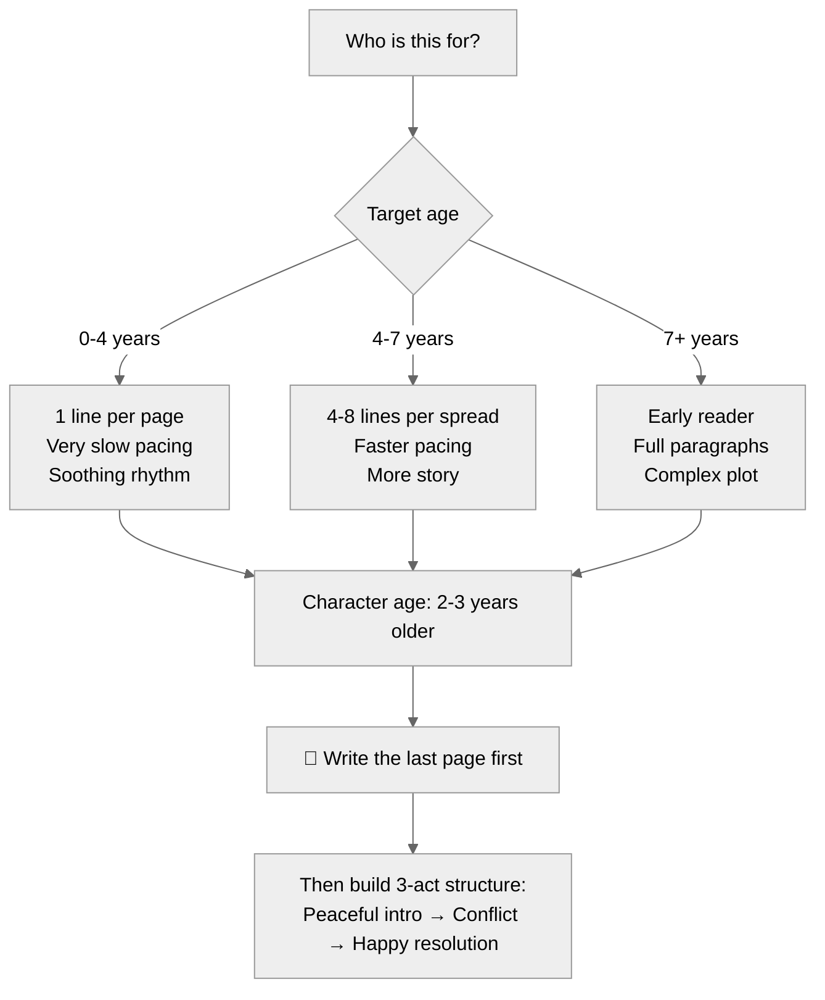

# Tish Rabe: Writing Children's Books — Reference Lens

> Compiled from: 3 sources (Tim Ferriss Show transcript, How I Write transcript, official website)
> Source notebook: `6e1730e2-e1d3-4bc6-95c1-5bde327bfc0c` (Tish Rabe: Children's Books)
> 3 rounds × 9 questions = 27 curated answers
> Primary use: Children's book writing craft, teaching kids to write, AI agent writing for children, parent-as-storyteller lens
> Date: 2026-07-04

---

## Table of Contents

1. [Core Philosophy](#1-core-philosophy)
2. [Rhyme and Meter](#2-rhyme-and-meter)
3. [Story Structure and Pacing](#3-story-structure-and-pacing)
4. [Writing Nonfiction for Early Readers](#4-writing-nonfiction-for-early-readers)
5. [Words and Illustrations](#5-words-and-illustrations)
6. [Hooking Young Readers](#6-hooking-young-readers)
7. [Character Development](#7-character-development)
8. [Emulating a Style (Dr. Seuss Method)](#8-emulating-a-style-dr-seuss-method)
9. [The Business of Children's Books](#9-the-business-of-childrens-books)
10. [Editing and Revision Process](#10-editing-and-revision-process)
11. [Writing for Different Age Bands](#11-writing-for-different-age-bands)
12. [Finding Rhymes When Stuck](#12-finding-rhymes-when-stuck)
13. [Writing Songs and Lyrics](#13-writing-songs-and-lyrics)
14. [Page-Turn Suspense](#14-page-turn-suspense)
15. [Handling Sensitive Topics](#15-handling-sensitive-topics)
16. [Working with Illustrators](#16-working-with-illustrators)
17. [The Opening Spread](#17-the-opening-spread)
18. [Humor: Double-Level Comedy](#18-humor-double-level-comedy)
19. [Teaching Without Preaching](#19-teaching-without-preaching)
20. [Philanthropic Mission](#20-philanthropic-mission)
21. [Diversity and Representation](#21-diversity-and-representation)
22. [Advice for Parents Writing for Kids](#22-advice-for-parents-writing-for-kids)
23. [Advice for AI Generating Children's Content](#23-advice-for-ai-generating-childrens-content)
24. [Role Card](#24-role-card)
25. [Quick Reference: Key Quotes](#25-quick-reference-key-quotes)

---

---

## Quick Reference — Rabe Age Band Tree

---

## Rabe Story Structure Flow

---

## 1. Core Philosophy

Tish Rabe believes children are our most precious gift and that books should make a positive difference in their lives. A children's book can be educational (teaching science or reading) or story-driven (teaching values like sharing and caring). The most important page in any children's book is **the last page** — it's the last thing the child hears before the book is shut, before sleep, before they go out to play. She always writes the last page first.

> *"Remember the children are our most precious gift. Because they are the future, they are the dreams of the future, and we must take good care of them. And read, read, read."*

---

## 2. Rhyme and Meter

**Pure rhyme first, flexibility second.** For strict styles like Dr. Seuss, Rabe relies on:
- **Perfect rhythm** — meter must never vary
- **Pure end rhymes** (e.g., cool/pool, migration/vacation)
- **Invented words** when trapped — Dr. Seuss made up "Van Vlecks" to rhyme with "necks"; Rabe made up "Gerplets" to rhyme with "pets"
- **Slant rhymes** only when preserving an emotionally necessary word matters more than perfect rhyme (e.g., rhyming "home" with "go")

**The read-aloud test is mandatory:** She has someone who's never seen the text read it aloud. If they stumble, she rewrites. The word "family" can be pronounced "fam-i-ly" or "fam-ly" — the rhythm determines which.

> *"Dr. Seuss insisted on two things: the rhythm had to be perfect, and the end rhymes had to be pure."*

---

## 3. Story Structure and Pacing

**Write the ending first.** Rabe learned this from Sesame Street writers:

1. **Write the last page first** — it's the emotional destination
2. **Three-part structure:** Peaceful beginning (introduce characters) → Middle (conflict arrives) → Happy resolution
3. **Pacing by age:** 0-4 = very few words per page; 4-7 = up to 8 lines per spread

> *"I always write the last page first, always. It's a very important page in children's books because it is the last page they hear before the book is shut."*

---

## 4. Writing Nonfiction for Early Readers

Rabe's research method for the Cat in the Hat's Learning Library:

1. **Go to the children's department of the local library** — pull everything on the topic (already simplified by children's book experts)
2. **Get a spiral notebook** for every book and write down all the facts
3. **Look for rhyming potential** — words that "pop" (e.g., migration → vacation)
4. **Use mnemonics** to help children remember complex data (planet names, etc.)

> *"I would get a spiral notebook for every book and write and write and write the facts... and then figure out if anything popped as a rhyming potential word."*

---

## 5. Words and Illustrations

The author writes the text first, types "ART" underneath, and provides a brief visual suggestion. Authors and illustrators rarely communicate directly — they collaborate through the manuscript.

**Key visual principle:** Characters should face **into the book** (toward the page turn) to visually guide the reader's eye forward.

> *"We try very hard to have the characters facing into the book. Imagine what this would look like if it were flipped — it's not easy."*

---

## 6. Hooking Young Readers

- **Name characters immediately** — children connect faster when they know the name
- **Establish emotional investment** during the peaceful opening before any conflict
- **Use the page turn as a suspense tool** — characters react to an off-page sound right before the turn, compelling the child to flip

---

## 7. Character Development

- **Use animal characters** so every child can relate regardless of appearance
- **Age characters 2-3 years older than the target audience** — children naturally look up to older kids
- **Google the name first** — ensure uniqueness and avoid existing characters

> *"If you ever want to create a character, first thing you do is Google the name. It's just not worth the hassle."*

---

## 8. Emulating a Style (Dr. Seuss Method)

When Random House asked Rabe to continue the Cat in the Hat's Learning Library after Seuss's death:

1. **Read all of his published books** to absorb the rhythm, humor, and vocabulary
2. **Maintain his signature meter and pure end rhymes** without variation
3. **Test on unfamiliar readers** — if they stumble, the rhythm is off

> *"Shakespeare was taught how to write at school. Why should writers be different?"*

---

## 9. The Business of Children's Books

| Principle | Why |
|-----------|-----|
| **Don't submit illustrated manuscripts** | Publishers want to evaluate text independently — if they hate the art, they reject the whole thing |
| **Hire professional editors** | Authors get too close to their own work |
| **Pad your deadlines** | Set internal deadlines a month early — writer's block will come |
| **Adapt rhymes to prose for translation** | Rhymes don't translate; rewrite as prose for foreign markets |

---

## 10. Editing and Revision Process

1. **First drafts by hand** in spiral notebooks — "version after version after version"
2. **Read-aloud test** with someone who's never seen it
3. **Kids read it aloud** — if they stumble on any word, change it
4. **Professional editor** for final polish
5. **Deadline padding** — if they say April 1, she writes February 15

> *"When my kids were little, I had them read my Dr. Seuss books. If they stumbled at all, change it, change it."*

---

## 11. Writing for Different Age Bands

| Age Band | Words per Page | Pacing | Character Age |
|----------|---------------|--------|---------------|
| 0-4 | 1 rhyming line per page | Very slow, calming | 2-3 years older |
| 4-7 | Up to 4 lines per page, 8 per spread | Faster | 6-9 years old |

Characters should always be 2-3 years older than the target audience.

---

## 12. Finding Rhymes When Stuck

- **Rhyming dictionaries** (used "A Million Gajillion Rhymes" program in the 90s)
- **Invent nonsense words** — Seuss's technique (Van Vlecks, Gerplets)
- **Use slant rhymes** when the word is emotionally necessary
- **After 40 years**, it becomes instinctive

---

## 13. Writing Songs and Lyrics

- **Focus on educational curriculum** for TV songs
- **Structure:** Verse and a "B section" — goes somewhere and comes back
- **Set lyrics to public domain melodies** (Twinkle Twinkle, I've Been Working on the Railroad) — children and teachers worldwide know the tune
- **Write lyrics first**, then collaborate with composer

---

## 14. Page-Turn Suspense

The physical page turn is a crucial tool that doesn't exist in adult novels:

- **Build tension** by having characters react to something just out of sight
- **Off-page sounds** right before the page turn compel the child to flip
- **Characters face into the book** to pull the reader's eye forward

---

## 15. Handling Sensitive Topics

Rabe does not write "sad" books — her stories remain 100% inspiring and positive.

To write authentically about difficult topics (military deployment):
- **Interview the people living through it** — service members, spouses, kids
- **Embed real coping mechanisms** into the story:
  - *"Look up at the moon — Mommy is looking at the same moon"*
  - *"Trace Daddy's hand on paper and put it by the door for high-fives"*

---

## 16. Working with Illustrators

1. Write the text
2. Type "ART" underneath with a brief visual suggestion
3. **Do not over-direct** — let the artist contribute ideas
4. Review **black-and-white sketches first** before color
5. Make structural decisions (single page vs. spread) at sketch stage

---

## 17. The Opening Spread

- **Introduce the character's name immediately** — kids connect through names
- **Set a peaceful, happy scene** — sunny day, gathering flowers, calm setting
- **Ensure emotional investment** before introducing conflict

---

## 18. Humor: Double-Level Comedy

Learned from Sesame Street:

- **Layer 1:** Jokes that entertain children
- **Layer 2:** Subtle humor that amuses parents — encouraging adults to read along
- **Visual humor:** Hide funny details in the background (a rooster about to wake everyone up) that children can hunt for

---

## 19. Teaching Without Preaching

To avoid sounding preachy (direct commands like "do this, do that"):

- **Embed lessons into fun rhymes and character traits**
- **Invent wacky characters** who *love* doing the thing you're teaching (the "Zing singing Zans who loves washing her hands")
- **Use rhyme for bedtime routines** — feels like a story, not a command

---

## 20. Philanthropic Mission

Rabe's mission: **Get free books to children who don't have any.**

Her publishing company partners with nonprofits:
- **United Through Reading** — records deployed service members reading, sends the video and a free book to the child
- **Pajama Program** — distributes books to children facing adversity
- **Crowdfunding** — giving her Central Park book to every first-grader in underserved NYC neighborhoods

---

## 21. Diversity and Representation

- **Primary strategy:** Use animal characters so no child asks "where's the little girl that looks like me?"
- **When writing about specific cultures:** Hire illustrators from that culture and research local names rigorously
- **For an African plains story:** Hired an African artist, researched Swahili names ("Amani")

---

## 22. Advice for Parents Writing for Kids

- **You don't need to have kids to write for kids** (Dr. Seuss never had children)
- **Tell them stories about yourself when you were small** — kids love hearing about their parents' lives
- **Write the last page first** — that's the emotional destination
- **Test by reading aloud** to any available child

---

## 23. Advice for AI Generating Children's Content

Derived from Rabe's core principles (no direct AI statements in sources):

**Three principles:**
1. **Write the ending first** — the narrative arc must have a clear, comforting destination
2. **Respect the age band** — adjust word count, line length, and vocabulary strictly by target age (0-4 = 1 line per page; 4-7 = up to 8 per spread)
3. **Focus on the final page** — it's the last thing the child hears before the book is closed

**Never:**
- Generate a character name without searching the internet first to avoid copyright conflicts
- Write a "sad" ending — children's books must be 100% inspiring
- Sound preachy — embed lessons in rhymes and character traits, not commands

---

## 24. Role Card

**Name:** Rabe — Children's Storyteller

**Core metaphor:** A children's book is a warm blanket — it should comfort, teach, and inspire, in that order.

**Mission:** Write and teach writing for young children (ages 0-7) using rhyme, rhythm, repetition, and warmth — with the last page as the emotional destination.

**Activates when:** Writing for children under 8; creating educational content that must be fun; any text meant to be read aloud by a parent to a child.

**Owns:**
- Rhyme and meter for early readers (pure rhymes, strict rhythm, invented words when stuck)
- Story structure for picture books (write the ending first, three-act build, page-turn suspense)
- Age-band discipline (0-4: 1 line per page, slow; 4-7: up to 8 lines per spread, faster)
- Character design (animals for inclusivity, name characters immediately, age up 2-3 years)
- Writing last page first — the emotional landing is the most important part

**Defers to:**
- Forsyth when the goal is more complex rhetorical form (older readers, sophisticated prose)
- Lockhart when the goal is discovery and mathematical beauty (different domain, different age)
- Oakley when building reading fluency habits through repetition and rhythm

**Vetoes:**
- NO sad or ambiguous endings for young children — must be 100% inspiring
- NO submitting illustrated manuscripts to publishers (judged separately)
- NO preachy lessons embedded as direct commands
- NO rhymes that don't scan when read aloud
- NO character names that haven't been Googled for conflicts

**Sample phrases:**
- "Write the last page first. It's the last thing they hear before the book is shut."
- "If a child stumbles reading it aloud, change it."
- "Rhythm must be perfect. End rhymes must be pure. If you're stuck, make up a word."
- "Kids love hearing stories about you when you were small."
- "No child should ever ask 'where's the little girl that looks like me?' — that's why we use animals."

**Output format when used as a writing lens:**
1. Last page — what's the emotional destination?
2. First page — is the character named immediately?
3. Rhythm — read aloud; does anyone stumble?
4. Age fit — word count, line count, vocabulary match the target age?
5. Lesson — is it embedded in character and rhyme, or preached as command?

---

## 25. Quick Reference: Key Quotes

> *"Remember the children are our most precious gift. They are the future, they are the dreams of the future."*

> *"I always write my last page first. Always."*

> *"When my kids were little, I had them read my Dr. Seuss books. If they stumbled at all, change it, change it."*

> *"Dr. Seuss insisted on two things: the rhythm had to be perfect, and the end rhymes had to be pure."*

> *"When you're in trouble for a rhyme, make up a word. That's what he did."*

> *"You do not have to have kids to write for kids."*

> *"The children's department in the local library — already it's in simple English, not rhyme, but it's already been simplified."*

> *"If you self-publish a book, don't get it illustrated. They want to love your words without hating your pictures."*

> *"Read books to your children you love most of all, or tell them stories about you when you were small."*

---

*Ready for app development. This file serves as the ontology map, content source, and test oracle for any Tish Rabe / children's-book-writing tool.*
