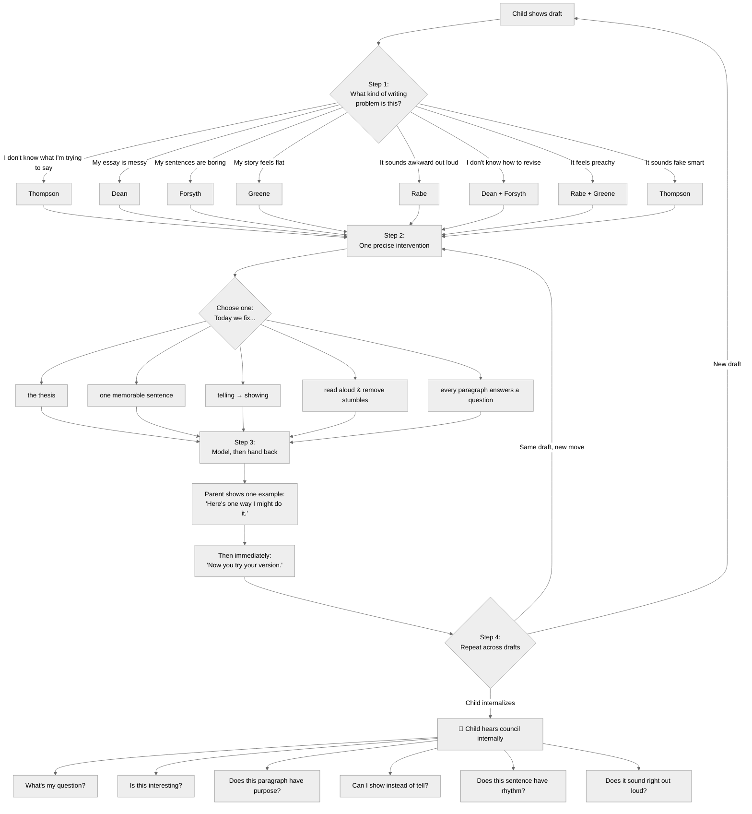
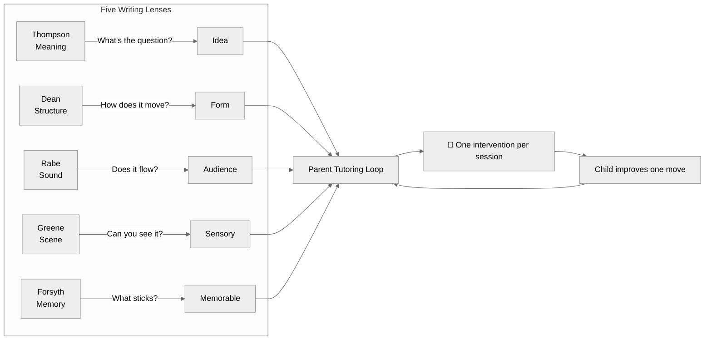

# Parent Tutoring Loop — The World-Class Mechanism

> How to use the 5 liberal arts lenses as a single, coordinated tutoring system.
> One parent + one child + one precise intervention per session.

---

## The Loop



---

## Step 1 — Diagnose the Problem

| When the child says... | The lens that helps |
|---|---|
| "I don't know what I'm trying to say" | **Thompson** — find the silent question |
| "My essay is messy" | **Dean** — check structure, invisible questions |
| "My sentences are boring" | **Forsyth** — give one sentence a memorable shape |
| "My story feels flat" | **Greene** — show don't tell, add sensory detail |
| "It sounds awkward out loud" | **Rabe** — read aloud, fix rhythm and flow |
| "I don't know how to revise" | **Dean** (structure) + **Forsyth** (one sentence) |
| "It feels preachy" | **Rabe** (embed in story) + **Greene** (present, don't judge) |
| "It sounds fake smart" | **Thompson** — simple is smart |

---

## Step 2 — One Precise Intervention

**Never:** "Here are twelve things wrong."

**Always:** "Today we fix one thing."

- Today we fix the **thesis**.
- Today we make **one sentence memorable**.
- Today we turn **telling into showing**.
- Today we **read aloud** and remove stumble points.
- Today we make **every paragraph answer a question**.

---

## Step 3 — Model, Then Hand It Back

```
Parent shows one example:
    "Here's one way I might do it."

Then immediately:
    "Now you try your version."
```

The child stays the writer. The parent is the coach.

---

## Step 4 — Repeat Across Drafts

One session → one move.
Ten sessions → ten moves.

After a while, the child starts hearing the council internally:

> *What's my question?*
> *Is this interesting?*
> *Does this paragraph have a purpose?*
> *Can I show this instead of telling it?*
> *Does this sentence have rhythm?*
> *Does it sound right out loud?*

---

## What Changes for the Parent

| Before the bundle | After the bundle |
|---|---|
| "This is good." | "This thesis is clearer now." |
| "This is confusing." | "Paragraph 3 answers no question." |
| "Add detail." | "Give me one sight, one sound, one action." |
| "Make it stronger." | "Use a three-beat sentence." |
| "Try again." | "Read it aloud and mark the stumble." |
| "You need a better intro." | "Open with a scene, not a summary." |

---

## The Deeper Thesis

These cards make parents world-class because they separate writing quality into **teachable dimensions**:

| Dimension | Lens | Question |
|-----------|------|----------|
| Meaning | Thompson | What are you trying to say? |
| Structure | Dean | How does the piece move? |
| Memory | Forsyth | What will stick? |
| Scene | Greene | What can the reader experience? |
| Sound | Rabe | How does it land in the ear? |
| Revision | Dean + Forsyth | What is the next smallest improvement? |

Most writing instruction fails because it collapses everything into: *"Write better."*

This bundle says: **Better how?**

Then it gives the parent five different ways to answer.

---

## The Product Promise

**Not:** *"Your child gets AI-generated writing."*

**But:** *"Your child gets a parent who can finally see what kind of writing problem is in front of them."*

The parent is still the relationship.
The child is still the writer.
The AI is the coaching scaffold.
The cards are the expert eyes.

And the session becomes what good 1-on-1 tutoring has always been: **the right question, at the right moment, with the right next move.**

---

## The Five Lenses at a Glance



---

*Ready for use alongside the 5 lens cards in `Learning_Coach_Heros/Writing_Liberal_Arts/`. See `_lens_workflow.md` for the full 20-hero inventory. Print this as a quick-reference guide.*
